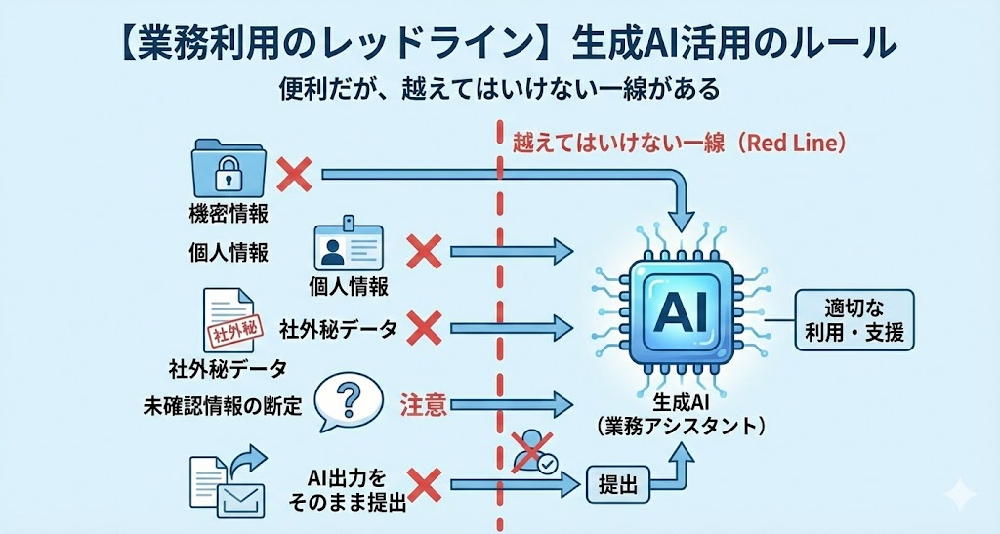

# AIリテラシー
生成AIを業務で使いこなすためには、ツールの操作方法を覚える前に、  **「AIが裏側で何をしているのか」** という本質的な仕組みを理解することが不可欠です。

なぜAIは時々もっともらしい嘘をつくのでしょうか？  
なぜ会社は「機密情報を入れるな」と厳しく言うのでしょうか？  

その理由はすべて、AIの仕組みの中に答えがあります。

## 1.1 生成AIの正体  

一見すると、AIは質問に対して考えて答えを出しているように見えます。 
しかし実際には、別の仕組みによって結果が生成されています。

### AIは言葉の意味を理解していない

人間は「リンゴ」と聞けば、赤くて丸い果物をイメージし、味や食感を思い出します。 しかし、現在の生成AIは言葉の意味を理解しているわけではありません。

AIが行っているのは、膨大なテキストデータの中から統計的に  
**「この言葉の後には、確率的にこの言葉が来やすい」**  
という計算を行い、次に来る言葉（トークン）を予測してつなげているだけです。

### 仕組みは「超高性能な予測変換」

スマートフォンのメール作成画面で「あ」と打つと、「ありがとう」「明日」などが予測変換として出てきます。  
生成AIの仕組みは、これの **超高性能版** だと考えてください。

インターネット上のニュース、SNS、小説などの膨大なデータを学習し、  
「『むかしむかし』と来たら、次は『あるところに』が来る確率が高い」  
といったパターンを無数に記憶しています。

この仕組みゆえに発生するのが **「ハルシネーション（もっともらしい嘘）」** です。  
AIは「事実かどうか」よりも **「文章として自然に繋がるか（確率が高いか）」** を優先して言葉を選びます。

そのため、知らないことであっても、「それっぽい言葉」を確率的に繋ぎ合わせて、自信満々に嘘をついてしまうのです。

### 人間が指示（プロンプト）で「確率の幅」を狭める

AIは「確率」で動くマシンです。だからこそ、人間が出す **指示（プロンプト）** が重要になります。

### 曖昧な指示（悪い例）

「メールを書いて」のように、曖昧な指示をAIに与えると、AIは次のような状態になります。

・誰宛のメールなのか？ 
・謝罪なのか？営業なのか？ 
・どんなトーンで書けばいいのか？

このように、確率の選択肢が多すぎる状態になるため、AIは「無難で平均的な文章」しか生成できません。

### 明確な指示（良い例）

一方で「取引先への謝罪メールを書いて。理由はシステム障害で、誠実かつ簡潔に」のように、  
**指示を具体的にすると**AIの状態は大きく変わります。

・取引先へのメールであること 
・内容は「謝罪」で、理由はシステム障害であること 
・誠実で、かつ簡潔なトーンで書く必要があること

このように、目的・状況・条件が明確になることで、  
確率の幅が狭まり、AIは「目的に合致した文章」を生成しやすくなります。

プロンプトエンジニアリングとは、  
**「AIが迷わないように、言葉で確率のレールを敷いてあげる技術」**  
なのです。

## 1.2 業務利用のレッドライン

AIは便利ですが、使い方を誤ると会社に損害を与えるリスクがあります。  
絶対に守るべき **「レッドライン」** を押さえましょう。

### ① 情報漏洩リスク  
#### 「入力データは勉強材料にされる」

無料版の生成AIや、一部のWebサービスでは、ユーザーが入力した情報を  
**「AIが賢くなるための学習データ」** として再利用する規約になっていることがあります。

もしあなたが、ChatGPTに「未発表の新製品Aの売り出し方」を相談したとします。  
その情報はAIに学習され、後日、競合他社の社員が「最近の製品トレンドは？」と聞いた際に、  
「そういえば新製品Aというものが…」と回答してしまうリスクがゼロではありません。

:::warning
個人情報、顧客情報、社外秘の会議内容などは、そのまま入力してはいけません。
:::

### ② オプトアウト（学習させない設定）

企業で安全に使うためには、  
**「入力情報を学習に使わせない（オプトアウト）」** 設定になっている環境を使う必要があります。

| 区分 | 主な特徴・ポイント |
|---|---|
| 企業版（ChatGPT Enterprise / Copilot for Microsoft 365 など） | ・基本的に入力データは学習に利用されない契約 ・会社が導入しているツールを使うべき最大の理由 |
| 無料版・個人版 | ・デフォルトでは学習される設定になっていることが多い ・設定画面から「学習履歴をオフ」にする対策は可能 ・業務利用では推奨されない |

:::info
【補足】ChatGPTのログインと初期設定（業務利用前に必ず実施して下さい）

業務でChatGPTを利用する前に、**入力した情報が学習に使われない設定** を必ず行ってください。  
以下は **PC・Web版** での設定手順です。

### 設定手順（PC・Web版）

1. [ChatGPT](https://chatgpt.com/)にログインします。
2. 画面 **左下** の **プロフィールアイコン** をクリックします。
3. メニューから **「設定」** を選択します。
4. **「データコントロール」** を開きます。
5. **「すべての人のためにモデルを改善する」** を **オフ** にします。
:::
---

### ③ 著作権と責任  
#### 最終責任は「使用者」にある

AIが作った文章や画像の責任は、AIではなく  
**「それを使った人間（あなた）」** にあります。

- 著作権侵害リスク  
  - AIが既存の著作物（有名なキャラクターや、特定のニュース記事など）にそっくりなものを生成してしまうことがあります。  
  - これを知らずに公開すると、著作権侵害になる可能性があります。

- Human in the loop（人間が必ず介入する）  
  - AIの出力結果をそのままメールで送信したり、資料として提出したりするのはNG  
  - ハルシネーション（嘘）や不適切な表現が含まれていないか、必ず人間がファクトチェック（事実確認）と修正を行ってください。

---

## まとめ

生成AIは「意味」ではなく「確率」で文章を生成します。
その仕組みを理解した上で指示（プロンプト）を与えることで、業務での活用効果を高めましょう。
また、便利なツールだからこそ、情報の取り扱いには十分注意して利用しましょう。
