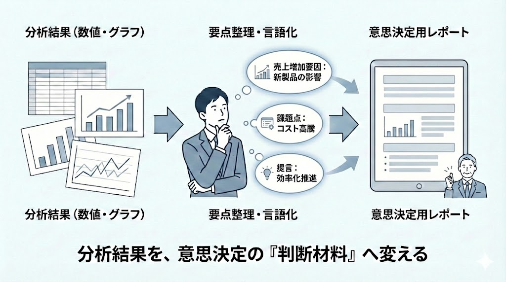

# 経営・管理職向けレポートの下書き作成

この章では、これまでの演習で得られた**集計結果や分析結果、グラフ**をもとに、 
それらを意思決定に活用できる**文章**へと整理・変換することを目的とします。

### 演習10-1　分析結果の可視化と報告資料の作成（応用）

| 項目 | 内容 |
|---|---|
| ケース | 演習8-6~9-3までの分析結果を受け、上司から「売上の傾向と異常のポイント、原因仮説が一目で分かる資料を作ってほしい」と依頼されました。定例会議での説明に使用する想定です。 |
| 演習内容 | 上司の依頼をCopilot向けに翻訳し、売上の全体傾向、異常値、原因仮説が伝わるグラフと簡潔な説明を含む報告資料を作成してください。 どのグラフを使えば上司が状況を理解しやすいかを考えさせることを目的とします。 |
| 提出物 | ① 指示文 ② 作成されたグラフとサマリーを含む資料（ExcelまたはPowerPoint） |
| 留意点 | ・グラフと説明が対応しているか ・専門用語に頼らず、上司が理解できる表現になっているか |

---

### 演習10-2　次の打ち手を考えるための報告整理

| 項目 | 内容 |
|---|---|
| ケース | 演習10-1の資料を確認した上司から、「この分析を踏まえて、次に何を検討すべきか整理してほしい」と追加の依頼がありました。意思決定の材料として使われる想定です。 |
| 演習内容 | 上司の追加依頼をCopilot向けに翻訳し、分析結果から考えられる次のアクション案を整理させてください。 異常値の原因仮説とデータの傾向を踏まえ、「次に検討すべき観点」や「追加で確認すべきデータ」を言語化させることを目的とします。 |
| 提出物 | ① 指示文 ② 次の打ち手を整理したサマリー |
| 留意点 | ・データから読み取れる内容に基づいて整理されているか ・断定ではなく、検討事項としてまとめられているか |

---

**この章でできるようになること**
- 分析結果を意思決定向けの文章に変換できる  
- 報告用途に応じて、出力形式を使い分けられる  

