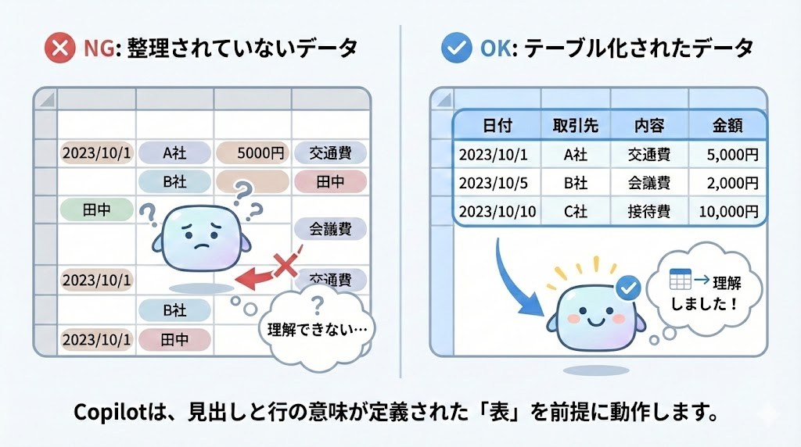

# AIデータ分析の環境を整える

本章では、日常業務で頻出する**データ集計・分析業務**を題材に、  
「Excelで手作業・関数暗記に頼る働き方」から  
「**AIに考えさせ、人は確認・判断に集中する働き方**」へ移行することを目指します。

【使用ツール】Microsoft Excel、Excel Copilot、ChatGPT  

Excel Copilotを正しく活用するためには、  
**事前に整えておくべき”お作法**”があります。
ここでは、Copilot未導入の状態を前提に、  
「なぜその準備が必要なのか」「導入後に何が変わるのか」をイメージしながら理解します。

---

## 6.1 Excel Copilotを動かすための環境準備

Copilotは、Excelシート上の**テーブル化されたデータ**を前提に動作します。  
単なるセルの集合ではなく、  「見出しがあり、行ごとに意味を持つ表」である必要があります。

チェック項目をまとめると以下のようになります。
<mark>
- 必須操作：**Ctrl + T** でテーブル化  
- 見出し行があること  
- 空白行・空白列がないこと  
</mark>

また、Copilotはクラウド上で動作するため、  
ファイルは以下の条件を満たす必要があります。

- **OneDrive または SharePoint** に保存  
- 自動保存がオンになっていること  

Copilot導入後は、  
・「この表をもとに売上傾向を教えて」  
・「このデータでグラフを作って」  
といった指示が可能になります。

:::note ミニ演習
- 手元のExcelファイルを開く  
- データ範囲を選択し、Ctrl + T でテーブル化する  
- OneDrive または Share Pointに保存する
:::
---

## 6.2 役割分担：Excel vs 生成AI

生成AIは、**計算を代わりに行うツールではありません**。  
Excel・生成AI・人間には、それぞれ得意な役割があります。

- **Excel**：正確に計算し、数値を保持する  
- **生成AI**：計算式の考え方や分析の切り口を考える  
- **人間**：何を知りたいかを決め、結果が正しいかを判断する  

業務では、すべてをAIに任せるのではなく、

> **人間が指示 → AIが組み立て → 人間が確認**

という形で使っていくのが基本です。

この使い方を意識することで、  
生成AIはミスを増やす存在ではなく、**仕事を速くする補助役** として活用できます。

**この章でできるようになること**
- Copilotが動作するExcelの条件を説明できる  
- 自分のデータが“AIに読める状態”か判断できる  
- ExcelとAIの役割を言葉で説明できる 