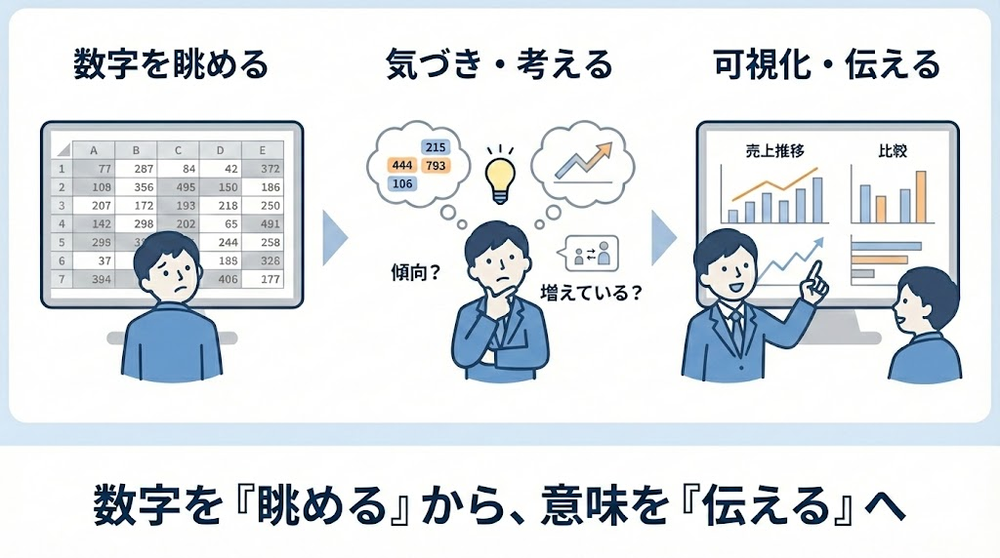

# データの傾向分析と可視化

この章では、集計された数値を「眺める」だけで終わらせず、  
**そのデータから何が言えるのかを考え、他者に伝わる形で可視化する力**を身につけます。

    
導入

    

本演習で使用するファイルは以下のリンクからダウロードしてください。 
[演習課題用②（演習8-1~8-5）](../files/day2演習課題用②.zip) 
[演習課題用③（演習8-6~）](../files/day2演習課題用③.zip)
    

    
演習課題

    

## 演習8-1　直感的なデータ把握（ヒートマップ）

| 項目 | 内容 |
|---|---|
| ケース | 売上明細データ（数千行）がありますが、数字の羅列で直感的に規模感がつかめません。上司から「パッと見て、金額が大きい取引と小さい取引の分布が分かるようにして」と指示されました。 |
| 演習内容 | 上司の依頼をCopilot向けに翻訳し、条件付き書式（カラースケール等）を用いて、数値の大小が色の濃淡で直感的に分かる状態にしてください。「〜以上を赤にする」といった固定条件ではなく、データの全体像を可視化する指示を目指します。 |
| 提出物 | ① 指示文 ② カラースケールが適用されたExcelファイル |
| 留意点 | ・具体的な数値を指定せず、機能（分布の可視化）を求めているか ・対象列（売上金額など）の指定が漏れていないか |

---

## 演習8-2　時系列推移の可視化（トレンドグラフ）

| 項目 | 内容 |
|---|---|
| ケース | 月別の売上集計表があります。数字の増減は分かりますが、全体的なトレンド（右肩上がりなのか、季節性があるのか）が見えにくい状態です。上司から「今年の動きが分かるグラフを作って」と依頼されました。 |
| 演習内容 | 上司の依頼を翻訳し、月ごとの推移が最も伝わりやすいグラフ（折れ線や棒グラフ）を作成してください。タイトルや軸ラベルも含め、他人が見て理解できる状態を目指します。 |
| 提出物 | ① 指示文 ② 作成されたグラフ |
| 留意点 | ・グラフの種類や目的（推移を見る）が示唆されているか ・X軸（月）とY軸（金額）の関係性が伝わっているか |

---

## 演習8-3　大量データの要約（ピボットテーブル）

| 項目 | 内容 |
|---|---|
| ケース | 「売上明細」シートには、日付・商品名・担当者・金額などが数千行入力されています。上司から「担当者ごとの売上合計を一覧にして報告して」と依頼されました。 |
| 演習内容 | 上司の依頼を翻訳し、ピボットテーブル（または集計機能）を用いて、担当者別の売上集計表を別シートに作成してください。 |
| 提出物 | ① 指示文 ② ピボットテーブルが作成されたExcelファイル |
| 留意点 | ・「担当者ごと」「売上合計」という集計軸が明確か ・元データを壊さず、別表を作成する意図が含まれているか |

---

## 演習8-4　多角的な分析（クロス集計）

| 項目 | 内容 |
|---|---|
| ケース | 担当者別集計を見た上司から、「誰がどの商品を売っているのか内訳を知りたい」と追加の依頼がありました。 |
| 演習内容 | 行に「担当者」、列に「商品カテゴリ」を配置したクロス集計表（ピボットテーブル）を作成してください。 |
| 提出物 | ① 指示文 ② クロス集計表が作成されたExcelファイル |
| 留意点 | ・縦軸と横軸の指定が混同されていないか ・集計する値（金額）の指定が漏れていないか |

---

## 演習8-5　異なる単位の可視化（2軸グラフ）

| 項目 | 内容 |
|---|---|
| ケース | 売上管理表には月別の「売上金額」と「前年比（%）」のデータがあります。上司から「売上規模と成長率の関係を1枚のグラフで見たい」と依頼されました。 |
| 演習内容 | 売上を棒グラフ、前年比を折れ線グラフ（第2軸）で表示する複合グラフを作成してください。 |
| 提出物 | ① 指示文 ② 複合グラフ（2軸グラフ）を含むExcelファイル |
| 留意点 | ・「2軸」「複合」などの意図が伝わっているか ・どの列をどのグラフ形式にするかが明確か |
---
## 演習8-6　複数データの統合と関係性の可視化（応用）

| 項目 | 内容 |
|---|---|
| ケース | 「売上データ.xlsx」と「広告費データ.xlsx」という2つのファイルがあります。 売上データには月別の売上金額、広告費データには月別の広告費が記録されています。 上司から「広告費と売上の関係が分かるグラフを作ってほしい」と依頼されました。 |
| 演習内容 | 上司の依頼をCopilot向けに翻訳し、複数ファイルのデータを参照して分析可能な形に整えたうえで、広告費と売上の関係性が分かるグラフを作成してください。 どのファイルのどの列をどのように結合・参照すればよいか、また、どのグラフ形式が関係性の把握に適しているかを、AIに考えさせることを目的とします。 具体的な関数や操作手順を暗記している前提にはせず、「やりたい分析内容」からAIに処理方針を提案させて実行してください。 |
| 提出物 | ① 指示文 ② 複数データを参照して作成されたグラフを含むExcelファイル |
| 留意点 | ・どのファイルをどのキー（月など）で結びつけるのかが明確になっているか ・元データを直接加工せず、分析用のデータを作成する意図が含まれているか ・「関係性を見る」という目的に合ったグラフになっているか |

## 演習8-7　関係性の解釈と過信しない分析（発展）

| 項目 | 内容 |
|---|---|
| ケース | 演習8-6で作成した「広告費と売上の関係を示すグラフ」を確認したところ、月によっては広告費が増えても売上が伸びていない期間があることが分かりました。 上司から「広告費と売上は本当に関係があると言えるのか？」「他に見落としている要因はないか？」と追加で確認を求められました。 |
| 演習内容 | 上司の追加依頼をCopilot向けに翻訳し、作成済みのグラフや元データを前提として、次の観点を整理させてください。 ・広告費と売上の関係性が強そうな期間／弱そうな期間の指摘 ・関係が弱く見える理由として考えられる要因の洗い出し（例：季節性、キャンペーン有無、外部要因など） ・「相関がある＝因果がある」とは限らない点への注意喚起 結論を断定させるのではなく、**あくまで仮説として整理させること**を目的とします。 |
| 提出物 | ① 指示文 ② AIによる考察・仮説整理の出力結果 |
| 留意点 | ・数値だけで断定的な結論を出していないか ・「考えられる要因」「可能性」といった表現で整理されているか ・グラフやデータを根拠として言語化できているか |

    

