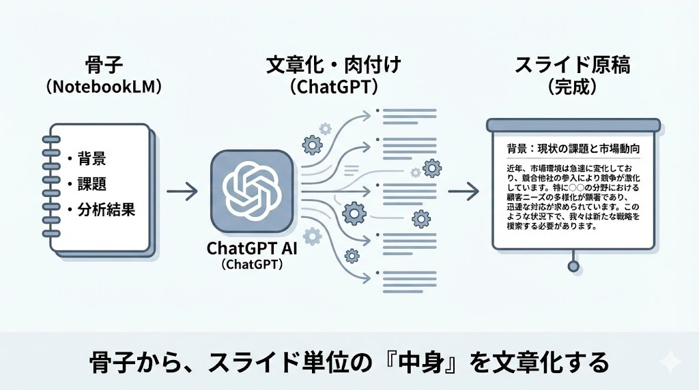

# Day3：資料作成・スライド編（10時間）
～「白紙」から作らない。AIリレーで実現する、伝わる報告資料の最速作成術～

---

## 12. 報告書・提案資料の自動生成：ChatGPTによる「中身」の作成

NotebookLMで作った骨子は、  
あくまで **見出しレベルの情報** です。

次はChatGPTを使って、  
**スライド1枚ごとの原稿** に落とし込みます。

---

### 12.1. 骨子の肉付けとスクリプト化

#### 手順

1. NotebookLMが出力した骨子をコピー  
2. ChatGPTに貼り付ける  
3. スライド原稿化を指示する  

#### プロンプト例

この構成案を基に、PowerPointのスライドごとの原稿を書いてください。
1枚あたり箇条書き3行以内で、
上司が一目で理解できるように簡潔にまとめてください。

#### 活用のコツ
- 「この課題部分は、数字を強調して書き直して」
- 「結論が先に来るように並び替えて」

など、**対話しながらブラッシュアップ** します。

---

### 12.2.【重要】AIリレーによる画像生成プロンプトの作成

ChatGPT自身に画像を作らせるのではありません。

ここでは、  
**Geminiに渡すための指示文をChatGPTに作らせる** のが目的です。

#### 指示例

スライド3枚目の「業務フローの混乱」を図解したいです。
画像生成AI（Gemini）に描かせるための、
詳細な指示プロンプトを英語で作成してください。

#### ポイント
- ChatGPT：指示文を考える役  
- Gemini：視覚化する役  
- 英語プロンプトの方が表現精度が安定しやすい  

---
