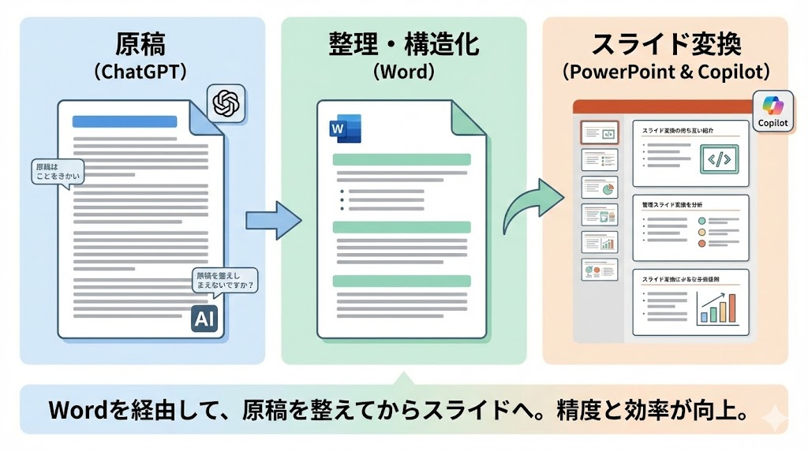

# Day3：資料作成・スライド編（10時間）
～「白紙」から作らない。AIリレーで実現する、伝わる報告資料の最速作成術～

---

## 13. Word資料からPowerPointへの変換

ChatGPTで作成した原稿は、  
一度 **Wordに整理** してからCopilotに渡します。

---

### 13.1. Word原稿の整備

#### なぜWordを使うのか

Copilotは、Wordの **見出し構造（H1 / H2）** を基に  
スライドの切れ目を判断します。

#### お作法
- スライドタイトル：見出し1（H1）  
- スライド内の補足：見出し2（H2）や本文  

これにより、  
「どこで1枚のスライドが切り替わるか」を  
AIが理解しやすくなります。

---

### 13.2. Copilotによる自動変換

1. PowerPointを開く  
2. Copilotを起動  
3. 次のように指示する  

**指示例**
このWordファイルからスライドを作成してください。

#### 注意点
- 初期状態のスライドは **たたき台**  
- 内容・構成は必ず人間が確認・修正する  

---