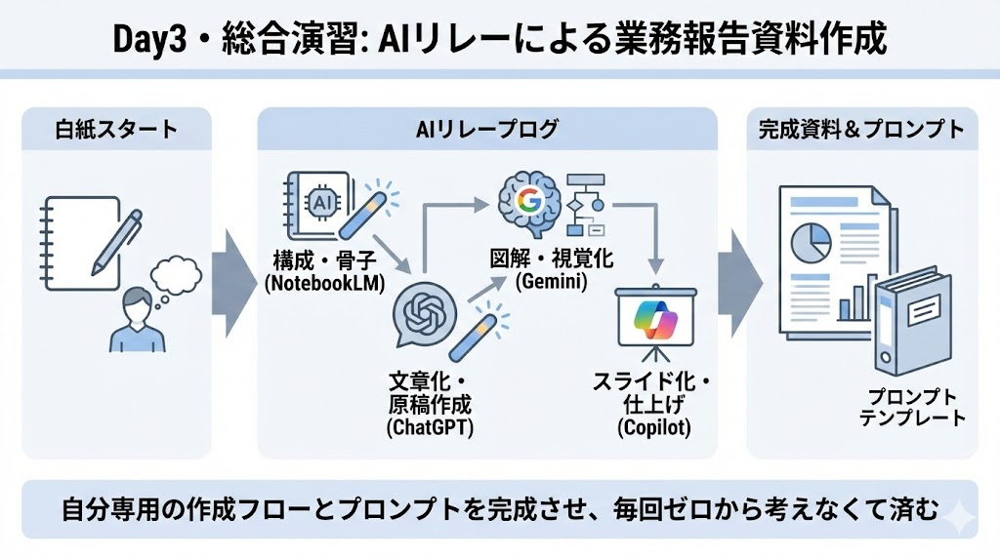

# Day3：資料作成・スライド編（10時間）
～「白紙」から作らない。AIリレーで実現する、伝わる報告資料の最速作成術～

---

## 16【演習】Day3 総合演習：AIリレーによる業務報告資料の作成

本演習では、Day3で学習した  
**NotebookLM → ChatGPT → Gemini → Copilot**  
の「AIリレー」を一通り実践します。

単に資料を1つ作ることが目的ではありません。  
本演習のゴールは、

- 白紙から考えなくて済む  
- 次回以降もそのまま使える  

**「自分用の資料作成プロンプトテンプレ一式」を完成させること**です。

---
### 16.1 演習の進め方（全体像）

本演習は、以下の4フェーズに分かれています。

| フェーズ | 使用AI | 目的 |
|---|---|---|
| フェーズ① | NotebookLM | 報告資料の骨子を作る |
| フェーズ② | ChatGPT | スライド原稿を作る |
| フェーズ③ | Gemini | 図解・イメージを作る |
| フェーズ④ | Copilot | PowerPointを完成させる |

各フェーズでは、  
**その場限りの指示ではなく、再利用可能な「プロンプトテンプレ**」を作成してください。

---

### 16.2 フェーズ①【骨子作成】NotebookLM

| 項目 | 内容 |
|---|---|
| ケース | あなたは定例会議・月次報告・プロジェクト報告などの**業務報告資料**を作成しています。毎回「何を・どの順番で伝えるか」を考えるところに時間がかかっています。 |
| 演習内容 | 本ケースを例として、NotebookLMを用いて**報告資料の骨子（構成案）を作成するための再利用可能なプロンプトテンプレ**を設計してください。報告の場（上司向け・部会向けなど）やトピック構成（成果／課題／次の打ち手）が差し替え可能な形になっていることを意識してください。 |
| 提出物 | NotebookLM用 プロンプトテンプレ（骨子作成用） |
| 留意点 | 元資料にない内容を作らせない設計になっているか、次回以降もそのまま使える汎用的な構造になっているかを確認してください。 |

---

### 16.3フェーズ②【原稿作成】ChatGPT

| 項目 | 内容 |
|---|---|
| ケース | フェーズ①で作成した骨子を基に、PowerPoint用の**スライド原稿**を作成する必要があります。スライド1枚あたりの情報量や読み手を意識した文章化が求められます。 |
| 演習内容 | 骨子を入力すると、**スライド1枚単位の原稿**を生成できるChatGPT用のプロンプトテンプレを設計してください。読み手（上司・経営層など）、トーン、1枚あたりの情報量が調整できる形を目指します。 |
| 提出物 | ChatGPT用 スライド原稿生成プロンプトテンプレ |
| 留意点 | 箇条書き量や結論の出し方など、業務でそのまま使える粒度になっているかを確認してください。 |

---

### 16.4 フェーズ③【図解作成】Gemini（AIリレー）

| 項目 | 内容 |
|---|---|
| ケース | スライド内で「業務フローの混乱」「情報共有不足」「改善後の理想状態」など、**文章だけでは伝わりにくい内容**を図解で表現したいと考えています。 |
| 演習内容 | ChatGPTに指示させる前提で、**Geminiに画像を生成させるためのプロンプトテンプレ**を設計してください。テーマやキーワードを差し替えて使える形にします。 |
| 提出物 | ChatGPT → Gemini 用 画像生成プロンプトテンプレ（英語） |
| 留意点 | 図の目的（何を伝えたいか）が明確で、抽象的なテーマでも使い回せる構造になっているかを確認してください。 |

---

### 16.5 フェーズ④【スライド生成】Copilot

| 項目 | 内容 |
|---|---|
| ケース | フェーズ②で作成した原稿（Word形式）を基に、**PowerPointスライドを効率よく完成させたい**と考えています。 |
| 演習内容 | Copilotに対して、Word原稿からPowerPointを生成させるための**指示プロンプトテンプレ**を設計してください。スライドの雰囲気や情報量の目安も含めます。 |
| 提出物 | Copilot用 スライド生成指示プロンプトテンプレ、完成したPowerPointファイル（pptx） |
| 留意点 | 初期生成は「たたき台」であることを前提に、人が確認・修正する流れになっているかを意識してください。 |

---

### 16.6 最終提出物まとめ

| 項目 | 内容 |
|---|---|
| 提出物一式 | ① NotebookLM用 プロンプトテンプレ ② ChatGPT用 スライド原稿プロンプトテンプレ ③ ChatGPT → Gemini 用 画像生成プロンプトテンプレ ④ Copilot用 スライド生成指示テンプレ ⑤ 上記テンプレを使用して作成した PowerPointファイル |

---

## 本演習のゴール

- AIを「全部任せる存在」ではなく  
  **役割分担して使えるようになる**
- 次回以降、  
  **白紙から資料を作らなくて済む状態**になる
- 自分の業務に合った  
  **資料作成テンプレート一式を持ち帰る**

この状態になっていれば、本演習は達成です。

---
