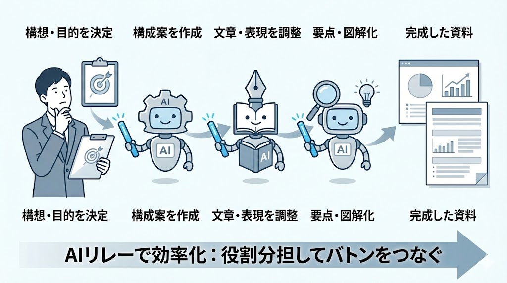

# 資料作成と「AIリレー」の考え方

生成AIで資料作成を効率化するためには、  
いきなりツールを触る前に、まず **「AIをどう使い分けるか」** を理解することが重要です。

なぜ、1つのAIにすべて任せると、  
内容が薄くなったり、事実とズレたりするのでしょうか？

それは、生成AIにはそれぞれ **得意な役割** があり、  
資料作成の工程ごとに分けて使うほうが、結果が安定するからです。

この章では、  
白紙から考えずに資料を作るための前提として、  
**AIを工程ごとにつなぐ「AIリレー」の考え方** を整理します。

    
前提確認

    

## 想定ケース

あなたは「生成AI研修サービスを提供する会社」の事業部に所属する事務担当者です。  
来月の部会（上司・管理職向け）にて、今月の事業状況を報告する資料を作成します。

### 手元資料
本研修では、以下のファイルをダウンロードして使用してください。 
[演習用ファイル](../files/day3演習課題用.zip)

| 資料名 | 内容 |
|---|---|
| 月次業務実績 | 受注数・売上データ |
| 対応案件一覧 | 企業問い合わせ・進行状況 |
| 課題メモ | 営業／運用／講師体制のメモ |

### 前提情報
本研修は以下の前提の元で実施してください。

| 項目 | 内容 |
|---|---|
| 自社サービス | 企業向け生成AI研修サービス |
| 直近状況 | ここ3ヶ月で企業からの問い合わせが増加 |
| 報告テーマ | 生成AI研修事業の現状整理と来月の方針判断 |

---

## 演習の目的

複数の生成AIツールを組み合わせ、  
上司に提出できるレベルの業務報告用PowerPoint資料を完成させる。

## 使用するAIツールと役割

| ツール | 役割 |
|---|---|
| [**NotebookLM**](https://notebooklm.google.com/) | 社内資料＋外部資料から骨子作成 |
| [**ChatGPT**](https://chatgpt.com/) | スライド原稿の整形・表紙生成プロンプト作成 |
| [**Genspark**](https://www.genspark.ai/) | スライド形式の資料生成 |
| [**Gemini**](https://gemini.google.com/) | 表紙画像の生成 |

各ツールの説明動画は以下のリンクからご確認ください。 

[・Genspark](https://drive.google.com/file/d/1JZ2hjVHBxt08dN6dBw0Vrt8lXNT2Mw_3/view?usp=drive_link)

[・Gemini(Nano Banana Pro)](https://drive.google.com/file/d/16UM1AD4GtOcm4OEK2wZ9_4KdMsHG45Ln/view?usp=drive_link)

[・NotebookLM](https://drive.google.com/file/d/10r2SmocjL6E8vz67KHOpAXgMUvtuYYHo/view?usp=drive_link)

    

    
演習課題

    

    
11. NotebookLM：骨子作成

    

まず、NotebookLMを使用して社内資料と外部資料を整理し、 業務報告資料の全体構成となる骨子を作成します。 

ここでは「何を伝える資料なのか」を明確にすることを目的とします。

### 目的
社内資料と外部資料を統合し、業務報告資料の骨子を作成する。

### 入力資料

#### 社内資料 
※「前提情報」でダウンロードした以下のファイルを使用します。
- 月次業務実績
- 対応案件一覧
- 課題メモ

#### 外部資料（NotebookLMのウェブ検索機能を使用）

以下の条件に従って、NotebookLMのウェブ検索機能から外部資料を収集してください。

---
##### 検索テーマ
・生成AI研修市場の動向  
・法人向けAI教育／AI研修の最新トレンド  
・企業における生成AI導入や教育投資の傾向

##### 情報の新しさ
・2025年〜2026年の情報を優先する  
・直近1年以内の調査・レポートを中心に選定する

##### 情報の種類
以下のいずれかに該当するものを推奨します。

・市場調査レポート  
・企業研修／人材育成に関する調査記事  
・IT企業・調査会社・研究機関による公開資料  
・ニュース記事（一次情報の引用があるもの）

##### 選定基準
・出典元が明記されていること  
・数値や事実が含まれていること  
・日本国内の動向が読み取れる内容であること

##### 収集量の目安
・2〜3件程度（多すぎないこと）

##### 留意点
・一般的なAI解説記事は対象外  
・業務報告に使える「事実・数字・トレンド」を優先する
・NotebookLM内に取り込んだ資料のみを骨子作成の根拠とする

---

### 構成要件
・売上実績 → 案件状況 → 市場動向 → 課題 → 来月方針の流れ  
・社内情報と市場情報を分ける  
・冒頭に結論サマリがある  
・成果／課題／次の対応が分かれている  
・上司に求める判断が明示されている

### 提出物
・プロンプト 
・NotebookLMで生成した最終版骨子

### 留意点
・推測は禁止  
・資料の事実のみ使用

    

    
12. ChatGPT：スライド原稿の整形

    

次に、NotebookLMで作成した骨子を基に、ChatGPTを使用して人が読みやすいスライド原稿へ整形します。ここでは「伝わる文章」に変換することを目的とします。

### 目的
骨子を人が読みやすいスライド原稿へ変換する。

### 入力
NotebookLMの骨子

### 原稿要件
・1スライド＝1メッセージ  
・1行目が結論  
・本文は3行以内  
・数値と事実ベース  
・抽象表現は禁止

### 提出物
・プロンプト 
・スライド単位で整形された原稿

    

    
13. Genspark：スライド生成

    

続いて、ChatGPTで整形した原稿を使用し、Gensparkでスライド資料の初期版を作成します。ここでは見た目よりも「資料としての構造」を重視してください。

### 目的
ChatGPTで整形した原稿を基に、スライド形式の資料を生成する。

### 指示内容
・業務報告資料として読みやすい構成  
・タイトルは具体的に  
・情報量を増やしすぎない

### 提出物
・プロンプト 
・Gensparkで生成したスライド資料（初期版）

### 留意点
・装飾よりも構造を優先する 
・誇張表現や推測ではなく事実を重視する

    

    
14. ChatGPT：表紙画像生成プロンプト作成

    

次に、資料の表紙として使用する画像を生成するため、 ChatGPTで画像生成用の指示文（プロンプト）を作成します。 

ここでは「業務資料として違和感がない指示文」を意識してください。

### 目的
業務報告資料の表紙画像を生成するための指示文を作成する。

### 必須要素
・生成AI研修事業の報告資料であること  
・ビジネス用途の落ち着いたトーン  
・過度な装飾を避ける  
・文字を入れない

### 提出物
Gemini用の表紙画像生成プロンプト

    

    
15. Gemini：表紙画像生成

    

作成したプロンプトをGeminiに入力し、実際に表紙画像を生成します。 資料の雰囲気に合うかを確認しながら進めてください。

### 目的
作成したプロンプトを使用して表紙画像を生成する。

### 要件
・業務資料として違和感がない  
・抽象的すぎない  
・色数を抑える

### 提出物
生成した表紙画像

    

    
16. PowerPoint：最終統合

    

最後に、Gensparkで作成したスライドとGeminiで生成した表紙画像をPowerPointに統合し、 提出用の業務報告資料として仕上げます。

### 目的
スライド本文と表紙画像を統合し、提出用資料を完成させる。

### 修正観点
・結論が先に見えるか  
・文字量が多すぎないか  
・図や余白のバランス

---

# 最終提出物

・完成したPowerPoint資料  

---

# 評価観点

| 観点 | 内容 |
|---|---|
| 把握性 | 冒頭で現状が理解できる |
| 関係性 | 社内状況と外部動向の関係が分かる |
| 意思決定 | 上司が判断できる材料になっている |
| AI活用 | 各ツールの役割が分かれている |

    

    

    
追加課題

    

## 追加課題
生成AIを活用した業務報告資料の一からの作成

---

## ケース
あなたは **IT企業の事業部に所属する事務担当者** です。  
所属部門では、**中小企業向けの業務システム導入支援（DX支援）** を行っています。

来月の部会にて、  
**「今月の部門業務の状況」と「今後の対応方針」** について、  
上司・管理職向けに業務報告を行う必要があります。

■ 使用する社内資料（固定）

本課題では、以下の添付ファイルを社内資料として使用します。
必ずこれらのファイルを根拠として資料を作成してください。

[day3最終課題ファイル](../files/day3最終課題.zip)

※ 上記ファイルは「自部門の業務状況」を整理するための一次情報です。 
※ 推測や架空情報の追加は禁止とします。

上司からの要望は以下のとおりです。
- 社内の業務状況だけでなく、中小企業のDX動向を踏まえた説明をしてほしい  
- 来月以降、現在の体制・進め方を継続すべきか判断したい  

---

## ゴール（最終到達点）
以下の状態を満たす **業務報告用 PowerPoint 資料** を完成させること。

- 自部門の業務状況が把握できる  
- 中小企業DXの外部動向と照らし合わせて、現状の取り組みが妥当かどうか判断できる  
- 来月に向けた対応方針・判断材料が整理されている  

---

## 外部資料に関する必須要件

### 参照対象（固定）
- 業界：中小企業 × DX  
- 以下のいずれかが公開しているレポート・白書・調査資料を **1つ以上** 使用すること  
  - 経済産業省  
  - 中小企業庁  
  - IPA（情報処理推進機構）  

### 参照テーマ（必須）
以下のうち **いずれかを含めること**。
- 中小企業におけるDXの進捗状況  
- DX推進における課題（人材・コスト・体制など）  
- IT導入・業務効率化に関する最新傾向  

※ 単なる要約ではなく、**自部門の業務状況との関係性** を説明すること。

---

## アウトプット要件（構成・内容）

- 冒頭に  
  **「部門業務の現状 × 中小企業DX動向」** の要点サマリがあること  
- 以下が明確に区別されていること  
  - 社内業務状況（実績・課題）  
  - 外部DX動向（マクロ環境）  
- 両者を踏まえた  
  **「今後の対応方針（継続する／見直す）」** が示されていること  

---

## 提出物

- スライド骨子作成用プロンプト(NotebookLM)
- スライド本文生成プロンプト(ChatGPT)
- スライドUI生成プロンプト(Genspark)
- 表紙画像生成プロンプト(Gemini)
- 完成した **業務報告用 PowerPoint 資料**

---

## 評価観点（到達状態）
提出資料を読むことで、上司・管理職が
- 状況を理解できる  
- 判断できる  
- 次の指示を出せる  

状態になっているかどうかを評価する。
    

