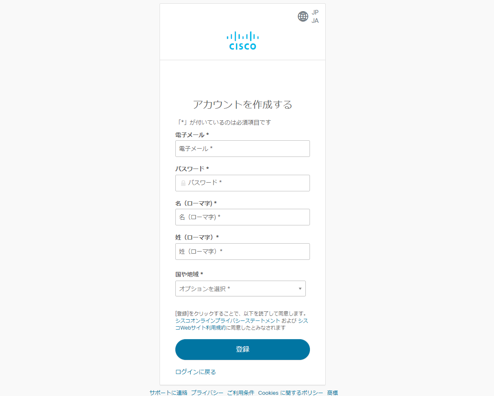
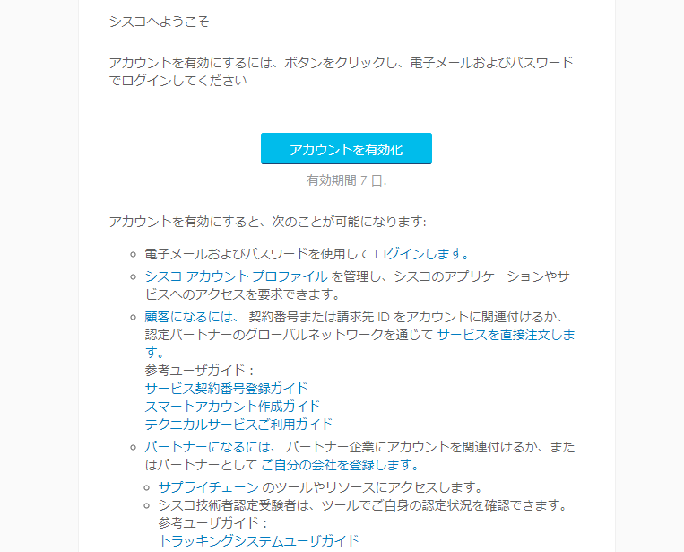
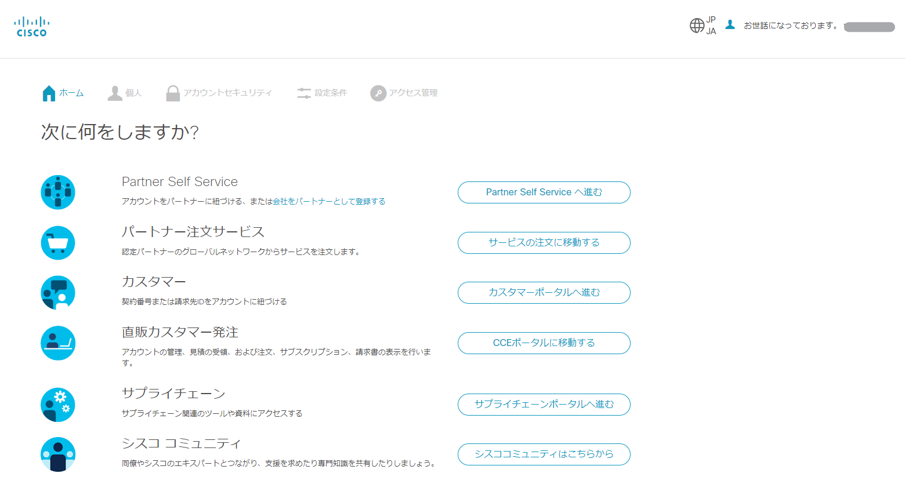
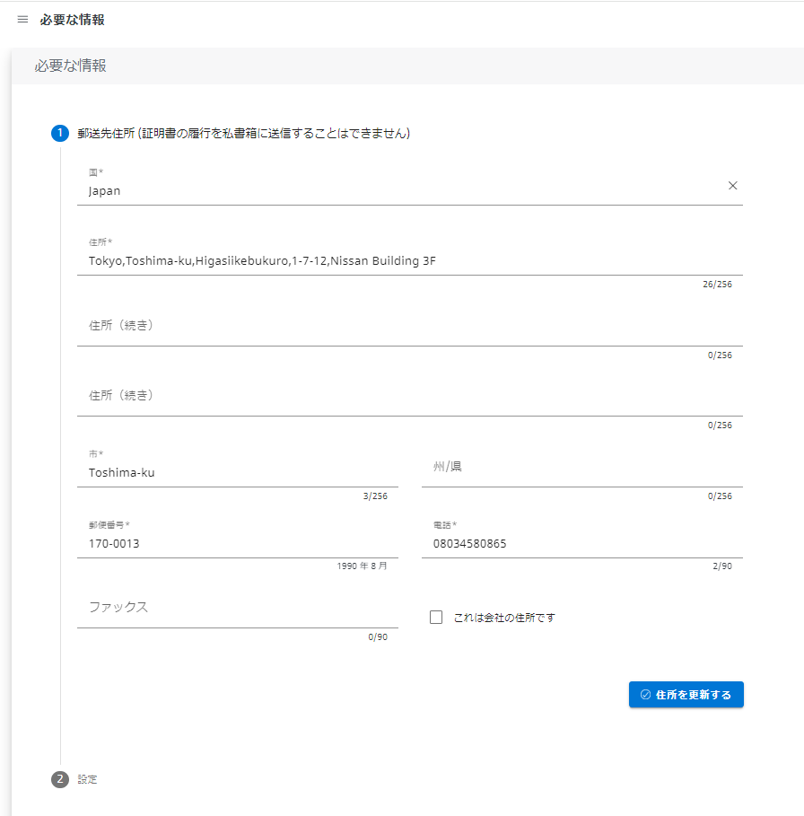
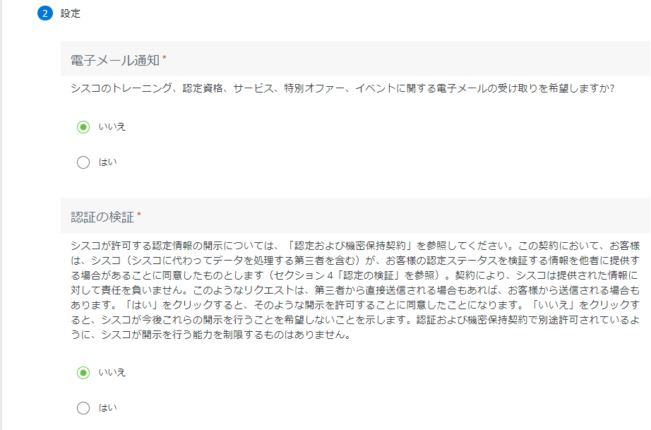
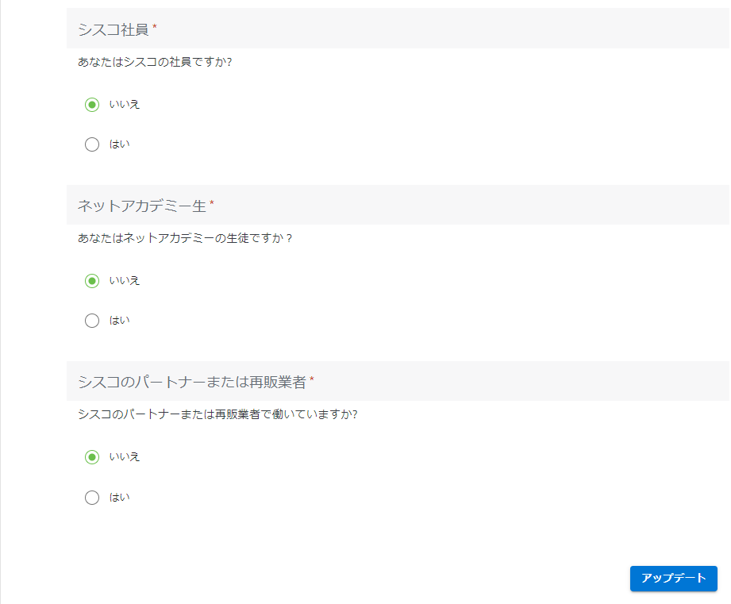
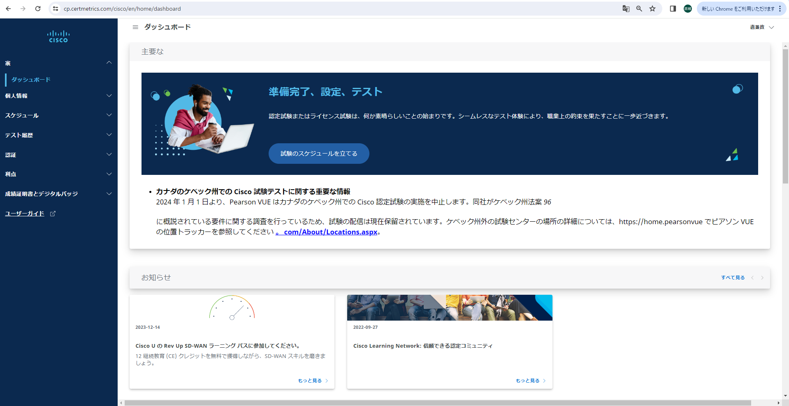
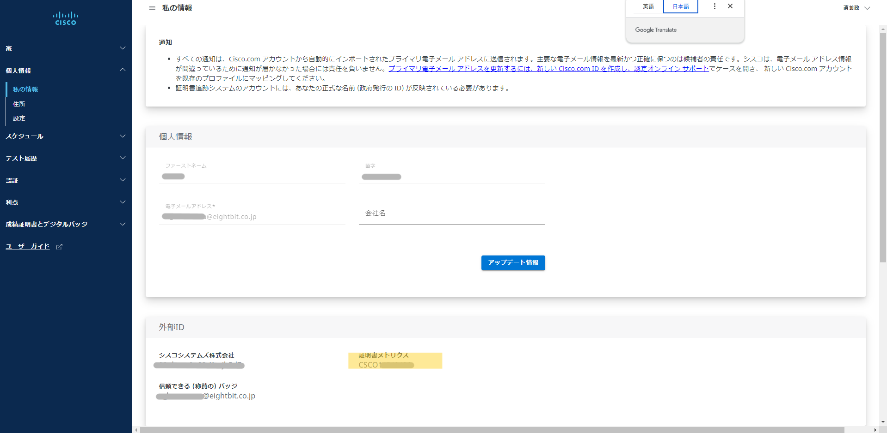
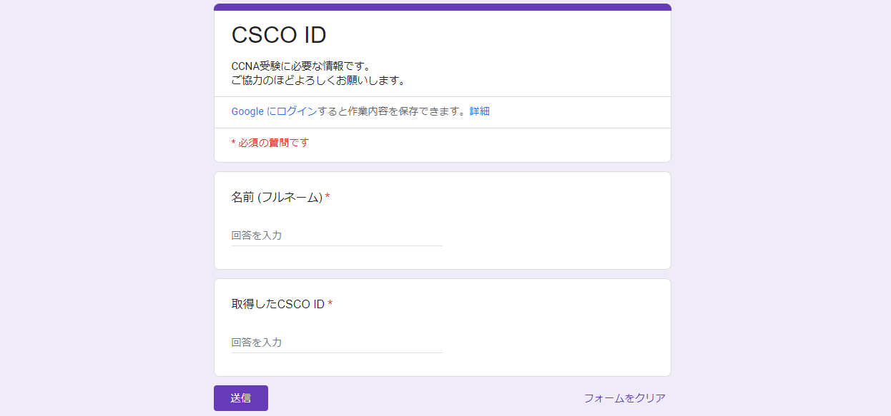

**CCNA受験のために必要なID** です。  
以下手順に沿って取得し、最終的にGoogle Formから取得した**CSCO ID**を送信して下さい。  

### 手順 1. アカウント登録ページにアクセス


以下のリンクからアカウント登録ページにアクセスし、以下の画面で必要項目を入力して下さい。

[公式アカウント登録ページ(id.cisco.com)](https://id.cisco.com/signin/register)

:::tip
**※入力時の注意点**  
- メールアドレスは会社から発行された `eightbit.co.jp` ドメインのものを使用して下さい
- ご自身で設定したパスワードは**忘れないように必ずメモしておいて下さい**  
:::

入力が完了したら `登録` ボタンをクリックします。



### 手順 2. アカウント有効化

設定したメールアドレスに **[アカウントを有効にする]** という件名のメールが届くので、  
該当メールから `アカウントを有効化` をクリックします。  




### 手順 3. サインイン確認

その後以下のURLからサインインできることを確認します。  
サインインに成功すると以下の画面が表示されます。


https://id.cisco.com/signin




### 手順 4. 詳細情報登録

以下のリンクにアクセスし、先程作成したアカウントでサインインしてください。

[公式詳細情報登録ページ(cp.certmetrics.com)](https://cp.certmetrics.com/cisco/en/login)

サインインすると以下の画面が表示されるので、現住所を **ローマ字で** 入力して下さい。

:::tip
参考までに、画像は以下の住所をローマ字にしたものです。

```
〒170-0013
東京都豊島区東池袋1-7-12　日産ビルディング3F
```
**※注意点**  
- 引越しが控えている方は**現住所**を入力して下さい (引越した場合はマイページから変更可能です)
:::

入力が完了したら `住所を更新する` をクリックしましょう。



次に、以下の項目の設定です。
- 電子メール通知
- 認証の検証
- シスコ社員
- ネットアカデミー生
- シスコのパートナーまたは再販業者

これらは全て ` いいえ ` (英語の場合は ` No ` )を選択し、  
右下の `アップデート` をクリックします。




### 手順 4. Ciscoマイページ表示

以下の画面に遷移することを確認しましょう。



### 手順 5. CSCO ID確認

画面左側の **個人情報** > **私の情報**  
英語の場合は **PERSONAL INFO** > **My Information**

をクリックし、下にスクロールして下さい。  
**証明書メトリクス** (英語の場合は**CERTMETRICS**) の下に記載されている**CSCO**から始まる文字列がCSCO IDですので、これをコピーしておきます。



### 手順 6. Google Formから送信

以下のURLにアクセスしてご自身のお名前 (※フルネーム) と先程コピーしたCSCO IDを貼り付けて送信ボタンをクリックして下さい。

[Google Form (CSCO ID送信用)](https://docs.google.com/forms/d/e/1FAIpQLSd8kYAfti0c9h4m_TWSN4Ov9dKwIUXlgx3OxBgiVg64tGBp9w/viewform)





以上で完了です。  
ご協力ありがとうございました！

