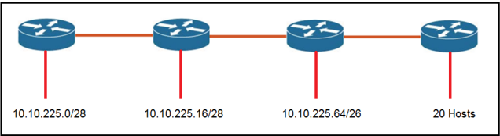
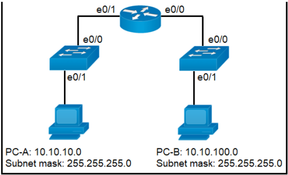

# CCNA対策問題 1-100

#### 問題 1  

展示を参照してください。  
R1 はホスト 10.10.13.10/32 に到達するためにどのタイプのルートを使用しますか?

- A. デフォルトルート
- B. ネットワークルート
- C. ホストルート
- D. フローティング静的ルート

#### 問題 2

展示を参照してください。  
Router1 はホスト A へのトラフィックにどのプレフィックスを使用しますか?

- A. 10.10.10.0/28
- B. 10.10.13.0/25
- C. 10.10.13.144/28
- D. 10.10.13.208/29

#### 問題 3  
ドラッグ ドロップ -  
ファイル転送プロトコルの説明を左側から右側の適切なプロトコルにドラッグ アンド ドロップします。

選択して配置します:

#### 問題 4  
スイッチに入るフレームは、フレーム チェック シーケンスに失敗します。  
どの 2 つのインターフェイス カウンタが増加しますか? (2 つお選びください。)

- A. input errors
- B. frame
- C. giants
- D. CRC
- E. runts

#### 問題 5  
DRAG DROP -  
IPv4 ネットワーク サブネットを左側から右側の適切な使用可能なホスト範囲にドラッグアンド ドロップします。

選択して配置します:

#### 問題 6  
TCP と UDP は、2 つのエンドポイント間の接続を確立する方法においてどのように異なりますか?

- A. TCP は 3 ウェイ ハンドシェイクを使用し、UDP はメッセージ配信を保証しません。
- B. TCP は同期パケットを使用し、UDP は確認パケットを使用します。
- C. UDP は信頼性の高いメッセージ転送を提供し、TCP はコネクションレス型プロトコルです。
- D. UDP はフレーム ヘッダーで SYN、SYN ACK、および FIN ビットを使用しますが、TCP は SYN、SYN ACK、および ACK ビットを使用します。

#### 問題 7  
どの 802.11 フレーム タイプがアソシエーション レスポンスですか?

- A. 管理
- B. 保護されたフレーム
- C. アクション
- D. コントロール

#### 問題 8  
追加のアクセス ポートが必要な場合、スパイン アンド リーフ アーキテクチャはネットワークの拡張性をどのように実現しますか?

- A. スパイン スイッチとリーフ スイッチは、それらの間の冗長接続を使用して追加できます。
- B. スパイン スイッチは少なくとも 40 GB のアップリンクを追加できます。
- C. リーフ スイッチは、すべてのスパイン スイッチに接続して追加できます。
- D. リーフ スイッチは、コア スパイン スイッチに 1 つの接続で追加できます。

#### 問題 9  
仮想マシンの機能を識別するものは何ですか?

- A. ハイパーバイザーは、追加のリソースを必要とせずにレイヤー 3 で通信します。
- B. 各ハイパーバイザーは、単一の仮想マシンと単一のソフトウェア スイッチをサポートします。
- C. ハイパーバイザーは、CPU、メモリ、ストレージなどの物理コンポーネントを仮想化します。
- D. 仮想化サーバーは、ハイパーバイザーとは別のスイッチに物理的に接続すると効率的に実行されます。

#### 問題 10  
指定された IPv6 プレフィックスとインターフェイスの MAC アドレスから IPv6 アドレスを自動的に生成するコマンドはどれですか?

- A. ipv6 address dhcp
- B. ipv6 address 2001:DB8:5:112::/64 eui-64
- C. ipv6 address autoconfig
- D. ipv6 address 2001:DB8:5:112::2/64 link-local

#### 問題 11  
インターフェイス上で IPv6 を設定する場合、どの 2 つの IPv6 マルチキャスト グループが参加しますか? (2 つお選びください。)

- A. 2000::/3
- B. 2002::5
C.FC00 ::/7
D.FF02 ::1
E.FF02 ::2

#### 問題 12  

DRAG DROP -  
出品物をご参照ください。  
左側のネットワーク パラメータを右側の正しい値にドラッグアンド ドロップします。

選択して配置します:

#### 問題 13  
宛先 MAC アドレスが不明なフレームを受信した場合のレイヤー 2 スイッチのデフォルトの動作は何ですか?

- A. レイヤ 2 スイッチはパケットを転送し、宛先 MAC アドレスをその MAC アドレステーブルに追加します。
- B. レイヤ 2 スイッチは、宛先 MAC アドレス学習のためにパケットのコピーを CPU に送信します。
- C. レイヤ 2 スイッチは、指定された VLAN の受信ポートを除くすべてのポートにパケットをフラッディングします。
- D. レイヤ 2 スイッチは受信したフレームをドロップします。

#### 問題 14  
エンジニアは 2 つのルート間に /30 サブネットを構成する必要があります。  
この基準を満たす使用可能な IP アドレスとサブネット マスクの組み合わせはどれですか?

- A. XX-AXXX:XXXXX IP アドレス 10.2.1.3 255.255.255.252 へのインターフェイスe0/0 の説明
- B. XX-AXXX:XXXXX IP アドレス 192.168.1.1 255.255.255.248 へのインターフェイス e0/0 の説明
- C. XX-AXXX:XXXXX IP アドレス 172.16.1.4 255.255.255.248 へのインターフェイスe0/0 の説明
- D. XX-AXXX:XXXXX IP アドレス 209.165.201.2 225.255.255.252 へのインターフェイス e0/0 の説明

#### 問題 15  
インターネットにアクセスせずにデバイスが通信できるネットワークはどれですか?

- A. 172.9.0.0/16
- B. 172.28.0.0/16
- C. 192.0.0.0 /8
- D. 209.165.201.0/24

#### 問題 16  

展示を参照してください。  
受信した構成エラー メッセージを説明しているステートメントはどれですか?

- A. プライベート IP アドレス範囲に属します。
- B. ルーターは /28 マスクをサポートしていません。
- C. ネットワーク IP アドレスです。
- D. ブロードキャスト IP アドレスです。

#### 問題 17  
サブネット間の通信を提供するが、インターネット上でルーティングできない IPv6 アドレス タイプはどれですか?

- A. link-local
- B. unique local
- C. multicast
- D. global unicast

#### 問題 18  
パケットを単一のアドレスではなくグループ アドレスに送信する IPv6 アドレス ブロックはどれですか?

- A. 2000::/3
- B. FC00 ::/7
- C. FE80 ::/10
- D. FF00 ::/8

#### 問題 19  
イーサネット インターフェイスでレイト コリジョンが増加する原因となる 2 つの理由は何ですか? (2 つお選びください。)

- A. キャリアセンス多重アクセス/衝突検出が使用される場合
- B. 接続の片側が半二重に設定されている場合
- C. 送信デバイスがフレームを再度送信する前に 15 秒待機する場合
- D. フレームの 32 バイト目が送信された後に衝突が発生した場合
- E. ケーブル長の制限を超えた場合

#### 問題 20  
Cisco ワイヤレス LAN コントローラを使用する利点は何ですか?

- A. 各アクセス ポイントを個別に設定する必要がなくなります。
- B. AP の集中管理には、より複雑な構成が必要です。
- C. 固有の SSID は同じ認証方法を使用できません。
- D. 自律型の軽量 AP をサポートします。

#### 問題 21  
PoE 電力分類オーバーライドが有効になっているスイッチ ポートによってどのアクションが実行されますか?

- A. 監視対象ポートが電力の最大管理値を超えると、ポートはシャットダウンされ、errdisabled になります。
- B. 受電装置が PoE スイッチ ポートから電力の供給を開始すると、syslog メッセージが生成されます。
- C. PoE スイッチ ポートの電力使用量がチェックされると、接続されたデバイスへのデータ フローが一時的に停止されます。
- D. デバイスが使用している電力が最小設定電力未満であるとスイッチが判断した場合、デバイスに障害が発生したものとみなし、デバイスを切断します。

#### 問題 22  
フレーム フラッディングのプロセス中にフレームに何が起こりますか?

- A. フレームは、他の VLAN に割り当てられているポートを含むすべてのポートに送信さ れます。
- B. フレームは、MAC アドレス テーブルに一致するエントリを持つスイッチ上のすべてのポートに送信されます。
- C. フレームは、発信元ポートを除く、同じ VLAN 内のスイッチ上のすべてのポートに送信されます。
- D. フレームは、同じ VLAN 内のスイッチ上のすべてのポートに送信されます。

#### 問題 23  
プライベート IPv4 アドレスの範囲はどの機能を実行しますか?

- A. 複数の企業が競合することなく同じアドレスを使用できるようにする
- B. 企業ネットワークの外部からのホストに直接接続を提供します。
- C. プライベート範囲アドレス指定を使用してインターネットに接続するために NAT が必要ないことを保証する
- D. すべての外部ホストに対してインターネットへの安全な通信を可能にする

#### 問題 24  
インターフェイスの MAC アドレスから派生したグローバル ユニキャスト IPv6 アドレスをインターフェイスに割り当てるには、どのアクションを実行する必要がありますか?

- A. リンクローカル アドレスを明示的に割り当てる
- B. EUI-64 ビットプロセスを無効にする
- C. インターフェイスで SLAAC を有効にする
- D. ネットワーク上にステートフル DHCPv6 サーバーを構成する

#### 問題 25  
組織の Wi-Fi ネットワークを改善するには、いくつかの新しいカバレッジ セルが必要です。  
推奨される 2 つの標準デザインはどれですか? (2 つお選びください。)

- A. 5GHz では、最大 23 の重複しないチャネルによりネットワーク容量が増加します。
- B. 5GHz チャネルの選択には自律型アクセス ポイントが必要です。
- C. 互いにオーバーラップするセルは、オーバーラップしないチャネルを使用するように設定されます。
- D. 重複するチャネルを持つ隣接セルは、リピータ アクセス ポイントを使用します。
- E. スループットを最大にするために、WLC は隣接するアクセス ポイントをチャネルに動的に設定するように設定されています。

#### 問題 26  
TCP と UDP は、パケット配信の信頼性を提供する点でどのように異なりますか?

- A. TCP は配信やデータの破損がないことを保証するエラー チェックを保証しません。UDP はメッセージの確認応答を提供し、失われた場合はデータを再送信します。
- B. TCP は、一度に大量のパケットを送信して受信者に負担をかけることを避けるためにフロー制御を提供します。UDP は、パケットをチェックせずに連続ストリームで受信者に送信します。
- C. TCP はコネクションレス型プロトコルであり、信頼性の高いデータ配信を提供しません。UDP は、シーケンスを使用して信頼性の高い配信を提供する接続指向のプロトコルです。
- D. TCP はウィンドウ処理を使用してパケットを確実に配信します。UDP は、3 ウェイ ハンドシェイクを確立することにより、ホスト間で信頼性の高いメッセージ転送を提供します。

#### 問題 27  
光ファイバーケーブルと銅線ケーブルの 2 つの違いは何ですか? (2 つお選びください。)

- A. ファイバー接続には BNC コネクタが使用されます
- B. ガラスコアコンポーネントがクラッドに包まれている
- C. データはクラッドを通過できる
- D. 光はファイバーのコアを通って伝送されます。
- E. ファイバーは RJ-45 接続を使用して物理インターフェイスに接続します

#### 問題 28  
CAPWAP はローカル モードのアクセス ポイントと WLC の間でどのように通信しますか?

- A. ループが発生するため、アクセス ポイントを有線ネットワークに接続しないでください。
- B. アクセス ポイントは WLC と同じスイッチに接続する必要があります
- C. アクセス ポイントは銅線ケーブルを使用して WLC に直接接続する必要があります
- D. アクセス ポイントは、WLC への接続を前提として、ネットワーク内の任意のスイッチにリンクする機能を備えています。

#### 問題 29  
パケットをユニキャスト アドレスではなくマルチキャスト アドレスに転送する IPv6 アドレス ブロックはどれですか?

- A. 2000::/3
- B. FC00 ::/7
- C. FE80 ::/10
- D. FF00 ::/12

#### 問題 30  
TCP と UDP の信頼性や通信タイプの違いは何ですか?

- A. TCP は信頼性が高く、コネクションレス型のプロトコルです。UDP は信頼性が低く、接続指向のプロトコルです。
- B. TCP は信頼性が低く、コネクションレス型プロトコルです。UDP は信頼性が高く、接続指向のプロトコルです。
- C. TCP は信頼性が低く、接続指向のプロトコルです。UDP は信頼性が高く、コネクションレス型プロトコルです。
- D. TCP は信頼性が高く、接続指向のプロトコルです。UDP は信頼性が低く、コネクションレス型のプロトコルです。

#### 問題 31  
3 層ネットワーク トポロジを 2 つ説明しますか? (2 つお選びください。)

- A. ディストリビューション層は、レイヤー 2 およびレイヤー 3 テクノロジーを実行します。
- B. ネットワーク コアは、デバイスに障害が発生した場合でも継続的な接続を維持するように設計されています。
- C. アクセス層は、異なるドメイン内のデバイス間のルーティングを管理します。
- D. コア層は各ホストの有線接続を維持します。
- E. コア層とディストリビューション層は同じ機能を実行します

#### 問題 32  
IPv4 パブリック アドレスと同じ方法でパブリックにルーティングできる IPv6 アドレスのタイプはどれですか?

- A. multicast
- B. unique local
- C. link-local
- D. global unicast

#### 問題 33  
EUI-64 アドレスが生成されると、どのような結果が期待されますか?

- A. インターフェイス ID はランダムな 64 ビット値として設定されます。
- B. インターフェイスの MAC アドレスの先頭に文字 FE80 が挿入されます。
- C. インターフェイスの元の MAC アドレスの 7 番目のビットが反転される
- D. インターフェースの MAC アドレスがそのままインターフェース ID として使用されます。

#### 問題 34  
企業のオフィスはビルの 4 フロアを使用します。

✑ フロア 1 には 24 人のユーザーがいます。  
✑ フロア 2 には 29 人のユーザーがいます。  
フロア 3 には 28 人のユーザーがいます。  
✑ フロア 4 には 22 人のユーザーがいます。  
どのサブネットがルーター構成の IP アドレスを要約し、最も効率的に配布しますか?

- A. 192.168.0.0/24 as summary and 192.168.0.0/28 for each floor
- B. 192.168.0.0/23 as summary and 192.168.0.0/25 for each floor
- C. 192.168.0.0/25 as summary and 192.168.0.0/27 for each floor
- D. 192.168.0.0/26 as summary and 192.168.0.0/29 for each floor

#### 問題 35  

展示を参照してください。  
エンジニアは、ネットワークに 20 人のユーザーを追加する新しいオフィスのサブネットを追加する必要があります。  
アドレスの無駄を最小限に抑えるために、エンジニアはどの IPv4 ネットワークとサブネット マスクの組み合わせを割り当てますか?

- A. 10.10.225.48 255.255.255.240
- B. 10.10.225.32 255.255.255.240
- C. 10.10.225.48 255.255.255.224
- D. 10.10.225.32 255.255.255.224

#### 問題 36  
スパインアンドリーフアーキテクチャの特徴は何ですか?

- A. リーフ スイッチ間の各リンクでは、より高い帯域幅が可能になります。
- B. STP ブロックされたポートの予測可能性が向上します。
- C. 可変遅延を提供します。
- D. 各デバイスは同じホップ数で分離されています。

#### 問題 37  
オフィスは 8 階建てで、各フロアのユーザー数は約 30 ～ 40 人です。1 つのサブネットを使用する必要があります。  
アドレス空間を効率的に使用するには、ルータのスイッチ仮想インターフェイスでどのコマンドを設定する必要がありますか?

- A. IP アドレス 192.168.0.0 255.255.0.0
- B. IP アドレス 192.168.0.0 255.255.254.0
- C. IP アドレス 192.168.0.0 255.255.255.128
- D. IP アドレス 192.168.0.0 255.255.255.224

#### 問題 38  
DRAG DROP -  
IP プロトコル送信の説明を左側から右側の IP トラフィック タイプにドラッグ アンドドロップします。

選択して配置します:

#### 問題 39  
デバイスが、同時にフレームを送信している 2 つのステーションを検出します。  
この状態は、フレームの最初の 64 バイトを受信した後に発生します。  
どのインターフェイス カウンタが増加しますか?

- A. runt
- B. collision
- C. late collision
- D. CRC

#### 問題 40  

展示を参照してください。  
最初の通信後に PC_A が PC_B にデータを送信すると、どのような結果が予想されますか?

- A. 送信元 MAC アドレスが変更されます。
- B. 宛先 MAC アドレスは ffff.ffff.ffff に置き換えられます。
- C. 送信元と宛先の MAC アドレスは同じままです。
- D. スイッチは送信元 MAC アドレスと宛先 MAC アドレスを独自の MAC アドレスに書き換えます。

#### 問題 41  
直接シーケンス スペクトラム拡散を使用して、衝突を制限するために 3 つの 2.4 GHz チャネルが使用されているのはどれですか?

- A. 5、6、7
- B. 1、2、3
- C. 1、6、11
- D. 1、5、10

#### 問題 42  
TCP と UDP は、パケット配信を保証する方法においてどのように異なりますか?

- A. TCP は再送信、確認応答、およびパリティ チェックを使用し、UDP は巡回冗長チェックのみを使用します。
- B. TCP は 2 次元のパリティ チェック、チェックサム、巡回冗長検査を使用し、UDP は再送信のみを使用します。
- C. TCP はチェックサム、確認応答、再送信を使用し、UDP はチェックサムのみを使用します
- D. TCP はチェックサム、パリティ チェック、および再送信を使用し、UDP は確認応答のみを使用します。

#### 問題 43  
ワイヤレス管理者が WLAN を設定しました。  
ただし、クライアントは音声品質を確保するために、混雑の少ない 5 GHz ネットワークにアクセスする必要があります。  
要件を満たすためにはどのようなアクションを実行する必要がありますか?

- A. バンド選択を有効にする
- B. DTIM を有効にする
- C. RX-SOP を有効にする
- D. AAA オーバーライドを有効にする

#### 問題 44  
DRAG DROP -  
アプリケーション プロトコルを左側から右側の使用するトランスポート プロトコルにドラッグ アンド ドロップします。

選択して配置します:

#### 問題 45  
ブロードキャストフレームの宛先 MAC アドレスとは何ですか?

- A. 00:00:0c:07:ac:01
- B. ff:ff:ff:ff:ff:ff
- C. 43:2e:08:00:00:0c
- D. 00:00:0c:43:2e:08
- E. 00:00:0c:ff:ff:ff

#### 問題 46  
イーサネット プロトコルが物理アドレスを使用する 2 つの目的は何ですか?

- A. レイヤ 2 でデバイスを一意に識別するため
- B. 別のネットワーク上のデバイスとの通信を許可するため
- C. レイヤ 2 フレームとレイヤ 3 パケットを区別するため
- D. どのデバイスが最初に送信できるかを決定する優先システムを確立する
- E. 同じネットワーク上の異なるデバイス間の通信を可能にする
- F. 物理アドレスが不明な場合にリモート デバイスの検出を許可する

#### 問題 47  
DRAG DROP -  
ネットワークパラメータを左側から右側の正しい値にドラッグアンドドロップします。

選択して配置します:

#### 問題 48  
トラフィックが到着していることをホストに通知するために、イーサネット フレームのどのコンポーネントが使用されますか?

- A. フレーム区切り文字の開始
- B. タイプフィールド
- C. 前文
- D. データフィールド

#### 問題 49  
インターネット接続用にパブリック IP アドレスを使用してエッジ ルーター インターフェイスを構成しています。  
ルーターはサービス プロバイダーから IP アドレスを動的に取得する必要があります。  
これを実現するには、インターフェイス FastEthernet 0/0 でどのコマンドが必要ですか?

- A. ip default-gateway
- B. ip route
- C. ip default-network
- D. ip address dhcp
- E. ip address dynamic

#### 問題 50  
OSI モデルの目的に関する 2 つの記述のうち、正確なのはどれですか? (2 つお選びください。)

- A. 各層で発生するネットワーク機能を定義します。
- B. 情報がネットワーク内をどのように移動するかについての理解を容易にする
- C. あるレイヤーでの変更は他のレイヤーに影響を与えない
- D. 階層化されたアプローチにより信頼性の高いデータ配信を保証します

#### 問題 51  
MAC アドレスに関する 3 つの記述のうち、正しいものはどれですか? （3 つお選びください。）

- A. ネットワーク上の他のデバイスと通信するには、ネットワーク デバイスに一意の MACアドレスが必要です。
- B. MAC アドレスは IP アドレスとも呼ばれます
- C. デバイスの MAC アドレスは、管理者権限を持つユーザが Cisco IOS CLI で設定する必要があります
- D. MAC アドレスには 2 つの主要なコンポーネントが含まれており、1 つ目はハードウェアの製造元を識別し、2 つ目はハードウェアを一意に識別します。
- E. MAC アドレスの例は 0A:26:B8:D6:65:90 です。
- F. MAC アドレスには 2 つの主要なコンポーネントが含まれます。1 つ目はホストが存在するネットワークを識別し、2 つ目はネットワーク上のホストを一意に識別します。

#### 問題 52  
IPv4 インフラストラクチャ上で IPv6 トラフィックをルーティングするために使用できる手法はどれですか?

- A. NAT
- B. 6 対 4 トンネリング
- C. L2TPv3
- D. デュアルスタック

#### 問題 53  

展示を参照してください。  
ネットワーク技術者は、冗長性を備えた小規模なネットワークを設計するように求められます。  
この展示では、すべてのホストが同じ VLAN 内に構成されているこの設計を表しています。この設計についてどのような結論が得られますか?

- A. この設計は意図したとおりに機能します。
- B. スパニングツリーを使用する必要があります。
- C. ルーターはアドレス指定スキームを受け入れません。
- D. スイッチ間の接続はトランクである必要があります。
- E. ルーター インターフェイスは 802.1Q プロトコルでカプセル化する必要があります。

#### 問題 54  
コマンド ip Route 172.16.3.0 255.255.255.0 192.168.2.4 について正しい 2 つの記述はどれですか? (2 つお選びください。)

- A. 172.16.3.0 ネットワークへのスタティック ルートを確立します。
- B. 192.168.2.0 ネットワークへの静的ルートを確立します。
- C. 不明な宛先へのトラフィックを 172.16.3.0 ネットワークに送信するようにルーターを設定します。
- D. 不明な宛先へのトラフィックをアドレス 192.168.2.4 のインターフェイスから送信するようにルーターを設定します。
- E. デフォルトのアドミニストレーティブ ディスタンスを使用します。
- F. 同じ宛先への他の経路が存在する場合に最後に使用される経路です。

#### 問題 55  
プライベート IPv4 IP アドレスの 2 つの利点は何ですか? (2 つお選びください。)

- A. これらはパブリック IP アドレスと同じようにルーティングされます。
- B. パブリック IP アドレスよりもコストがかかりません。
- C. インターネットに接続していなくてもデバイスに割り当てることができます。
- D. NAT ポリシーが不要になります。
- E. 重複した IP の競合を排除します。

#### 問題 56  
UDP プロトコルがアプリケーション トラフィックにもたらす 2 つの利点は何ですか?(2 つお選びください。)

- A. UDP トラフィックは TCP トラフィックよりもオーバーヘッドが低い
- B. UDP は、失われたパケットを再送信するための組み込みの回復メカニズムを提供します。
- C. UDP パケット ヘッダーの CTL フィールドにより、接続を確立するための 3 ウェイハンドシェイクが可能になります。
- D. UDP は接続状態を維持し、TCP よりも安定した接続を提供します。
- E. アプリケーションはチェックサムを使用してアプリケーション データの整合性を検証できます。

#### 問題 57  
ネットワークにプライベート IPv4 アドレッシングを実装する理由となる 2 つの目標はどれですか? (2 つお選びください。)

- A. PCI 規制に準拠する
- B. IPv4 アドレスを保存する
- C. ネットワークルーター上の転送テーブルのサイズを減らす
- D. ネットワークセキュリティ侵害のリスクを軽減する
- E. 現地の法律を遵守する

#### 問題 58  
小規模オフィス/ホーム オフィス アーキテクチャにはどの WAN アクセス テクノロジーが適していますか?

- A. ブロードバンド ケーブル アクセス
- B. フレームリレーパケットスイッチング
- C. 専用のポイントツーポイント専用線
- D. 統合サービスデジタルネットワークスイッチング

#### 問題 59  
ビジネスの拡張性とネットワークの信頼性に役立つ 2 つの WAN アーキテクチャ オプションはどれですか? (2 つお選びください。)

- A. 非同期ルーティング
- B. シングルホームブランチ
- C. デュアルホームブランチ
- D. 静的ルーティング
- E. 動的ルーティング

#### 問題 60  
固有の IPv6 固有ローカル アドレスのバイナリ パターンは何ですか?

- A. 00000000
- B. 11111100
- C. 11111111
- D. 11111101

#### 問題 61  
IPV4 プライベート IP 空間を使用する最も良い理由は、次の 2 つのうちどれですか? (2つお選びください。)

- A. 企業内通信を可能にするため
- B. NAT を実装する
- C. アプリケーションを接続する
- D. グローバルアドレス空間を節約するため
- E. ルーティングのオーバーヘッドを管理するため

#### 問題 62  

展示を参照してください。  
PC1 が PC2 にパケットを送信する場合、パケットはルータ R2のインターフェイス Gi0/0 に到着したときにどの送信元 IP アドレスと宛先 IP アドレスを持ちますか?

- A. 送信元 192.168.10.10 および宛先 10.10.2.2
- B. 送信元 192.168.20.10 と宛先 192.168.20.1
- C. 送信元 192.168.10.10 および宛先 192.168.20.10
- D. 送信元 10.10.1.1 と宛先 10.10.2.2

#### 問題 63  
SFP モジュールを使用する場合、銅線インターフェイスとファイバー インターフェイスの両方で同じことは何ですか?

- A. 信号強度を強化するためのインライン光減衰器をサポートしています。
- B. 単一モジュールでシングルモードとマルチモードに対応します。
- C. ホットスワップ可能であるため、サービスの中断を最小限に抑えます。
- D. 半二重モードで最大 100 Mbps の信頼できる帯域幅を提供します。

#### 問題 64  
ネットワーク上のサーバーの 2 つの機能は何ですか? (2 つお選びください。)

- A. 複数のワークステーションからのリクエストを同時に処理します
- B. 仮想サーバークラスタリングのみを利用して冗長化を実現
- C. 単一クライアント専用のデータセンターにのみ収容されており、仮想サーバークラスタリングのみを使用して冗長性を実現します。
- D. 他のサーバーと通信するために同じオペレーティング システムを実行する
- E. リクエストを行うワークステーションのデータを送信および取得するアプリケーションを実行する

#### 問題 65  
2 層アーキテクチャの折りたたまれたコア層によって実行される機能はどれですか?

- A. ルーティング ポリシーの適用
- B. データ ポリシーの対象トラフィックをマークする
- C. セキュリティポリシーの適用
- D. ユーザーをネットワークのエッジに接続する

#### 問題 66  
レイヤ 3 デバイスの主な機能は何ですか?

- A. ホスト間で無線トラフィックを送信するため
- B. トラフィックを分析し、インターネットからの不正なトラフィックをドロップするため
- C. 同じブロードキャスト ドメイン内でトラフィックを転送する
- D. 異なるネットワーク間でトラフィックを渡すため

#### 問題 67  
3 層アーキテクチャのコア層によって実行される 2 つの機能はどれですか? (2 つお選びください。)

- A. 中断のない転送サービスを提供する
- B. 悪意のあるアクティビティがないかパケットを検査する
- C. レイヤー間でタイムリーなデータ転送を確保する
- D. エンドユーザーデバイスに直接接続を提供する
- E. ネットワークのエッジに送信されるポリシング トラフィック

#### 問題 68  
2.4 GHz 周波数を使用するアクセス ポイントを設置する際に、同一チャネルの輻輳を回避するための推奨されるアプローチは何ですか?

- A. 重複しない異なるチャネル
- B. 1 つの重複チャンネル
- C. 1 つの非重複チャネル
- D. 異なる重複チャンネル

#### 問題 69  
管理者はネットワーク エンジニアに、従業員がたまにしか使用しないソフトウェアのインストール、管理、更新に時間を無駄にしないように、どのクラウド サービス モデルを使用するかをアドバイスしてもらいます。  
エンジニアが推奨するクラウド サービス モデルはどれですか?

- A. サービスとしてのインフラストラクチャ
- B. サービスとしてのプラットフォーム
- C. さまざまな種類のサービスをサポートするサービスとしてのビジネス プロセス
- D. サービスとしてのソフトウェア

#### 問題 70  
レイヤ 2 スイッチの 2 つの機能は何ですか? (2 つお選びください。)

- A. アソシエーション サーバーと認証サーバーの中心点として機能します。
- B. WAN 上のネットワーク間の最適なルートを選択する
- C. VLAN 内でパケットを移動する
- D. 異なる VLAN 間でパケットを移動する
- E. パケットの MAC アドレスに基づいて転送を決定します。

#### 問題 71  
DRAG DROP -  
TCP/IP プロトコルを左側から右側のプライマリ送信プロトコルにドラッグ アンド ドロップします。

選択して配置します:

#### 問題 72  
エンジニアは、2.4GHz チャネルの使用率が高く、5GHz チャネルの使用率が低いことを観察しました。  
クライアントが 5GHz アクセス ポイントを優先的に使用できるようにするには、何を構成する必要がありますか?

- A. Client Band Select
- B. Re-Anchor Roamed Clients
- C. OEAP Spilt Tunnel
- D. 11ac MU-MIMO

#### 問題 73  
データ プレーンではどのネットワーク機能が実行されますか?

- A. 受信 SSH 管理トラフィックの処理
- B. OSPF Hello パケットの送受信
- C. スパニングツリーの選択を容易にする
- D. リモートクライアント/サーバートラフィックの転送

#### 問題 74  
どのような条件下で TCP が UDP よりも優先されますか?

- A. 低遅延が最適な場合は UDP が使用され、遅延が許容できる場合は TCP が使用されます。
- B. TCP は、ドロップされたデータがより受け入れられる場合に使用され、UDP はデータが順不同で受け入れられる場合に使用されます。
- C. データの信頼性が重要な場合は TCP が使用され、パケットの欠落が許容される場合はUDP が使用されます。
- D. UDP はデータの対話性が高い場合に使用され、TCP はデータが時間に敏感な場合に使用されます。

#### 問題 75  

展示を参照してください。  
サイト A が新しいシングルモード ファイバー パスを介してサイト B に接続された直後、サイト A のユーザーから、サイト B でホストされているアプリケーションとの断続的な接続の問題が報告されました。  
断続的な接続問題の原因は何ですか?

- A. インターフェースのエラーが増加しています。
- B. 使用率が高いと遅延が長くなります。
- C. 間違った SFP メディア タイプが SiteA で使用されました。
- D. サイトが間違ったタイプのケーブルで接続されていた。

#### 問題 76  
ネットワーク エンジニアは、ルータ R1 GigabitEthernet1/1 インターフェイスをルータR2 GigabitEthernet1/1 インターフェイスに接続するように設定する必要があります。  
構成を適用するには、エンジニアはアドレス2001:0db8:0000:0000:0500:000a:400F:583B を圧縮する必要があります。  
インターフェイス上でどのコマンドを発行する必要がありますか?  

- A. `ipv6 address 2001::db8:0000::500:a:400F:583B`
- B. `ipv6 address 2001:db8:0::500:a:4F:583B`
- C. `ipv6 address 2001:db8::500:a:400F:583B`
- D. `ipv6 address 2001:0db8::5:a:4F:583B`

#### 問題 77  
パケットの状態をチェックして、パケットが正当であるかどうかを判断するネットワークアプライアンスとは何ですか?

- A. レイヤ 2 スイッチ
- B. LAN コントローラー
- C. ロードバランサ
- D. ファイアウォール

#### 問題 78  
企業ネットワークにおけるアクセス ポイントの役割は何ですか?

- A. DDoS 攻撃を防ぐために SNMP と統合する
- B. 企業ネットワークの防御の第一線として機能する
- C. 無線デバイスを有線ネットワークに接続する
- D. ネットワーク上のデバイスへの安全なユーザー ログインのサポート

#### 問題 79  
実装者は、ホスト上に仮想マシンを作成するために仮想化用のハードウェアを準備しています。  
ハードウェアと仮想マシン間の通信を提供するには何が必要ですか?

- A. ルーター
- B. ハイパーバイザー
- C. スイッチ
- D. ストレートケーブル

#### 問題 80  
Cisco Unified Wireless Network は Wi-Fi チャネルの重複にどのように対応しますか?

- A. これにより、管理者はデバイスごとまたはインターフェイスごとにチャネルを割り当てることができます。
- B. 異なるメーカーのデバイスを異なるチャネルに分離します。
- C. クライアントの負荷とバックグラウンド ノイズを分析し、チャネルを動的に割り当てます。
- D. 隣接するアクセス ポイントでは、2.4 GHz と 5 GHz が自動的に切り替わります。

#### 問題 81  
組織のネットワーク上の新しいサブネットにプライベート IPv4 アドレス指定が適しているのはどのような状況ですか?

- A. ネットワークには複数のエンドポイント リスナーがあり、ブロードキャストの数を制限することが望まれます。
- B. ISP は、Web サービスのために新しいサブネットをインターネットにアドバタイズすることを要求します。
- C. 一意のアドレス空間が限られているため、新しいサブネット上のトラフィックは組織内でローカルに留まります。
- D. サブネット上のトラフィックは、サイト間 VPN を経由して外部の組織に到達する必要があります。

#### 問題 82  
DRAG DROP -  
ネットワーク アーキテクチャの特性を左側から右側のアーキテクチャの種類にドラッグアンド ドロップします。

選択して配置します:

#### 問題 83  
クライアントがプローブ要求を送信した後、プローブ応答によって示される 802.11 フレーム タイプはどれですか?

- A. データ
- B. 管理
- C. コントロール
- D. アクション

#### 問題 84  
TCP と UDP のデータ伝送の配信と信頼性の違いは何ですか?

- A. TCP はより高いレートでデータを送信し、パケット配信を保証します。UDP は失われたデータを再送信し、アプリケーションがリモート エンドでデータを確実に受信できるようにします。
- B. TCP では、データを送信する前に接続を確立する必要があります。UDP は、パケット配信を保証せずに、より高いレートでデータを送信します。
- C. UDP は、データを送信する前に両方のデバイス間の接続を設定します。TCP は 3 ウェイ ハンドシェイクを使用して、信頼性の高い接続でデータを送信します。
- D. UDP はマルチキャストおよびブロードキャスト通信に使用されます。TCP はユニキャスト通信に使用され、エラー チェックを行いながら高速でデータを送信します。

#### 問題 85  

展示を参照してください。  
PC-A が PC-B にトラフィックを送信する場合、どのネットワーク コンポーネントが PC-A からのパケットの受信、IP アドレスの確認、パケットのPC-B への転送を担当しますか?

- A. ルーター
- B. レイヤ 2 スイッチ
- C. ロードバランサ
- D. ファイアウォール

#### 問題 86  
T1 ポイントツーポイント接続の最大帯域幅はどれくらいですか?

- A. 1.544Mbps
- B. 2.048Mbps
- C. 34.368Mbps
D.43.7Mbps

#### 問題 87  
UTP Cat 5e ケーブルと Cat 6a ケーブルの 2 つの類似点は何ですか? (2 つお選びください。)

- A. どちらも最大 10 ギガビットの速度をサポートします。
- B. どちらも少なくとも 1 ギガビットの速度をサポートします。
- C. どちらも最大 55 メートルの走行をサポートします。
- D. どちらも最大 100 メートルの走行をサポートします。
- E. どちらも 500 MHz の周波数で動作します。

#### 問題 88  
クラウドベースのネットワーク トポロジの特徴は何ですか?

- A. オンサイト ネットワーク サービスは、物理レイヤー 2 およびレイヤー 3 コンポーネントで提供されます。
- B. ワイヤレス接続はサービスへの唯一のアクセス方法を提供します
- C. 物理ワークステーションがリソースを共有するように構成されている
- D. サービスはパブリック、プライベート、またはハイブリッド展開によって提供されます。

#### 問題 89  
データ プレーン内で発生するネットワーク アクションはどれですか?

- A. 受信した ICMP エコー要求に応答する
- B. 受信した NETCONF RPC から構成を変更する
- C. ルーティング プロトコル (OSPF、EIGRP、RIP、BGP) を実行する
- D. 宛先 IP アドレスを IP ルーティング テーブルと比較する

#### 問題 90  

展示を参照してください。R1 はホスト A からホスト B 宛てのパケットを受信したところです。  
R1 がホスト B に到達するためにルーティング テーブル内のどのルートを使用しますか?

- A. 10.10.13.0/25 [1/0] via 10.10.10.2
- B. 10.10.13.0/25 [108/0] via 10.10.10.10
- C. 10.10.13.0/25 [110/2] via 10.10.10.6
- D. 10.10.13.0/25 [110/2] via 10.10.10.2

#### 問題 91  
データ プレーン内で発生する 2 つのネットワーク アクションはどれですか? (2 つお選びください。)

- A. ルーティング プロトコルを実行します。
- B. 受信した NETCONF RPC から構成を変更します。
- C. 802.1Q トランキング ヘッダーを追加または削除します。
- D. 宛先 MAC アドレスを MAC アドレス テーブルと照合します。
- E. 受信した ICMP エコー要求に応答します。

#### 問題 92  
ネットワークエンドポイントとは何ですか?

- A. VLAN 間接続のサポート
- B. ネットワークが侵害された場合のネットワークへの脅威
- C. ユーザーをサービスプロバイダーのネットワークに接続するルーターとして機能する
- D. インターネットに向かうキャンパス全体のトラフィックに対するポリシーを適用する

#### 問題 93  

展示を参照してください。  
PC1 とスイッチ間のリンクは稼働していますが、パフォーマンスが低下しています。  
パフォーマンスの問題の原因となっているインターフェイスの状態はどれですか?

- A. スイッチ インターフェイスのファイバーに問題があります。
- B. インターフェイス上にデュプレックスの不一致があります。
- C. インターフェイス タイプの不一致があります。
- D. インターフェイスに速度の不一致があります。

#### 問題 94  
RFC 1918 アドレス空間はなぜ定義されたのですか?

- A. パブリック IPv4 アドレス指定を保存する
- B. NAT プロトコルをサポートする
- C. パブリック IPv6 アドレス空間を保持する
- D. 重複する IP アドレスのインスタンスを減らす

#### 問題 95  
ドラッグ ドロップ -  
TCP または UDP の詳細を左側から右側の対応するプロトコルにドラッグ アンド ドロップします。

選択して配置します:

#### 問題 96  
DRAG DROP -  
IPv6 アドレスを左側から右側の対応するアドレス タイプにドラッグ アンド ドロップします。

選択して配置します:

#### 問題 97  
どのタイプの組織がコラプス・コア・アーキテクチャを使用する必要がありますか?

- A. 小規模であり、ネットワークコストを削減する必要がある
- B. 大規模であり、ハードウェア障害時のダウンタイムを最小限に抑える必要がある
- C. 大規模であり、柔軟でスケーラブルなネットワーク設計が必要
- D. 現在は小規模だが、近い将来に劇的に成長すると予想される

#### 問題 98  
ネットワーク管理者は、64 ビット アドレス2001:0EB8:00C1:2200:0001:0000:0000:0331/64 を使用して、新しい IPv6 ネットワークを設定しています。  
構成を簡素化するために、管理者はアドレスを圧縮することにしました。管理者はどの IP アドレスを設定する必要がありますか?

- A. ipv6 address 2001:EB8:C1:22:1::331/64
- B. ipv6 address 21:EB8:C1:2200:1::331/64
- C. ipv6 address 2001:EB8:C1:2200:1:0000:331/64
- D. ipv6 address 2001:EB8:C1:2200:1::331/64

#### 問題 99  
DRAG DROP -  
IPv6 アドレスを左側から右側の対応するアドレス タイプにドラッグ アンド ドロップします。

選択して配置します:

#### 問題 100  
プライベート IPv4 アドレス指定の適切な使用法は何ですか?

- A. 内部のホストが組織外部のホストと双方向通信できるようにするため
- B. 外部リソースのみにデータをストリーミングする内部ホスト上
- C. ファイアウォールの一般公開インターフェイス上
- D. 他の内部ホストとのみ通信するホスト上

