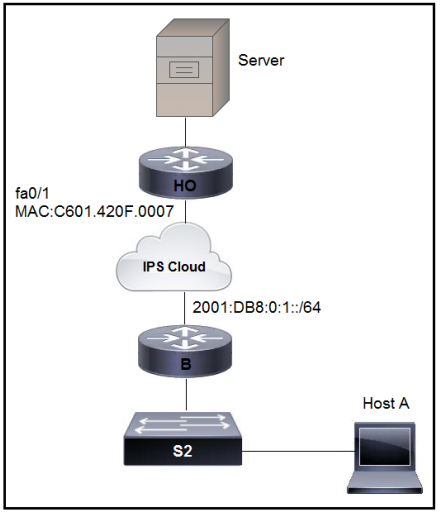
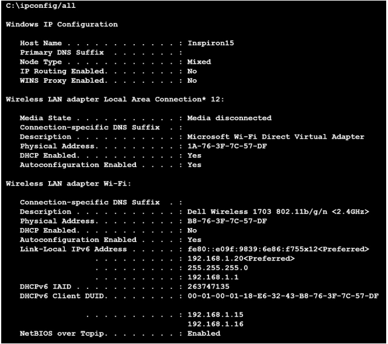

# CCNA対策問題 101-200

#### 問題 101  

展示を参照してください。  
エンジニアが HO ルーターを構成しています。  
ルータがそれ自身に一意の 64 ビット IPv6 アドレスを割り当てるには、どの IPv6 アドレス設定をルータ fa0/1 インターフェイスに適用する必要がありますか?

- A. ipv6 address 2001:DB8:0:1:FFFF:C601:420F:7/64
- B. ipv6 address 2001:DB8:0:1:FE80:C601:420F:7/64
- C. ipv6 address 2001:DB8:0:1:C601:42FF:FE0F:7/64
- D. ipv6 address 2001:DB8:0:1:C601:42FF:800F:7/64

#### 問題 102  
1000BASE-LX 規格と 1000BASE-T 規格の類似点は何ですか?

- A. どちらも同じデータリンク ヘッダーとトレーラーの形式を使用します。
- B. どちらのケーブル タイプも RJ-45 コネクタをサポートしています。
- C. どちらもノード間で最大 550 メートルをサポートします。
- D. どちらのケーブル タイプも LR コネクタをサポートしています。

#### 問題 103  

展示を参照してください。  
指定された Windows PC は、www.cisco.com のホストの IPアドレスを要求しています。  
リクエストはどの IP アドレスに送信されますか?

- A. 192.168.1.253
- B. 192.168.1.100
- C. 192.168.1.226
- D. 192.168.1.254

#### 問題 104  
一致する宛先 MAC アドレスを持つポートにフレームを転送する機能はどれですか?

- A. フレームフラッディング
- B. フレームフィルタリング
- C. フレーム押し
- D. フレーム切り替え

#### 問題 105  
ユニキャスト アドレスに似ていますが、同じネットワーク上の複数のデバイスに同時に割り当てられる IPv6 アドレスのタイプはどれですか?

- A. グローバルユニキャストアドレス
- B. リンクローカルアドレス
- C. エニーキャストアドレス
- D. マルチキャストアドレス

#### 問題 106  
プライベート IPv4 アドレッシングの特徴は何ですか?

- A. 最大 65,536 個の使用可能なアドレスで構成される
- B. 自律システム番号と組み合わせて IANA によって発行される
- C. 追跡または登録なしで使用される
- D. アウトバウンド ACL が適用されている場合にインターネットを通過する

#### 問題 107  
ネットワーク上のエンドポイントの機能とは何ですか?

- A. 建物内のユーザーに無線サービスを提供する
- B. サーバーとクライアントデバイスをネットワークに接続する
- C. ユーザーがデータを記録し、ファイルサーバーに送信できるようにする
- D. ネットワーク上の VLAN 間でトラフィックを転送する

#### 問題 108  
コントローラーベースのネットワークにおけるコントローラーの機能は何ですか?

- A. SDN アーキテクチャの集中管理ポイントとして機能します。
- B. キャンパスのすべてのルーティング決定を維持する 1 対のコア ルーターです
- C. ネットワークのデータ プレーンを一元化する
- D. キャンパスのすべてのルーティング決定を維持するコア ルータ上のカードです。

#### 問題 109  

展示を参照してください。  
各ルーターは、サブネット内で最後に使用可能な IP アドレスを使用して構成する必要があります。  
この要件を満たす構成はどれですか?

- A. R7# interface FastEthernet1/0 ip address 10.88.31.127 255.255.255.192  
R8# interface FastEthernet0/0 ip address 10.19.63.95 255.255.255.240  
R9# interface FastEthernet1/1 ip address 10.23.98.159 255.255.255.224
- B. R7# interface FastEthernet1/0 ip address 10.88.31.126 255.255.255.240  
R8# interface FastEthernet0/0 ip address 10.19.63.94 255.255.255.192  
R9# interface FastEthernet1/1 ip address 10.23.98.158 255.255.255.248
- C. R7# interface FastEthernet1/0 ip address 10.88.31.127 255.255.255.240  
 R8# interface FastEthernet0/0 ip address 10.19.63.95 255.255.255.192  
 R9# interface FastEthernet1/1 ip address 10.23.98.159 255.255.255.248
- D. R7# interface FastEthernet1/0 ip address 10.88.31.126 255.255.255.192  
R8# interface FastEthernet0/0 ip address 10.19.63.94 255.255.255.240  
R9# interface FastEthernet1/1 ip address 10.23.98.158 255.255.255.224

#### 問題 110  
TCP と UDP はクエリ責任モデルにどのように適合しますか?

- A. TCP はシーケンスの使用を回避し、UDP は確認応答の使用を回避します。
- B. TCP はデータを送信する前に接続を確立し、UDP は即座に送信します。
- C. TCP は順序どおりでないパケット配信を促進し、UDP は再順序付けを防止します
- D. TCP はパケットのエラー検出を使用し、UDP はエラー回復を使用します。

#### 問題 111  
企業ネットワークにおける認証とローミングの集中制御を提供するものは何ですか?  

- A. 軽量アクセス ポイント
- B. 無線 LAN コントローラー
- C. ファイアウォール
- D. LAN スイッチ

#### 問題 112  
米国で標準となっている 2 つの 4 GHz 重複しないワイヤレス チャネルのセットはどれですか?

- A. チャンネル 1、6、11、14
- B. チャンネル 2、7、9、11
- C. チャンネル 2、7、11
- D. チャンネル 1、6、および 11

#### 問題 113  
ネットワーク エンジニアが IPv6 のみ対応のデバイスを設置しています。  
クライアントは、デバイスの IP アドレスが内部ネットワークからのみ到達可能であることを要求しました。  
エンジニアはどのタイプの IPv6 アドレスを割り当てる必要がありますか?

- A. IPv4 互換の IPv6 アドレス
- B. 固有のローカルアドレス
- C. リンクローカルアドレス
- D. 集約可能なグローバル アドレス

#### 問題 114  
Wi-Fi チャネルが重複しないための要件は何ですか?

- A. 異なるセキュリティ設定
- B. 不連続な周波数範囲
- C. 固有の SSID
- D. 異なる伝送速度

#### 問題 115  
ネットワーク エンジニアは、vlan 2000 インターフェイスに IPv6 構成を実装して、インターネットへのアドバタイズがブロックされる、ルーティング可能なローカルで一意のユニキャスト アドレスを作成する必要があります。  
エンジニアはどの構成を適用する必要がありますか?

- A. `interface vlan 2000 ipv6 address ff00:0000:aaaa::1234:2343/64`
- B. `interface vlan 2000 ipv6 address fd00::1234:2343/64`
- C. `interface vlan 2000 ipv6 address fe80:0000:aaaa::1234:2343/64`
- D. `interface vlan 2000 ipv6 address fc00:0000:aaaa::a15d:1234:2343:8aca/64`

#### 問題 116  
SSID の 2 つの特徴は何ですか? (2 つお選びください。)

- A. WLAN 内のクライアントを一意に識別します。
- B. 長さは最大 32 文字です
- C. WLAN 内のアクセス ポイントを一意に識別します
- D. WLAN への安全なアクセスを提供します。
- E. WLAN 内で非表示にすることも、ブロードキャストすることもできます。

#### 問題 117  
スイッチが既知の宛先 MAC アドレスのフレームを受信した場合、フレームはどのように処理されますか?

- A. 発信元のポートを除くすべてのポートにフラッディング
- B. 最初に利用可能なポートに転送される
- C. 既知の MAC アドレスで識別されたポートに送信される
- D. すべてのポートにブロードキャストする

#### 問題 118  
DRAG DROP -  
IPv6 アドレスの詳細を左側から右側の対応するタイプにドラッグ アンド ドロップします。

選択して配置します:

#### 問題 119  
折りたたまれたコア アーキテクチャの折りたたまれたレイヤーとは何ですか?

- A. コアとディストリビューション
- B. アクセスと WAN
- C. distribution とアクセス
- D. コアと WAN

#### 問題 120  
SOHO ネットワークの特徴は何ですか?

- A. 負荷分散と冗長性を提供するために、少なくとも 3 層のデバイスが含まれている
- B. 各スイッチをネットワーク内の他のすべてのスイッチに接続する
- C. 複数のユーザーが単一のブロードバンド接続を共有できるようにする
- D. 1000 人以上のユーザーに高スループットのアクセスを提供する

#### 問題 121  
コントローラーベースのネットワークにおける分解の役割は何ですか?

- A. コントロール プレーンとデータ プレーンの機能を分割します。
- B. レイヤ 2 またはレイヤ 3 の機能を実行するように個々のデバイスを割り当てることで、トラフィック処理を合理化します。
- C. ネットワーク トポロジのコア層とディストリビューション層の間のルートを要約します。
- D. ネットワーク トポロジをリング ネットワークからスター ネットワークに迅速に調整できるようにします。

#### 問題 122  
Web サーバーによって実行される機能とは何ですか?

- A. クライアントデバイスから電子メールを送受信する
- B. FTP アクセス用にファイルを安全に保存する
- C. ユーザーのアイデンティティを認証および認可する
- D. HTTP 経由で送信されるアプリケーションを提供する

#### 問題 123  

展示を参照してください。  
サイト A は最近、新しいシングルモード ファイバー パスを介してサイト B に接続されました。  
サイト A のユーザーは、サイト B でホストされているアプリケーションとの断続的な接続の問題を報告しています。  
問題の理由は何ですか?

- A. 物理ネットワーク エラーが 2 つのサイト間で送信されています。
- B. 使用量が多いと遅延が長くなります。
- C. 接続に間違ったタイプのケーブルが使用されました。
- D. 間違ったタイプのトランシーバーがリンク上のデバイスに挿入されています。

#### 問題 124  
SSL を使用するプロトコルはどれですか?

- A. SSH
- B. HTTPS
- C. HTTP
- D. Telnet

#### 問題 125  
VoIP などの低遅延が必要なアプリケーションには、TCP よりも UDP が適しているのはなぜですか?

- A. UDP はすべてのパケットの配信を確実に保証します。TCP は高負荷時にパケットをドロップします。
- B. TCP がランダムな順序でパケットを受信する機能を提供するために、UDP はパケットが到着する順序データを使用します。
- C. TCP は効率的なパケット配信のために輻輳制御を使用します。UDP はパケットの配信にフロー制御メカニズムを使用します。
- D. TCP は受信したすべてのパケットに対して確認応答を送信します。UDP は確認応答なしで動作します。

#### 問題 126  
SSID の 2 つの機能は何ですか? (2 つお選びください。)

- A. 最大 32 文字の英数字を使用します
- B. Wi-Fi ネットワークの速度を制御します
- C. コントローラーベースの Wi-Fi ネットワークのみで使用される
- D. 単一のアクセス ポイントをサポートする
- E. デフォルトでブロードキャストする

#### 問題 127  
3 層ネットワーク アーキテクチャのアクセス層を説明する 2 つの特性はどれですか? (2つお選びください。)

- A. ネットワーク集約ポイントとして機能します
- B. LAN プリンタの物理接続ポイント
- C. 継続的な冗長稼働時間の要件を満たすように設計されている
- D. 無線アクセス ポイントが有線ネットワークに接続する層
- E. レイヤ 2 通信とレイヤ 3 通信の間の境界を提供します。

#### 問題 128  
どの PoE モードが受電デバイスの検出を有効にし、デバイスが検出されたときに電力を保証しますか?

- A. auto
- B. static
- C. dynamic
- D. active

#### 問題 129  

展示を参照してください。  
ルーターは、サブネット上の 380 ユーザーの要件に対応するスーパー ネットを使用して構成されています。  
この要件では、将来の 30% の成長がすでに考慮されています。  
ルーター R4 上の IP サブネットを検証する設定はどれですか?

- A. Subnet: 10.7.54.0 Subnet mask: 255.255.128.0 Broadcast address: 10.5.55.255 Usable IP address range: 10.7.54.1 ג€ "10.7.55.254
- B. Subnet: 10.7.54.0 Subnet mask: 255.255.255.0 Broadcast address: 10.7.54.255 Usable IP address range: 10.7.54.1 ג€ "10.7.55.254
- C. Subnet: 10.7.54.0 Subnet mask: 255.255.254.0 Broadcast address: 10.7.54.255 Usable IP address range: 10.7.54.1 ג€ "10.7.55.254
- D. Subnet: 10.7.54.0 Subnet mask: 255.255.254.0 Broadcast address: 10.7.55.255 Usable IP address range: 10.7.54.1 ג€ "10.7.55.254

#### 問題 130  

展示を参照してください。  
スイッチと PC の設定が完了しました。  
VLAN 2 と 3 が相互に通信するには、どの設定を適用する必要がありますか?

- A. interface GigabitEthernet0/0 ip address 10.10.2.10 255.255.252.0
- B. interface GigabitEthernet0/0.10 encapsulation dot1Q 3 ip address 10.10.2.10 255.255.254.0
- C. interface GigabitEthernet0/0.3 encapsulation dot1Q 3 native ip address 10.10.2.10 255.255.252.0
- D. interface GigabitEthernet0/0.3 encapsulation dot1Q 10 ip address 10.10.2.10 255.255.255.252

#### 問題 131  
DRAG DROP -  
IPv6 アドレス タイプの特性を左から右にドラッグ アンド ドロップします。

選択して配置します:

#### 問題 132  

DRAG DROP -   
出品物をご参照ください。  
次の要件に基づいて、DC-1 および HQ-1 ルータ上で IP アドレス設定を完了する必要があります。  
✑ DC-1 Gi1/0 は /30 上で使用可能な最後のアドレスである必要があります  
✑ DC-1 Gi1/1 は最初のアドレスである必要があります/29 で使用可能なアドレス  
✑ DC-1 Gi1/2 は /28 で使用可能な最後のアドレスである必要があります  
✑ HQ-1 Gi1/3 は /29 で使用可能な最後のアドレスである必要があります  
コマンドを左側から右側に宛先インターフェイス。すべてのコマンドが使用されるわけではありません。

選択して配置します:

#### 問題 133  
RFC 1918 アドレス指定はネットワークでどのように使用されますか?  

- A. 内部ネットワークから変換せずにインターネットにアクセスするために使用されます。
- B. セキュリティを強化するために、パブリック アドレスの代わりに使用されます。
- C. これらは、パブリック IPv4 アドレスを保存するために NAT とともに使用されます。
- D. これらは、インターネット サービス プロバイダーがインターネット上でルーティングするために使用します。

#### 問題 134  
ドラッグ ドロップ -  
IPv6 アドレス タイプを左側から右側の説明にドラッグ アンド ドロップします。

選択して配置します:

#### 問題 135  

展示を参照してください。  
ネットワーク インターフェイスのパフォーマンスが低下する理由は何ですか?

- A. インターフェイスが過剰なブロードキャスト トラフィックを受信しています。
- B. インターフェイスの帯域幅設定が間違っています。
- C. 2 つのデバイス間のケーブル接続に欠陥があります。
- D. インターフェイスは、接続されたデバイスとは異なる速度で動作しています。

#### 問題 136  
DRAG DROP -  
IPv6 アドレスの説明を左側から右側の IPv6 アドレス タイプにドラッグ アンド ドロップします。  
すべてのオプションが使用されるわけではありません。

選択して配置します:

#### 問題 137  
DRAG DROP -  
IPv6 アドレスを左側から右側の対応するアドレス タイプにドラッグ アンド ドロップします。

選択して配置します:

#### 問題 138  
どの WAN トポロジが最も高い信頼性を持っていますか?

- A. ポイントツーポイント
- B. ルーターオンスティック
- C. フルメッシュ
- D. ハブアンドスポーク

#### 問題 139  
DRAG DROP -  
IPv6 アドレス タイプの特性を左から右にドラッグ アンド ドロップします。

選択して配置します:

#### 問題 140  
ポートが err-disabled 状態になる原因は何ですか?

- A. ポートに何も接続されていません
- B. リンクのフラッピング
- C. 待ち時間
- D. ポート上で発行されたシャットダウン コマンド

#### 問題 141  
DRAG DROP -  
トランスポート層プロトコルの特性を左側から右側の対応するプロトコルにドラッグ アンド ドロップします。

選択して配置します:

#### 問題 142  
ネットワーク エンジニアは、IP アドレス 10.10.10.145 と11111111.11111111.11111111.11111000 に相当するサブネット マスクを使用してインターフェイスを構成する必要があります。  
エンジニアはどのサブネット マスクを使用する必要がありますか?
- A. /29
- B. /30
- C. /27
- D. /28

#### 問題 143  

展示を参照してください。  
スイッチは、テストに成功した Cat5 イーサネット ケーブルを介して接続されています。  
インターフェイスはアクセス ポートとして設定されており、両方ともダウン状態です。  
問題の原因は何ですか?

- A. スイッチの速度設定が一致していません。
- B. 2 つのスイッチ間の距離は Cat5 ではサポートされていません
- C. スイッチが互換性のないデュプレックス設定で構成されている
- D. portfast コマンドが設定に欠落している

#### 問題 144  
パブリック IPv4 アドレス空間を維持しながら、ネットワーク上のユーザーにインターネット アクセスを提供する 2 つの IP アドレス指定スキームはどれですか? (2 つお選びください。)

- A. IPv6 アドレス指定
- B. プライベート内部アドレス指定を使用した PAT
- C. 単一のパブリック クラス A ネットワーク
- D. プライベートネットワークのみ
- E. ARIN からのカスタム アドレス

#### 問題 145  
アドレス ブロック 192.168.32.0/24 は、より小規模なネットワークにサブネット化する必要があります。  
エンジニアは次の要件を満たす必要があります。  
✑ 8 つの新しいサブネットを作成します。  
✑ 各サブネットには 30 台のホストを収容する必要があります。  
✑ インターフェイス VLAN 10 は、最初の新しいサブネットで最後に使用可能な IP を使用する必要があります。  
✑ レイヤ 3 インターフェイスが使用されます。  
どの設定をインターフェイスに適用する必要がありますか?

- A. no switchport mode trunk ip address 192.168.32.97 255.255.255.224
- B. switchport ip address 192.168.32.65 255.255.255.240
- C. no switchport ip address 192.168.32.30 255.255.255.224
- D. no switchport mode access ip address 192.168.32.62 255.255.255.240

#### 問題 146  
ドラッグ ドロップ -  
TCP または UDP の詳細を左側から右側の対応するプロトコルにドラッグ アンド ドロップします。

選択して配置します:

#### 問題 147  
ネットワーク上にプライベート アドレスを導入する 2 つの理由は何ですか? (2 つお選びください。)

- A. 組織化された階層内のサブネット アドレスへ
- B. ネットワーク保守コストを削減するため
- C. グローバル ルーティング テーブルからローカル IP アドレスをセグメント化する
- D. 企業内のアクセス ユーザーから機密データを隠すため
- E. 保護されたデータをインターネット サービス プロバイダー経由で安全にルーティングするため

#### 問題 148  
DRAG DROP -  
IPv6 DNS レコード タイプを左側から右側の説明にドラッグ アンド ドロップします。

選択して配置します:

#### 問題 149  
10GBase-SR インターフェイスと 10GBase-LR インターフェイスで共有されるプロパティはどれですか?

- A. どちらもシングルモードファイバータイプを使用しています。
- B. どちらも、送信には UTP ケーブル メディアが必要です。
- C. どちらも伝送にはファイバーケーブルメディアが必要です。
- D. どちらもマルチモードファイバータイプを使用します。

#### 問題 150  
DRAG DROP -  
IPv6 アドレスを左側から右側の対応するアドレス タイプにドラッグ アンド ドロップします。

選択して配置します:

#### 問題 151  
一連のルールに基づいてネットワーク トラフィックを許可または拒否するデバイスはどれですか?

- A. スイッチ
- B. ファイアウォール
- C. ワイヤレスコントローラー
- D. アクセスポイント

#### 問題 152  
企業ネットワークにおけるファイアウォールの役割は何ですか?

- A. セキュリティで保護されていないネットワークからセキュリティで保護されたネットワークへの通過を許可するパケットを決定します。
- B. 不正なパケットを処理し、ネットワークの安全性の低いセグメントへの通過を許可する
- C. ステートレス パケット インスペクションに基づいてパケットを転送する
- D. すべてのパケットが管理ドメインに入るのを明示的に拒否する

#### 問題 153  

DRAG DROP -  
出品物をご参照ください。
エンジニアは、クライアント ワークステーションのネットワーク構成パラメータを検証してチーム リーダーに報告する任務を負っています。  
左側のノード識別子を右側のネットワーク パラメーターにドラッグ アンド ドロップします。

選択して配置します:

#### 問題 154  
DRAG DROP -  
DNS ルックアップ コンポーネントを左側から右側の関数にドラッグ アンド ドロップします。

選択して配置します:

#### 問題 155  
ドラッグ ドロップ -  
TCP または UDP の詳細を左側から右側の対応するプロトコルにドラッグ アンド ドロップします。

選択して配置します:

#### 問題 156  

展示を参照してください。  
IP サブネットは、割り当てられたホストの数に対して十分なアドレスを提供し、新しいホストの増加が 10% 以下であることが予想される各ルーターで構成する必要があります。どの構成スクリプトを使用する必要がありますか?

A.   
B.   
C.   
D. 

#### 問題 157  
PoE 電力分類オーバーライドが有効になっているスイッチ ポートによってどのアクションが実行されますか?

- A. PoE スイッチ ポートの電力使用量がチェックされるため、接続されたデバイスへのデータ フローが一時的に停止されます。
- B. 受電装置が PoE スイッチ ポートから電力の供給を開始すると、syslog メッセージが生成されます
- C. デバイスが使用している電力が最小構成電力未満であるとスイッチが判断した場合、デバイスに障害が発生したものとみなし、デバイスを切断します。
- D. 監視対象ポートが電力の最大管理値を超えると、ポートはシャットダウンされ、errdisabled になります。

#### 問題 158  
機能スパインとリーフのアーキテクチャとは何ですか?

- A. エンド デバイス間のトラフィック パスの遅延を予測可能にします。
- B. スパインに直接接続されているサーバー間でマルチキャスト トラフィックを排他的に送信します。
- C. リーフ スイッチの層を追加することでオーバーサブスクリプションを軽減します。
- D. リーフ層内のトラフィックのペイロード サイズを制限します。

#### 問題 159  
ネットワーク デバイス内のデータ プレーンによって実行されるアクションはどれですか?

- A. ルーティング プロトコルに基づいてルーティング テーブルを構築します。
- B. トラフィックを次のホップに転送します。
- C. 転送情報ベースで出力インターフェイスを検索します。
- D. ネットワーク デバイスへの CLI アクセスを提供します。

#### 問題 160  
コントロールプレーンの機能は何ですか?

- A. ルーティングテーブル情報を交換します。
- B. ネットワーク デバイスへの CLI アクセスを提供します。
- C. 転送情報ベースで出力インターフェイスを検索します。
- D. トラフィックを次のホップに転送します。

#### 問題 161  
2.5 Gbps および 5 Gbps のアップロード速度が必要な場合、アクセス ポイントを WLCに接続するために使用する必要がある 2 つのケーブル タイプはどれですか? (2 つお選びください。)

- A. 10GBASE-T
- B. 1000BASE-LX/LH
- C. Cat 5e
- D. Cat 5
- E. Cat 3

#### 問題 162  
パブリック クラウド リソースを消費する外部ユーザーにとってのメリットは何ですか?

- A. 専用 WAN 経由で実装
- B. すべて物理サーバーでホストされる
- C. インターネット経由でアクセスする
- D. ユーザーと同じデータセンターに位置する

#### 問題 163  
エンジニアは、ローカルで互いに通信できるように、2 つの異なるサブネットにある 2 台の PC の構成を更新する必要があります。  
1 台の PC には IP アドレス192.168.25.128/25 が設定され、もう 1 台の PC には 192.168.25.100/25 が設定されています。  
通信を可能にするためにエンジニアは両方の PC でどのネットワーク マスクを設定する必要がありますか?

- A. 255.255.255.248
- B. 255.255.255.224
- C. 255.255.255.0
- D. 255.255.255.252

#### 問題 164  
データ プレーンによって提供される重要な機能はどれですか?

- A. パケットの発信元
- B. ルーティングテーブルデータの交換
- C. ルーティングの決定
- D. 次のホップへのトラフィックの転送

#### 問題 165  
エンジニアはどのような場合にコラプスコアアーキテクチャを実装すべきでしょうか?

- A. VSS テクノロジーを使用する場合のみ
- B. 拡張の必要性が最小限の小規模ネットワークの場合
- C. 複数のリモート サイトに接続されている大規模ネットワークの場合
- D. アクセス層とディストリビューション層は同じデバイス上にある必要があります

#### 問題 166  

展示を参照してください。  
エンジニアは、3 台の PC を使用して現在の VLAN に IP アドレスを割り当てます。  
設定では、サブネット化とホスト数に同じクラス C サブネットを使用する 30 個の追加VLAN の拡張も考慮する必要があります。  
予想される増加に備えてアドレス空間を確保しながらリクエストを満たすのはどのコマンド セットですか?

- A. Switch(config)#interface vlan 10 Switch(config-if)#ip address 192.168.0.1 265.255.255.252
- B. Switch(config)#interface vlan 10 Switch(config-if)#ip address 192.168.0.1 255.255.255.248
- C. Switch(config)#interface vlan 10 Switch(config-if)#ip address 192.168.0.1 255.255.255.0
- D. Switch(config)#interface vlan 10 Switch(config-if)#ip address 192.168.0.1 255.255.255.128

#### 問題 167  
クライアントは、データセンターのコア スイッチに直接接続されているサーバーからのスループットが低下します。  
ネットワーク エンジニアは、サーバへの接続の遅延が最小限であることを確認しましたが、データ転送の信頼性が低く、showinterfacescounterserrorsコマンドの出力には、サーバに接続されているインターフェイスでの高い FCS-Err 数が示されています。  
スループットの問題の原因は何ですか?

- A. 物理的なケーブルの障害
- B. 速度の不一致
- C. 高帯域幅の使用量
- D. ケーブルが長すぎる

#### 問題 168
1000BASE-LX/LH インターフェイスと 1000BASE-ZX インターフェイスの違いは何ですか?

- A. 1000BASE-LX/LH はマルチモードおよびシングルモード ファイバと相互運用でき、1000BASE-ZX にはマルチモードのコンディショニング パッチ ケーブルが必要です。
- B. 1000BASE-ZX はマルチモード ファイバー上でデュアルレート 100M/1G 10Km SFPと相互運用し、1000BASE-LX/LH はシングルレートのみをサポートします。
- C. 1000BASE-ZX は最大 1000 km のリンクでサポートされ、1000BASE-LX/LH は最大 70 km のリンクで動作します。
- D. 1000BASE-LX/LH は最大 10 km のリンクでサポートされ、1000Base-ZX は最大70 km のリンクで動作します。

#### 問題 169
ネットワーク上に IPv4 プライベート アドレス指定を実装する 2 つの理由は何ですか?(2 つお選びください。)

- A. 内部アプリケーションがプライベート IPv4 アドレスを一意のものとして扱えるようにするため
- B. ネットワークを結合する際の再番号付けを容易にするため
- C. ルーター上のルーティング テーブルを拡張するには
- D. 外部のサービス拒否攻撃から保護するため
- E. グローバルで一意の IPv4 アドレスを保存するため

#### 問題 170
プライベート IPv4 アドレス指定を使用すると、どの問題に対処できますか?

- A. CIDR および VLSM のルーティング プロトコル サポートの欠如
- B. ネットワーク境界におけるセキュリティ プロトコルの欠如
- C. IPv5 アドレスごとに利用可能な TCP/UDP ポートが不足している
- D. 利用可能な公的にルーティング可能な一意の IPv4 アドレスの欠如

#### 問題 171
3 層アーキテクチャ モデルの別のスイッチ上の、あるユーザー ワークステーションから別のワークステーションに送信されるトラフィックのパスは何ですか?

- A. 「コア」へのアクセス
- B. 「ディストリビューション」へのアクセス 「ディストリビューション」へのアクセス
- C. 「コア」「ディストリビューション」「アクセス」へのアクセス
- D. アクセス 「ディストリビューション」 コア 「ディストリビューション」 アクセス

#### 問題 172
IPv6 ユニキャスト アドレス指定とエニーキャスト アドレス指定の違いは何ですか?

- A. 個々の IPv6 ユニキャスト アドレスは 1 つのノード上の単一のインターフェイスでサポートされますが、IPv6 エニーキャスト アドレスは複数のノード上のインターフェイスのグループに割り当てられます。
- B. IPv6 エニーキャスト ノードは、エニーキャスト アドレスを認識するように明示的に設定する必要がありますが、IPv6 ユニキャスト ノードには特別な設定は必要ありません。
- C. IPv6 ユニキャスト ノードは、ユニキャスト アドレスを認識するように明示的に設定する必要がありますが、IPv6 エニーキャスト ノードには特別な設定は必要ありません。
- D. IPv6 エニーキャスト アドレスとは異なり、IPv6 ユニキャスト アドレスは複数のノード上のインターフェイスのグループに割り当てられます。

#### 問題 173

展示を参照してください。  
ワイヤレス ユーザーはどのゾーン間で断続的な接続が発生すると予想されますか?

- A. ゾーン 1 と 2 の間
- B. ゾーン 2 と 5 の間
- C. ゾーン 3 と 4 の間
- D. ゾーン 3 と 6 の間

#### 問題 174
シンプルさ品質と可用性の組み合わせを提供する WAN トポロジはどれですか?

- A. 部分メッシュ
- B. フルメッシュ
- C. ポイントツーポイント
- D. ハブアンドスポーク

#### 問題 175
DRAG DROP -  
ワイヤレス アーキテクチャに関するステートメントを左側から右側のアーキテクチャにドラッグ アンド ドロップします。

選択して配置します:

#### 問題 176
ドラッグ ドロップ -  
Wi-Fi 用語を左側から右側の説明にドラッグ アンド ドロップします。

選択して配置します:

#### 問題 177
スパインアンドリーフ トポロジのスイッチはどのように相互接続されていますか?

- A. 各リーフ スイッチはスパイン スイッチの 1 つに接続されています。
- B. 各リーフ スイッチは各スパイン スイッチに接続されています。
- C. 各リーフ スイッチは 2 つのスパイン スイッチに接続され、ループを形成します。
- D. 各リーフ スイッチは中央のリーフ スイッチに接続され、その後コア スパイン スイッチにアップリンクされます。

#### 問題 178
spaning-tree portfast コマンドの主な効果は何ですか?

- A. ポートが即時にリスニング状態になります。
- B. スイッチがリロードされると、すぐにポートがフォワーディング ステートになります。
- C. BPDU メッセージを有効にします。
- D. スパニングツリーのコンバージェンス時間を最小限に抑えます。

#### 問題 179
別のスイッチに接続されているインターフェイスで PortFast が有効になっている場合はどうなりますか?

- A. スイッチ リンクがダウンすると、ルート ポートの選択とスパニング ツリーの再計算が高速化されます。
- B. スパニングツリーが収束した後、PortFast は BPDU を受信するすべてのポートをシャットダウンします。
- C. VTP は、VLAN 設定情報をスイッチからスイッチに自動的に伝播することができます。
- D. スパニングツリーがスイッチング ループを検出できないため、ブロードキャスト ストームが発生する可能性が高くなります。

#### 問題 180
Voice over WLAN 導入を構成するときに、GUI でどの QoS プロファイルが選択されますか?

- A. Platinum
- B. Bronze
- C. Gold
- D. Silver

#### 問題 181

展示を参照してください。  
この構成内のどのスイッチがルート ブリッジとして選択されますか?

SW1: 0C:E0:38:41:86:07 -  
SW2: 0C:0E:15:22:05:97 -  
SW3: 0C:0E:15:1A:3C:9D -  
SW4: 0C:E0:18: A1:B3:19 -  

- A. SW1
- B. SW2
- C. SW3
- D. SW4

#### 問題 182

DRAG DROP -  
出品物をご参照ください。  
エンジニアは、ネットワーク パラメータが /24 サブネット上のユーザーの無線 LAN 接続に対して有効であることを確認する必要があります。  
左側の値を右側のネットワーク パラメータにドラッグ アンド ドロップします。  
すべての値が使用されるわけではありません。  

選択して配置します:

#### 問題 183
エンジニアは、ポート記述タイプの長さの値 (TLV) を送信するように LLDP を構成する必要があります。  
どのコマンド シーケンスを実装する必要がありますか?

- A. switch(config-if)lldp port-description
- B. switchlldp ポートの説明
- C. switch(config-line)lldp port-description
- D. switch(config)lldp ポートの説明

#### 問題 184

展示を参照してください。  
どのスイッチがルートブリッジになりますか?

A.S1
B.S2
C.S3
D.S4

#### 問題 185
スイッチが常に VLAN 750 のルートになるようにする設定はどれですか?

- A. Switch(config)#spanning-tree vlan 750 priority 38418607
- B. Switch(config)#spanning-tree vlan 750 priority 0
- C. Switch(config)#spanning-tree vlan 750 root primary
- D. Switch(config)#spanning-tree vlan 750 priority 614440

#### 問題 186

展示を参照してください。  
スイッチの構成後、PC A と PC B の間で ping テストが失敗します。  
スイッチ 1 の出力に基づいて、どのエラーを修正する必要がありますか?

- A. PC が間違った VLAN に属しています。
- B. トランク上ではすべての VLAN が有効になっていません。
- C. アクセス モードがスイッチ ポートに設定されている。
- D. ネイティブ VLAN の不一致があります。

#### 問題 187
ドラッグ ドロップ -  
WLAN コンポーネントを左側から右側の正しい説明にドラッグ アンド ドロップします。

選択して配置します:

#### 問題 188
Cisco ワイヤレス LAN コントローラへの接続が失われた後もワイヤレス クライアントにサービスを提供し続けるユニファイド アクセス ポイント モードはどれですか?

- A. local
- B. mesh
- C. flexconnect
- D. sniffer

#### 問題 189

展示を参照してください。  
どのコマンドがこの出力を提供しますか?

- A. IP ルートを表示する
- B. CDP ネイバーを表示する
- C. IP インターフェイスの表示
- D. インターフェイスの表示

#### 問題 190
ネゴシエーション プロトコルを使用せずに 2 つのスイッチ間で EtherChannel を設定するには、どのモードを使用する必要がありますか?

- A. active
- B. on
- C. auto
- D. desirable

#### 問題 191
Cisco ワイヤレス LAN コントローラでアクセス ポイントを管理できるのはどのモードですか?

- A. bridge
- B. lightweight
- C. mobility express
- D. autonomous

#### 問題 192
Cisco ワイヤレス LAN コントローラ GUI で新しい WLAN を設定するときに入力する必要がある 2 つの値または設定はどれですか? (2 つお選びください。)

- A. QoS 設定
- B. 1 つ以上のアクセス ポイントの IP アドレス
- C. SSID
- D. プロファイル名
- E. 管理インターフェースの設定

#### 問題 193
インターフェイス上で LLDP を初期化するための遅延時間を秒単位で指定するには、どのコマンドを使用しますか?

- A. lldp timer
- B. lldp tlv-select
- C. lldp reinit
- D. lldp holdtime

#### 問題 194

展示を参照してください。  
SW2 はこの VTP ドメイン内の他のスイッチとどのように対話しますか?

- A. ネットワーク上の VTP クライアントからの VTP アップデートをトランク ポートで送信し、処理します。
- B. ネットワーク上の VTP クライアントからの VTP アップデートをアクセス ポートで処理します。
- C. すべての VTP サーバからアップデートを受信し、ローカルに設定されたすべてのVLAN をすべてのトランク ポートに転送します。
- D. トランク ポートで受信した VTP アドバタイズメントのみを転送します。

#### 問題 195

展示を参照してください。  
LACP ネイバー ステータスに基づいて、SW1 ポート チャネルはどのモードで設定されますか?

- A. mode on
- B. active
- C. passive
- D. auto

#### 問題 196
2 つのスイッチが接続されており、Cisco Dynamic Trunking Protocol を使用しています。  
SW1 は Dynamic Auto に設定され、SW2 は Dynamic Desirable に設定されます。  
この構成の結果はどうなるでしょうか?

- A. リンクはアクセス ポートになります。
- B. リンクはエラー無効状態にあります。
- C. リンクはダウン状態です。
- D. リンクはトランク ポートになります。

#### 問題 197
Cisco IP Phone は、接続された PC からタグなしのデータ トラフィックを受信します。  
電話ではどのようなアクションが実行されますか?

- A. トラフィックがドロップされます。
- B. トラフィックが変更されずに通過できるようにします。
- C. トラフィックにネイティブ VLAN のタグを付けます。
- D. トラフィックにデフォルト VLAN のタグを付けます。

#### 問題 198
802.11b ワイヤレス インフラストラクチャを展開する際のベスト プラクティスはどの設計要素ですか?

- A. 互いに物理的に近接しているアクセス ポイントに重複しないチャネルを割り当てる
- B. TCP を無効にして、アクセス ポイントが接続されている無線デバイスと信号レベルをネゴシエートできるようにする
- C. クライアントに最大 5 Mbps を提供するようにアクセス ポイントを構成する
- D. Cisco ワイヤレス LAN コントローラの最大データ レートを 54 Mbps に設定する

#### 問題 199

展示を参照してください。  
ネットワーク管理者は、スイッチ 1 とスイッチ 2 の間で VLAN67 トラフィックのタグを解除し、他のすべての VLAN にはタグを付けたままにしたいと考えています。  
このタスクを実行するコマンドはどれですか?

- A. スイッチポート アクセス VLAN 67
- B. スイッチポート トランクは VLAN 67 を許可します
- C. スイッチポート プライベート VLAN アソシエーション ホスト 67
- D. スイッチポート トランク ネイティブ VLAN 67

#### 問題 200
オープン標準プロトコルを使用してレイヤ 3 EtherChannel を確立するには、スイッチ上でどの 2 つのコマンド シーケンスを設定する必要がありますか? (2 つお選びください。)

- A. interface GigabitEthernet0/0/1 channel-group 10 mode auto
- B. interface GigabitEthernet0/0/1 channel-group 10 mode on
- C. interface port-channel 10 no switchport ip address 172.16.0.1 255.255.255.0
- D. interface GigabitEthernet0/0/1 channel-group 10 mode active
- E. interface port-channel 10 switchport switchport mode trunk