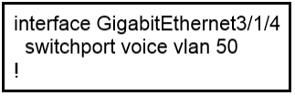
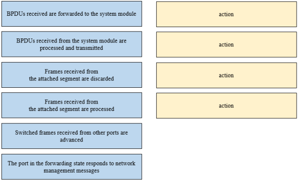
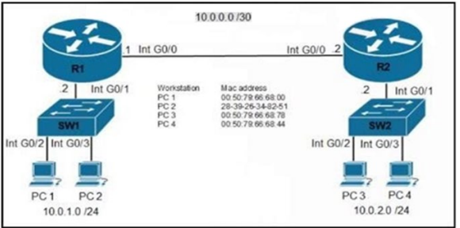
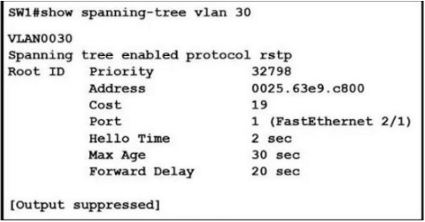

# CCNA対策問題 201-300

#### 問題 201

展示を参照してください。  
一緒に使用するとポート チャネル 10 が作成される 2 つのコマンドはどれですか? (2 つお選びください。)

- A. int range g0/0-1 channel-group 10 mode active
- B. int range g0/0-1 channel-group 10 mode desirable
- C. int range g0/0-1 channel-group 10 mode passive
- D. int range g0/0-1 channel-group 10 mode auto
- E. int range g0/0-1 channel-group 10 mode on

#### 問題 202

展示を参照してください。  
管理者は音声 VLAN を構成する役割を担っています。  
Cisco 電話機がスイッチのギガビットイーサネット 3/1/4 ポートに接続されている場合、どのような結果が予想されますか?

- A. 電話機とその電話機に接続されているワークステーションには VLAN 接続がありません。
- B. 電話機は VLAN 50 でデータを送受信しますが、電話機に接続されたワークステーションは VLAN 1 でデータを送受信します。
- C. 電話機は VLAN 50 でデータを送受信しますが、電話機に接続されているワークステーションには VLAN 接続がありません。
- D. 電話機とその電話機に接続されているワークステーションは、VLAN 50 でデータを送受信します。

#### 問題 203

展示を参照してください。  
タグなしフレームが GigabitEthernet0/1 インターフェイスで受信された場合、SW1 からどのアクションが予想されますか?

- A. フレームは VLAN 1 で処理されます
- B. フレームは VLAN 11 で処理されます
- C. フレームは VLAN 5 で処理されます
- D. フレームがドロップされる

#### 問題 204
Cisco IOS ISR で LLDP をグローバルに有効にするために使用されるコマンドはどれですか?

- A. lldp run
- B. lldp enable
- C. lldp transmit
- D. cdp run
- E. cdp enable

#### 問題 205
LLDP 遅延時間を 5 秒に設定するには、どのコマンドを入力する必要がありますか?

- A. lldp timer 5000
- B. lldp holdtime 5
- C. lldp reinit 5000
- D. lldp reinit 5

#### 問題 206
CDP 環境で、隣接するデバイスの CDP インターフェイスが IP アドレスなしで構成されている場合はどうなりますか?

- A. CDP がそのネイバー上で動作しなくなります
- B. CDP はそのネイバーに対して別のインターフェイスの IP アドレスを使用します
- C. CDP は正常に動作しますが、そのネイバーの IP アドレス情報を提供できません
- D. CDP は正常に動作しますが、そのネイバーに情報を提供できません。

#### 問題 207
ドラッグ ドロップ -  
Cisco ワイヤレス LAN コントローラの利点を左側から右側の正しい例にドラッグ アンド ドロップします。

選択して配置します:

#### 問題 208
EtherChannel バンドルを設定する場合、LACP デバイスが検出された場合にのみ LACPを有効にするモードはどれですか?

- A. Passive
- B. Desirable
- C. On
- D. Auto
- E. Active

#### 問題 209

展示を参照してください。  
特定の環境のデフォルト VLAN に関連付けられている VLANID はどれですか?

- A. VLAN 1
- B. VLAN 5
- C. VLAN 10
- D. VLAN 20

#### 問題 210
デフォルト VLAN を示す 2 つの VLAN ID はどれですか? (2 つお選びください。)

- A. 0
- B. 1
- C. 1005
- D. 1006
- E. 4096

#### 問題 211
Cisco Discovery Protocol で通信できる Cisco デバイスに関する 2 つの情報はどれですか? (2 つお選びください。)

- A. native VLAN
- B. trunking protocol
- C. VTP domain
- D. spanning-tree priority
- E. spanning-tree protocol

#### 問題 212
新しい WLAN コントローラをネットワークに導入した後、追加で考慮すべき 2 つのタスクはどれですか? (2 つお選びください。)

- A. ロードバランサーを展開する
- B. 追加の VLAN を構成する
- C. 複数の VRRP グループを構成する
- D. POE スイッチを導入する
- E. 追加のセキュリティ ポリシーを構成する

#### 問題 213

展示を参照してください。  
スイッチ SW2 は SW1 上の VLAN 10 からのトラフィックをどのように処理しますか?

- A. トラフィックを VLAN 10 に送信します。
- B. トラフィックを VLAN 100 に送信します。
- C. トラフィックがドロップされます。
- D. トラフィックを VLAN 1 に送信します。

#### 問題 214
アクティブにネゴシエートする EtherChannel を設定するために使用できる 2 つのコマンドはどれですか? (2 つお選びください。)

- A. channel-group 10 mode on
- B. channel-group 10 mode auto
- C. channel-group 10 mode passive
- D. channel-group 10 mode desirable
- E. channel-group 10 mode active

#### 問題 215
STP は OSI レイヤ 2 での転送ループをどのように防止しますか?

- A. TTL
- B. MAC address forwarding
- C. Collision avoidance
- D. Port blocking

#### 問題 216
VTP に関する 2 つの記述のうち、正しいものはどれですか? (2 つお選びください。)

- A. すべてのスイッチは同じ VTP ドメイン名で設定する必要があります
- B. すべてのスイッチがトランク ネゴシエーションを実行するように構成されている必要がある
- C. すべてのスイッチに一意の VTP ドメイン名を設定する必要がある
- D. VTP サーバーのリビジョン番号はドメイン内で最も大きい必要があります。
- E. すべてのスイッチは同じ VTP バージョンを使用する必要があります

#### 問題 217
ブリッジ上で最適な BPDU を受信した場合、ポートはどのタイプになりますか?

- A. 指定ポート
- B. バックアップポート
- C. 代替ポート
- D. ルートポート

#### 問題 218
特定のインターフェイスを優先転送インターフェイスとして構成するには、どの値を変更できますか?

- A. interface number
- B. port priority
- C. VLAN priority
- D. hello time

#### 問題 219
Cisco Discovery Protocol に関する正しい記述はどれですか?

- A. これはシスコ独自のプロトコルです。
- B. ネットワーク層で実行されます。
- C. ルーター、ファイアウォール、スイッチからの情報を検出できる。
- D. 物理層とデータリンク層で実行されます。

#### 問題 220
ネットワーク管理者が CDP を使用する 2 つの理由は何ですか? (2 つお選びください。)

- A. 2 つのデバイスを相互接続するケーブルの種類を確認するため
- B. リモートデバイス上のネットワークサービスのステータスを確認するため
- C. 直接接続されたスイッチから VLAN 情報を取得する
- D. レイヤ 3 に障害が発生した場合に 2 つのデバイス間のレイヤ 2 接続を検証するため
- E. デバイスに Telnet 接続するために、接続されたデバイスの IP アドレスを取得します。
- F. 直接接続されたルータ間のルーティング プロトコルのステータスを確認するため

#### 問題 221
スイッチング環境で VTP を使用する 2 つの利点は何ですか? (2 つお選びください。)

- A. スイッチがフレーム タグを読み取ることができるようになります。
- B. ポートを VLAN に自動的に割り当てることができます。
- C. スイッチド ネットワーク全体で VLAN の一貫性を維持します。
- D. 複数の VLAN からのフレームが単一のインターフェイスを使用できるようにします。
- E. VLAN 情報をスイッチング環境全体に自動的に伝達できるようにします。

#### 問題 222
VLAN 配置の典型的な特徴は次の 3 つですか? （3 つお選びください。）

- A. 新しいスイッチには VLAN が設定されていません。
- B. VLAN 間の接続にはレイヤー 3 デバイスが必要です。
- C. VLAN は通常、コリジョン ドメインの数を減らします。
- D. 各 VLAN は個別のアドレス空間を使用します。
- E. スイッチは、VLAN ごとに個別のブリッジング テーブルを維持します。
- F. VLAN は複数のスイッチにまたがることはできません。

#### 問題 223
企業ネットワークでは、同じ VLAN 上のホストは相互に通信できますが、異なる VLAN 上のホストとは通信できません。  
VLAN 間の通信を可能にするためには何が必要ですか?

- A. スイッチに接続されている物理インターフェイス上にサブインターフェイスが設定されているルーター
- B. スイッチに接続された物理インターフェイス上の IP アドレスを持つルーター
- C. スイッチ間にアクセス リンクが設定されているスイッチ
- D. スイッチ間にトランク リンクが設定されているスイッチ

#### 問題 224
LLDP について正しいのはどれですか?

- A. これはシスコ独自のプロトコルです。
- B. グローバル コンフィギュレーション モードで設定されます。
- C. LLDP 更新頻度は固定値です。
- D. トランスポート層上で実行されます。

#### 問題 225
無線 LAN コントローラーとはどのような機能ですか?

- A. 有線エンドポイントと無線エンドポイント間のトラフィックを制御する単一のアクセス ポイントに登録します。
- B. SSID を使用してワイヤレス クライアントを区別する
- C. LWAPP パケットをアクセス ポイントに送信する
- D. 無線および有線 LAN 上のアクティビティを監視する

#### 問題 226
プロキシ キャッシュによって Web トラフィックのパフォーマンスを向上させるためにどのテクノロジーが使用されていますか?

- A. WSA
- B. Firepower
- C. ASA
- D. FireSIGHT

#### 問題 227
ルートポートの選択プロセス中に最初に使用される基準は何ですか?

- A. ローカルポート ID
- B. トゥートブリッジまでの最低パスコスト
- C. 最も低い隣接ブリッジ ID
- D. 最も低いネイバーのポート ID

#### 問題 228
VLAN 設定に関する正しい記述はどれですか?

- A. VLAN を設定するには、スイッチが VTP サーバー モードまたはトランスペアレントモードになっている必要があります。
- B. 拡張 VLAN を設定する前に、スイッチは config-vlan モードになっている必要があります
- C. 動的 VLAN 間ルーティングは、VLAN2 から VLAN 4064 まででサポートされます。
- D. VTP トランスペアレント モードのスイッチは、VLAN データベースを実行コンフィギュレーションにのみ保存します

#### 問題 229

展示を参照してください。  
この構成に関して、どのような結論を下すべきでしょうか? (2 つお選びください。)

- A. ルート ポートは FastEthernet 2/1 です。
- B. 指定ポートは FastEthernet 2/1 です
- C. スパニングツリー モードは PVST+ です
- D. これはルートブリッジです
- E. スパニングツリー モードは Rapid PVST+ です

#### 問題 230
ネットワーク エンジニアは、マルチベンダー ネットワークの図を作成する必要があります。  
ネットワークのトポロジをマッピングできるようにするには、Cisco デバイスでどのコマンドを設定する必要がありますか?

- A. Device(config)#lldp run
- B. Device(config)#cdp run
- C. Device(config-if)#cdp enable
- D. Device(config)#flow-sampler-map topology

#### 問題 231
ユーザー識別、ユーザー サービス、およびアクセス制御に関して、AAA の操作はどのように比較されますか?

- A. 認可はアクセス制御を提供し、認証はユーザー サービスを追跡します
- B. 認証はユーザーを識別し、アカウンティングはユーザー サービスを追跡します
- C. アカウンティングはユーザー サービスを追跡し、認証はアクセス制御を提供します
- D. 認可はユーザーを識別し、認証はアクセス制御を提供します

#### 問題 232
RADIUS と TACACS+ の違いは何ですか?

- A. RADIUS は管理者が入力したすべてのコマンドをログに記録しますが、TACACS+ は開始、停止、および暫定コマンドのみをログに記録します。
- B. TACACS+ は認証と認可を分離し、RADIUS はそれらを統合します。
- C. TACACS+ はパスワード情報のみを暗号化し、RADIUS はペイロード全体を暗号化します。
- D. RADIUS はダイヤル認証に最も適していますが、TACACS+ は複数のタイプの認証に使用できます。

#### 問題 233
ローカル AP モードと FlexConnect AP モードの違いは何ですか?

- A. ローカル AP モードでは、WLC への AP ごとに 2 つの CAPWAP トンネルが作成されます。
- B. ローカル AP モードにより、AP は自律型 AP であるかのように動作します。
- C. AP が WLC との接続を失うと、FlexConnect AP モードが機能しなくなる
- D. FlexConnect AP モードは、ローカル スイッチングが設定されている場合に、AP からWLC にトラフィックをブリッジします。

#### 問題 234
SW1 インターフェイス g0/1 はダウン/ダウン状態です。インターフェースの状態が起こる 2 つの理由は何ですか? (2 つお選びください。)

- A. プロトコルの不一致があります
- B. デュプレックスの不一致があります
- C. インターフェースがシャットダウンされている
- D. インターフェイスがエラーディセーブルになっている
- E. 速度の不一致があります

#### 問題 235
リンク アグリゲーションは Cisco ワイヤレス LAN コントローラにどのように実装されますか?

- A. EtherChannel は「モード アクティブ」で設定する必要があります。
- B. 有効にすると、WLC 帯域幅が 500 Mbps に低下します。
- C. クライアント トラフィックを渡すには、2 つ以上のポートを構成する必要があります。
- D. クライアント トラフィックを渡すには、機能する物理ポートが 1 つ必要です。

#### 問題 236
Cisco IOS スイッチで SSH が正常に動作するには、どの 2 つの条件を満たす必要がありますか? (2 つお選びください。)

- A. スイッチ上で IP ルーティングを有効にする必要があります。
- B. スイッチ上でコンソールのパスワードを設定する必要があります。
- C. スイッチ上で Telnet を無効にする必要があります。
- D. スイッチは k9 (暗号化) IOS イメージを実行している必要があります。
- E. ip domain-name コマンドをスイッチ上で設定する必要があります。

#### 問題 237

展示を参照してください。  
エンジニアが有効モードに入るにはどのパスワードを使用する必要がありますか?

- A. adminadmin123
- B. cisco123
- C. default
- D. testing1234

#### 問題 238
PortFast が有効になっている場合、スイッチ ポートはどの状態に移行しますか?

- A. blocking
- B. listening
- C. learning
- D. forwarding

#### 問題 239
ワイヤレス LAN コントローラが GUI アクセス用に独自のローカル Web 管理 SSL 証明書を生成するように要求するプロトコルはどれですか?

- A. RADIUS
- B. HTTPS
- C. TACACS+
- D. HTTP

#### 問題 240
エンジニアは、Cisco スイッチとサードパーティ製スイッチ間のスイッチ間 VLAN 通信を構成する必要があります。  
どのような措置を講じるべきでしょうか?

- A. DSCP を設定する
- B. IEEE 802.1q を設定する
- C. ISL を設定する
- D. IEEE 802.1p を設定する

#### 問題 241
エンジニアは、スイッチ インターフェイスが隣接スイッチとのトランク リンクの確立を積極的に試みることを必要とします。  
どのようなコマンドを設定する必要がありますか?

- A. switchport mode trunk
- B. switchport mode dynamic desirable
- C. switchport nonegotiate
- D. switchport mode dynamic auto

#### 問題 242

展示を参照してください。  
選出プロセス後、本社 LAN のルート ブリッジは何ですか?

Switch 1: 0C:E0:38:81:32:58 -
Switch 2: 0C:0E:15:22:1A:61 -
Switch 3: 0C:0E:15:1D:3C:9A -
Switch4:0C:E0:19:A1:4D:16 -

- A. Switch 1
- B. Switch 2
- C. Switch 3
- D. Switch 4

#### 問題 243
エンジニアは 2 つのスイッチ間にトランク リンクを確立する必要があります。  
隣接するスイッチはトランクまたは望ましいモードに設定されています。  
どのような措置を講じるべきでしょうか?

- A. スイッチポートのネゴシエートを設定する
- B. スイッチポート モードを動的に設定することが望ましい
- C. スイッチポート モードを動的自動に設定する
- D. スイッチポート トランクを動的に構成することが望ましい

#### 問題 244
ラーニング ステートとリスニング ステートを回避し、ポートを即座にフォワーディングステートに設定するスパニング ツリー拡張機能はどれですか?

- A. BPDUfilter
- B. PortFast
- C. Backbonefast
- D. BPDUguard

#### 問題 245
動的に学習される MAC アドレス機能はどのように機能しますか?

- A. 入力トラフィックが各ポートに到着するまで、CAM テーブルは空です。
- B. スイッチは、接続している各 CAM テーブルの MAC アドレスを動的に学習します。
- C. ポートは制限されており、動的に学習されるアドレスは最大 10 個まで学習されます。
- D. 動的に入力されるセキュア MAC アドレスの最小数が必要です

#### 問題 246
Rapid PVST+ を使用する場合、スイッチが常に VLAN 200 のルート ブリッジであることを保証するコマンドはどれですか?

- A. spanning-tree vlan 200 priority 614440
- B. spanning-tree vlan 200 priority 0
- C. spanning-tree vlan 200 root primary
- D. spanning-tree vlan 200 priority 38813258

#### 問題 247

展示を参照してください。  
SW2 の Gi1/1 が Desired モードまたはトランク モードに設定されている場合、SW1 の Gi1/1 がパッシブにトランク ポートになるためには、どのコマンドを実行する必要がありますか?

- A. switchport mode dynamic auto
- B. switchport mode dot1-tunnel
- C. switchport mode dynamic desirable
- D. switchport mode trunk

#### 問題 248

展示を参照してください。  
全体の内容またはMAC アドレステーブルが表示されます。  
Sales4 は Sales-1 にデータ フレームを送信します。  
スイッチは Sales-4 からフレームを受信すると何をしますか?

- A. レイヤ 2 MAC アドレスをレイヤ 3 IP アドレスにマッピングし、フレームを転送します。
- B. 送信元 MAC アドレスとポートを転送テーブルに挿入し、フレームを Sales-1 に転送します。
- C. MAC アドレス テーブルの検索を実行し、エントリがないためフレームを破棄します。
- D. Sales-1 が接続されているポートを除くすべてのポートからフレームをフラッディングします。

#### 問題 249

展示を参照してください。  
エンジニアは、音声およびデータ トラフィックに対応できるように GigabitEthernet1/1 を構成する必要があります。  
このタスクを達成できるのはどの構成ですか?

- A. interface gigabitethernet1/1 switchport mode access switchport access vlan 300 switchport voice vlan 400
- B. interface gigabitethernet1/1 switchport mode trunk switchport trunk vlan 300 switchport trunk vlan 400
- C. interface gigabitethernet1/1 switchport mode access switchport voice vlan 300 switchport access vlan 400
- D. interface gigabitethernet1/1 switchport mode trunk switchport trunk vlan 300 switchport voice vlan 400

#### 問題 250
エンジニアは古いスイッチをネットワークに追加し直す必要があります。  
スイッチによるVLAN データベースの破損を防ぐには、何らかの措置を講じる必要がありますか?

- A. より低いリビジョン番号を持つ VTP ドメインにスイッチを追加します。
- B. より大きなリビジョン番号を持つスイッチを VTP ドメインに追加します。
- C. DTP を動的に設定してスイッチを追加します。
- D. DTP を「desirable」に設定してスイッチを追加します。

#### 問題 251
状態を修復せずにクライアント デバイスが勝手にネットワークに接続することを防ぐテクノロジーはどれですか?

- A. 802.11n
- B. 802.1x
- C. MAC Authentication Bypass
- D. IP Source Guard

#### 問題 252
アクセス ポイントは、接続されたスイッチから電力を供給するためにどのプロトコルを使用しますか?

- A. Internet Group Management Protocol
- B. Cisco Discovery Protocol
- C. Adaptive Wireless Path Protocol
- D. Neighbor Discovery Protocol

#### 問題 253
管理者は、スプーフィングされたアソシエーション要求を受信しないように WLC を保護する必要があります。  
要求を制限し、ユーザがアソシエーション要求を再試行するまで 10ミリ秒待機するように WLC を設定するには、どの手順を実行する必要がありますか?

- A. MAC フィルタリングを有効にし、SA クエリのタイムアウトを 10 に設定します。
- B. 802.1x レイヤ 2 セキュリティを有効にし、カムバック タイマーを 10 に設定します。
- C. セキュリティ アソシエーション ティアダウン保護を有効にし、SA クエリ タイムアウトを 10 に設定します。
- D. Protected Management Frame サービスを有効にし、カムバック タイマーを 10 に設定します。

#### 問題 254

展示を参照してください。  
VLAN spanning-tree process に参加しているスイッチは 4 つだけです。

Branch-1: priority 614440 -
Branch-2: priority 39391170 -
Branch-3: priority 0 -
Branch-4: root primary -どのスイッチが VLAN 5 の永続的なルート ブリッジになりますか?

- A. Branch-1
- B. Branch-2
- C. Branch-3
- D. Branch-4

#### 問題 255
エンジニアは、トランク リンクを通過するときにスイッチによってタグ付けされていないVLAN のトラフィックを設定する必要があります。  
どのコマンドを使用すればよいでしょうか?

- A. switchport trunk encapsulation dot1q
- B. switchport trunk allowed vlan 10
- C. switchport mode trunk
- D. switchport trunk native vlan 10

#### 問題 256
PortFast 機能を使用する 2 つの利点は何ですか? (2 つお選びください。)

- A. 有効なインターフェイスは自動的にリスニング状態になります。
- B. 有効なインターフェイスは、フォワーディング ステートに移行する前に 50 秒待機します。
- C. 有効なインターフェイスはトポロジ変更通知を生成しません。
- D. 有効なインターフェイスが起動し、ただちにフォワーディング ステートに移行します。
- E. 学習状態に移行する有効なインターフェイスは、スイッチ トポロジ変更通知を生成します。

#### 問題 257
インターフェイス上で PortFast を設定する利点は何ですか?

- A. インターフェイスに入るフレームには、より高い優先順位が付けられ、スイッチによってより高速に処理されます。
- B. ケーブルを接続すると、インターフェイスを使用してユーザー データをより速く送受信できるようになります。
- C. インターフェイスに入力されるリアルタイムの音声およびビデオ フレームがより高速に処理されます。
- D. ケーブルが接続されると、インターフェイスはそのケーブル タイプで利用可能な最速の速度設定を使用します。

#### 問題 258
DRAG DROP -  
AAA サポート プロトコルの機能を左側から右側のプロトコルにドラッグ アンド ドロップします。

選択して配置します:

#### 問題 259
スイッチがすべてのポートにフレームをフラッディングするのはなぜですか?

- A. フレームには宛先 MAC アドレスがありません。
- B. フレームの宛先 MAC アドレスが不明です。
- C. フレームの送信元 MAC アドレスが不明です
- D. フレームの送信元 MAC アドレスと宛先 MAC アドレスが同じである。

#### 問題 260
エンジニアは、ISP に接続するために会社の PE ルーターのインターフェイス Gi1/0 を構成します。  
近隣探索が無効になっています。  
ISP がサードパーティのネットワーク デバイスを使用している場合、構成を完了するにはどのアクションが必要ですか?

- A. 自動ネゴシエーションを無効にします。
- B. LLDP をグローバルに有効にします。
- C. ISP デバイスで LLDP-MED を有効にします。
- D. インターフェイスで Cisco Discovery Protocol を無効にします。

#### 問題 261
DRAG DROP -  
Rapid PVST+ フォワーディング ステート アクションを左から右にドラッグ アンド ドロップします。  
すべてのアクションが使用されるわけではありません。

選択して配置します:

#### 問題 262
管理、ローミング、SSID 構成を集中コントローラに依存するアクセス ポイント モードはどれですか?

- A. 軽量モード
- B. 自律モード
- C. ブリッジモード
- D. リピーターモード

#### 問題 263

展示を参照してください。  
ネットワーク エンジニアは、PC A とファイル サーバー間の通信を構成する必要があります。  
他の通信の中断を防ぐには、どのコマンドを設定する必要がありますか?

- A. スイッチポート トラックは VLAN 12 を許可します
- B. スイッチポート トラックは vlan なしを許可します
- C. スイッチポート トラックは VLAN 追加 13 を許可します
- D. スイッチポート トラックは VLAN 削除 10-11 を許可しました

#### 問題 264

展示を参照してください。  
Gig1/11 が STP BPDU を受信した場合、結果はどうなりますか?

- A. ポートは STP ブロッキングに移行します。
- B. ポートはすぐに STP 転送に移行します。
- C. ポートがエラーディセーブル状態になります。
- D. ポートはルート ポートに移行します。

#### 問題 265
ID に基づいたセキュリティを提供するアクセス レイヤの脅威軽減技術はどれですか?

- A. Dynamic ARP Inspection
- B. DHCP snooping
- C. 802.1x
- D. デフォルト以外のネイティブ VLAN を使用する

#### 問題 266

展示を参照してください。  
スイッチはトランク リンクに対してどのようなアクションを実行しますか?

- A. トランクは形成されず、ポートは err-disabled ステータスになります。
- B. トランクは形成されますが、一致しないネイティブ VLAN は単一のブロードキャストドメインにマージされます。
- C. トランクは形成されますが、VLAN 99 と VLAN 999 はシャットダウン状態です。
- D. トランクは形成されませんが、VLAN 99 と VLAN 999 はリンクを通過できます。

#### 問題 267
ネットワーク エンジニアは、次の要件を満たすために、アドレス ブロック10.70.128.0/19 を使用して 2 つの新しいサブネットを構成する必要があります。  
✑ 最初のサブネットは 24 台のホストをサポートする必要があります。  
✑ 2 番目のサブネットは 472 台のホストをサポートする必要があります。  
✑ 両方のサブネットは、アドレス ブロックから可能な最長のサブネット マスクを使用する必要があります。  
新しいサブネットを構成し、各サブネットで最初に使用可能なアドレスをルーター インターフェイスに使用するという要件を満たすには、どの 2 つの構成を使用する必要がありますか? (2 つお選びください。)

- A. interface vlan 1148 ip address 10.70.148.1 255.255.254.0
- B. interface vlan 3002 ip address 10.70.147.17 255.255.255.224
- C. interface vlan 4722 ip address 10.70.133.17 255.255.255.192
- D. interface vlan 1234 ip address 10.70.159.1 255.255.254.0
- E. interface vlan 155 ip address 10.70.155.65 255.255.255.224

#### 問題 268

展示を参照してください。  
管理者は、スイッチ SW11 上でインターフェイス Gi1/1 および Gi1/3 を設定する必要があります。  
PC-1 と PC-2 はデータ VLAN に配置し、電話機1 は音声 VLAN に配置する必要があります。  
これらの要件を満たす構成はどれですか?

- A. interface gigabitethernet1/1 switchport mode access switchport access vlan 8 !  
interface gigabitethernet1/3 switchport mode access switchport access vlan 8  
switchport voice vlan 9
- B. interface gigabitethernet1/1 switchport mode access switchport access vlan 8 !  
interface gigabitethernet1/3 switchport mode trunk switchport trunk vlan 8  
switchport voice vlan 9
- C. interface gigabitethernet1/1 switchport mode access switchport access vlan 9 !  
interface gigabitethernet1/3 switchport mode trunk switchport trunk vlan 8  
switchport trunk vlan 9
- D. interface gigabitethernet1/1 switchport mode access switchport access vlan 8 !  
interface gigabitethernet1/3 switchport mode access switchport voice vlan 8  
switchport access vlan 9

#### 問題 269

展示を参照してください。  
ユーザーは、IEEE 802.11r 互換デバイスを使用してワイヤレスネットワークに接続する必要があります。  
ユーザーがフロア間を移動したり、建物内の他のエリアに移動したりするときも、接続を維持する必要があります。  
接続の構成はどのようにする必要がありますか?

- A. AES 暗号化を無効にします。
- B. 高速移行を有効にし、FT 802.1x オプションを選択します。
- C. 高速トランジションを有効にし、FT PSK オプションを選択します。
- D. WPA ポリシー オプションと CCKM オプションを選択します。

#### 問題 270

展示を参照してください。  
エンジニアは、以前の構成を変更せずに、新しい VLAN を既存のトランクに挿入するように求められます。  
このタスクを実行するコマンドはどれですか?

- A. switchport trunk allowed vlan 100-104
- B. switchport trunk allowed vlan 104
- C. switchport trunk allowed vlan all
- D. switchport trunk allowed vlan add 104

#### 問題 271
RSTP (802.1w) の使用中にスイッチ ポートが遷移するのは、破棄とは別に、どの 2 つの状態ですか? (2 つお選びください。)

- A. blocking
- B. speaking
- C. listening
- D. learning
- E. forwarding

#### 問題 272
ドラッグ ドロップ -  
ワイヤレス アーキテクチャに関する事実を左側から右側のアクセス ポイントの種類にドラッグ アンド ドロップします。  
すべてのオプションが使用されるわけではありません。

選択して配置します:

#### 問題 273
集中型アーキテクチャで軽量 AP を接続するには、どのインターフェイス モードを設定する必要がありますか?

- A. WLAN dynamic
- B. trunk
- C. access
- D. management

#### 問題 274

展示を参照してください。  
以下の点を考慮する必要があります。  
✑ SW1 はすべてのトラフィックに対して完全に構成されています。  
✑ SW1 への SW4 および SW9 リンクが設定されています。  
✑ SW9 上の SW4 インターフェイス Gi0/1 および Gi0/0 が設定されています。  
✑ 残りのスイッチでは、すべての VLAN が VLAN データベースに追加されています。  
他の PC 間のトラフィック フローを中断することなく、PC2 から PC7 への ping を成功させる構成はどれですか?

- A. SW4 interface Gi0/7 switchport mode trunk switchport trunk allowed vlan 108 !  
interface Gi/0/2 switchport mode access switchport access vlan 14 SW11# interface  
Gi0/2 switchport mode trunk switchport trunk allowed vlan 14,108 ! interface Gi0/1  
switchport mode trunk switchport trunk allowed vlan 14,108 SW9# interface Gi0/2  
switchport mode access switchport access vlan 14
- B. SW4 interface Gi0/2 switchport mode trunk switchport trunk allowed vlan 14,108  
SW11# interface Gi0/2 switchport mode trunk switchport trunk allowed vlan  
14,108 !! interface Gi0/1 switchport mode trunk switchport trunk allowed vlan  
14,108 SW9# interface Gi0/2 switchport mode trunk switchport trunk allowed vlan  
14
- C. SW4 interface Gi0/2 switchport mode trunk switchport trunk allowed vlan 14  
SW11# interface Gi0/1 switchport mode trunk switchport trunk allowed vlan 14  
SW9# interface Gi0/2 switchport mode trunk switchport trunk allowed vlan 108  
- D. SW4 interface Gi/0/2 switchport mode access switchport access vlan 14 SW11#  
interface Gi0/2 switchport mode trunk switchport trunk allowed vlan 14 ! interface  
Gi0/0 switchport mode access switchport access vlan 14 ! interface Gi0/1 switchport  
mode trunk SW9# interface Gi0/2 switchport mode access switchport access vlan  
14

#### 問題 275

展示を参照してください。  
ネットワーク管理者は、プロトコルを無効にすることなく、スイッチ Cat9K-2 IP アドレスが LLDP に表示されないようにする必要があります。  
タスクを完了するにはどのアクションを実行する必要がありますか?

- A. Cat9K-2 で no lldp mac-phy-cfg コマンドをグローバルに設定します。
- B. Cat9K-1 のインターフェイス G1/0/21 で no lldp accept コマンドを設定します。
- C. Cat9K-1 のインターフェイス G1/0/21 で no lldp transfer コマンドを設定します。
- D. no lldp tlv-select Management-address コマンドを Cat9K-2 でグローバルに設定します。

#### 問題 276

展示を参照してください。  
エンジニアは交換用スイッチ SW1 の構成を開始しました。  
構成の一部を確認するために、エンジニアは次のコマンドを発行し、PC2 のエントリが欠落していることに気付きました。  
PC1 と PC2 が正常に通信するには、SW1 にどの変更を適用する必要がありますか?

- A. SW1(config)#interface fa0/2 SW1(config-if)#no switchport access vlan 2  
SW1(config-if)#no switchport trunk allowed vlan 3 SW1(config-if)#switchport  
trunk allowed vlan 2
- B. SW1(config)#interface fa0/2 SW1(config-if)#no switchport access vlan 2  
SW1(config-if)#switchport trunk native vlan 2 SW1(config-if)#switchport trunk  
allowed vlan 3
- C. SW1(config)#interface fa0/2 SW1(config-if)#no switchport mode trunk  
SW1(config-if)#no switchport trunk allowed vlan 3 SW1(config-if)#switchport  
mode access
- D. SW1(config)#interface fa0/1 SW1(config-if)#no switchport access vlan 2  
SW1(config-if)#switchport access vlan 3 SW1(config-if)#switchport trunk allowed  
vlan 2

#### 問題 277

展示を参照してください。  
どのスイッチがスパニングツリーのルートになりますか?

Switch 1 -  
BID: 32778 0018.184e.3c00 -  
Switch 2 -  
BID: 24586 001a.e3ff.a680 -  
Switch 3 -  
BID: 28682 0022.55cf.cc00 -  
Switch 4 -  
BID: 64000 4e15.8403.08f -  

- A. Switch 1
- B. Switch 2
- C. Switch 3
- D. Switch 4

#### 問題 278
ドラッグ ドロップ -  
ワイヤレス アーキテクチャに関する事実を左側から右側のアクセス ポイントの種類にドラッグ アンド ドロップします。  
すべてのオプションが使用されるわけではありません。  

選択して配置します:

#### 問題 279

展示を参照してください。  
エンジニアは、LACP を使用してレイヤ 3 ポートチャネル インターフェイスを設定しています。  
最初のデバイスの設定が完了し、両方のインターフェイスが CDP テーブルに隣接デバイスを登録したことが確認されます。  
隣接デバイス上のどのタスクにより、チャネルをネゴシエートせずに新しいポート チャネルを起動できるようになりますか?

- A. 隣接デバイスの IP アドレスを設定します。
- B. no shutdown コマンドを使用して隣接インターフェイスを起動します。
- C. 隣接インターフェイスの EtherChannel モードを auto に変更します。
- D. デバイスの静的 EtherChannel 設定をパッシブ モードに変更します。

#### 問題 280

展示を参照してください。  
両方のスイッチに適用された場合、レイヤ 2 LACPEtherChannel を確立する設定はどれですか?

- A. Interface range G1/1 ג€ "1/3 switchport mode trunk channel-group 1 mode active no shutdown
- B. Interface range G1/1 ג€ "1/3 switchport mode access channel-group 1 mode passive no shutdown
- C. Interface range G1/1 ג€ "1/3 switchport mode trunk channel-group 1 mode desirable no shutdown
- D. Interface range G1/1 ג€ "1/3 switchport mode access channel-group 1 mode on no shutdown

#### 問題 281
個別のブロードキャスト ドメインを作成するためにどのスイッチング概念が使用されまか?

- A. STP
- B. VTP
- C. VLAN
- D. CSMA/CD

#### 問題 282

展示を参照してください。  
隣接デバイスがスイッチ Cat9300 を迅速に検出できるようにするには、どのアクションを実行する必要がありますか?

- A. 隣接デバイスに接続するポートで PortFast を有効にします。
- B. スイッチ Cat9300 で cdp timer 10 コマンドを設定します。
- C. スイッチ Cat9300 で cdpholdtime10 コマンドを設定する
- D. スイッチ Cat9300 のネイバー上で cdp timer 10 コマンドを設定します。

#### 問題 283
WLC で LAG を設定または削除する場合の要件は何ですか?   

- A. LAG が有効な場合は、トラフィック フローの受信ポートと送信ポートを指定する必要があります。
- B. LAG が無効になっている場合は、管理インターフェイスを再割り当てする必要があります
- C. LAG を有効化または再構成した後、コントローラーを再起動する必要がある
- D. 同じポート上の複数のタグなしインターフェイスをサポートする必要がある

#### 問題 284
ドラッグ ドロップ -  
左側の脅威軽減テクニックを、右側の軽減する脅威または攻撃の種類にドラッグ アンドドロップします。

選択して配置します:

#### 問題 285
Autonomous AP が 2 つの VLAN を WLAN にマッピングする場合、有線ネットワークの接続に使用されるポートのタイプはどれですか?

- A. access
- B. LAG
- C. trunk
- D. EtherChannel

#### 問題 286
ネットワーク管理者は、4 つのポートを 1 つの論理リンクに集約する必要があります。  
この論理リンクでは、別のスイッチ上のポートへのレイヤー 2 接続をネゴシエートする必要があります。  
接続の両側でアクティブ モードを使用する場合、何を構成する必要がありますか?

- A. LLDP
- B. LACP
- C. Cisco vPC
- D. 802 1q trunks

#### 問題 287

展示を参照してください。  
エンジニアは SW1 と SW2 の間に新しい L2 LACP EtherChannel を構築し、次のshow コマンドを実行して、 LACP ポート チャネルが確立されることを確認しました。  

- A. SW1 のチャネルグループモードを望ましいモードに変更します。
- B. SW1 のチャネル グループ モードをアクティブまたはパッシブに変更します。
- C. SW2 のチャネル グループ モードを auto に変更します。
- D. 両方のスイッチでインターフェイス ポート チャネル 1 コマンドを設定します。

#### 問題 288

展示を参照してください。  
セキュリティ上の理由から、R5 Gi0/1 インターフェイスでは自動近隣探索を無効にする必要があります。  
次のタスクを完了する必要があります。  
✑ R5 インターフェイス Gi0/1 ですべての近隣探索メソッドを無効にします。  
✑ R5 インターフェイス Gi0/2 で近隣探索を許可します。  
✑ R5 インターフェイス Gi0/1 に動的に学習されたネイバーがないことを確認します。  
✑ R6 のインターフェイス Gi0/2 の IP アドレスを表示します。  
どの構成を使用する必要がありますか?

- A. R5(config)#int Gi0/1 R5(config-if)#no cdp enable R5(config-if)#exit  
R5(config)#lldp run R5(config)#no cdp run R5#sh cdp neighbor detail R5#sh lldp  
neighbor
- B. R5(config)#int Gi0/1 R5(config-if)#no cdp enable R5(config-if)#exit  
R5(config)#no lldp run R5(config)#cdp run R5#sh cdp neighbor R5#sh lldp  
neighbor
- C. R5(config)#int Gi0/1 R5(config-if)#no cdp run R5(config-if)#exit  
R5(config)#lldp run R5(config)#cdp enable R5#sh cdp neighbor R5#sh lldp  
neighbor
- D. R5(config)#int Gi0/1 R5(config-if)#no cdp enable R5(config-if)#exit  
R5(config)#no lldp run R5(config)#cdp run R5#sh cdp neighbor detail R5#sh lldp  
neighbor

#### 問題 289
PortFast を実行しているインターフェイスでバイパスされるスパニングツリーの 2 つの状態はどれですか? (2 つお選びください。)

- A. disabled
- B. listening
- C. learning
- D. blocking
- E. forwarding

#### 問題 290
DRAG DROP -  
管理接続タイプを左側から右側の定義にドラッグ アンド ドロップします。

選択して配置します:

#### 問題 291
エンジニアは、データと音声サービスが同じポートを通過するように構成しています。  
指定されたスイッチ インターフェイス fastethernet0/1 は、IP 電話のアクセス ポートからパケットを受信するときに、データに同じ優先順位を使用してパケットを送信する必要があります。  
どの構成を使用する必要がありますか?

- A. interface fastethernet0/1 switchport voice vlan dot1p
- B. interface fastethernet0/1 switchport priority extend cos 7
- C. interface fastethernet0/1 switchport voice vlan untagged
- D. interface fastethernet0/1 switchport priority extend trust

#### 問題 292

展示を参照してください。  
Switch2 の設定に対するどの変更により、2 つのスイッチがEtherChannel を確立できるようになりますか?

- A. LACP モードを望ましいモードに変更します。
- B. プロトコルを PAgP に変更し、自動モードを使用します。
- C. LACP モードをアクティブに変更します。
- D. プロトコルを EtherChannel モードに変更します。

#### 問題 293

展示を参照してください。  
エンジニアは、PC1 に接続するインターフェイスを構成し、PC1のみがポートの使用を許可されるようにセキュリティを確保する必要があります。  
音声VLAN を除き、VLAN タグ付けは使用できません。スイッチを設定するにはどのコマンドシーケンスを入力する必要がありますか?

A.SW1(config-if)#switchport mode dynamic auto SW1(config-if)#switchport portsecurity SW1(config-if)#switchport port-security violation restrict
B.SW1(config-if)#switchport mode nonegotiate SW1(config-if)#switchport portsecurity SW1(config-if)#switchport port-security maximum 1
C.SW1(config-if)#switchport mode access SW1(config-if)#switchport port-security SW1(config-if)#switchport port-security mac-address 0050.7966.6800
D.SW1(config-if)#switchport mode dynamic desirable SW1(config-if)#switchport port-security mac-address 0050.7966.6800 SW1(config-if)#switchport portsecurity mac-address sticky

#### 問題 294
ワイヤレス AP の個別の認可および認証ソリューションをサポートするには、どのプロトコルを実装する必要がありますか?

- A. RADIUS
- B. TACACS+
- C. 802.1X
- D. Kerberos

#### 問題 295
追加設定なしでスパニングツリー portfast コマンドをサポートするポート タイプはどれですか?

- A. trunk ports
- B. Layer 3 sub interfaces
- C. Layer 3 main interfaces
- D. access ports

#### 問題 296

展示を参照してください。  
この構成に関する 2 つの結論は何ですか? (2 つお選びください。)

- A. スパニングツリー モードは Rapid PVST+ です。
- B. これはルートブリッジです。
- C. スパニングツリー モードは PVST+ です
- D. 指定ポートは FastEthernet 2/1 です
- E. ルート ポートは FastEthernet 2/1 です。

#### 問題 297
シスコのエンジニアは、次の要件を満たすように単一のスイッチ インターフェイスを設定する必要があります。  
✑ タグなしフレームを受け入れて VLAN 20 に配置する  
CDP が Cisco IP Phone を検出した場合、タグ付きフレームを VLAN 30 に受け入れる  
エンジニアはどのコマンド セットを適用する必要がありますか?

- A. switchport mode dynamic desirable switchport access vlan 20 switchport trunk allowed vlan 30 switchport voice vlan 30
- B. switchport mode access switchport access vlan 20 switchport voice vlan 30
- C. switchport mode dynamic auto switchport trunk native vlan 20 switchport trunk allowed vlan 30 switchport voice vlan 30
- D. switchport mode trunk switchport access vlan 20 switchport voice vlan 30

#### 問題 298
スイッチは MAC アドレス テーブルを構築するために何を使用しますか?

- A. VTP
- B. DTP
- C. ingress traffic
- D. egress traffic

#### 問題 299

展示を参照してください。  
EtherChannel は、チャネル グループ 1 の両端で速度 1000、全二重に設定されています。  
LACP 通信に応答するが開始しないようにスイッチ A のチャネルを設定するには、次の手順は何ですか?

- A. interface range gigabitethernet0/0/0-15 channel-group 1 mode on
- B. interface range gigabitethernet0/0/0-15 channel-group 1 mode desirable
- C. interface port-channel 1 channel-group 1 mode auto
- D. interface port-channel 1 channel-group 1 mode passive

#### 問題 300
Rapid PVST+ が設定されたスイッチに入力されたコマンドは、特定の期間リッスンおよび学習しますか?

- A. switch(config)spanning-tree vlan 1 priority 4096
- B. switch(config)spanning-tree vlan 1 hello-time 10
- C. switch(config)spanning-tree vlan 1 max-age 6
- D. switch(config)spanning-tree vlan 1 forward-time 20