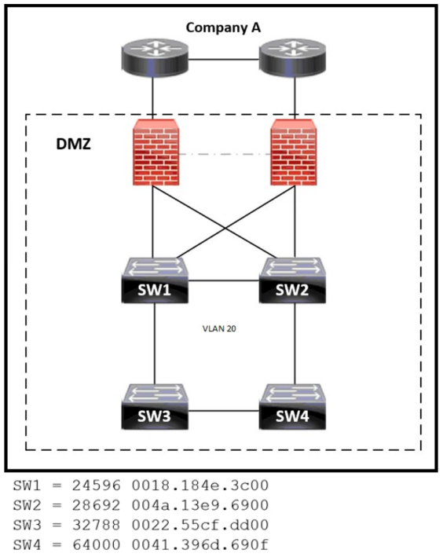
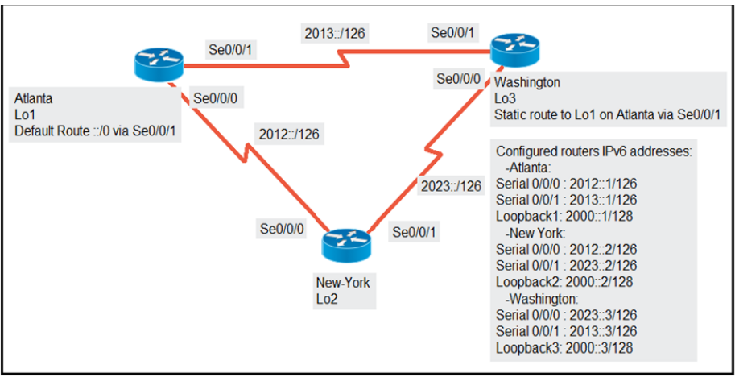

# CCNA対策問題 301-400

#### 問題 301
ネットワーク管理者は、新しいワイヤレス ネットワークを自律モードの AP で構成するか、クラウドベース モードで実行する AP で構成するかを決定するときに何を考慮する必要がありますか?

- A. 自律モードの AP はアンダーレイへの依存度が低いですが、クラウドベース モードのAP よりも保守が複雑です。
- B. クラウドベース モードの AP はアンダーレイを中継するため、自律モードの AP よりも保守が複雑です。
- C. クラウドベース モードの AP は導入が簡単ですが、自律モードの AP よりも自動化が困難です。
- D. 自律モード AP は、クラウドベース モードの AP よりも導入と自動化が簡単です。

#### 問題 302
スイッチが宛先 MAC アドレスが不明なフレームを受信した場合、フレームはどのように処理されますか?

- A. 発信元ポートを除くすべてのポートにフラッディング
- B. 最初に利用可能なポートに転送される
- C. スイッチ上のすべてのポートにブロードキャストする
- D. スイッチによって検査され、落とされた

#### 問題 303
PortFast がポートで有効になっている場合、Rapid PVST+ ではどの状態がバイパスされますか?

- A. blocking
- B. forwarding
- C. learning
- D. discarding

#### 問題 304
最近期限切れになった宛先 MAC アドレスを持つフレームをスイッチが受信するとどうなりますか?

- A. スイッチは、フレームを受信したポートを除くすべての VLAN のすべてのポートにフレームをフラッディングします。
- B. スイッチは、フレームを受信したポートを除く VLAN 内のすべてのポートにフレームをフラッディングします。
- C. スイッチは、フレームを受信したポート上の履歴アドレスの MAC アドレス エージング テーブルを参照します。
- D. スイッチはフレームをドロップし、フレームを受信したポートから宛先 MAC アドレスを再度学習します。

#### 問題 305
ストアアンドフォワードスイッチングの機能とは何ですか?

- A. フレーム内のエラーチェックを排除することでレイテンシを短縮します。
- B. CRC を使用して、効果的なレベルのエラーのないネットワーク トラフィックを生成します。
- C. フレームをバッファリングし、フレーム内のエラーに関係なく転送します。
- D. 宛先 MAC アドレスのみをチェックしてフレームを転送する

#### 問題 306

    
展示を参照してください。  
スイッチ AccSw1 が PC2 とともにネットワークに追加されました。  
すべての VLAN は AccSw2 に実装されています。  
PC1 と PC2 の間にレイヤー 2接続を確立するには、AccSw2 のポートをどのように構成する必要がありますか?

- A. interface GigabitEthernet1/2 switchport mode access switchport access vlan 2 !  
interface GigabitEthernet1/24 switchport mode trunk
- B. interface GigabitEthernet1/1 switchport mode access switchport access vlan 11 !  
interface GigabitEthernet1/24 switchport mode trunk
- C. interface GigabitEthernet1/24 switchport mode trunk switchport trunk allowed  
vlan 11, 12 ! interface GigabitEthernet1/1 switchport access vlan 11
- D. interface GigabitEthernet1/2 switchport mode access switchport access vlan 12 !  
interface GigabitEthernet1/24 switchport mode trunk switchport trunk allowed vlan  
11, 12

#### 問題 307

展示を参照してください。  
ネットワーク エンジニアは、LLDP パケットを 1 分ごとに送信し、LLDP 経由で送信される情報が 3 分ごとに更新されるように、Switch2 の構成を更新する必要があります。  
エンジニアはどの構成を適用する必要がありますか?

- A. Switch2(config)lldp timer 60 Switch2(config)lldp tlv-select 180
- B. Switch2(config)lldp timer 60 Switch2(config)lldpholdtime 180
- C. Switch2(config)lldp timer 1 Switch2(config)lldpholdtime 3
- D. Switch2(config)lldp timer 1 Switch2(config)lldp tlv-select 3

#### 問題 308

展示を参照してください。スイッチ A が新しく構成されました。  
すべての VLAN は VLANデータベースに存在します。  
PC 間の接続を確立するには、Gi0/1 上の IP 電話と PC A を適切な VLAN に設定する必要があります。  
どのコマンド セットが要件を満たしますか?

- A. SwitchA(config-if)#switchport mode access SwitchA(config-if)#switchport  
access vlan 50 SwitchA(config-if)#switchport voice vlan 51
- B. SwitchA(config-if)#switchport mode trunk SwitchA(config-if)#switchport trunk  
allowed vlan add 50, 51 SwitchA(config-if)#switchport voice vlan dot1p
- C. SwitchA(config-if)#switchport mode trunk SwitchA(config-if)#switchport trunk  
allowed vlan 50, 51 SwitchA(config-if)#mis qos trust cos
- D. SwitchA(config-if)#switchport mode access SwitchA(config-if)#switchport  
access vlan 50 SwitchA(config-if)#switchport voice vlan untagged

#### 問題 309

展示を参照してください。  
2 つの新しいスイッチが設置されています。  
リモート監視チームはサポート ネットワークを使用して両方のスイッチを監視します。  
2 台の PC 間にレイヤー 2 接続を確立するための次のステップはどの構成ですか?

- A. SwitchA(config)#interface GigabitEthernet0/1 SwitchA(config-if)#switchport  
access vlan 500 SwitchB(config)#interface GigabitEthernet0/1 SwitchB(configif)#switchport access vlan 500
- B. SwitchA(config)#interface GigabitEthernet0/1 SwitchA(config-if)#switchport  
mode trunk SwitchB(config)#interface GigabitEthernet0/1 SwitchB(configif)#switchport mode trunk
- C. SwitchA(config)#interface GigabitEthernet0/0 SwitchA(config-if)#switchport  
trunk allowed vlan 500, 550 SwitchB(config)#interface GigabitEthernet0/0  
SwitchB(config-if)#switchport trunk allowed vlan 500, 550
- D. SwitchA(config)#interface GigabitEthernet0/0 SwitchA(config-if)#spanning-tree  
portfast SwitchA(config-if)#spanning-tree bpduguard enable  
SwitchB(config)#interface GigabitEthernet0/0 SwitchB(config-if)#spanning-tree  
portfast SwitchB(config-if)#spanning-tree bpduguard enable

#### 問題 310

展示を参照してください。  
エンジニアは、SW2 を置き換えるために新しい Cisco スイッチ NewSW を構成しています。  
詳細は次のとおりです。  
✑ スイッチ SW1 および SW2 は、トランク ポートをサポートしないサードパーティデバイスです。  
✑ PC1、PC2、および PC3 の間の既存の接続を維持する必要があります。  
✑ スイッチが将来の VLAN 10 からのトラフィックを通過できるようにします。  
どの設定を適用する必要がありますか?

- A. NewSW(config)#interface f0/0 NewSW(config-if)#switchport mode trunk  
NewSW(config-if)#switchport trunk native vlan 10 NewSW(config-if)#switchport  
trunk native vlan 10
- B. NewSW(config)#interface f0/0 NewSW(config-if)#switchport mode access  
NewSW(config-if)#switchport trunk allowed vlan 2, 10 NewSW(configif)#switchport trunk native vlan 2
- C. NewSW(config)#interface f0/0 NewSW(config-if)#switchport mode access  
NewSW(config-if)#switchport trunk allowed vlan 2, 10 NewSW(configif)#switchport trunk native vlan 10
- D. NewSW(config)#interface f0/0 NewSW(config-if)#switchport mode trunk  
NewSW(config-if)#switchport trunk allowed vlan 2, 10 NewSW(configif)#switchport trunk native vlan 2

#### 問題 311
Cisco Unified Wireless Network Architecture で帯域外管理を提供する WLC インターフェイスはどれですか?

- A. AP-Manager
- B. service port
- C. dynamic
- D. virtual

#### 問題 312

展示を参照してください。  
ネットワーク エンジニアは新しい WLAN を構成しており、認証に RADIUS サーバーの代わりにセットアップ パスワードを使用するように指示されます。  
構成を完了するためにエンジニアはどの追加タスクを実行する必要がありますか?

- A. PMF を無効にする PSK を有効にする 802.1x を有効にする
- B. WPA ポリシーを選択します CCKM を有効にする PSK を有効にする
- C. WPA ポリシーを選択します。 WPA2 ポリシーを選択します。 FT PSK を有効にします。
- D. WPA2 ポリシーの選択 PMF の無効化 PSK の有効化

#### 問題 313
CAPWAP (Control and Provisioning of Wireless Access Points) プロトコルを使用してワイヤレス LAN コントローラと通信するには、AP がどのモードに設定する必要がありますか?

- A. route
- B. bridge
- C. lightweight
- D. autonomous

#### 問題 314
接続するとすぐにネットワーク接続を確立するスイッチ テクノロジーはどれですか?

- A. PortFast
- B. BPDU guard
- C. UplinkFast
- D. BackboneFast

#### 問題 315
PC がポートに接続されるとすぐにフォワーディング ステートに入るポート上のコマンドはどれですか?

- A. switch(config)#spanning-tree portfast default
- B. switch(config)#spanning-tree portfast bpduguard default
- C. switch(config-if)#spanning-tree portfast trunk
- D. switch(config-if)#no spanning-tree portfast

#### 問題 316
スイッチ ポートが前のフレームをアクティブに送信している間に新しいフレームを受信した場合、そのフレームはどのように処理されますか?

- A. 新しいフレームが最初に配信され、前のフレームがドロップされ、再送信要求が送信されます。
- B. 前のフレームが配信され、新しいフレームがドロップされ、再送信要求が送信されます。
- C. 新しいフレームは、前のフレームの後に送信のためにキューに入れられます。
- D. 2 つのフレームが同時に処理され、配信される

#### 問題 317

展示を参照してください。  
SW1 の MAC アドレス テーブル全体を次に示します。  

Br-4 が Br-2 にフレームを送信するときに SW1 は何をしますか

- A. Br-4 の MAC アドレス テーブルのルックアップを実行し、エントリが欠落しているため toe フレームを破棄します。
- B. フレームアウトまたは Br-2 が接続されているポートを除くすべてのポートをフラッディングします。
- C. 送信元 MAC アドレスとポートを転送テーブルに挿入し、フレームを Br-2 に転送します。
- D. Fa0/3 のレイヤ 2 MAC アドレスをレイヤ 3 IP アドレスにマッピングし、フレームに向けます。

#### 問題 318
Cisco ワイヤレス LAN コントローラに実装された場合のリンク アグリゲーションに関する記述のうち、正しいものはどれですか?

- A. クライアント トラフィックを渡すには、2 つ以上のポートを設定する必要があります
- B. EtherChannel は「モードアクティブ」で設定する必要があります。
- C. 有効にすると、WLC 帯域幅が 500 Mbps に低下します。
- D. クライアント トラフィックを渡すには、機能する物理ポートが 1 つ必要です

#### 問題 319

展示を参照してください。  
エンジニアは、スイッチ 1 と 2 の間で LACP を使用してEtherChannel を設定しています。  
スイッチ 1 のみが LACP 開始パケットを送信するには、どの設定を適用する必要がありますか?

A.   
B.   
C.   
D.   

#### 問題 320

展示を参照してください。  
Marketing-SW1 の MAC アドレス テーブル全体を次に示します。  
PC-4 が PC-1 にフレームを送信するとき、スイッチは何をしますか?

- A. MAC アドレス テーブルの検索を実行し、エントリが見つからないためフレームを破棄します。
- B. レイヤ 2 MAC アドレスをレイヤ 3 IP アドレスにマッピングし、フレームを転送します。
- C. 送信元 MAC アドレスとポートをテーブルに挿入し、フレームを PC-1 に転送します。
- D. PC-1 が接続されているポートを除くすべてのポートからフレームがフラッディングされます。

#### 問題 321

展示を参照してください。すべての VLAN は VLAN データベースに存在します。  
構成を完了するにはどのコマンド シーケンスを適用する必要がありますか?

A.   
B.   
C.   
D.   

#### 問題 322

展示を参照してください。  
プライマリ スイッチに障害が発生し、すべてのリンクの速度が等しい場合、どのスイッチが VLAN 10 のスパニング ツリーのルートになりますか?

- A. SW1
- B. SW2
- C. SW3
- D. SW4

#### 問題 323

展示を参照してください。  
ホスト A はホスト D 宛てのデータ フレームを送信しました。  

スイッチはホスト A からフレームを受信すると何をしますか?

- A. ポート Fa0/1 を除くすべてのポートからフレームがフラッディングされます。
- B. ブロードキャスト ストームが発生する
- C. ポート Fa0/1 をシャットダウンし、err-disable モードにします。
- D. スイッチ CAM テーブルからフレームをドロップします。

#### 問題 324

展示を参照してください。  
どのスイッチがスパニングツリーのルートになりますか?

- A. Switch 1
- B. Switch 2
- C. Switch 3
- D. Switch 4

#### 問題 325
WLC に接続されている複数のディストリビューション インターフェイスがバンドルされている場合、どのチャネル グループ モードを設定する必要がありますか?

- A. Channel-group mode passive.
- B. Channel-group mode on.
- C. Channel-group mode desirable.
- D. Channel-group mode active.

#### 問題 326

展示を参照してください。  
すべてのリンクの速度が等しい場合、どのスイッチが VLAN 20のスパニング ツリーのルートになりますか?

- A. SW1
- B. SW2
- C. SW3
- D. SW4

#### 問題 327
パケットが同じポートを通過し、VLAN 間のトラフィック分離を維持できるように、異なる VLAN のパケットをカプセル化するレイヤ 2 スイッチ機能はどれですか?

- A. VLAN marking
- B. VLAN numbering
- C. VLAN DSCP
- D. VLAN tagging

#### 問題 328
アクセス ポイントがワイヤレス ネットワーク デバイスへのワイヤレス接続を確立および維持するために使用する一意の識別子はどれですか?

- A. VLAN ID
- B. SSID
- C. RFID
- D. WLAN ID

#### 問題 329
エンジニアは、会社のルーターと ISP の間の近隣探索を構成する必要があります。  
ISP がサードパーティ製ルーターを使用している場合、構成を完了するには次の手順は何ですか?

- A. LLDP をグローバルに有効にします。
- B. gi0/0 で CDP を無効にします。
- C. ISP ルーターで LLDP TLV を有効にします。
- D. オートネゴシエーションを無効にする。

#### 問題 330
ドラッグ ドロップ -  
ワイヤレス アーキテクチャに関する事実を左側から右側のアクセス ポイントの種類にドラッグ アンド ドロップします。  
すべてのオプションが使用されるわけではありません。

選択して配置します:

#### 問題 331
スイッチの MAC 学習機能とは何ですか?

- A. MAC アドレス学習は、デフォルトではすべての VLAN で無効になっています。
- B. アドレス テーブルにリストされていない宛先 MAC アドレスに対して受信したフレームはドロップされます。
- C. MAC アドレス テーブルは、ARP テーブルを設定するために使用されます。
- D. 静的 MAC アドレスが手動で MAC テーブルに追加されます。

#### 問題 332
宛先 MAC アドレスが MAC アドレス テーブルにないフレームを受信した場合、スイッチは何をしますか?

- A. フレームのチェックサムを、無効なフレームを示す値に変更します。
- B. フレームの宛先 MAC アドレスを使用して CAM テーブルを更新します。
- C. テーブルに MAC の静的エントリを追加し、ポートをシャットダウンします。
- D. 受信 VLAN の残りのすべてのポートにフレームを変更せずにフラッディングします。

#### 問題 333
デフォルトでは、ワークステーションがトラフィックの送信を停止した後、スイッチはどのくらいの期間ワークステーションの MAC アドレスを認識し続けますか?

- A. 200 秒
- B. 300 秒
- C. 600 秒
- D. 900 秒

#### 問題 334
プロジェクトの目的は、モバイル デバイスがオフィス内を移動する際に、さまざまなアクセス ポイントへの接続時間を最小限に抑えることです。  
理想的なソリューションは、ラップトップ、携帯電話、タブレット、ワイヤレス プリンターなど、多数のデバイスとデバイス タイプをカバーする必要があります。  
何を設定する必要がありますか?

- A. 802.11v BSS Max Idle Service
- B. 802.11v Disassociation Imminent
- C. 802.11ax BSS configure
- D. 802.11k neighbor List Dual Band

#### 問題 335
管理者がアクセス ポイントの認証と構成に使用する 2 つのプロトコルはどれですか? (2つお選びください。)

- A. 802.1Q
- B. RADIUS
- C. Kerberos
- D. TACACS+
- E. 802.1x

#### 問題 336
DRAG DROP -  
アクセス ポイント モードに関するステートメントを左側から右側の対応するモードにドラッグ アンド ドロップします。

選択して配置します:

#### 問題 337
WLC は不正 AP に関するアラームを送信し、ネットワーク管理者はアラームが正規のAutonomous AP によって引き起こされたものであることを確認します。  
AP の MAC アドレスのアラームはどのように停止する必要がありますか?

- A. WLC 管理から AP を削除します。
- B. AP を手動封じ込めに配置します。
- C. AP を保留状態から手動で削除します。
- D. AP クラス タイプをフレンドリに設定します。

#### 問題 338
Cisco WLC に LAG を実装する理由の 1 つは何ですか?

- A. セキュリティを強化し、管理フレームを暗号化するため
- B. 接続されたスイッチ ポートをフェイルオーバーし、異なる VLAN を使用できるようにする
- C. リンクの冗長性と負荷分散を提供するため
- D. ステートフルおよびリンクステートのフェイルオーバーを可能にする

#### 問題 339
アクセス ポイントがワイヤレス LAN コントローラに参加しようとしているとき、どのメッセージが AP マネージャ インターフェイスに送信されますか?

- A. 発見への対応
- B. DHCP リクエスト
- C. DHCP 検出
- D. ディスカバリーリクエスト

#### 問題 340

展示を参照してください。  
ネットワーク エンジニアは、RADIUS サーバに対してローカルワイヤレス クライアントを認証するように Cisco WLC を設定します。  
プロセスを完了するにはどのタスクを実行する必要がありますか?

- A. CoA のサポートを有効に変更します。
- B. 「管理」の横にある「有効化」を選択します。
- C. [ネットワーク ユーザー] の横にある [有効にする] を選択します。
- D. サーバーのステータスを無効に変更する

#### 問題 341
新しい Cisco ISE サーバをインストールした後、クレデンシャルに基づいて特定の VLAN上のワイヤレス クライアントを接続するために、エンジニアは Cisco WLC 上でどのタスクを実行する必要がありますか?

- A. 次回の再起動時に LAG モードを無効にします。
- B. イベント ドリブン RRM を有効にします。
- C. [AAA オーバーライドを許可] を有効にします。
- D. auth-list または AAA に対して MIC AP を承認するを有効にします。

#### 問題 342

展示を参照してください。  
ルーター R1 は 3 つの異なるルーティング プロトコルを実行しています。  
ルーターが宛先 IP 172.16.32.1 で受信したパケットを転送するために使用するルート特性はどれですか?

- A. 最長のプレフィックス
- B. アドミニストレーティブ ディスタンス
- C. コスト
- D. メトリック

#### 問題 343

展示を参照してください。  
ルーター R1 Fa0/0 はルーター R3 Fa0/1 に ping できません。  
設定の問題を解決するには、ルータ R1 でどのアクションを実行する必要がありますか?

- A. デフォルト ゲートウェイを 20.20.20.2 に設定します。
- B. 20.20.2.0/24 ネットワークに到達するための出力インターフェイスとして Fa0/1 を使用してスタティック ルートを設定します。
- C. 20.20.20.0/24 ネットワークに到達するためのネクスト ホップとして 10.10.10.2を使用する静的ルートを構成する
- D. デフォルトのネットワークを 20.20.20.0/24 に設定します。

#### 問題 344
デフォルトでは、EIGRP はルーティング テーブルのルートのメトリックをどのように決定しますか?

- A. パスの帯域幅と遅延値を使用してルート メトリックを計算します。
- B. ルーターによって学習されたすべてのルートに対して、デフォルトのメトリック 10 が使用されます。
- C. 受信側ルーターと宛先ルーター間のホップ数をカウントし、その値をメトリックとして使用します。
- D. 基準帯域幅と接続されたリンクの実際の帯域幅を使用して、ルート メトリックを計算します。

#### 問題 345
ルーター R1 は、一致するルーティング テーブル エントリのないすべてのトラフィックを 192.168.1.1 に送信する必要があります。  
このタスクを達成できるのはどの構成ですか?

- A. R1config t R1(config)ip routing R1(config)ip Route default-route 192.168.1.1
- B. R1config t R1(config)ip routing R1(config)ip Route 192.168.1.1 0.0.0.0 0.0.0.0
- C. R1config t R1(config)ip routing R1(config)ip Route 0.0.0.0 0.0.0.0 192.168.1.1
- D. R1config t R1(config)ip routing R1(config)ip default-gateway 192.168.1.1

#### 問題 346
パケットの宛先は 10.10.1.22 です。  
ルーターはパケットを転送するためにどの静的ルートを選択しますか?

- A. ip route 10.10.1.0 255.255.255.240 10.10.255.1
- B. ip route 10.10.1.20 255.255.255.252 10.10.255.1
- C. ip route 10.10.1.16 255.255.255.252 10.10.255.1
- D. ip route 10.10.1.20 255.255.255.254 10.10.255.1

#### 問題 347

展示を参照してください。  
ルーターは 192.168.12.16 へのトラフィックをどのように管理しますか?

- A. アドミニストレーティブ ディスタンスが最も低いため、EIGRP ルートが選択されます。
- B. 3 つのルートすべての間でトラフィックの負荷を分散します。
- C. 宛先アドレスを含む最長のプレフィックスを持つ OSPF ルートが選択されます。
- D. 宛先アドレスを含む最長のプレフィックスを持つ RIP ルートが選択されます。

#### 問題 348
エンジニアがフローティング スタティック ルートを構成する 2 つの理由は何ですか? (2つお選びください。)

- A. 動的ルーティング プロトコルが失敗した場合にフォールバック静的ルーティングを有効にする
- B. パケットの送信元 IP に基づいて異なる方法でトラフィックをルーティングする
- C. プライマリ パスがダウンしたときにトラフィックをセカンダリ パスに自動的にルーティングする
- D. 静的ルーティングによる負荷分散をサポートするため
- E. ルーターから送信されるトラフィックのリターン パスを制御するため

#### 問題 349

展示を参照してください。  
ルーター R1 は 192.168.10.16 へのトラフィックをどのように処理しますか?

- A. 宛先アドレスを含む最短のプレフィックスを持つ IS-IS ルートが選択されます。
- B. 宛先アドレスを含む最長のプレフィックスを持つ RIP ルートが選択されます。
- C. コストが最も低い OSPF ルートを選択します。
- D. アドミニストレーティブ ディスタンスが最も低いため、EIGRP ルートを選択します。

#### 問題 350

展示を参照してください。  
ルーターは、さまざまなルーティング情報ソースからこれら 5つのルートを受信しました。  
ルーターがルーティング テーブルにインストールする 2 つのルートはどれですか?(2 つお選びください。)

- A. OSPF route 10.0.0.0/30
- B. IBGP route 10.0.0.0/30
- C. OSPF route 10.0.0.0/16
- D. EIGRP route 10.0.0.1/32
- E. RIP route 10.0.0.0/30

#### 問題 351

展示を参照してください。  
Router1 はホスト 10.10.13.165 宛てのパケットをどのデバイスに送信しますか?

- A. Router2
- B. Router3
- C. Router4
- D. Router5

#### 問題 352
R1 は、多数のルーティング プロトコルを介してルート 10.10.10.0/24 を学習しました。  
どのルートが設置されていますか？

- A. 最も高い IP を持つネクストホップを持つルート
- B. コストが最も低いルート
- C. アドミニストレーティブ ディスタンスが最も短いルート
- D. プレフィックス長が最も短いルート

#### 問題 353
OSPFV2 が動作できるようにするには、アクティブなインターフェイスで設定する必要がある 2 つの最小パラメータはどれですか? (2 つお選びください。)

- A. OSPF process ID
- B. OSPF MD5 authentication key
- C. OSPF stub flag
- D. IPv6 address
- E. OSPF area

#### 問題 354

展示を参照してください。  
IP アドレス 10.20.20.1/24 の VLAN 20 を許可するために、R1 の Ethernet0/0 にサブインターフェイスを追加するには、どのようなコマンドが必要ですか?

- A. R1(config)#interface ethernet0/0 R1(config-if)#encapsulation dot1q 20  
R1(config-if)#ip address 10.20.20.1 255.255.255.0
- B. R1(config)#interface ethernet0/0.20 R1(config-if)#encapsulation dot1q 20  
R1(config-if)#ip address 10.20.20.1 255.255.255.0
- C. R1(config)#interface ethernet0/0.20 R1(config-if)#ip address 10.20.20.1  
255.255.255.0
- D. R1(config)#interface ethernet0/0 R1(config-if)#ip address 10.20.20.1  
255.255.255.0

#### 問題 355

展示を参照してください。  
ルーター R1 は OSPF ルーター ID として何を使用しますか?

- A. 10.10.1.10
- B. 10.10.10.20
- C. 172.16.15.10 _
- D. 192.168.0.1 _

#### 問題 356

展示を参照してください。  
アトランタ ルーターのループバック 1 インターフェイスは、ワシントン ルーターのループバック 3 インターフェイスに到達する必要があります。  
ニューヨーク ルーターで設定する必要がある 2 つの静的ホスト ルートはどれですか? (2つお選びください。)

- A. ipv6 route 2000::3/128 s0/0/0
- B. ipv6 route 2000::1/128 s0/0/1
- C. ipv6 route 2000::1/128 2012::1
- D. ipv6 route 2000::1/128 2012::2
- E. ipv6 route 2000::3/128 2023::3

#### 問題 357

展示を参照してください。  
設定が適用された後、2 つのルーターは OSPF ネイバー関係を確立できません。  
問題の理由は何ですか?

- A. OSPF プロセス ID が一致しません
- B. Router1 のネットワーク ステートメントが正しく構成されていない
- C. Router2 はデフォルトの hello タイマーを使用しています
- D. OSPF ルーター ID が一致しません

#### 問題 358

展示を参照してください。  
インターネットに到達するように構成されているルート タイプはどれですか?

- A. フローティング静的ルート
- B. ホストルート
- C. ネットワークルート
- D. デフォルトルート

#### 問題 359

展示を参照してください。  
ルーターがインターネット トラフィックに使用するパスはどれですか?

- A. 209.165.200.0/27
- B. 0.0.0.0/0
- C. 10.10.13.0 /24
- D. 10.10.10.0/28

#### 問題 360
OSPF はネットワークへの複数のパスを学習するとき、どのようにルートを選択しますか?

- A. 既存のインターフェイスごとに、送信元ルーターから宛先までのメトリックを追加して、帯域幅が最も低いルートを計算します。
- B. 送信元ルーターと宛先間のホップ数をカウントして、メトリックが最も低いルートを決定します。
- C. 100 Mbps の基準帯域幅を、出口インターフェイスの実際の帯域幅で除算して、コストが最も低いルートを計算します。
- D. アクティブな K 値を 256 で乗算して、メトリックが最も低いルートを計算します。

#### 問題 361
フローティング スタティック ルートが設定されている場合、プライマリ ルートに障害が発生した場合にバックアップ ルートが確実に使用されるようにするアクションはどれですか?

- A. バックアップ ルートがセカンダリになるように、プライマリ ルートのアドミニストレーティブ ディスタンスを大きくする必要があります。
- B. ルートがルーティング テーブルにインストールされるように、default-information Originate コマンドを設定する必要があります。
- C. フローティング スタティック ルートは、バックアップとして使用されるように、プライマリ ルートよりも低いアドミニストレーティブ ディスタンスを持つ必要があります。
- D. フローティング スタティック ルートは、バックアップとして使用されるように、プライマリ ルートよりも高いアドミニストレーティブ ディスタンスを持つ必要があります。

#### 問題 362

展示を参照してください。  
show ip ospf Interface コマンドが R1 で実行されました。  
OSPF はどのように設定されていますか?

- A. ポイントツーポイント ネットワーク タイプが構成されています。
- B. インターフェイスは OSPF に参加していません。
- C. デフォルトの Hello タイマーと Dead タイマーが使用されています。
- D. このインターフェイスには 6 つの OSPF ネイバーがあります。

#### 問題 363
ユーザーが OSPF を設定し、OSPF でギガビット イーサネット インターフェイスをアドバタイズしました。  
デフォルトでは、このインターフェイスはどのタイプの OSPF ネットワークに属しますか?

- A. point-to-multipoint
- B. point-to-point
- C. broadcast
- D. nonbroadcast

#### 問題 364
2 つの異なるルーティング プロトコルから同じ宛先への 2 つ以上の異なるルートが存在する場合、ルーターはどの属性を使用して最適なパスを選択しますか?

- A. デュアルアルゴリズム
- B. メトリック
- C. アドミニストレーティブ ディスタンス
- D. ホップ数

#### 問題 365
ルーター A は、2 つの異なる近隣ルーターから同じルートを学習します。  
隣接ルータの 1つは OSPF 隣接ルータであり、もう 1 つは EIGRP 隣接ルータです。  
ルーティング テーブルに設定されるルートのアドミニストレーティブ ディスタンスはどれくらいですか?

- A. 20
- B. 90
- C. 110
- D. 115

#### 問題 366

展示を参照してください。  
エンジニアは、ルーター 1 の Gi0/1 インターフェイス上でMPLS プロバイダーへの新しい回線を立ち上げています。  
新しい回線は eBGP を使用し、BGP パスから VLAN25 へのルートを学習します。  
ルート 10.10.13.0/25 のトラフィック フローで予想される動作は何ですか?

- A. 10.10.13.0/25 へのトラフィックは、複数のインターフェイスから負荷分散されます。
- B. 10.10.13.0/25 へのトラフィックは非対称です。
- C. ルート 10.10.13.0/25 は、インターフェイス Gi0/1 から学習されたものとしてルーティング テーブルで更新されます。
- D. Gi0/0 インターフェイス経由で学習したルート 10.10.13.0/25 はルーティング テーブルに残ります。

#### 問題 367
EIGRP ルート選択プロセスに影響を与える 2 つのアクションはどれですか? (2 つお選びください。)

- A. アドバタイズされた距離は、ダウンストリームのネイバーによって計算され、リンク上の帯域幅をローカル ルーターに通知します。
- B. ルーターは、宛先ルートまでのすべてのパスの実行可能な距離を計算します。
- C. ルーターは、アドバタイズされた距離を特定のルートのメトリックとして使用する必要があります。
- D. ルーターは宛先ルートへの最適なバックアップ パスを計算し、それをフィージブル サクセサとして割り当てます。
- E. ルーターは、既存のインターフェイスの遅延を 256 で乗算して、報告される距離を計算します。

#### 問題 368

展示を参照してください。  
OSPF がこのネットワーク上で実行されている場合、Router2 はサイト B からサイト A の 10.10.13.128/25 へのトラフィックをどのように処理しますか?

- A. インターフェイス Fa0/1 からのみパケットを送信します。
- B. インターフェイス Fa0/2 からのみパケットを送信します。
- C. Fa0/1 と Fa0/2 からのトラフィックを負荷分散します。
- D. 10.10.13.128/25 にパケットを送信できません。

#### 問題 369
HSRP で予測可能な動作となる 2 つの結果はどれですか? (2 つお選びください。)

- A. 2 つのルーターは、一方のルーターをアクティブ ルーターとして、もう一方のルーターをスタンバイ ルーターとしてネゴシエートします。
- B. 2 つのルーターは同じインターフェイス IP アドレスを共有し、デフォルト ゲートウェイ トラフィックはそれらの間で負荷分散されます。
- C. 2 つのルーターは設定を同期して、一貫したパケット転送を提供します。
- D. 各ルーターには異なる IP アドレスがあり、両方のルーターが LAN 上のデフォルトゲートウェイとして機能し、トラフィックはそれらの間で負荷分散されます。
- E. 2 つのルーターは、LAN 上のデバイスのデフォルト ゲートウェイとして使用される仮想 IP アドレスを共有します。

#### 問題 370

展示を参照してください。  
エンジニアは、インターフェイス Se0/0/0 をプライマリ パスとして使用して、アトランタ ルーターの Lo1 インターフェイスに到達するようにニューヨーク ルーターを設定しています。  
ニューヨークとアトランタ間のリンクがダウンしたときに、ワシントン経由でアトランタ ルーターの Lo1 インターフェイスに到達するには、ニューヨーク ルーターで設定する必要がある 2 つのコマンドはどれですか?(2 つお選びください。)

- A. Ipv6 route 2000::1/128 2012::1
- B. Ipv6 route 2000::1/128 2012::1 5
- C. Ipv6 route 2000::1/128 2012::2
- D. Ipv6 route 2000::1/128 2023::2 5
- E. Ipv6 route 2000::1/128 2023::3 5

#### 問題 371
HSRP は最初のホップの冗長性をどのように提供しますか?

- A. 同じ VLAN で構成されたすべてのインターフェイスにトラフィックをフラッディングすることにより、パスに沿ってレイヤー 2 トラフィックの負荷を分散します。
- B. LAN 上のホストのデフォルト ゲートウェイとして機能するルーターのグループに対して、共有仮想 MAC および仮想 IP アドレスを使用します。
- C. データ パス内の異なるルーティングされたリンクを介して、複数のパケットを同じ宛先に転送します。
- D. IP ルーティング テーブル内の同じ宛先への複数のルートに同じメトリック値を割り当てることで、トラフィックの負荷を分散します。

#### 問題 372

展示を参照してください。  
隣接関係を形成せずに OSPF ネイバー関係を確立するアクションはどれですか?

- A. Hello 間隔を変更する
- B. プロセス ID を変更する
- C. 優先順位を変更する
- D. ネットワークタイプを変更する

#### 問題 373
より高い優先順位を持つ HSRP ルータがリロード後に HSRP プライマリ ルータになることを保証するには、どのコマンドを入力する必要がありますか?

- A. standby 10 preempt
- B. standby 10 version 1
- C. standby 10 priority 150
- D. standby 10 version 2

#### 問題 374
HSRP グループ内のルータの優先順位を確認するには、どのコマンドを入力する必要がありますか?

- A. hsrp を表示
- B. セッションを表示する
- C. インターフェイスを表示する
- D. スタンバイを表示

#### 問題 375

展示を参照してください。  
Router1 上でネットワーク 192.168.202.0/24 へのスタティック ルートをデフォルト以外のアドミニストレーティブ ディスタンスで設定するには、どのコマンドを使用しますか?

- A. router1(config)#ip route 192.168.202.0 255.255.255.0 192.168.201.2 1
- B. router1(config)#ip route 192.168.202.0 255.255.255.0 192.168.201.2 5
- C. router1(config)#ip route 1 192.168.201.1 255.255.255.0 192.168.201.2
- D. router1(config)#ip route 5 192.168.202.0 255.255.255.0 192.168.201.2

#### 問題 376
次のダイナミック ルーティング プロトコルのうち、ディスタンス ベクター ルーティング プロトコルはどれですか?

- A. IS-IS
- B. EIGRP
- C. OSPF
- D. BGP
- E. RIP

#### 問題 377
OSPF ルーター ID を使用してルーターを構成しましたが、その IP アドレスは依然として物理インターフェイスを反映しています。  
混乱を最小限に抑えて問題を解決するには、どのようなアクションを実行できますか?

- A. OSPF プロセスをリロードする
- B. ループバックアドレスを指定する
- C. ルーターを再起動する
- D. ルーター設定を保存する

#### 問題 378
EIGRP for IPv6 環境でエラー ログを表示するには、どのコマンドを入力する必要がありますか?

- A. show ipv6 eigrp neighbors
- B. show ipv6 eigrp topology
- C. show ipv6 eigrp traffic
- D. show ipv6 eigrp events

#### 問題 379

展示を参照してください。  
ルーター R1 のネットワーク環境に関する 2 つの記述のうち、正しいものはどれですか? (2 つお選びください。)

出品物をご参照ください。ルーター R1 は、10.0.1.0/24 セグメントから 10.0.3.0/24 ネットワークに到達するように構成する必要があります。  
ルートを設定するにはどのコマンドを使用する必要がありますか?

- A. route add 10.0.3.0 0.255.255.255 10.0.4.2
- B. ip route 10.0.3.0 0.255.255.255 10.0.4.2
- C. route add 10.0.3.0 mask 255.255.255.0 10.0.4.3
- D. ip route 10.0.3.0 255.255.255.0 10.0.4.3

#### 問題 380

- A. EIGRP アドミニストレーティブ ディスタンスは手動で 90 から 170 に変更されました。
- B. 10.0.0.0/8 ネットワーク内には 20 の異なるネットワーク マスクがあります。
- C. 10 個のルートが Te0/1/0.100 と Te0/2/0.100 の間で均等に負荷分散されます。
- D. 10.0.0.0/8 ネットワークは外部 EIGRP 経由で学習されました。
- E. 10.85.33.14 への静的デフォルト ルートが定義されました。

#### 問題 381
外部ルーティング プロトコルに関する 2 つの記述のうち、正しいものはどれですか? (2つお選びください。)

- A. 自律システム内で最適なものを決定します。
- B. 自律システム間の最適なパスを決定します。
- C. BGP は、現在の標準の外部ルーティング プロトコルです。
- D. 最新のネットワークのほとんどは、外部ルーティングとして EGP と BGP の両方をサポートしています。
- E. 最新のネットワーク ルーターのほとんどは、外部ルーティングとして EGP と EIGRPの両方をサポートしています。

#### 問題 382
10.10.10.0 ネットワークには 2 つのパスがあります。  
1 つは実現可能な距離が 3072で、もう 1 つは 6144 です。  
EIGRPルートの負荷を分散するには何をする必要がありますか?

- A. 最大パスを 2 に変更します。
- B. 両方が同じ実現可能な距離になるように構成を変更します。
- C. 実現可能距離が 3072 であるパスの分散を 2 に変更します。
- D. 両方のパスが同じ送信元 IP アドレスを持つように IP アドレスを変更します。

#### 問題 383
DRAG DROP -  
各ルート ソースを左側から右側の番号までドラッグします。  
最小のアドミニストレーティブ ディスタンスから始まり、最大のアドミニストレーティブ ディスタンスで終わります。

選択して配置します:

#### 問題 384
2 つのルーターが OSPF ネイバー隣接関係を確立できない原因となる 2 つの状況はどれですか? (2 つお選びください。)

- A. 自律システム番号の不一致
- B. マルチキャスト アドレス 224.0.0.10 からのトラフィックをブロックする ACL
- C. プロセス ID の不一致
- D. hello タイマーとデッド タイマーの不一致
- E. 両方のデバイスで同じルーター ID を使用する

#### 問題 385
大規模な OSPF ネットワークが階層設計を使用する理由を説明する 3 つはどれですか?（3 つお選びください。）

- A. 収束を早めるため
- B. ルーティングのオーバーヘッドを削減するため
- C. ルーターをディストリビューション層スイッチに置き換えてコストを削減する
- D. 帯域幅を増やして遅延を短縮する
- E. ネットワークの不安定性をネットワークの単一領域に限定する
- F. ルーター設定の複雑さを軽減するため

#### 問題 386

展示を参照してください。  
R1 が 172.16.1.1 宛てのパケットを受信した場合、どの IP アドレスにパケットを送信しますか?

- A. 192.168.14.4
- B. 192.168.12.2
- C. 192.168.13.3 _
- D. 192.168.15.5

#### 問題 387

展示を参照してください。  
R1 では、192.168.10.1 へのルートでどのルーティング プロトコルが使用されていますか?

- A. RIP
- B. OSPF
- C. IGRP
- D. EIGRP

#### 問題 388

展示を参照してください。  
R1 がループバック 0 インターフェイスを BGP ピアにアドバタイズするには、どのコマンドを入力しますか?

- A. Network 172.16.1.32 mask 255.255.255.224
- B. Network 172.16.1.0 0.0.0.255
- C. Network 172.16.1.32 255.255.255.224
- D. Network 172.16.1.33 mask 255.255.255.224
- E. Network 172.16.1.32 mask 0.0.0.31
- F. Network 172.16.1.32 0.0.0.31

#### 問題 389

出品物を参照してください。  
192.168.10.1 へのルートはどの管理距離にありますか?

- A. 1
- B. 90
- C. 110
- D. 120

#### 問題 390
HSRP のデフォルト設定でアクティブ ルータを決定するために使用される値はどれですか?

- A. ルーターのループバック アドレス
- B. ルーターの IP アドレス
- C. ルーターの優先順位
- D. ルーター追跡番号

#### 問題 391

展示を参照してください。  
RTR01 が図のように設定されている場合、ネットワーク上でEIGRP を実行している他のルータはどの 3 つのアドレスを受信しますか? （3 つお選びください。）

- A. 192.168.2.0
- B. 10.4.3.0
- C. 10.0.0.0
- D. 172.16.0.0
- E. 172.16.4.0
- F. 192.168.0.0

#### 問題 392
グループ内の他のすべてのルータに障害が発生した場合に、HSRP ルータのローカル インターフェイスがアクティブになるように、HSRP ルータに適用できるコンフィギュレーション コマンドはどれですか?

- A. no additional config is required
- B. standby 1 track ethernet
- C. standby 1 preempt
- D. standby 1 priority 250

#### 問題 393
eBGP ネイバー関係に関する 2 つの記述のうち、正しいものはどれですか? (2 つお選びください。)

- A. 2 つのデバイスは異なる自律システムに存在する必要があります
- B. ネイバーは各デバイスの設定で明確に宣言する必要があります
- C. ネットワークステートメントの構成後に動的に作成できる
- D. 2 つのデバイスは同じ自律システム内に存在する必要があります
- E. 2 つのデバイスのタイマー設定が一致している必要があります

#### 問題 394

展示を参照してください。  
ルーターは 192.0.2.156 宛てのパケットをどのように処理しますか?

- A. ルーターは Serial0 または Serial1 のいずれかを介してパケットを転送します。
- B. ルーターはパケットを送信元に返します。
- C. ルーターは Serial2 経由でパケットを転送します。
- D. ルーターはパケットをドロップします。

#### 問題 395
ルーティング プロトコル OSPF を説明するステートメントはどれですか? （3 つお選びください。）

- A. VLSM をサポートしています。
- B. 自律システム間のルーティングに使用されます。
- C. ネットワークの不安定性がネットワークの 1 つの領域に限定される。
- D. ネットワーク上のルーティングのオーバーヘッドが増加します。
- E. ルーティング更新の広範な制御が可能になります。
- F. RIP v2 よりも設定が簡単です。

#### 問題 396

展示を参照してください。  
指定された設定を R1 と R2 に適用すると、OSPFv3 が起動に失敗することがわかります。

- A. R1 と R2 のエリア番号が一致しません。
- B. R1 と R2 の IPv6 ネットワーク アドレスが一致しません
- C. R1 と R2 の自律システム番号が一致しません
- D. R1 と R2 のルーター ID が一致しません

#### 問題 397
OSPF リンク状態のコレクションを表示するにはどのコマンドが使用されますか?

- A. show ip ospf link-state
- B. show ip ospf lsa database
- C. show ip ospf neighbors
- D. show ip ospf database

#### 問題 398

展示を参照してください。  
ネットワーク アソシエートは、次のコマンドを使用して OSPFを設定しました。  
`City(config-router) network 192.168.12.64 0.0.0.63 area 0`  
設定の完了後、アソシエートは、すべてのインターフェイスが OSPF に参加しているわけではないことを発見します。  
展示品に示されている 3 つのインターフェイスのうち、この構成ステートメントに従って OSPF に参加するのはどれですか? （3 つお選びください。）

- A. FastEthernet0 /0
- B. FastEthernet0 /1
- C. Serial0/0
- D. Serial0/1.102
- E. Serial0/1.103
- F. Serial0/1.104

#### 問題 399

展示を参照してください。  
C ルーターは、VLAN 間でルーティングするための「ルーターオン ア スティック」として使用されます。  
すべてのインターフェイスが適切に構成されており、IP ルーティングが機能しています。  
VLAN 内のホストは、適切なデフォルト ゲートウェイを使用して構成されています。  
この構成について正しいのはどれですか?

- A. 次のコマンドを設定に追加する必要があります。 C-router(config) router eigrp 123  
C-router(config-router) network 172.19.0.0
- B. 次のコマンドを設定に追加する必要があります。 C-router(config) router ospf 1 C-  
router(config-router) network 172.19.0.0 0.0.3.255 area 0
- C. 次のコマンドを設定に追加する必要があります。 C-router(config) router rip Crouter(config-router) network 172.19.0.0
- D. これ以上のルーティング構成は必要ありません。

#### 問題 400

展示を参照してください。  
EIGRP によって学習されたルートの概要を表すアドレスとマスクの組み合わせはどれですか?

- A. 192.168.25.0 255.255.255.240
- B. 192.168.25.0 255.255.255.252
- C. 192.168.25.16 255.255.255.240
- D. 192.168.25.16 255.255.255.252
- E. 192.168.25.28 255.255.255.240
- F. 192.168.25.28 255.255.255.252
