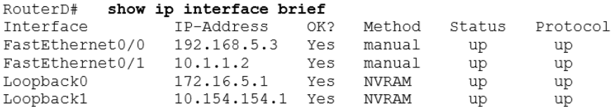
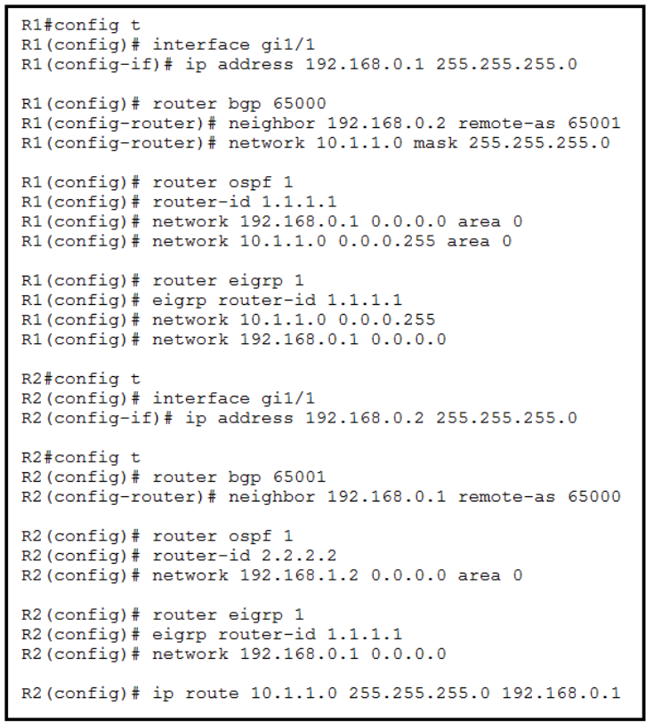
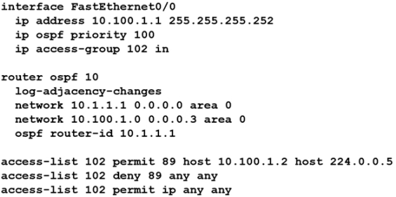

# CCNA対策問題 401-500

#### 問題 401

展示を参照してください。  
このコマンドの出力を考慮すると、ルータ ID が手動で設定されていない場合、OSPF はこのルータにどのルータ ID を使用しますか?

- A. 10.1.1.2
- B. 10.154.154.1
- C. 172.16.5.1
- D. 192.168.5.3

#### 問題 402

展示を参照してください。  
EIGRP を実行する場合、RouterA が RouterC とルーティングアップデートを交換するには何が必要ですか?

- A. AS 番号は、すべてのルーターで一致するように変更する必要があります。
- B. DR が選択されるようにループバック インターフェイスを設定する必要がある
- C. no auto-summary コマンドはルータ A とルータ C では必要ありません
- D. ルーター B には、接続されたネットワークごとに 1 つずつ、合計 2 つのネットワーク ステートメントが必要です

#### 問題 403
ネットワーク管理者は、ルーター R1 および R2 の OSPF 構成のトラブルシューティングを行っています。  
ルーターは、共通のイーサネット リンク上で隣接関係を確立できません。  
この図は、ルータ R1 および R2 に対する show ip ospf Interface e0 コマンドの出力を示しています。  
図の情報に基づいて、この問題の原因は何ですか?

- A. OSPF エリアが正しく設定されていません。
- B. R1 の優先順位を高く設定する必要があります。
- C. R1 のコストを高く設定する必要があります。
- D. hello タイマーとデッド タイマーが正しく設定されていません。
- E. バックアップ指定ルーターをネットワークに追加する必要があります。
- F. OSPF プロセス ID 番号は一致する必要があります。

#### 問題 404

展示を参照してください。  
RouterB に設定されているループバック アドレスに関して正しい 2 つの記述はどれですか? (2 つお選びください。)

- A. データが RouterB によって転送されることが保証されます。
- B. RouterB 上の OSPF プロセスに安定性をもたらします。
- C. RouterB のルーター ID が 10.0.0.1 であることが指定されています。
- D. RouterB からアドバタイズされるルートのメトリックが減少します。
- E. RouterB を LAN の DR として選択する必要があることを示します。

#### 問題 405
単一エリア内のすべての OSPF ルーターが同じ優先順位値で設定されている場合、ループバック インターフェイスがない場合、ルーターは OSPF ルーター ID にどのような値を使用しますか?

- A. 最初のファスト イーサネット インターフェイスの IP アドレス
- B. コンソール管理インターフェイスの IP アドレス
- C. アクティブなインターフェースの中で最も大きい IP アドレス
- D. アクティブなインターフェイスの中で最も小さい IP アドレス
- E. ループバック インターフェイスが設定されるまでの優先順位の値

#### 問題 406
OSPF Hello プロトコルは次のタスクのうちどれを実行しますか? (2 つお選びください。)

- A. 動的な近隣探索を提供します。
- B. 到達不能な近隣ノードを 90 秒間隔で検出します。
- C. 隣人関係を維持する。
- D. 隣接するインターフェイス間で正確性パラメータをネゴシエートします。
- E. タイマーを使用して、最速のリンクを持つルーターを指定ルーターとして選択します。
- F. OSPF を実行しているすべてのルーターを検出するために、インターネットワーク全体に hello パケットをブロードキャストします。

#### 問題 407
HSRP グループの 2 つの要件は何ですか? (2 つお選びください。)

- A. アクティブなルーターは 1 台のみ
- B. 1 つ以上のスタンバイ ルーター
- C. 1 つ以上のバックアップ仮想ルーター
- D. スタンバイ アクティブ ルーターが 1 つだけ
- E. バックアップ仮想ルーターが 1 つだけ

#### 問題 408
ルーティング テーブルを表示すると、どの 2 つの情報を知ることができますか? (2 つお選びください。)

- A. ACL がインターフェイスにインバウンドまたはアウトバウンドで適用されたかどうか
- B. EIGRP または BGP 自律システム
- C. アドミニストレーティブ ディスタンスが手動で設定されたか動的に設定されたか
- D. どのネイバー隣接関係が確立されるか
- E. ルートがわかっている時間の長さ

#### 問題 409

展示を参照してください。  
ルーティング プロトコル コード D は出力でどのルート タイプを表しますか?

- A. 静的に割り当てられたルート
- B. EIGRP を通じて学習されたルート
- C. ローカルに設定された IP の 724 ルート
- D. 内部 BGP ルート

#### 問題 410
エンジニアは、ルータ R1 と R3 の間に OSPF ネイバー関係を設定する必要があります。  
認証構成が構成されており、接続インターフェイスは同じ 192.168.1.0/30 サブネット内にあります。  
構成を完了するための次の 2 つの手順は何ですか? (2 つお選びください。)

- A. 両側でインターフェイスを OSPF アクティブとして設定します。
- B. 両方のインターフェースを同じエリア ID で構成する
- C. hello タイマーとデッド タイマーを両側で一致するように設定する
- D. ルータの OSPF プロセスに同じプロセス ID を設定する
- E. 両方のルーティング プロセスで同じルーター ID を設定します。

#### 問題 411

展示を参照してください。  
パケットはルーター R1 を経由してホスト 172.16.0.14 に送信されています。  
パケットの宛先ルートは何ですか?

- A. 209.165.200.250 via Serial0/0/0
- B. 209.165.200.254 via Serial0/0/0
- C. 209.165.200.254 via Serial0/0/1
- D. 209.165.200.246 via Serial0/1/0

#### 問題 412

展示を参照してください。  
パケットはルーター R1 を経由してホスト 172.16.3.14 に送信されています。  
ルーターはパケットをどの宛先に送信しますか?

- A. 207.165.200.246 via Serial0/1/0
- B. 207.165.200.254 via Serial0/0/0
- C. 207.165.200.250 via Serial0/0/0
- D. 207.165.200.254 via Serial0/0/1

#### 問題 413

展示を参照してください。  
ルーター R2 は、ルーター R1 からネットワーク 10.1.1.0/24に到達するための複数のルートで構成されています。  
宛先ネットワーク 10.1.1.0/24 に到達するためにルーター R2 によって選択されるパスはどれですか?

- A. static
- B. EIGRP
- C. eBGP
- D. OSPF

#### 問題 414

展示を参照してください。  
ホスト 10.0.1.5 を宛先とするトラフィックのネクスト ホップアドレスは何ですか?

- A. Loopback 0
- B. 10.0.1.4
- C. 10.0.1.3
- D. 10.0.1.50

#### 問題 415

展示を参照してください。  
ネットワーク管理者は、PC A とファイル サーバー間の接続を完了するタスクを想定しています。  
スイッチ A とスイッチ B は、VLAN 10、11、12、および 13 で部分的に構成されています。構成の次のステップは何ですか?

- A. VLAN セグメンテーションのために、PC A を VLAN 10 に追加し、ファイル サーバーを VLAN 11 に追加します。
- B. VLAN 伝播のために、スイッチ A とスイッチ B のトランク リンクに VLAN 13 を追加します。
- C. スイッチ A とスイッチ B の間のスティックにルーターを追加して、VLAN 間ルーティングを可能にする
- D. PC A をファイル サーバーと同じサブネットに追加し、VLAN 内通信を可能にする

#### 問題 416
DRAG DROP -  
ネットワーク エンジニアが OSPFv2 ネイバー隣接関係を構成しています。パラメータを左側から右側の必要なカテゴリにドラッグ アンド ドロップします。  
すべてのパラメータが使用されるわけではありません。

選択して配置します:

#### 問題 417
R1 は、IS-IS、OSPF、RIP、および内部 EIGRP 経由でルート 192.168.12.0/24 を学習しました。  
通常の動作条件では、どのルーティング プロトコルがルーティング テーブルにインストールされますか?

- A. IS-IS
- B. Internal EIGRP
- C. RIP
- D. OSPF

#### 問題 418

展示を参照してください。  
default-informationoriginate コマンドは、R1 OSPF 設定で設定されます。  
テスト後、サイト B の VLAN 20 上のワークステーションはインターネット上の DNS サーバーに到達できません。  
構成の問題を修正するアクションはどれですか?

- A. R2 にデフォルト情報生成コマンドを追加します。
- B. R1 のデフォルト情報生成コマンドに always キーワードを追加します。
- C. R1 で ip Route 0.0.0.0 0.0.0.0 10.10.10.18 コマンドを設定します。
- D. R2 で ip Route 0.0.0.0 0.0.0.0 10.10.10.2 コマンドを設定します。

#### 問題 419

展示を参照してください。  
ホスト 172.16.0.202 へのルートはどのメトリックで学習されましたか?
- A. 0
- B. 110
- C. 38443
- D. 3184439

#### 問題 420
ユーザーは 2 つのルーター間の単一エリアに OSPF を設定しました。  
R1 と R2 を接続するシリアル インターフェイスは、カプセル化 PPP を実行しています。  
デフォルトでは、ユーザーが R1 または R2 で「show ip ospf Interface」と入力した場合、このインターフェイスにはどの OSPF ネットワーク タイプが表示されますか?

- A. nonbroadcast
- B. point-to-point
- C. point-to-multipoint
- D. broadcast

#### 問題 421
VRRP の仮想アドレスとして認識される MAC アドレスはどれですか?

- A. 0000.5E00.010a
- B. 0005.3709.8968
- C. 0000.0C07.AC99 _
- D. 0007.C070.AB01 _

#### 問題 422

展示を参照してください。ニューヨークのルーターは、アトランタとワシントンのサイトを指す静的ルートで構成されています。  
アトランタ ルーターとワシントン ルーターの Se0/0/0 インターフェイスが相互に接続するには、どの 2 つのタスクを実行する必要がありますか? (2 つお選びください。)

- A. Atlanta ルーターで ipv6 Route 2023::/126 2012::1 コマンドを設定します。
- B. ワシントン ルーターで ipv6 Route 2012::/126 2023::2 コマンドを設定します。
- C. ワシントン ルーターで ipv6 Route 2012::/126 2023::1 コマンドを設定します。
- D. Atlanta ルーターで ipv6 Route 2023::/126 2012::2 コマンドを設定します。
- E. Atlanta ルーターで ipv6 Route 2012::/126 s0/0/0 コマンドを設定します。

#### 問題 423
EIGRP を実行しているルータは、2 つの異なるパスから同じルートを学習しました。  
ルーターは最適なパスを選択するためにどのパラメータを使用しますか?

- A. as-path
- B. administrative distance
- C. metric
- D. cost

#### 問題 424
エンジニアは、OSPF ネイバーを指定ルーターとして構成しました。  
指定ルーターが適切なモードであることを確認するのはどの状態ですか?

- A. Init
- B. 2-way
- C. Exchange
- D. Full

#### 問題 425

展示を参照してください。  
R1 は 192.168.16.2 宛てのトラフィックに対してどのルートを選択しますか?

- A. 192.168.16.0/21
- B. 192.168.16.0/24
- C. 192.168.16.0/26
- D. 192.168.16.0/27

#### 問題 426

展示を参照してください。  
ip Route 0.0.0.0 0.0.0.0 10.13.0.1 120 コマンドを使用してルータ上に静的デフォルト ルートを設定した場合、ルータはどのように応答しますか?

- A. ルーティング テーブルに特定の一致するエントリがないトラフィックをGigabitEthernet0/1 に送信し始めます。
- B. ルーティング テーブル内の既存の OSPF ルートが、新しく設定されたスタティックルートに即座に置き換えられます。
- C. 2 つのデフォルト ルート間のトラフィックの負荷分散を開始します。
- D. 既存の OSPF デフォルト ルートが削除されるまで、新しいスタティック ルートは無視されます。

#### 問題 427

図を参照してください。  
R1 は R3 と OSPF ネイバー関係を確立できません。  
この問題の考えられる原因は何ですか? (2 つお選びください。)

- A. すべてのルーターをバックボーン エリア 1 用に設定する必要があります。
- B. R1 と R2 は DR および BDR であるため、OSPF は R3 とのネイバー隣接関係を確立しません。
- C. スタティック ルートが R1 から R3 に設定されており、ネイバー隣接関係の確立を妨げています。
- D. hello インターバル タイマーとデッド インターバル タイマーが R1 と R3 で同じ値に設定されていません。
- E. これらのルータでは、EIGRP もより低いアドミニストレーティブ ディスタンスで設定されています。
- F. R1 と R3 は異なる領域に設定されます。

#### 問題 428

展示を参照してください。  
プライマリ リンクにバックアップを提供するようにフローティング スタティック ルートを設定するコマンドはどれですか?

- A. ip route 209.165.200.224 255.255.255.224 209.165.202.129 254
- B. ip route 209.165.201.0 255.255.255.224 209.165.202.130
- C. ip route 0.0.0.0 0.0.0.0 209.165.200.224
- D. ip route 0.0.0.0 0.0.0.0 209.165.202.131

#### 問題 429

展示を参照してください。  
エンジニアは、アトランタ サイトとワシントン サイトを指す静的ルートを使用してニューヨーク ルーターを構成しました。  
両方のサイトがニューヨークルーターのループバック 2 インターフェイスに到達できるようにするには、アトランタルーターとワシントン ルーターでどのコマンドを設定する必要がありますか?

- A. ipv6 route::/0 Serial 0/0/0
- B. ipv6 route::/0 Serial 0/0/1
- C. ipv6 route:0/0 Serial 0/0/0
- D. ip route 0.0.0.0 0.0.0.0 Serial 0/0/0
- E. ipv6 route::/0 2000::2

#### 問題 430
OSPF プロセスの設定中にループバック インターフェイスと設定されたルータ ID が存在しない場合、どのような影響がありますか?

- A. 最も小さい IP アドレスが 1 ずつ増分され、ルーター ID として選択されます。
- B. ルーター ID 0.0.0.0 が選択され、OSPF プロセスに配置されます。
- C. ルータ ID が設定されていないため、OSPF プロトコルが実行されません。
- D. 最大のアップ/アップ物理インターフェイス IP アドレスがルータ ID として選択されます。

#### 問題 431

展示を参照してください。  
192.168.10.33/28 サブネットへのルートのメトリックは何ですか?

- A. 84
- B. 110
- C. 128
- D. 192
- E. 193

#### 問題 432

展示を参照してください。  
Loopback0 インターフェイスから送信されたトラフィックは、SSH 経由で 10.0.1.15 のホストに接続しようとしています。  
宛先アドレスへの次のホップは何ですか?

- A. 192.168.0.7
- B. 192.168.0.4
- C. 192.168.0.40 _
- D. 192.168.3.5

#### 問題 433
VRRP グループ内のアクティブなルーターに障害が発生した場合、どのルーターがその役割を引き継ぎ、パケットを転送しますか?

- A. forwarding
- B. standby
- C. backup
- D. listening

#### 問題 434
ルーターはネットワーク経由でパケットを転送するときにどのようなアクションを実行しますか?

- A. ルーターは元のパケットをカプセル化し、送信元ルーターの MAC アドレスを識別するタグを含めて、それを宛先に透過的に送信します。
- B. ルーターは、送信元ルーターの IP アドレスを送信元、近隣 IP アドレスを宛先として、送信元 IP アドレスと宛先 IP アドレスをカプセル化します。
- C. ルータは、元の送信元および宛先 MAC アドレスを、送信元ルータの MAC アドレスと宛先としての隣接 MAC アドレスに置き換えます。
- D. ルータは、送信元ラベルと宛先ラベルを、送信元ルータ インターフェイス ラベルと宛先としてのネクスト ホップ ルータ ラベルに置き換えます。

#### 問題 435

展示を参照してください。  
このルーティング テーブル エントリに含まれる 2 つのプレフィックスはどれですか? (2 つお選びください。)

- A. 192.168.1.17
- B. 192.168.1.61
- C.192.168.1.64 _
- D. 192.168.1.127
- E.192.168.1.254 _

#### 問題 436
VRRP グループ 1 はどの仮想 MAC アドレスを使用しますか?

- A. 0504.0367.4921
- B. 0007.c061.bc01
- C. 0050.0c05.ad81
- D. 0000.5E00.0101

#### 問題 437
特定のサブネットでファーストホップ冗長プロトコルを使用する目的は何ですか?

- A. ルータ間でマルチキャスト hello メッセージを転送します。
- B. デフォルト ルートをネットワーク上のホストに送信します。
- C. ループのない物理トポロジを保証する
- D. 宛先 IP アドレス指定に基づいてトラフィックをフィルタリングする

#### 問題 438

展示を参照してください。  
2 つのルータ間で OSPF ネイバー関係を確立できないのは、どの設定上の問題ですか?

- A. R1 には、インターフェイス Gi1/0 に対するネットワーク コマンドが正しくありません。
- B. R2 のネットワーク コマンドはエリア 1 にある必要があります。
- C. R1 インターフェイス Gi1/0 の MTU サイズは大きくなります。
- D. R2 は、passive-interfacedefault コマンドを使用しています。

#### 問題 439

展示を参照してください。  
ルーター R1 が IP アドレス 10.56.192.1 にトラフィックを送信している場合、パケットのルーティングにどのインターフェイスまたはネクスト ホップ アドレスが使用されますか?

- A. 10.56.0.1 _
- B. 0.0.0.0/0
- C. Vlan57
- D. 10.56.128.19

#### 問題 440

展示を参照してください。  
負荷分散されたトラフィックが WAN から 172.16.1.190 のホストに送信されます。  
ルーターがリクエストを転送するためにどのネクストホップが使用されますか?

- A. 192.168.7.4
- B. 192.168.7.7
- C. 192.168.7.35 _
- D. 192.168.7.40

#### 問題 441
VRRP の利点は何ですか?

- A. 2 つ以上のルーターを使用して、LAN 上にデフォルト ゲートウェイの冗長性を提供します。
- B. 送信元から 2 ホップ以上離れた宛先にトラフィックの負荷分散を提供します。
- C. すべてのトラフィックをルート ブリッジに転送することで、レイヤ 2 LAN でのループを防止し、ルート ブリッジが転送の最終決定を行います。
- D. 近隣ノードが相互にルーティング テーブル情報を共有できるようにします。

#### 問題 442

展示を参照してください。  
ルーター R1 および R3 にはデフォルトの構成があります。  
ルータ R2 の優先順位は 99 に設定されています。R3 のどのコマンドが、10.0.4.0/24 ネットワークの DR としてルータを設定しますか?

- A. R3(config)interface Gig0/0 R3(config-if)ip ospf priority 100
- B. R3(config)interface Gig0/0 R3(config-if)ip ospf priority 1
- C. R3(config)interface Gig0/1 R3(config-if)ip ospf priority 0
- D. R3(config)interface Gig0/1 R3(config-if)ip ospf priority 100

#### 問題 443

展示を参照してください。  
ネットワーク エンジニアは、10.0.0.0/24 ネットワーク宛てのすべてのパケットが R3 に送信され、PC1 宛てのすべてのパケットが R2 に送信されるように R1 を設定する必要があります。  
エンジニアはどの構成を実装する必要がありますか?

- A. R1(config)#ip route 10.0.0.0 255.255.255.0 172.16.0.2 R1(config)#ip route  
10.0.0.5 255.255.255.255 192.168.0.2
- B. R1(config)#ip route 10.0.0.0 255.255.0.0 172.16.0.2 R1(config)#ip route  
10.0.0.5 255.255.255.255 192.168.0.2
- C. R1(config)#ip route 10.0.0.0 255.255.255.0 192.168.0.2 R1(config)#ip route  
10.0.0.5 255.255.255.255 172.16.0.2
- D. R1(config)#ip route 10.0.0.0 255.255.0.0 192.168.0.2 R1(config)#ip route   
10.0.0.5 255.255.255.0 172.16.0.2

#### 問題 444

展示を参照してください。  
すべてのトラフィックは、IP アドレス 192.168.50.1 のインターフェイス Serial0/3 から CPE ルーターに入ります。  
WAN からの Web トラフィックは、サーバーの負荷分散が行われている LAN ネットワークに送信されます。  
HTTP 仮想IP の宛先アドレスが 192.168.1.250 である IP パケットを転送する必要があります。ルーターはどのルーティング テーブル エントリを使用しますか?

- A. 192.168.1.0/24 via 192.168.12.2
- B. 192.168.1.128/25 via 192.168.13.3
- C. 192.168.1.192/26 via 192.168.14.4
- D. 192.168.1.224/27 via 192.168.15.5

#### 問題 445

展示を参照してください。  
エンジニアはピアから構成タスクを引き受けます。  
ルーター Aは、ネイバー 172.1.1.1 と OSPF ネイバー関係を確立する必要があります。  
出力には、2時間後の隣接関係のステータスが表示されます。  
ルーターが隣接関係を確立するための構成プロセスの次のステップは何ですか?

- A. ルーター A がルーター B と同じ MTU サイズを使用するように設定します。
- B. ルーター A とルーター B の間にポイントツーポイント リンクを設定します。
- C. ルーター B の OSPF ID をその IP アドレスと同じ値に設定します。
- D. ルーター B の OSPF ID を非ホスト アドレスに設定します。

#### 問題 446

展示を参照してください。  
R1 が DR になるようにエンジニアがこのネットワークに適用する必要がある 2 つの構成はどれですか? (2 つお選びください。)

- A. R3(config)interface fastethernet 0/0 R3(config-if)ip ospf priority 0
- B. R1(config)router ospf 1 R1(config-router)router-id 192.168.100.1
- C. R1(config)interface fastethernet 0/0 R1(config-if)ip ospf priority 200
- D. R1(config)interface fastethernet 0/0 R1(config-if)ip ospf priority 0
- E. R3(config)interface fastethernet 0/0 R3(config-if)ip ospf priority 200

#### 問題 447

展示を参照してください。  
ルータ R1 と R2 の間のポイントツーポイント リンクでOSPF を設定するコマンドはどれですか?

- A. router-id 10.0.0.15
- B. neighbor 10.1.2.0 cost 180
- C. network 10.0.0.0 0.0.0.255 area 0
- D. ip ospf priority 100

#### 問題 448

展示を参照してください。  
ネットワーク エンジニアは、2 つのサイト間の IP 接続を確立中です。  
ルーター R1 および R2 には、部分的に IP アドレッシングが構成されています。  
どちらのルーターも、それぞれの LAN 上のデバイスにアクセスする機能を備えています。  
各サイトの両方の LAN にあるデバイス間の IP 接続を構成するコマンド セットはどれですか?

- A. R1 ip route 192.168.1.1 255.255.255.0 GigabitEthernet0/1 R2 ip route 10.1.1.1  
255.255.255.0 GigabitEthernet0/1
- B. R1 ip route 192.168.1.0 255.255.255.0 GigabitEthernet0/0 R2 ip route 10.1.1.1  
255.255.255.0 GigabitEthernet0/0
- C. R1 ip route 0.0.0.0 0.0.0.0 209.165.200.225 R2 ip route 0.0.0.0 0.0.0.0  
209.165.200.226
- D. R1 ip route 0.0.0.0 0.0.0.0 209.165.200.226 R2 ip route 0.0.0.0 0.0.0.0  
209.165.200.225

#### 問題 449

展示を参照してください。  
Router1 はホスト 10.10.13.158 宛てのパケットにどのネクストホップ IP アドレスを使用しますか?

- A. 10.10.10.9
- B. 10.10.10.5
- C. 10.10.11.2
- D. 10.10.12.2

#### 問題 450

展示を参照してください。  
ルーターが BGP から受信したパケットは、209.165.201.1 のシリアル インターフェイスを介して入力されます。  
各ルートはルーティング テーブル内に存在します。  
宛先 IP が 10.1.1.19 のトラフィックの転送にはどのインターフェイスが使用されますか?

- A. F0 /0
- B. F0 /1
- C. F0 /4
- D. F0 /3

#### 問題 451

展示を参照してください。  
OSPF が稼働しているときに OSPF ルーティングが使用され、OSPF がダウンしてもサーバーに到達できるようにするには、R1 でどのルートを設定する必要がありますか?

- A. ip route 10.1.1.10 255.255.255.255 gi0/0 125
- B. ip route 10.1.1.0 255.255.255.0 172.16.2.2 100
- C. ip route 10.1.1.0 255.255.255.0 gi0/1 125
- D. ip route 10.1.1.10 255.255.255.255 172.16.2.2 100

#### 問題 452

展示を参照してください。  
宛先 10.1.2.126 で R1 に入るトラフィックのネクスト ホップは何ですか?

- A. 10.165.20.126
- B. 10.165.20.146
- C. 10.165.20.166
- D. 10.165.20.226

#### 問題 453

展示を参照してください。  
ルータ R1 が内部 EIGRP から学習したプレフィックスはどれですか?

- A. 192.168.3.0/24
- B. 192.168.1.0/24
- C. 172.16.1.0 /24
- D. 192.168.2.0/24

#### 問題 454

展示を参照してください。  
R5 はネットワーク上の現在の DR であり、R4 は BDR です。  
インターフェイスがフラッピングしているため、ネットワーク エンジニアは、OSPF ネットワークが別の DR と BDR を選択することを望んでいます。  
エンジニアはどの構成セットを実装する必要がありますか?

- A. R4(config)interface gi0/0 R4(config-if)ip ospf priority 20 R5(config)interface  
gi0/0 R5(config-if)ip ospf priority 10
- B. R5(config)interface gi0/0 R5(config-if)ip ospf priority 120 R4(config)interface  
gi0/0 R4(config-if)ip ospf priority 110
- C. R3(config)interface gi0/0 R3(config-if)ip ospf priority 255 R2(config)interface  
gi0/0 R2(config-if)ip ospf priority 240
- D. R2(config)interface gi0/0 R2(config-if)ip ospf priority 259 R3(config)interface  
gi0/0 R3(config-if)ip ospf priority 256

#### 問題 455

展示を参照してください。  
Web トラフィックは WAN インターフェイスから入ってきます。  
ルーターが 10.0.10.0/24 の LAN ネットワーク宛てのトラフィックを処理する場合、どのルートが優先されますか?

- A. via next-hop 10.0.1.5
- B. via next-hop 10.0.1.4
- C. via next-hop 10.0.1.50
- D. via next-hop 10.0.1.100

#### 問題 456

展示を参照してください。  
10.10.10.1 から送信されたパケットの宛先は 10.10.8.14 です。  
宛先ルートのサブネットマスクは何ですか?

- A. 255.255.254.0
- B. 255.255.255.240
- C. 255.255.255.248
- D. 255.255.255.252

#### 問題 457

展示を参照してください。  
エンジニアは、ルーター R2 が WAN サブネット上の DR として選択されるように構成する必要があります。  
どのコマンド シーケンスを設定する必要がありますか?

- A. interface gigabitethernet0/0 ip address 10.0.0.34 255.255.255.248 ip ospf priority 0
- B. interface gigabitethernet0/0 ip address 10.0.0.34 255.255.255.224 ip ospf priority 100
- C. interface gigabitethernet0/0 ip address 10.0.1.1 255.255.255.0 ip ospf priority 255
- D. interface gigabitethernet0/0 ip address 10.0.1.1 255.255.255.224 ip ospf priority 98

#### 問題 458
エンジニアは、プレフィックス 2019:C15C:0CAF:E001::/64 の IPv6 静的ルートを使用してルーター R1 を構成しています。  
ネクストホップは 2019:C15C:0CAF:E002::1である必要があります。  
ルートは、R1 ギガビット 0/0 インターフェイス経由で到達可能である必要があります。  
指定ルートを設定するコマンドはどれですか?

- A. R1(config-if)#ip route 2019:C15C:0CAF:E001::/64 GigabitEthernet 0/0
- B. R1(config)#ip route 2019:C15C:0CAF:E001::/64 GigabitEthernet 0/0
- C. R1(config-if)#ipv6 route 2019:C15C:0CAF:E001::/64 2019:C15C:0CAF:E002::1
- D. R1(config)#ipv6 route 2019:C15C:0CAF:E001::/64 2019:C15C:0CAF:E002::1

#### 問題 459

展示を参照してください。  
R17 が R18 の WAN インターフェイスに正常に ping を実行するには、どの IPv6 設定が必要ですか?

- A. R17# ! no ip domain lookup ip cef ipv6 cef ! interface FastEthernet0/0 no ip  
address duplex auto speed auto ipv6 address 2001:DB8:2::201/64 ! Interface  
FastEthernet1/0 no ip address duplex auto speed auto ipv6 address  
2001:DB8:3::201/64 ! no cdp log mismatch duplex ipv6 route 2001:DB8:4::/64  
2001:DB8:4::302
- B. R17# ! no ip domain lookup ip cef ipv6 unicast-routing ! interface  
FastEthernet0/0 no ip address duplex auto speed auto ipv6 address  
2001:DB8:2::201/64 ! Interface FastEthernet1/0 no ip address duplex auto speed  
auto ipv6 address 2001:DB8:3::201/64 ! no cdp log mismatch duplex ipv6 route  
2001:DB8:4::/64 2001:DB8:3::301
- C. R17# ! no ip domain lookup ip cef ! interface FastEthernet0/0 no ip address  
duplex auto speed auto ipv6 address 2001:DB8:3::201/64 ! Interface  
FastEthernet1/0 no ip address duplex auto speed auto ipv6 address  
2001:DB8:2::201/64 ! no cdp log mismatch duplex ipv6 route 2001:DB8:4::/64  
2001:DB8:5::101
- D. R17# ! no ip domain lookup ip cef ipv6 unicast-routing ! interface  
FastEthernet0/0 no ip address duplex auto speed auto ipv6 address  
2001:DB8:2::201/64 ! Interface FastEthernet1/0 no ip address duplex auto speed  
auto ipv6 address 2001:DB8:3::201/64 ! no cdp log mismatch duplex ipv6 route  
2001:DB8:4::/64 2001:DB8:2::201

#### 問題 460

展示を参照してください。  
企業はフェイルオーバー計画を構成しており、プライマリ リンクがダウンしたときにフローティング スタティック ルートがトラフィックの転送を引き受けるようにデフォルト ルートを実装する必要があります。  
どのプライマリ ルート設定を使用する必要がありますか?

- A. ip route 0.0.0.0 0.0.0.0 192.168.0.2
- B. ip route 0.0.0.0 0.0.0.0 192.168.0.2 GigabitEthernet1/0
- C. ip route 0.0.0.0 0.0.0.0 192.168.0.2 floating
- D. ip route 0.0.0.0 0.0.0.0 192.168.0.2 tracked

#### 問題 461
OSPF はルーター R1 と R2 の間に設定する必要があります。  
DR'BDR の選択を回避するには、ルータ R1 にどの OSPF 設定を適用する必要がありますか?

- A. router ospf 1 network 192.168.1.1 0.0.0.0 area 0 interface e1/1 ip address  
192.168.1.1 255.255.255.252 ip ospf cost 0
- B. router ospf 1 network 192.168.1.1 0.0.0.0 area 0 hello interval 15 interface e1/1  
ip address 192.168.1.1 255.255.255.252
- C. router ospf 1 network 192.168.1.1 0.0.0.0 area 0 interface e1/1 ip address  
192.168.1.1 255.255.255.252 ip ospf network broadcast
- D. router ospf 1 network 192.168.1.1 0.0.0.0 area 0 interface e1/1 ip address  
192.168.1.1 255.255.255.252 ip ospf network point-to-point

#### 問題 462

展示を参照してください。  
エンジニアは、新しいサーバーを管理ネットワークに接続するために R1 構成を更新しています。  
管理ネットワーク上の PC が新しいサーバーのデフォルト ゲートウェイに ping を送信できないようにブロックする必要があります。  
タスクを完了するには、R1 でどのコマンドを設定する必要がありますか?

- A. R1(config)#ip route 172.16.2.0.255.255.255.0 192.168.1.15
- B. R1(config)#ip route 172.16.2.2 255.255.255.248 gi0/1
- C. R1(config)#ip route 172.16.2.2 255.255.255.255 gi0/0
- D. R1(config)#ip route 172.16.2.0 255.255.255.0 192.168.1.5

#### 問題 463

展示を参照してください。  
現在、ルータ R1 はインターネットへのプライマリ ルートとして R3 を使用するように設定されており、ルートではデフォルトのアドミニストレーティブ ディスタンス設定が使用されます。  
ネットワーク エンジニアは、R3 がダウンした場合に限り、R2 をバックアップとして使用するように R1 を構成する必要があります。  
R3 へのリンク上のアドミニストレーティブ ディスタンス設定を変更せずに、R2 をバックアップ ルートとして正しく使用するには、エンジニアが R1 でどのコマンドを設定する必要がありますか?

- A. ip route 0.0.0.0 0.0.0.0 209.165.201.5.10
- B. ip route 0.0.0.0 0.0.0.0 g0/1 1
- C. ip route 0.0.0.0 0.0.0.0 209.165.200.226 1
- D. ip route 0.0.0.0 0.0.0.0 g0/1 6

#### 問題 464

展示を参照してください。  
ルータ A が OSPF エリア 0 の DR として確実に選択されるようにするには、どのアクションを実行する必要がありますか?

- A. ルーター A インターフェイスをエリア内で最も高い OSPF 優先値で設定します。
- B. ルーター B とルーター C をルーター A の OSPF ネイバーとして設定する
- C. ルータ A の OSPF 優先度を 3 つのルータの中で最も低い値に設定します。
- D. 固定の OSPF ルーター ID を使用してルーター A を構成する

#### 問題 465

展示を参照してください。  
ルーターが BGP から受信したパケットは、シリアル インターフェイス 209.165.201.10 を介して入力されます。  
各ルートはルーティング テーブル内に存在します。  
宛先 IP が 10.10.10.24 のトラフィックの転送にはどのインターフェイスが使用されますか?

- A. F0 /10
- B. F0 /11
- C. F0 /12
- D. F0 /1

#### 問題 466

展示を参照してください。  
OSPF がこのネットワーク上で実行されている場合、Router2 はサイト B からサイト A の 10.10.13.128/25 へのトラフィックをどのように処理しますか?

- A. インターフェイス Fa0/1 からパケットを送信します。
- B. インターフェイス Fa0/2 からパケットを送信します。
- C. Fa0/1 と Fa0/2 からのトラフィックを負荷分散します。
- D. 到達不可能なため、トラフィックが破棄されます。

#### 問題 467

展示を参照してください。  
ルーター R1 は OSPF エリア 0 にあります。  
トラフィックの誘導に使用するパスに影響を与えるために R1 構成を更新した後、エンジニアは 4 つのギガビット インターフェイスのそれぞれが 10 10.0.0/16 への同じルートを持っていることを確認しました。  
R1 はルートに到達するためにトラフィックを送信するためにどのインターフェイスを選択しますか?

- A. GigabitEthernet0/0
- B. GigabitEthernet0/1
- C. GigabitEthernet0/2
- D. GigabitEthernet0/3

#### 問題 468

展示を参照してください。  
EIGRP 経由で学習されたネットワーク プレフィックスはどれですか?
- A. 172.160.0/16
- B. 207.165.200.0/24
- C. 192.168.1.0 /24
- D. 192.168.2.0/24

#### 問題 469

展示を参照してください。  
ルータ A でフローティング スタティック デフォルト ルートを有効にするには、どのコマンドを発行する必要がありますか?

- A. ip route 0.0.0.0 0.0.0.0 192.168.1.2 10
- B. ip route 0.0.0.0 0.0.0.0 192.168.1.2
- C. ip default-gateway 192.168.2.1
- D. ip route 0.0.0.0 0.0.0.0 192.168.2.1 10

#### 問題 470

展示を参照してください。  
ルータ R14 と R86 がルータ間で OSPF 情報を交換するための中心点として機能しながら、OSPFv2 隣接関係を形成できる設定はどれですか?

- A. R14# interface FastEthernet0/0 ip address 10.73.65.65 255.255.255.252 ip  
ospf network broadcast ip ospf priority 0 ip mtu 1400 router ospf 10 router-id  
10.10.1.14 network 10.10.1.14 0.0.0.0 area0 network 10.73.65.64 0.0.0.3  
area0 R86# interface Loopback0 ip address 10.10.1.86 255.255.255.255  
interface FastEthernet0/0 ip address 10.73.65.66 255.255.255.252 ip ospf  
network broadcast ip mtu 1500 router ospf 10 router-id 10.10.1.86 network  
10.10.1.86 0.0.0.0 area 0 network 10.73.65.64 0.0.0.3 area 0
- B. R14# interface Loopback0 ip ospf 10 area 0 interface FastEthernet0/0 ip address  
10.73.65.65 255.255.255.252 ip ospf network broadcast ip ospf 10 area 0 ip  
mtu 1500 router ospf 10 ip ospf priority 255 router-id 10.10.1 14 R86# interface  
Loopback0 ip ospf 10 area 0 interface FastEthernet0/0 ip address 10.73.65.66  
255.255.255.252 ip ospf network broadcast ip ospf 10 area 0 ip mtu 1500 router  
ospf 10 router-id 10.10.1.86
- C. R14# interface FastEthernet0/0 ip address 10.73.65.65 255.255.255.252 ip  
ospf network broadcast ip ospf priority 255 ip mtu 1500 router ospf 10 routerid 10.10.1.14 network 10.10.1.14 0.0.0.0 area0 network 10.73.65.64 0.0.0.3  
area0 R86# interface FastEthernet0/0 ip address 10.73.65.66 255.255.255.252  
ip ospf network broadcast ip mtu 1500 router ospf 10 router-id 10.10.1.86  
network 10.10.1.86 0.0.0.0 area 0 network 10.73.65.64 0.0.0.3 area 0  
- D. R14# interface FastEthernet0/0 ip address 10.73.65.65 255.255.255.252 ip ospf  
network broadcast ip ospf priority 255 ip mtu 1500 router ospf 10 router-id  
10.10.1.14 network 10.10.1.14 0.0.0.0 area0 network 10.73.65.64 0.0.0.3 area0  
R86# interface FastEthernet0/0 ip address 10.73.65.66 255.255.255.252 ip ospf  
network broadcast ip mtu 1400 router ospf 10 router-id 10.10.1.86 network  
10.10.1.86 0.0.0.0 area 0 network 10.73.65.64 0.0.0.3 area 0  

#### 問題 471

展示を参照してください。  
管理者がルータ D で show ip Route コマンドを実行してルーティング テーブルを表示すると、ネットワーク 192.168 1.0 へのルートのアドミニストレーティブ ディスタンスとしてどの値が表示されますか?

- A. 110
- B. 120
- C. 170
- D. 90

#### 問題 472
ルーター R1 および R2 がそれぞれの LAN インターフェイスで構成されている展示を参照してください。  
2 つの回線は動作しており、WAN 経由で到達可能です。  
プライマリ回線がダウンした場合にフェールオーバー冗長性を確立するコマンド セットはどれですか?

- A. R1(config)ip route 0.0.0.0 0.0.0.0 10.10.10.6 R2(config)ip route 0.0.0.0 0.0.0.0  
10.10.10.5
- B. R1(config)ip route 10.10.13.10 255.255.255.255 10.10.10.2 R2(config)ip route  
192.168.0.100 255.255.255.255 10.10.10.1 
- C. R1(config)ip route 10.10.13.10 255.255.255.255 10.10.10.6 R2(config)ip route  
192.168.0.100 255.255.255.255 10.10.10.5
- D. R1(config)ip route 0.0.0.0 0.0.0.0 10.10.10.6 2 R2(config)ip route 0.0.0.0  
0.0.0.0 10.10.10.5 2

#### 問題 473

展示を参照してください。  
R1 は OSPF 経由ですべてのルートを学習します。  
R3 経由で192.168.20 0/24 ネットワークに到達するように R1 上でバックアップ スタティックルートを設定するコマンドはどれですか?

- A. R1(config)#ip route 192.168.20.0 255.255.255.0 192.168.30.2 111
- B. R1(config)#ip route 192.168.20.0 255.255.255.0 192.168.30.2 90
- C. R1(config)#ip route 192.168.20.0 255.255.0.0 192.168.30.2
- D. R1(config)#ip route 192.168.20.0 255.255.255.0 192.168.30.2

#### 問題 474

展示を参照してください。  
R1 は、OSPF DR/BDR 選択プロセスで DROTHER の役割を果たしました。  
R1 が DR として選択されるように、エンジニアはどの構成を実装する必要がありますか?

- A. R1(config)interface FastEthernet 0/0 R1(config-if)ip ospf priority 1 R1clear ip ospf process
- B. R3(config)interface FastEthernet 0/1 R3(config-if)ip ospf priority 200 R3clear ip ospf process
- C. R2(config)interface FastEthernet 0/2 R2(config-if)ip ospf priority 1 R2clear ip ospf process
- D. R1(config)interface FastEthernet 0/0 R1(config-if)ip ospf priority 200 R1clear ip ospf process

#### 問題 475
ユーザー生成のトラフィックを転送するのはどの SDN プレーンですか?

- A. 管理プレーン
- B. コントロールプレーン
- C. ポリシープレーン
- D. データプレーン

#### 問題 476
ネットワーク内のアプリケーションが 300 台のサーバーから 600 台のサーバーにスケールアップされています。  
運用、バックアップ、および管理トラフィックをサポートするには、各サーバーに 3 つのネットワーク接続が必要です。  
各接続は異なるサブネット上に存在します。  
運用ネットワークのルーター構成は、最初に 10.0.0.0/8 ネットワーク内のサブネットを使用して構成する必要があります。  
要件に対応し、無駄な IP アドレス スペースを制限するには、ルータのインターフェイスでどのコマンドを設定する必要がありますか?

- A. ip address 10.10.10.1 255.255.254.0
- B. ip address 10.10.10.1 255.255.252.0
- C. ip address 10.10.10.1 255.255.240.0
- D. ip address 10.10.10.1 255.255.255.240

#### 問題 477

展示を参照してください。  
192.168.0.55 のホストにトラフィックを転送するためにどのインターフェイスが選択されますか?

- A. GigabitEthernet0/3
- B. Null0
- C. GigabitEthernet0/1
- D. GigabitEthernet0/2

#### 問題 478

展示を参照してください。  
管理者は、`2001:db8:1234:2::1` を指すフローティング スタティック デフォルト ルートを構成し、失敗した場合にのみ現在のデフォルト ルートを置き換える必要があります。  
エンジニアが CPE で設定する必要があるコマンドはどれですか?

- A. `ipv6 route ::/0 2001:db8:1234:2::1 3`
- B. `ipv6 route ::/128 2001:db8:1234:2::1 3`
- C. `ipv6 route ::/0 2001:db8:1234:2::1 1`
- D. `ipv6 route ::/0 2001:db8:1234:2::1 2`

#### 問題 479

展示を参照してください。  
ルーター OldR は、OldR と R2 にルートを交換させることを目的として、ネットワーク上の別のルーターを置き換えています。  
エンジニアが初期 OSPF構成を適用した後も、両方のデバイスでルートがまだ見つかりませんでした。  
ネイバー関係を有効にするために、clear IP ospf process コマンドを入力する前に、どのコマンド シーケンスを発行する必要がありますか?

- A. OldR(config)#interface g0/0/0 OldR(config-if)#ip ospf hello-interval 15
- B. OldR(config)#router ospf 1 OldR(config-router)#network 192.168.1.0 255.255.255.0 area 2
- C. OldR(config)#interface g0/0/0 OldR(config-if)#ip ospf dead-interval 15
- D. OldR(config)#router ospf 1 OldR(config-router)#no router-id 192.168.1.1

#### 問題 480
DRAG DROP -  

出品物をご参照ください。  
プレフィックスの長さを左側から右側の対応するプレフィックスにドラッグ アンド ドロップします。  
すべてのプレフィックスが使用されるわけではありません。

選択して配置します:

#### 問題 481

展示を参照してください。  
ルート 172.16.4.0 のサブネット マスクは何ですか?

- A. 255.255.255.192
- B. 255.255.254.0
- C. 255.255.248.0
- D. 255.255.240.0

#### 問題 482

展示を参照してください。  
R86 上にある 172.21.34.0/25 ネットワークのトラフィックを転送するには、R14 上にスタティック ルートを設定する必要があります。  
リクエストを満たすにはどのコマンドを使用する必要がありますか?

- A. ip route 172.21.34.0 255.255.255.192 10.73.65.65
- B. ip route 172.21.34.0 255.255.255.128 10.73.65.66
- C. ip route 172.21.34.0 255.255.255.0 10.73.65.65
- D. ip route 172.21.34.0 255.255.128.0 10.73.65.64

#### 問題 483

展示を参照してください。  
ネットワーク エンジニアは、ネットワーク上の代替ルーターとしてルーター R2 を構成しています。  
初期設定が適用された後、R2 が R1 をネイバーとして表示できなかったことが判断されます。  
OSPF 設定を完了し、R1 とのネイバー関係を確立できるようにするには、どの設定を R2 に適用する必要がありますか?

- A. R2(config)router ospf 1 R2(config-router)network 192.168.1.0 255.255.255.0 area 2
- B. R2(config)interface g0/0/0 R2(config-if)ip ospf hello-interval 10
- C. R2(config)interface g0/0/0 R2(config-if)ip ospf Dead-interval 40
- D. R2(config)router ospf 1 R2(config-router)router-id 192.168.1.2

#### 問題 484

展示を参照してください。  
すべてのインターフェイスは二重自動および IP OSPF ネットワーク ブロードキャストで構成されています。  
ルーター R14 と R86 が OSPFv2 隣接関係を形成し、ルーター間で OSPF 情報を交換するための中心点として機能できる設定はどれですか?

- A. R14# interface FastEthernet0/0 ip address 10.73.65.65 255.255.255.252 ip  
ospf priority 255 ip mtu 1500 router ospf 10 router-id 10.10.1.14 network  
10.10.1.14 0.0.0.0 area 0 network 10.73.65.64 0.0.0.3 area 0 R86# interface  
FastEthernet0/0 ip address 10.73.65.66 255.255.255.252 ip mtu 1400 router  
ospf 10 router-id 10.10.1.86 network 10.10.1.86 0.0.0.0 area 0 network  
10.73.65.64 0.0.0.3 area 0
- B. R14# interface Loopback0 ip ospf 10 area 0 interface FastEthernet0/0 ip address  
10.73.65.65 255.255.255.252 ip ospf 10 area 0 ip mtu 1500 router ospf 10 ip  
ospf priority 255 router-id 10.10.1.14 R86# interface Loopback0 ip ospf 10 area  
0 interface FastEthernet0/0 ip address 10.73.65.66 255.255.255.252 ip ospf 10  
area 0 ip mtu 1500 router ospf 10 router-id 10.10.1.86
- C. R14# interface FastEthernet0/0 ip address 10.73.65.65 255.255.255.252 ip  
ospf priority 0 ip mtu 1500 router ospf 10 router-id 10.10.1.14 network  
10.10.1.14 0.0.0.0 area 0 network 10.73.65.64 0.0.0.3 area 0 R86# interface  
FastEthernet0/0 ip address 10.73.65.66 255.255.255.252 ip mtu 1500 router  
ospf 10 router-id 10.10.1.86 network 10.10.1.86 0.0.0.0 area 0 network  
10.73.65.64 0.0.0.3 area 0
- D. R14# interface Loopback0 ip ospf 10 area 0 interface FastEthernet0/0 ip address  
10.73.65.65 255.255.255.252 ip ospf priority 255 ip ospf 10 area 0 ip mtu 1500  
router ospf 10 router-id 10.10.1.14 R86# interface Loopback0 ip ospf 10 area  
0 interface FastEthernet0/0 ip address 10.73.65.66 255.255.255.252 ip ospf 10  
area 0 ip mtu 1500 router ospf 10 router-id 10.10.1.86

#### 問題 485
会社の支社からのパケットは、本社のホスト 172.31.0.1 を宛先としています。  
送信側ルーターのルーティング テーブルには、パケットのプレフィックス 172.31.0.0/16、172.31.0.0/24、および 172.31.0.0/25 の 3 つの一致の可能性があります。  
ルーターはパケットをどのように処理しますか?

- A. プレフィックス 172.31.0.0/24 経由でトラフィックを送信します。
- B. プレフィックス 172.31.0.0/16 経由でトラフィックを送信します。
- C. プレフィックス 172.31.0.0/25 経由でトラフィックを送信します。
- D. デフォルト ゲートウェイ 0.0.0.0/0 経由でトラフィックを送信します。

#### 問題 486

展示を参照してください。  
エンジニアは、ルータ R2 と OSPF シングルエリア ネイバー関係を形成するようにルータ R1 を設定するように求められます。  
ルーターを設定するにはどのコマンド シーケンスを実装する必要がありますか?

- A. router ospf 100 network 10.0.0.0 0.0.0.252 area0 network 10.0.1.0 0.0.0.255 area0
- B. router ospf 100 network 10.0.0.0 0.0.0.3 area0 network 10.0.2.0 255.255.255.0 area0
- C. router ospf 10 network 10.0.0.0 0.0.0.3 area0 network 10.0.1.0 0.0.0.255 area0
- D. router ospf 10 network 10.0.0.0 0.0.0.3 area0 network 10.0.2.0 0.0.0.255 area0

#### 問題 487

展示を参照してください。  
ネットワーク内のすべてのルーターが構成されています。  
R2 はDR である必要があります。  
エンジニアがデバイスを接続した後、R1 が DR として選出されました。  
ネットワーク内の DR として選択するには、R2 でどのコマンド シーケンスを設定する必要がありますか?

- A. R2(config)intergface gi0/0 R2(config-if)ip ospf priority 100
- B. R2(config)router ospf 1 R2(config-router)router-id 192.168.2.7
- C. R2(config)router ospf 1 R2(config-router)router-id 10.100.100.100
- D. R2(config)intergface gi0/0 R2(config-if)ip ospf priority 1

#### 問題 488

展示を参照してください。  
ルータ R1 は構成中です。  
ルーター R2 および R3 は、新しい環境用に正しく構成されています。  
PC1 が 10.10.10.0/24 ネットワーク上のすべてのPC と通信するには、R1 で設定する必要がある 2 つのコマンドはどれですか? (2 つお選びください。)

- A. ip route 10.10.10.0 255.255.255.0 192.168.2.3
- B. ip route 10.10.10.10 255.255.255.255 192.168.2.2
- C. ip route 10.10.10.10 255.255.255.255 g0/1
- D. ip route 10.10.10.8 255.255.255.248 g0/1
- E. ip route 10.10.10.0 255.255.255.248 192.168.2.2

#### 問題 489

展示を参照してください。  
10.10.13.160 プレフィックスへのルートのサブネット マスクは何ですか?

- A. 255.255.255.240
- B. 255.255.255.128
- C. 255.255.248.0
- D. 255.255.255.248

#### 問題 490

展示を参照してください。  
ルータ R1 で設定された場合、これらの要件を満たす 2 つのコマンドはどれですか? (2 つ選択してください。)  
✑ ネットワーク全体 2001:db8:23::/64 へのパケットは、ルーター R2 経由で転送する必要があります。  
ホスト 2001:db8:23::14 に向かうパケットは、R3 経由で転送する必要があります。  

- A. ipv6 route 2001:db8:23::/128 fd00:12::2
- B. ipv6 route 2001:db8:23::14/128 fd00:13::3
- C. ipv6 route 2001:db8:23::/64 fd00:12::2
- D. ipv6 route 2001:db8:23::14/64 fd00:12::2 200
- E. ipv6 route 2001:db8:23::14/64 fd00:12::2

#### 問題 491

展示を参照してください。  
R1 から 10.10.2.0/24 サブネットへのトラフィックは、ネクスト ホップとして 192.168.1.2 を使用します。  
ネットワーク エンジニアは、宛先 10.102.1 のトラフィックがルータ R3 を通過し、10.10.2.0/24 サブネットへの他のすべてのトラフィックが R2 を通過するように R1 設定を更新したいと考えています。  
どのコマンドを使用する必要がありますか?

- A. ip route 10.10.2.1 255.255.255.255 192.168.1.4115
- B. ip route 10.10.2.0 255.255.255.0 192.168.1.4115
- C. ip route 10.10.2.0 255.255.255.0 192.168.1.4100
- D. ip route 10.10.2.1 255.255.255.255192.168.1.4100

#### 問題 492

展示を参照してください。  
イメージ サーバーとクライアント A は、両者間で非常に大量のデータを転送するアプリケーションを実行しています。  
エンジニアは R1 と R2 の間に専用回路を構成しています。  
イメージ サーバーとクライアント A の間のトラフィックのみに新しい回線の使用を強制するには、エンジニアはどのコマンド セットをルーターに適用する必要がありますか?

- A. R1(config)#ip route 10.10.13.10 255.255.255.255 10.10.10.6 R2(config)#ip  
route 192.168.0.100 255.255.255.255 10.10.10.5
- B. R1(config)#ip route 10.10.13.10 255.255.255.128 10.10.10.6 R2(config)#lp  
route 192.168.0.100 255.255.255.0 10.10.10.5
- C. R1(config)#ip route 10.10.13.10 255.255.255.252 10.10.10.6 R2(config)#ip  
route 192.168.0.100 255.255.255.252 10.10.10.5
- D. R1(config)#ip route 10.10.13.10 255.255.255.255 10.10.10.2 R2(config)#ip  
route 192.168.0.100 255.255.255.255 10.10.10.1

#### 問題 493

展示を参照してください。  
エンジニアは、メイン ルーターのルーティング テーブルをチェックして、ネットワーク上のサーバーへのパスを特定しています。  
ルーターは192.168.2.2 のサーバーに到達するためにどのルートを使用しますか?

- A. S 192.168.0.0/20 [1/0] via 10.1.1.1
- B. S 192.168.2.0/29 [1/0] via 10.1.1.1
- C. S 192.168.2.0/28 [1/0] via 10.1.1.1
- D. S 192.168.1.0/30 [1/0] via 10.1.1.1

#### 問題 494

展示を参照してください。  
OSPF ネイバー関係は、次のガイドラインに従って設定する必要があります。  
✑ R1 は、R2 とのネイバー関係の確立のみを許可されます。  
✑ R1 は DR 選挙に決して参加しません。  
✑ R1 は 10.1.1.1 のルーター ID を使用します。  
どの構成を使用する必要がありますか?

- A.   
- B.   
- C.   
- D.   

#### 問題 495

展示を参照してください。  
router1 がホスト A に到達するために使用するルートのプレフィックスの長さはどれくらいですか?

- A. /25
- B. /27
- C. /28
- D. /29

#### 問題 496

展示を参照してください。  
この設定をルータ R1 に適用した後、ネットワーク エンジニアは実装を検証しています。  
すべてのリンクが正常に動作しており、エンジニアが一連のパケットを PC1 から PC3 に送信した場合、パケットはどのようにルーティングされるでしょうか?

- A. ラウンドロビン方式でインターフェイス S0/0/0 および S0/0/1 に分散送信されます。
- B. 10.0.0.2 にルーティングされる
- C. 192.168.100.2 にルーティングされる
- D. 172.16.20.2 にルーティングされる

#### 問題 497

展示を参照してください。  
ルーター R1 が宛先 IP アドレス 10.56.0.62 のパケットを受信した場合、どのインターフェイスを介してパケットをルーティングしますか?

- A. Vlan58
- B. Null0
- C. Vlan59
- D. Vlan60

#### 問題 498

展示を参照してください。  
目的のネイバー関係を実現するには、ネイバー デバイスのGigabitEthernet0/0 インターフェイスで OSPF をどの程度設定する必要がありますか?

- A. Router(config)interface GigabitEthernet 0/0 Router(config-if)ip ospfcost 5
- B. Router(config)interface GigabitEthernet 0/0 Router(config-if)ip ospf priority 1
- C. Router(config)interface GigabitEthernet 0/0 Router(config-if)ip ospf area 2
- D. Router(config)interface GigabitEthernet 0/0 Router(config-if)ip ospf network point-to-point

#### 問題 499
エンジニアがネットワーク 10.120.10.0/24 をインストールしました。  
新しいネットワークを OSPF ルーティング テーブルに追加するには、どの設定を R14 ルーターに適用する必要がありますか?

- A. Router ospf 100 Network 10.120.10.0 0.0.0.255 area 0
- B. Router ospf 120 Network 10.120.10.0 255.255.255.0 area 0 Ip route 10.120.10.0 255.255.255.0 fa0/1
- C. Router ospf 100 area 0 Network 10.120.10.0 0.0.0.255
- D. Router ospf 100 Network 10.120.10.0 255.255.255.0 area 0

#### 問題 500
FHRP の 2 つの利点は何ですか? (2 つお選びください。)

- A. 暗号化されたトラフィックが許可されます
- B. レイヤ 2 ネットワークでのループを防止します。
- C. 複数のポートをバンドルして帯域幅を増やすことができる
- D. デフォルト ゲートウェイの自動フェイルオーバーを有効にする
- E. 複数のデバイスがネットワーク内のクライアントに対する単一の仮想ゲートウェイとして機能できるようにします。
