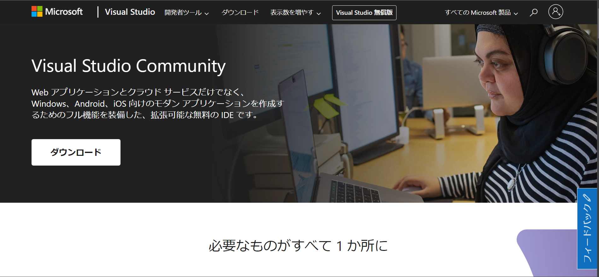
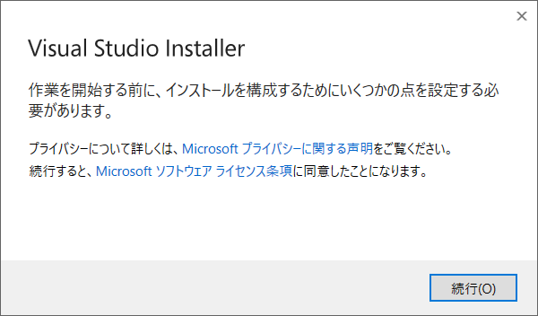
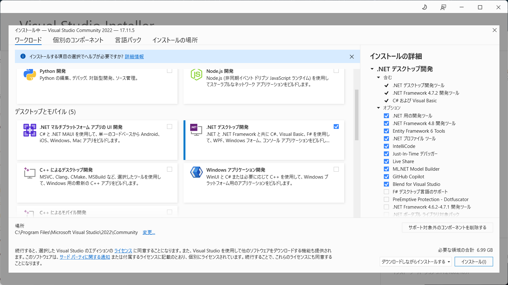
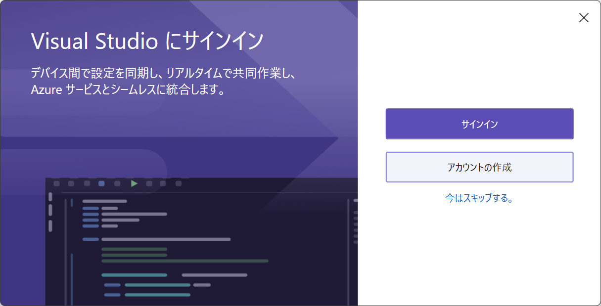
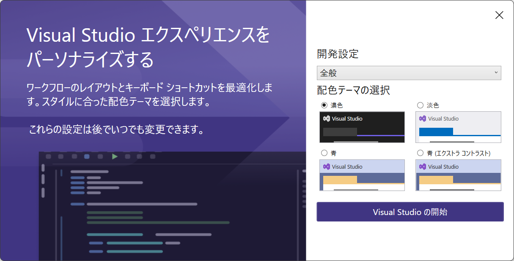
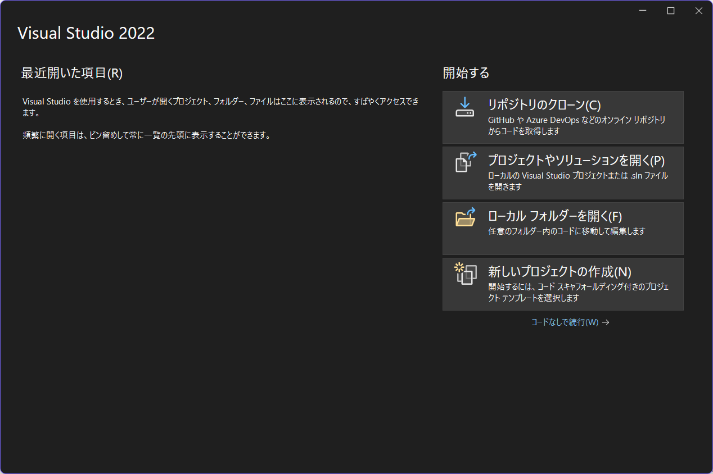

# Visual Studioのインストール

## インストーラのダウンロード

以下のリンクからVisual Studio公式のダウンロードページにアクセスして下さい  

- [公式ダウンロードページ(Community版)](https://visualstudio.microsoft.com/ja/vs/community/)

## インストーラ起動
1. インストーラを実行すると以下の画面が表示されるので  
    利用規約に同意し、 `続行` をクリック

2. `.NET デスクトップ開発` にチェックを入れ `インストール` をクリック

3. `今はスキップ` をクリック  
(私用PCで利用する場合は、必要に応じてアカウントの作成やサインインをしてください)

5. 好みの配色テーマを選択して `Visual Studioの開始` をクリック

6. 以下の画面が表示されたら正常にインストールされています

