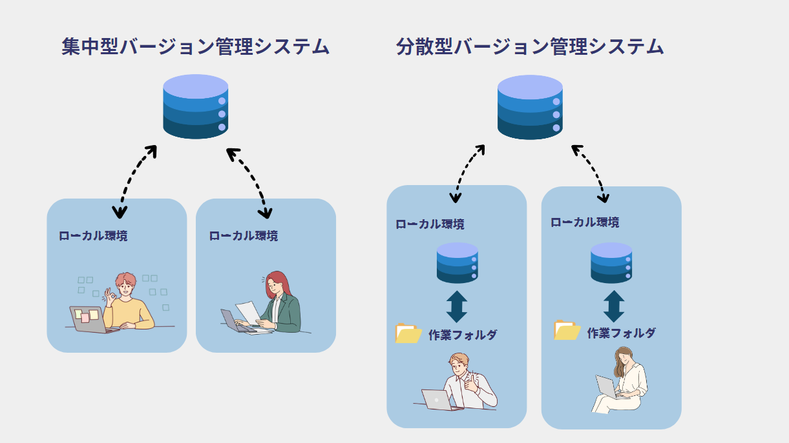
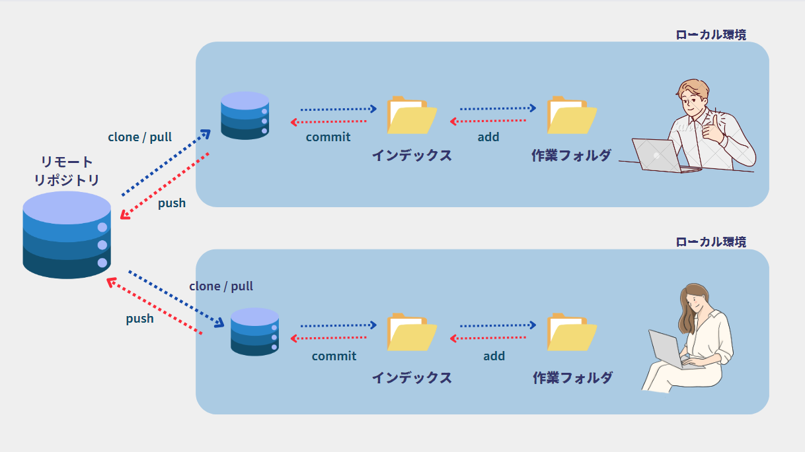
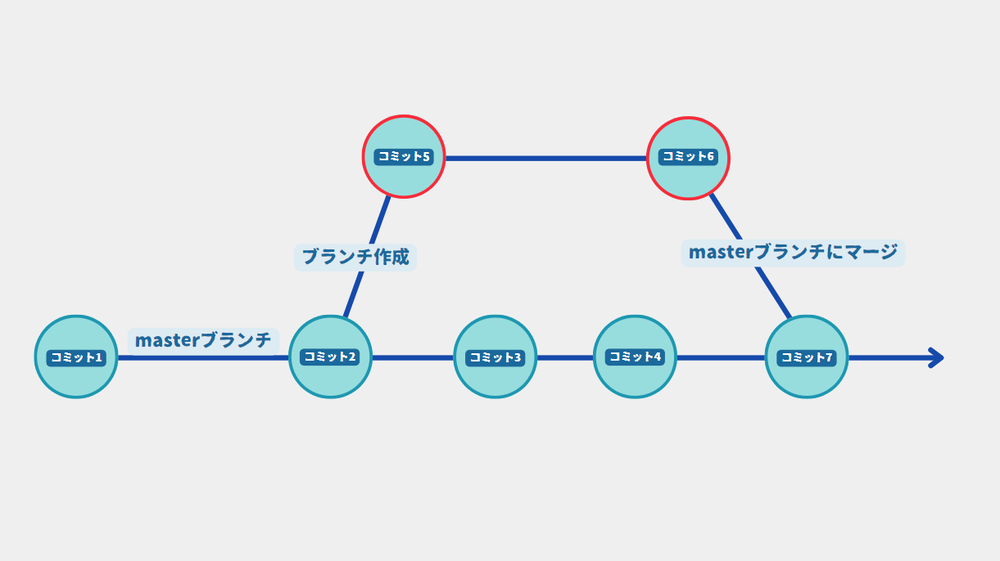

# Gitの基礎知識
本記事では、バージョン管理システムの一つであるGitの基礎知識についてまとめています。


### Gitとは
Gitは、ソースコードや設定ファイルなどの変更履歴を管理するための **分散型バージョン管理システム** です。  
従来の集中型バージョン管理システムとは異なり、各開発者が自分のローカル環境にプロジェクト全体のリポジトリを複製するため、  
オフラインでも作業が可能で、ネットワークの遅延の影響を受けずに効率的に作業できます。

### バージョン管理システムの種類
***
バージョン管理システムには集中型と分散型の2種類があります。※Gitは分散型バージョン管理システムです  
集中型はシンプルで安全性が高いですが、オフライン作業やスケーラビリティに課題があります。  
分散型はオフライン作業やスケーラビリティに優れていますが、構造が複雑でセキュリティ対策が必要になります。  
プロジェクトの特性を理解し、適切なバージョン管理システムを選択することが重要です。



### 分散型バージョン管理システム(Git)の特徴
***
- **リポジトリの複製**: 各開発者が自分のローカル環境にリポジトリの完全なコピーを持つため、オフラインでも作業できます。
- **高いコラボレーション性**: ブランチ機能とマージ機能によって、複数の開発者が効率的にコラボレーションできます。
- **軽量な操作**: コミット単位でファイルの変更を保存するため、操作が軽量です。
- **高い信頼性**: データの冗長性が高いため、データ損失のリスクが低いです。
- **ヒストリーの可視化**: すべての変更履歴をコミットメッセージ付きで保存するため、プロジェクトの進捗状況を簡単に把握できます。


<details>
    <summary>Git用語集</summary>
    <div>
#### 【作業ディレクトリ】
  Gitの管理対象としている変更中のコードや画像などを配置している場所です。

#### 【インデックス】  
インデックスとは、リポジトリにコミットする準備をするための場所のことで、ここに配置したものだけがリポジトリに反映できます。  
**※ステージングとも呼ばれます。**  
作業ディレクトリで行った編集をすべてリポジトリに反映させるのではなく、作業単位でリポジトリに反映させたい場合に役立ちます。

#### 【コミット】
コミットは、Gitでバージョン管理を行う際に、ローカルリポジトリに変更を記録する操作です

#### 【リポジトリ】
変更履歴が管理される場所です。  
リポジトリにはローカルリポジトリとリモートリポジトリという、2つの重要な概念が存在します。


- **ローカルリポジトリ**  
  ユーザーがローカルマシン上で作業するために利用するリポジトリです。  
  基本的にそのユーザーはこの領域にて変更履歴を管理しつつ作業を行います。

- **リモートリポジトリ**  
  ネットワーク上に存在する複数の利用者で共有するリポジトリの事で、  
  ローカルリポジトリの変更をリモートリポジトリへ反映して共有管理します。


    </div>
</details>

<details>
    <summary>Gitコマンド集</summary>
    <div>
## Gitの移行系操作コマンド
Gitで使われる代表的な移行系操作コマンドについて紹介します。  
最低限以下のコマンドは覚えておきましょう。

#### clone  
***
リモートリポジトリをローカル環境に丸々コピーします。初回操作に使われます。

▼masterブランチのクローン  
``` 
git clone <リモートリポジトリURL>
```

▼特定のブランチをクローン
``` 
git clone -b <ブランチ名> <リモートリポジトリURL>
```


#### pull
***
ローカルリポジトリにリモートリポジトリの変更を反映します。
``` 
git pull
```

#### add
***
作業ディレクトリで変更したファイルをインデックスに追加します。
```
git add <ファイル名>
```

#### commit
***
ローカルリポジトリに変更内容を反映します。これを「コミット」と言います。
オプションの-m 'message'はコミットメッセージを作成しています。
```
git commit -m 'message'
```

#### push
***
ローカルリポジトリからリモートリポジトリに反映します。
```
git push <リモートリポジトリ名> <ローカルブランチ名>
```
    </div>
</details>

## ブランチ
開発プロジェクトでは複数のメンバーが同時に機能追加を行ったり、バグ修正をすることがあります。  
複数のリリースバージョンが存在する状態で、メンバーごとに並行して行われる機能追加やバージョン管理を支援するため、  
Gitにはブランチという機能が備わっています。

ブランチは、英語で「枝」という意味があり、その名の通り履歴の流れを枝分かれして記録します。  
分岐したブランチは他のブランチの影響を受けないため、同じリポジトリ中で複数の変更を同時に進める事が可能です。

### masterブランチ  
木の幹に相当するブランチのことを**masterブランチ**と呼びます。  
複数人でプログラム修正や機能の追加を並行して実施する際にmasterブランチからから新しくブランチを作成し、  
担当者ごとに枝分かれしたブランチで作業を実施します。
 
### マージ  
分岐したブランチは他のブランチとマージすることで、一つのブランチにまとめ直すことが出来ます。

