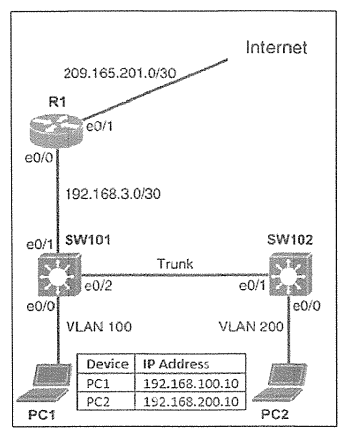

# Named Access-list & Port Security



### タスク

#### タスク1. 仮想ポート0~4で Telnet アクセスが可能な SW101 のローカルアカウントを構成する
- ユーザー名: support
- パスワード: max2learn
- 権限レベル: Execモード

<details>
<summary>タスク1の解答・解説を確認する</summary>

```
SW101(config)# username support privilege 15 password max2learn
SW101(config)# line vty 0 4
SW101(config-line)# transport input telnet
SW101(config-line)# login local
```
</details>

#### タスク2. SW101 に単一の名前付きアクセスリストを設定して適用する
- 名前: ENT_ACL
- PC2 のみが PC1 に ping することを禁止
- PC2 のみが SW101 に telnet することを許可
- VLAN 200上の PC2以外のデバイスは telnet することを禁止
- VLAN 200 からেরその他のすべてのネットワーク トラフィックを許可

<details>
<summary>タスク2の解答・解説を確認する</summary>

```
SW101#show ip interface vlan 100
Vlan100 is up, line protocol is up
Internet address is 192.168.100.1/24

SW101(config)#ip access-list extended ENT_ACL
SW101(config-ext-nacl)#deny icmp host 192.168.200.10 host 192.168.100.10 echo
SW101(config-ext-nacl)#permit tcp host 192.168.200.10 host 192.168.100.1 eq telnet
SW101(config-ext-nacl)#deny tcp 192.168.200.0 0.0.0.255 any eq telnet
SW101(config-ext-nacl)#permit ip 192.168.200.0 0.0.0.255 any
SW101(config-ext-nacl)#exit
SW101(config)#interface vlan 200
SW101(config-if)#ip access-group ENT_ACL in
SW101(config-if)#exit
```

**解説・注意点**: 
- ICMPのときは (echoの前に)、eqは付けない。
- 「eq 23」は「telnet」でも良い。
- SW101とSW102の間のtrunkは、VLAN100, 200が通っている。
</details>

#### タスク3. SW102 のEthernet 0/0 にセキュリティを設定します。
- セキュア MAC アドレスの最大数を 4 に設定します。
- セキュアMACアドレスの数が最大値に達している場合、違反パケットをドロップします。通知アクションは必要ありません。
- セキュア MAC アドレスを動的に学習できるようにします。

<details>
<summary>タスク3の解答・解説を確認する</summary>

```
SW102(config)# interface ethernet0/0
SW102(config-if)# switchport port-security
SW102(config-if)# switchport port-security maximum 4
SW102(config-if)# switchport port-security violation protect
SW102(config-if)# switchport port-security mac-address sticky
SW102(config-if)# exit
```

**解説・注意点**:
- バイオレーションモードには、protect (破棄/通知なし)、restrict (破棄/通知あり)、shutdown (shutdownとなる/通知あり)がある。「通知アクションは必要ありません」とのことなので、protectが正しい。
</details>

#### 設定の保存
<details>
<summary>設定の保存を確認する</summary>

```
SW101, SW102#copy run start
```
</details>
