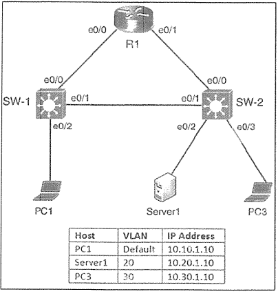

# VLAN and CDP



| Host | VLAN | IP Address |
| :--- | :--- | :--- |
| PC1 | Default | 10.10.1.10 |
| Server1 | 20 | 10.20.1.10 |
| PC3 | 30 | 10.30.1.10 |

### タスク

#### タスク1. PC3のスイッチポートに接続するVLANを「SALES」という名前で設定する
<details>
<summary>タスク1の解答・解説を確認する</summary>

```
SW-2(config)#vlan 30
SW-2(config-vlan)#name SALES
SW-2(config-vlan)#exit
```
</details>

#### タスク2. Server1に接続するスイッチポートを構成する
<details>
<summary>タスク2の解答・解説を確認する</summary>

```
SW-2(config)#int e0/2
SW-2(config-if)#switchport mode access
SW-2(config-if)#switchport access vlan 20
```
</details>

#### タスク3. PC3に接続するスイッチポートを構成する
<details>
<summary>タスク3の解答・解説を確認する</summary>

```
SW-2(config-if)#int e0/3
SW-2(config-if)#switchport mode access
SW-2(config-if)#switchport access vlan 30
```
</details>

#### タスク4. R1がシスコ独自のネイバー探索プロトコルを介してSW-1を検出し、ネットワーク上の他のすべてのデバイスがSW-1を検出できないことを確認します。
<details>
<summary>タスク4の解答・解説を確認する</summary>

```
SW-1(config)#cdp run
SW-1(config)#int e0/0
SW-1(config-if)#cdp enable
SW-1(config-if)#exit
SW-1(config)#int range e0/1 - 2
SW-1(config-if)#no cdp enable
```
</details>

#### 設定の保存
<details>
<summary>設定の保存を確認する</summary>

```
SW-1#copy run start
SW-2#copy run start
```
</details>
