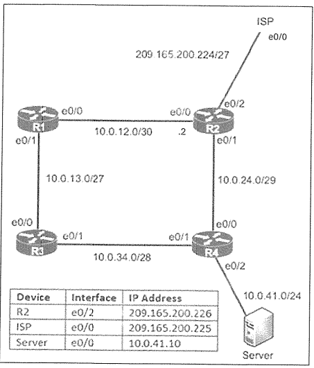

# Static Routing Configuration 1



| Device | Interface | IP Address |
| :--- | :--- | :--- |
| R2 | e0/2 | 209.165.200.226 |
| ISP | e0/0 | 209.165.200.225 |
| Server | e0/0 | 10.0.41.10 |

### タスク

#### タスク1. R1からサーバー宛てのとき、R2を優先するように設定する
<details>
<summary>タスク1の解答・解説を確認する</summary>

```
R1(config)#ip route 10.0.41.10 255.255.255.255 10.0.12.2
```
* 10.0.41.0/24 としないように注意
</details>

#### タスク2. R2でISPへのデフォルトルートを設定する
<details>
<summary>タスク2の解答・解説を確認する</summary>

```
R2(config)#ip route 0.0.0.0 0.0.0.0 209.165.200.225
```
</details>

#### タスク3. R1からR4のLAN (10.0.41.0/24) 宛てのとき、R3を優先するように設定する
<details>
<summary>タスク3の解答・解説を確認する</summary>

```
R1(config)#ip route 10.0.41.0 255.255.255.0 10.0.13.3
```
* 事前に、R3#show ip interface brief を実行し、R3 e0/0 のIPアドレスを確認する
</details>

#### タスク4. R1からR4のLAN (10.0.41.0/24) 宛てのとき、R3とR4間のリンクが失敗した場合に備えて、R2を経由する設定をする。管理距離は254としてのフローティング スタティックルートをバックアップ ルートとして設定する。
<details>
<summary>タスク4の解答・解説を確認する</summary>

```
R1(config)#ip route 10.0.41.0 255.255.255.0 10.0.12.2 254
```
* AD値は少なくとも2以上にしてください。1の次のルートとして2と設定する場合と、ダイナミックルーティング（例えばOSPF110）の次のバックアップルートとする考え方（設計）もあります。本問では254と指定があります。
</details>

#### 設定の保存
<details>
<summary>設定の保存を確認する</summary>

```
R1,R2#copy run start
```
</details>
