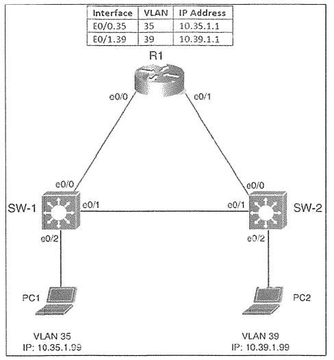

# VLAN & LLDP



| Interface | VLAN | IP Address |
| :--- | :--- | :--- |
| E0/0.35 | 35 | 10.35.1.1 |
| E0/1.39 | 39 | 10.39.1.1 |

- PC1 (VLAN 35): 10.35.1.99
- PC2 (VLAN 39): 10.39.1.99

### タスク

#### タスク1. SW-1をVLAN 35で設定し、SALESというラベルを付ける
<details>
<summary>タスク1の解答・解説を確認する</summary>

```
SW-1(config)#vlan 35
SW-1(config-vlan)#name SALES
SW-1(config-vlan)#exit
```
* exit または end することで設定が反映されます
</details>

#### タスク2. SW-2をVLAN 39で設定し、MARKETINGとラベルを付ける
<details>
<summary>タスク2の解答・解説を確認する</summary>

```
SW-2(config)#vlan 39
SW-2(config-vlan)#name MARKETING
SW-2(config-vlan)#exit
```
</details>

#### タスク3. SW-1で、PC1に接続するスイッチポートを構成する。1つのVLANのみ許可する。
<details>
<summary>タスク3の解答・解説を確認する</summary>

```
SW-1(config)#int e0/2
SW-1(config-if)#switchport mode access
SW-1(config-if)#switchport access vlan 35
```
</details>

#### タスク4. SW-2で、PC2に接続するスイッチポートを構成する。1つのVLANのみ許可する。
<details>
<summary>タスク4の解答・解説を確認する</summary>

```
SW-2(config)#int e0/2
SW-2(config-if)#switchport mode access
SW-2(config-if)#switchport access vlan 39
```
</details>

#### タスク5. 業界標準プロトコルを使用してSW-1とSW-2をユニバーサルネイバーディスカバリ用に構成し、PC1に接続するインターフェースで無効にします。
<details>
<summary>タスク5の解答・解説を確認する</summary>

**SW-1設定**
```
SW-1(config)#lldp run
SW-1(config)#int e0/2
SW-1(config-if)#no lldp receive
SW-1(config-if)#no lldp transmit
```

**SW-2設定**
```
SW-2(config)#lldp run
```

**解説・注意点**
* CDP (Cisco Discovery Protocol)やLLDP (Link Layer Discovery Protocol)のうち、後者を使用する。
* PCはネットワーク機器ではないので、CDPやLLDPの設定は不要である。
* 両方(receive/transmit)を無効に設定することで、LLDP機能が完全に無効になる。
</details>

#### 設定の保存
<details>
<summary>設定の保存を確認する</summary>

```
SW-1,SW-2#copy run start
```
</details>
