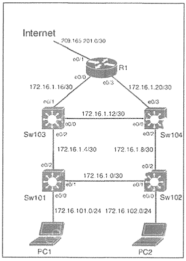

# Named Access-list & DHCP Snooping



### 初期設定（事前構成済み）
<details>
<summary>初期設定を確認する</summary>

**SW101**
```
ip routing
hostname Sw101
vlan 101
 exit
interface e0/0
 switchport mode access
 switchport access vlan 101
 no shutdown
interface vlan 101
 ip address 172.16.101.1 255.255.255.0
 ip helper-address 172.16.1.17
interface e0/1
 no switchport
 ip address 172.16.1.1 255.255.255.252
interface e0/2
 no switchport
 ip address 172.16.1.5 255.255.255.252
!
router ospf 1
 network 172.16.0.0 0.0.255.255 area 0
```

**R1**
```
hostname R1
ip domain-name 9tut.com
!
int e0/0
 ip address 172.16.1.17 255.255.255.252
interface e0/1
 ip address 209.165.201.1 255.255.255.252
interface e0/3
 ip address 172.16.1.21 255.255.255.252
!
ip route 0.0.0.0 0.0.0.0 209.165.201.2
!
router ospf 1
 network 172.16.0.0 0.0.255.255 area 0
 network 209.165.201.0 0.0.0.3 area 0
 default-information originate
!
ip access-list extended INTERNET_ACL
 permit ospf any any
 permit udp any any eq bootps
 permit udp any any eq domain
!
ip dhcp pool NETPOOL
 network 172.16.101.0 255.255.255.0
 default-router 172.16.101.1
!
ip dhcp excluded-address 172.16.101.1 172.16.101.3
```
</details>

### タスク

#### タスク1. 仮想ポート0~4でのみTelnetアクセスが可能な、Sw103 のローカルアカウントを設定する
- Username: devnet
- Password: access8cli
- Algorithm type: SHA256
- 権限レベル: Exec mode

<details>
<summary>タスク1の解答・解説を確認する</summary>

```
Sw103(config)# username devnet privilege 15 algorithm-type sha256 secret access8cli
Sw103(config)# line vty 0 4
Sw103(config-line)# transport input telnet
Sw103(config-line)# login local
```
**解説・注意点**
* algorithm-typeには、md5/scrypt/sha256 の3種類がある
* passwordではなく、secretである点にも注意。3種類のうち、scrypt や sha256は、passwordは使えず、secretにする必要がある。

**セルフチェック**
Sw103 E0/2 のIPアドレスを確認する
```
Sw103#show ip interface brief
...
Interface    IP-Address    OK? Method    Status Protocol
Ethernet0/2  172.16.1.6    YES manual    up     up
```
PC1からSw103 E0/2 にtelnet接続してみる
```
PC1:\> telnet 172.16.1.6
Username: * devnetと入力
Password: * access8cliと入力
Sw103#    * Sw103のデバイス名になれば接続成功
```
</details>

#### タスク2. 最小数の ACEを使用して、既存の NACL「INTERNET_ACL」を変更し、インターネット宛てのネットワーク トラフィックを制御し、R1にACLを適用する。
- 172.16.0.0/16 からの HTTPS を許可する
- VLAN101に対してのみ Telnet を許可する
- 他のすべてのトラフィックを制限し、入力インターフェイス、送信元 MAC アドレス、パケットの送信元と宛先の IP アドレス、およびポートをログに記録する

<details>
<summary>タスク2の解答・解説を確認する</summary>

```
R1(config)# ip access-list extended INTERNET_ACL
R1(config-ext-nacl)# permit tcp 172.16.0.0 0.0.255.255 any eq 443
R1(config-ext-nacl)# permit tcp 172.16.101.0 0.0.0.255 any eq telnet
R1(config-ext-nacl)# deny ip any any log-input
R1(config-ext-nacl)# exit

R1(config)# interface e0/0
R1(config-if)# ip access-group INTERNET_ACL in
R1(config-if)# exit

R1(config)# interface e0/3
R1(config-if)# ip access-group INTERNET_ACL in
R1(config-if)# exit
```
* ACE : アクセスコントロールエントリ (ACLを構成する各permitやdenyのこと)
</details>

#### タスク3. Sw101 で DHCPスヌーピングを構成する
- VLAN 101のDHCPスヌーピングを有効にする
- DHCPオプション82の挿入を無効にする
- DHCPスヌーピングMACアドレス検証を有効にする

<details>
<summary>タスク3の解答・解説を確認する</summary>

```
Sw101(config)#ip dhcp snooping
Sw101(config)#ip dhcp snooping vlan 101
Sw101(config)#no ip dhcp snooping information option
Sw101(config)#ip dhcp snooping verify mac-address
```
**解説・注意点**
* DHCPスヌーピング : 正規のDHCPサーバからトラフィックのみ許可する
* `no ip dhcp snooping information option`: Option 82(DHCP リレー エージェント情報オプション)の挿入を無効化する。DHCPリレーを使用しない環境や、Option 82に対応していないDHCPサーバーがある場合に必要。
* `ip dhcp snooping verify mac-address`: DHCPパケット内のクライアントMACアドレスとイーサネットフレームの送信元MACアドレスが一致するか確認する。MACアドレス偽装を防止する。
</details>

#### 設定の保存
<details>
<summary>設定の保存を確認する</summary>

```
R1,Sw101,Sw103#copy run start
```
</details>
