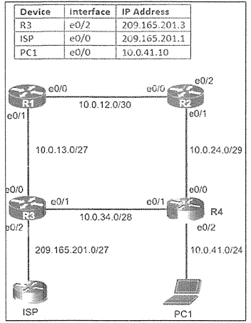

# Static Routing Confiquration 2



| Device | interface | IP Address |
| :--- | :--- | :--- |
| R3 | e0/2 | 209.165.201.3 |
| ISP | e0/0 | 209.165.201.1 |
| PC1 | e0/0 | 10.0.41.10 |

#### タスク

#### 1. R1 が R4 の LAN 上の PC1 にのみ到達するために R2 経由のパスを優先するようにスタティックルーティングを構成する
<details>
<summary>解答・解説を確認する</summary>

```
R1(config)#ip route 10.0.41.10 255.255.255.255 10.0.12.2
```
</details>

#### 2. プライマリ経路で障害が発生した場合に、R1から送信されたトラフィックがR3を経由してPC1に到達する代替経路を確保する静的ルーティングを設定する。最高の管理者距離 (254) を持つフローティング スタティック ルートをバックアップ ルートとして設定できます。
<details>
<summary>解答・解説を確認する</summary>

```
R1(config)#ip route 10.0.41.10 255.255.255.255 10.0.13.3 254
```
</details>

#### 3. 最小のホップ数を使用して、R1とR3でインターネットへのデフォルトルートを構成する
<details>
<summary>解答・解説を確認する</summary>

```
R1(config)#ip route 0.0.0.0 0.0.0.0 10.0.13.3
R3(config)#ip route 0.0.0.0 0.0.0.0 209.165.201.1
```
</details>

#### 設定の保存
<details>
<summary>設定の保存を確認する</summary>

```
R1, R3#copy run start
```
</details>
