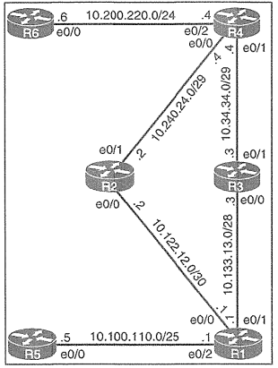

# Static Routing Configuration 3



### タスク

#### タスク1
① R5に 宛先 10.200.220.6 のホスト ルートを設定します。  
② R1に R3 を経由して R6 に向かう静的デフォルト ルートを設定します。  
③ R5で traceroute と ping を使用して、R6 へのパスと R6 の到達可能性を確認します。

<details>
<summary>タスク1の解答・解説を確認する</summary>

```
R5(config)#ip route 10.200.220.6 255.255.255.255 10.100.110.1

R1(config)#ip route 0.0.0.0 0.0.0.0 10.133.13.3
```

**確認 (R5)**
```
R5#traceroute 10.200.220.6
Tracing the route to traceroute 10.200.220.6
  1  10.100.110.1  0 msec  0 msec  0 msec  //R1
  2  10.133.13.3   0 msec  0 msec  0 msec  //R3
  3  10.34.34.4    0 msec  0 msec  0 msec  //R4
  4  10.200.220.6  0 msec  0 msec  0 msec  //R6

R5#ping 10.200.220.6
.!!!! -> successful
```
</details>

#### タスク2
① R3 へのリンクに障害が発生した場合に R2 を経由して R6 に向かうパスを優先するように、R1 にフローティング スタティック デフォルト ルートを設定します。管理距離を 225 に設定します。  
② R2で 戻りトラフィックを 10.100.110.0/25 に転送します。  
③ R1 の e0/1 をシャットダウンした後、R5 から traceroute と ping を使用して、R6 へのパスと到達可能性を確認します。

<details>
<summary>タスク2の解答・解説を確認する</summary>

```
R1(config)#ip route 0.0.0.0 0.0.0.0 10.122.12.2 225

R2(config)#ip route 10.100.110.0 255.255.255.128 10.122.12.1
```

**確認 (R1 e0/1 shutdown後)**
```
R1(config)#interface e0/1
R1(config-if)#shut
R1(config-if)#exit

R5#ping 10.200.220.6
!!!!! -> successful

R5#traceroute 10.200.220.6
Tracing the route to traceroute 10.200.220.6
  1  10.100.110.1  0 msec  0 msec  0 msec  //R1
  2  10.122.12.2   0 msec  0 msec  0 msec  //R2
  3  10.240.24.4   0 msec  0 msec  0 msec  //R4
  4  10.200.220.6  0 msec  0 msec  0 msec  //R6
```
</details>

#### 設定の保存
<details>
<summary>設定の保存を確認する</summary>

```
R1,R2,R5#copy run start
```
</details>
