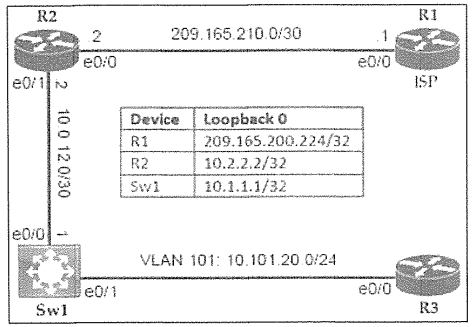

# PAT, NTP & DHCP Relay



| Device | Loopback 0 |
| :--- | :--- |
| R1 | 209.165.200.224/32 |
| R2 | 10.2.2.2/32 |
| Sw1 | 10.1.1.1/32 |

- VLAN 101: 10.101.20.0/24

### タスク

#### タスク1
- R2 に PAT を構成し、10.0.12.1 の通信を e0/0 のパブリックな IP アドレスに変換します。
- Sw1から209.165.200.224へのpingを使用して、R2での変換が成功していることを確認します。
- *解説: 10.0.12.1 = 図のとおり Sw1 e0/0のIPアドレス。パブリックな IP アドレス = グローバルIPアドレス。*

<details>
<summary>タスク1の解答・解説を確認する</summary>

```
R2(config)#int e0/0
R2(config-if)#ip nat outside
R2(config-if)#int e0/1
R2(config-if)#ip nat inside
R2(config-if)#exit
R2(config)#access-list 1 permit 10.0.12.1 0.0.0.0
R2(config)#ip nat inside source list 1 interface e0/0 overload
```
* 問題文「10.0.12.1 の通信を」→ そのホストだけ → 0.0.0.0

**確認 (Sw1)**
```
Sw1#ping 209.165.200.224
...
Success rate is 60 percent (3/5)
```
</details>

#### タスク2
R2 e0/1 に構成されたNTPサーバーを使用して、SW1にNTPクライアントを構成します。
ntp broadcast clientまたはntp broadcastコマンドは使用しないでください。

<details>
<summary>タスク2の解答・解説を確認する</summary>

```
Sw1(config)#ntp server 10.0.12.2
```
**セルフチェック (任意)**
```
Sw1#show ntp status
Clock is synchronized, stratum 16, reference is 10.0.12.2
```
</details>

#### タスク3
SW1 の VLAN101 インターフェースで R2 e0/1 に DHCP 要求を転送するよう DHCP リレーエージェントを設定します。

<details>
<summary>タスク3の解答・解説を確認する</summary>

```
Sw1(config)#interface vlan 101
Sw1(config-if)#ip helper-address 10.0.12.2
```
**セルフチェック (任意)**
```
R3#show ip interface brief
Interface    IP-Address    OK?  Method Status Protocol
Ethernet0/0  10.101.20.3   YES  DHCP   up     up
```
* R3 の E0/0 は DHCP(サーバー)によって、10.101.20.3 が設定されている
</details>

#### タスク4
SW1のVTYライン0から4にSSHサーバーを設定します。
- 2048ビットRSAキーとSSHバージョン2を使用します。

<details>
<summary>タスク4の解答・解説を確認する</summary>

```
hostname Sw1
ip domain-name abcxyz.com
crypto key generate rsa modulus 2048
ip ssh version 2

username admin privilege 15 secret StrongPass!

line vty 0 4
 login local
 transport input ssh
```
</details>

#### 設定の保存
<details>
<summary>設定の保存を確認する</summary>

```
R1, R2, R3#copy run start
```
</details>
