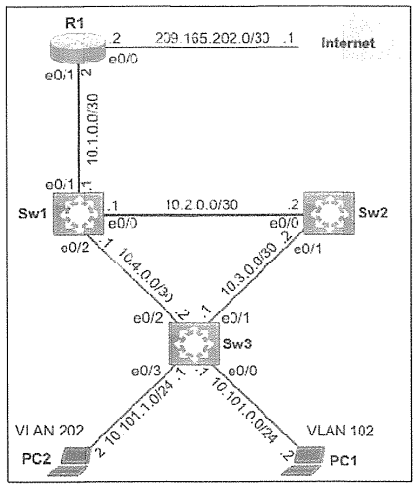

# NACL DHCP Snooping



### タスク

#### タスク1
最小限のACE数を使用して、拡張名前付きACLを設定し、トポロジ内に配置して、可能な限り多くのリソースを節約します。ACLの要件は次のとおりです。
- ACL名 = WWW_ACL
- VLAN 202からのHTTPトラフィックのみを許可
- PC1のTelnetのみをブロック
- その他のトラフィックはすべて許可

<details>
<summary>タスク1の解答・解説を確認する</summary>

```
R1(config)#ip access-list extended WWW_ACL
R1(config-ext-nacl)#permit tcp 10.101.1.0 0.0.0.255 any eq www  //VLAN202
R1(config-ext-nacl)#deny tcp any any eq www
R1(config-ext-nacl)#deny tcp host 10.101.0.2 any eq telnet  //PC1
R1(config-ext-nacl)#permit ip any any
R1(config-ext-nacl)#exit
R1(config)#interface e0/1
R1(config-if)#ip access-group WWW_ACL in
```
**解説・注意点**
* permit ip : ipはtcpやudpなどを含んでいます。プロトコル単位ではなく、すべての通信を許可/拒否したいときに使用します。
* e0/1 の in (入ってくるもの) に対してACLを設定している

**セルフチェック (任意)**
```
PC1
C:\>telnet 10.1.0.2
Trying 10.1.0.2 ...
% Connection timed out; remote host not responding
* R1宛てのtelnetは不通となる

R1#show ip access-lists
Extended IP access list WWW_ACL
    10 permit tcp 10.101.1.0 0.0.0.255 any eq www
    20 deny tcp any any eq www
    30 deny tcp host 10.101.0.2 any eq telnet
    40 permit ip any any
```
</details>

#### タスク2
Sw2に、仮想ポート0~4でTelnetアクセスを許可するローカルアカウントを設定します。
- ユーザー名: AdminGroup
- パスワード: BumBL3d
- アルゴリズムの種類: Scrypt
- 権限レベル: Execモード

<details>
<summary>タスク2の解答・解説を確認する</summary>

```
Sw2(config)#username AdminGroup privilege 15 algorithm-type scrypt secret BumBL3d
Sw2(config)#line vty 0 4
Sw2(config-line)#transport input telnet
Sw2(config-line)#login local
```
* 構文 algorithm-type [ md5 | scrypt | sha256 ] secret password
</details>

#### タスク3
Sw3を以下のとおり構成する。
- VLAN 102および202のDHCPスヌーピングを有効にする
- DHCPスヌーピングのMACアドレス検証を有効にする

<details>
<summary>タスク3の解答・解説を確認する</summary>

```
Sw3(config)#ip dhcp snooping
Sw3(config)#ip dhcp snooping vlan 102,202
Sw3(config)#ip dhcp snooping verify mac-address
```
* クライアントからのDHCPメッセージ内のMACアドレスを検証し、詐称を防ぐ
</details>

#### 設定の保存
<details>
<summary>設定の保存を確認する</summary>

```
R1,Sw2,Sw3 #copy run start
```
</details>
