# 環境構築

早速学習を進めるための環境を構築します。  
想定する開発環境は以下の通りです。

|項目|バージョン|
|---|---|
|OS|windows11|
|JDK|Amazon Corretto 17|
|VSCode|最新|

<details>
    <summary>1. JDKインストール</summary>
    <div>

## JDK（Java Development Kit）とは
JDKはJavaのプログラムを開発するための「道具一式セット」です。

JDKには、主に以下の3つの要素が含まれています。

|項目|説明|
|---|---|
|**コンパイラ**（javac）|あなたが書いた人間が読めるJavaのソースコード（.javaファイル）を、コンピューターが理解できるバイトコード（.classファイル）に翻訳する道具です。|
|**JRE**（Java Runtime Environment）|コンパイラが翻訳したバイトコードを実行するための環境です。これがないと、作ったプログラムを動かすことができません。JREには、JVM（Java Virtual Machine）や、プログラムを動かすために必要な標準ライブラリが含まれています。|
|**各種ツール**|他にも、プログラムをデバッグするためのツールや、ドキュメントを作成するためのツールなど、開発を助ける様々な便利な道具が入っています。|

Javaの開発者は、プログラムを作るために必ずJDKをインストールする必要があります。  
対してプログラムを実行するだけのユーザーは、JDKに含まれているJREさえあれば事足ります。

## インストーラのダウンロード

以下のリンクからAWS公式のダウンロードページにアクセスして下さい  

- [公式ダウンロードページ](https://docs.aws.amazon.com/corretto/latest/corretto-17-ug/downloads-list.html)

*Platform*：Windows x64  
*Type*：JDK  
*Download Link*：https://corretto.aws/downloads/latest/amazon-corretto-17-x64-windows-jdk.msi

上記のmsiファイル(インストーラ)をダウンロードし、実行して下さい

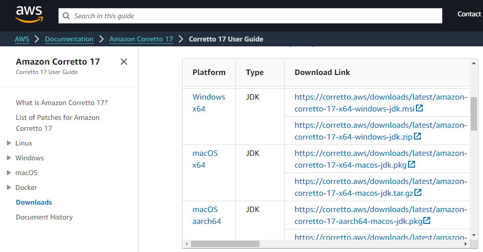

## インストーラ起動

インストーラを実行すると以下の画面が表示されるので `Next` をクリック

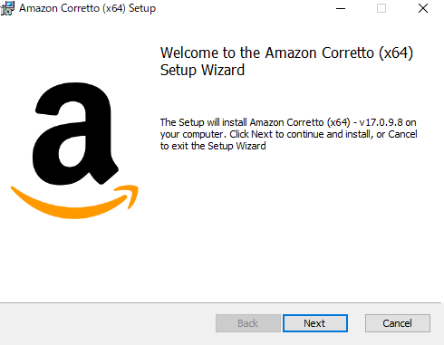

特に変更はせず `Next` をクリック


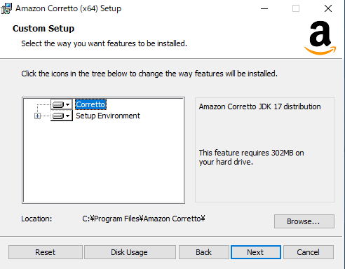

`Install` をクリック  
Amazon Correttoの場合、インストール時に勝手にパスが通ります

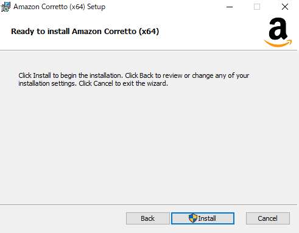

インストールが完了すると以下の画面が表示されるので `Finish` をクリックして画面を閉じます

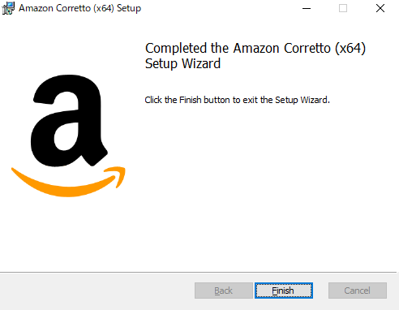

コマンドプロンプトを起動し、  
`java -version` を実行してJDKのバージョンが表示されることを確認して下さい

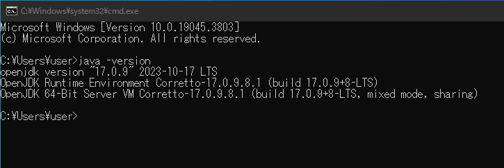

以上でJavaのインストールは完了です

    </div>
</details>


<details>
    <summary>2. VSCode(エディタ)インストール</summary>
    <div>
## エディタとは

プログラミングにおけるエディタは、ソースコードを書くためのソフトウェアです。  
これはメモ帳やワードのような文章作成ソフトと似ていますが、プログラミングに特化した便利な機能が多数備わっています。

### 主な機能

|項目|説明|
|---|---|
|**シンタックスハイライト** |プログラミング言語の構文（キーワード、変数、コメントなど）を色分けして表示し、コードを読みやすくします。|
|**自動補完**|入力中のコードを予測して候補を表示し、入力の手間を省き、タイピングミスを減らします。|
|**インデント**|コードの階層構造を自動で調整し、視認性を高めます。|

## VSCodeとは

VSCode（Visual Studio Code）は、多くのプログラマーに利用されている高機能なエディタです。  
「統合開発環境（IDE）」に匹敵する多機能さを持ちながら、動作が軽く、シンプルで使いやすいのが特徴です。

### 主な特徴

|項目|説明|
|---|---|
|**軽量で高速**|起動が速く、動作も軽快なため、ストレスなく開発ができます。|
|**豊富な拡張機能**|様々なプログラミング言語やフレームワークに対応した拡張機能が多数公開されており、必要な機能を自由に追加できます。これにより、デバッグ機能やGit連携なども簡単に導入できます。|
|**統合ターミナル**|エディタ内でコマンドラインを実行できるため、アプリケーションの実行やビルド、Gitコマンドの操作などがシームレスに行えます。|
|**Git連携**|拡張機能を使わずとも、標準でGitとの連携機能が組み込まれており、バージョン管理が簡単に行えます。|

## インストーラのダウンロード

以下のリンクからvscode公式のダウンロードページにアクセスし、インストーラをダウンロードして下さい  

- [公式ダウンロードページ *https://code.visualstudio.com/*](https://code.visualstudio.com/)

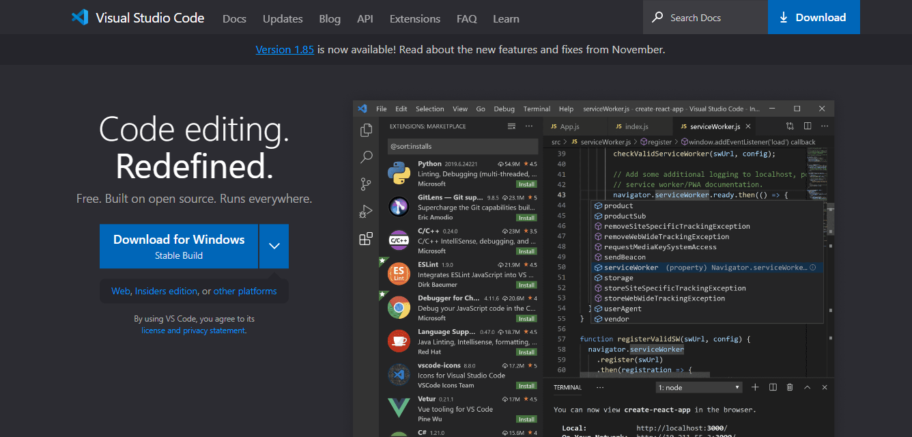

## インストーラ起動
インストーラを実行すると以下の画面が表示されるので  
利用規約に同意し、 `次へ` をクリック

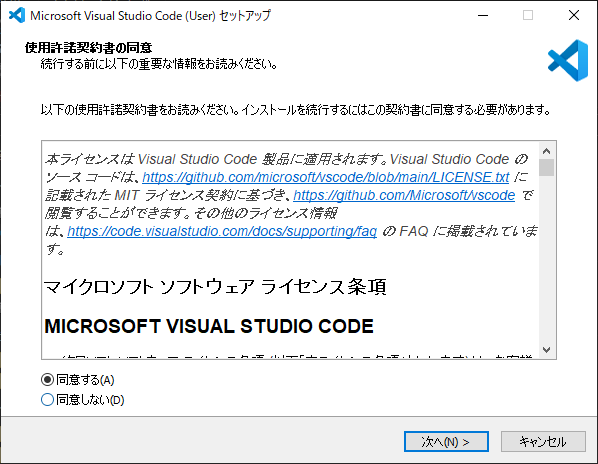

特に変更はせず `次へ` をクリック

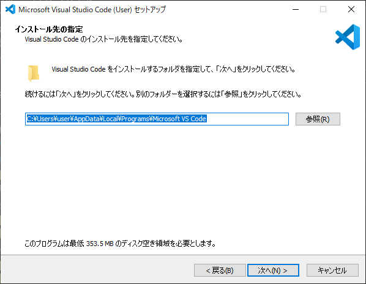

特に変更はせず `次へ` をクリック

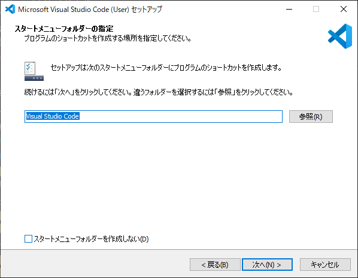

特に変更はせず `次へ` をクリック

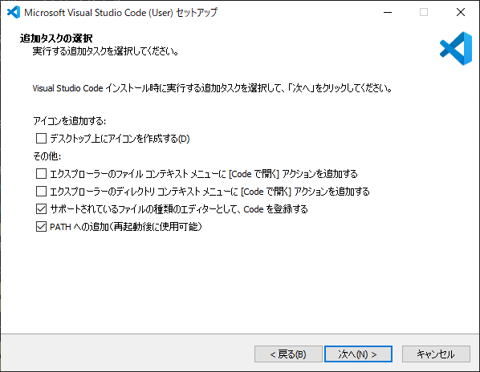

`インストール` をクリック

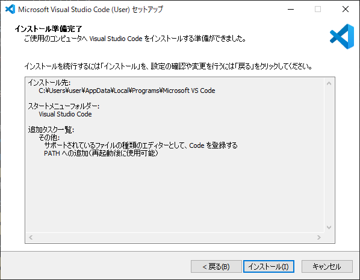

`完了` をクリック

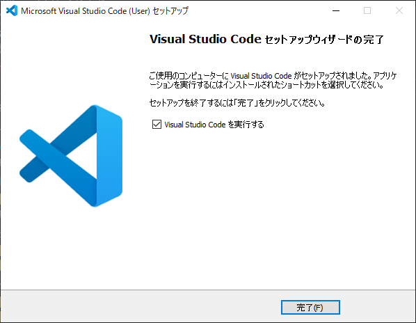

以下の画面が表示されたら正常にインストールされています

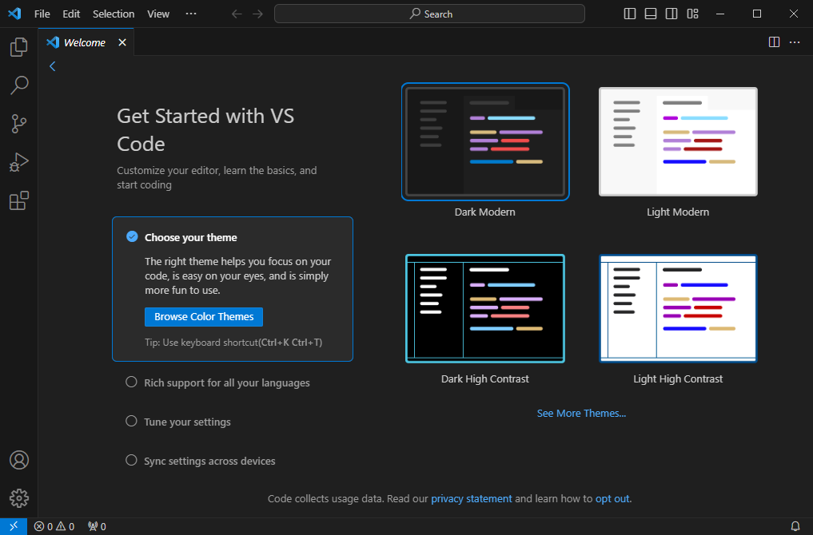

以上でVSCodeのインストールは完了です

    </div>
</details>


<details>
    <summary>3. 動作確認</summary>
    <div>

## ワークスペース作成

以下のように任意のパスに`workspace`フォルダを作成しましょう  

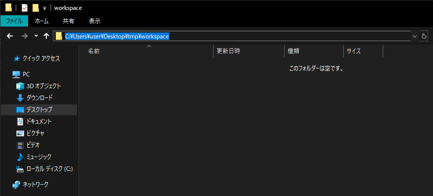

## VSCode起動

:::danger
Jdkのパスが読み込まれず、後の手順で詰まる可能性があるためVSCodeを一度再起動して下さい
:::

左上メニューの `File` > `Open Folder` をクリックし、  
先程作成した `workspace` フォルダを選択して下さい  

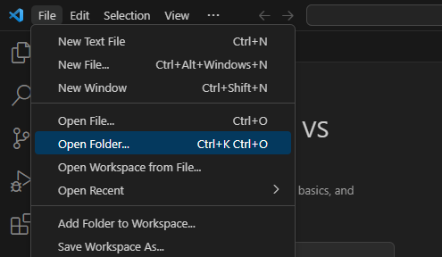

以下の画面が表示された場合は `Yes, I trust the authors` をクリックします  

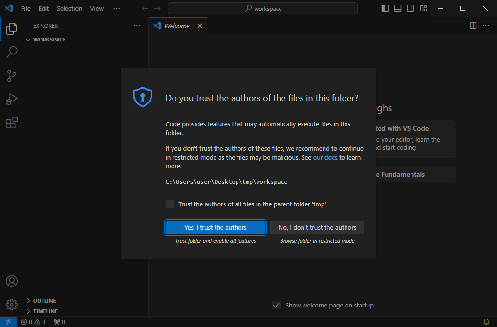

左上にフォルダが表示されます(プロジェクトエクスプローラ)  
フォルダ名右の**ファイルアイコン**をクリックし、 `Test.java` というファイルを作成して下さい

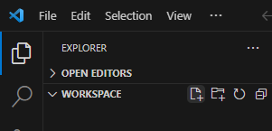

以下の様に画面右側に先程作成した `Test.java` が表示されます  


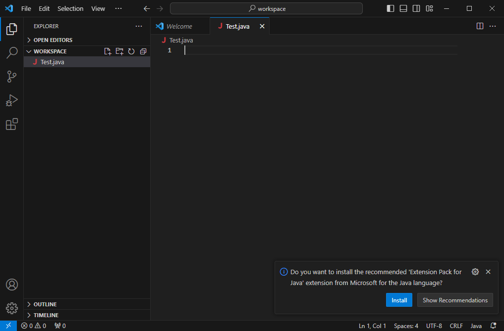

下の画像の通りに `Test.java`の内容を編集し、上書き保存をしてください

```Java showLineNumbers
class Test{
    public static void main(String[] args){
        System.out.println("Hello World!!");
    }
}
```

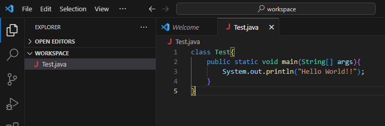

上部メニューの **Terminal** > **New Terminal** をクリックし  
下部にターミナル(powershell)を表示します

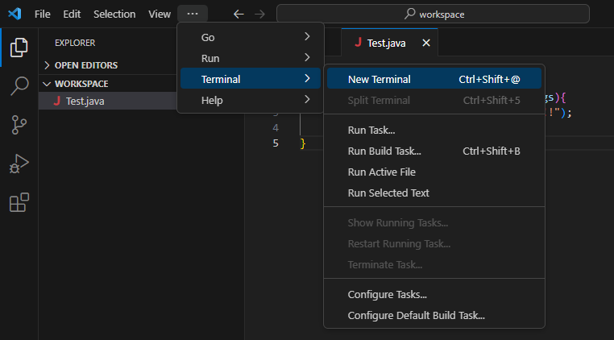

## コンパイル

ターミナルに `javac ./Test.java` と入力し、エンターキーを押して下さい  
何も表示されなければコンパイル成功です

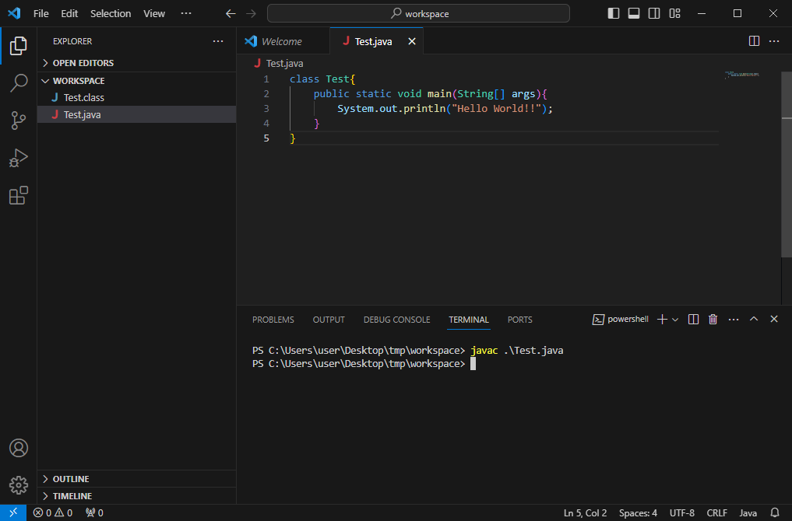

:::tip
## ターミナルについて
PCを操作する場合、多くの人はキーボードとマウスを使用するかと思います  
しかしコンピュータが誕生してからしばらくの間、「マウスのカーソルを動かしてクリックする」という概念すらなく、  
当時の人はキーボードだけでコンピュータを操作していた、という歴史があります  
その時に使用していたのが **「ターミナル」 「コンソール」 「CLI」** 等と呼ばれるコマンドを入力するためのインターフェースです  
皆さんが使用しているWindowsPCも理論的には「コマンドプロンプト」や「powershell」  
というアプリケーションを使用し、コマンドだけで操作することが可能です  


上記の `javac ./Test.java` の説明は以下の通りです  
|コマンド|引数|
|-------|----|
|Javac|./Test.java|

- **コマンド**  
意味的には「どうする」に当たります  
`javac` というのは「javaファイルをコンパイルする」という機能を持つコマンドです

- **引数**  
意味的には「何を」に当たります  
`./Test.java` はファイル名を表しています  
`./` これは「同じ階層」のという意味を持ちます(カレントディレクトリとも言う)

左側の `C:\ws2\sourus\eightbit-saurus>` のような表示は、自分がいる現在のパス(場所)を表します  
Windwosの場合は「エクスプローラ」の概念と同一です  

:::

## 実行

同じくターミナルに `java Test` と入力し、エンターキーを押して下さい  
`Hello World!!` と表示されればプログラムは実行されています

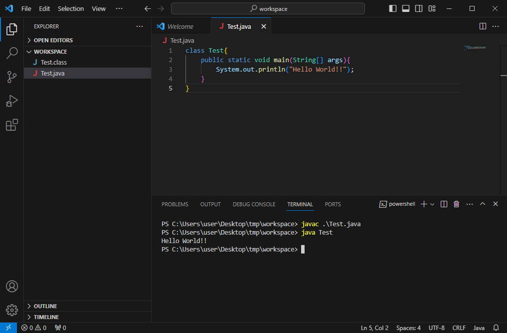


:::tip

## 文字コードの違いによるコンパイルエラー

例えば以下の様に出力文字列部分を日本語のひらがなに変更してコンパイルする場合

```Java showLineNumbers
class Test{
    public static void main(String[] args){
        System.out.println("こんにちは!!");
    }
}
```

コンパイル時に以下のようなエラーが発生します  
`この文字は、エンコーディング~にマップできません`


これはjavaファイルが **UTF-8** という文字コードで保存されていることに起因します  
VSCode右下の **UTF-8** という表示がそれに当たります  

#### 対策1. コンパイル時にオプションを付与する

対策としては以下のようにコンパイル時にオプションをつけることで回避できます
```powershell
javac -encoding UTF-8 ./Test.java
```

#### 対策2. ファイルの文字コードを変更する
上記のエラーはファイルの文字コードとwindowsデフォルトの文字コードの違いによって発生します  
windows標準文字コードは **Shift-JIS** です  
ということは現状 **UTF-8** で保存されているファイルを **Shift-JIS** として保存してあげれば同じ様にこのコンパイルエラーを回避することができます  


:::

    </div>
</details>