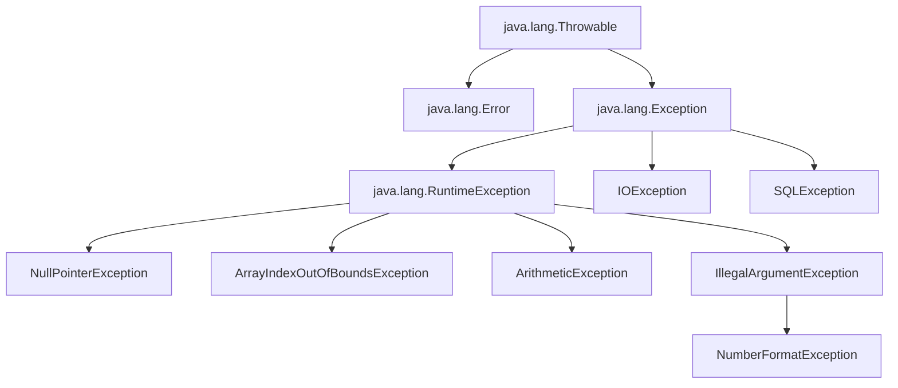

# 例外処理
---

### 1. 例外処理とは

プログラムは、予期せぬ問題（エラー）に直面することがあります。  
例えば、ファイルが見つからない、ネットワーク接続が切れた、数値ではない文字列を数値に変換しようとした、などです。    
このような問題が発生した場合、プログラムが突然停止（クラッシュ）してしまうと、ユーザー体験が悪化したり、データが破損したりする可能性があります。  

**例外処理 (Exception Handling)** とは、プログラムの実行中に発生するこれらの「予期せぬ事態」を適切に検知し、安全に回復したり、ユーザーに分かりやすく通知したりするための仕組みです。  

:::tip
**例外処理の必要性**  
*   **プログラムの安定性向上:** クラッシュを防ぎ、継続的な実行を可能にする。  
*   **ユーザー体験の向上:** エラーメッセージを表示したり、代替処理を提供したりすることで、ユーザーを適切に誘導する。  
*   **デバッグの容易化:** エラーの原因と発生箇所を特定しやすくする。  
*   **堅牢なシステムの構築:** 予期せぬ入力や環境の変化にも対応できる。  
:::


---

### 2. 例外の基本的な種類と階層

Javaにおけるすべての例外は、`Throwable`クラスをルートとするクラス階層を形成しています。  



*   **`java.lang.Throwable`**:  
    Javaにおけるすべてのエラーと例外の基底クラスです。  
    このクラスは、スタックトレース情報を保持しており、エラーが発生した場所と原因を追跡するために利用されます。  
    :::info
        **スタックトレースとは**  

        プログラムがエラー（例外）で停止したときに表示される、エラー発生までの「足跡」を記録したリストのことです。

        **具体的な見方**

        Javaでエラーが発生すると、通常以下のようなスタックトレースが表示されます。
            ```
        Exception in thread "main" java.lang.ArithmeticException: / by zero
            at com.example.MyClass.divide(MyClass.java:10)
            at com.example.MyClass.calculate(MyClass.java:6)
            at com.example.Main.main(Main.java:3)
            ```
        このリストは、一番上がエラーの直接的な原因で、一番下がプログラムの開始地点（mainメソッド）になります。
    :::

*   **`java.lang.Error`**:  
    JVM自身に問題がある場合（メモリ不足 `OutOfMemoryError`、スタックオーバーフロー `StackOverflowError` など）に発生します。  
    これらは通常、アプリケーションが回復できるものではなく、開発者が直接処理すべきではありません。  
    JVMやシステムレベルの深刻な問題を示唆しており、アプリケーションを終了してシステム全体をチェックする必要がある場合が多いです。  

*   **`java.lang.Exception`**:  
    アプリケーションレベルで発生するエラーや、回復可能な問題を表します。  
    大きく分けて以下の2種類があります。  

    1.  **検査例外 (Checked Exception)**  
        *   `Exception`クラスの直接の子孫（`RuntimeException`を除く）や、その子孫クラスです。  
        *   例: `IOException`, `SQLException`, `ClassNotFoundException` など。  
        *   **特徴**:   
        **コンパイル時にチェックされます**。  
        メソッドが検査例外を発生させる可能性がある場合、そのメソッドは `throws` キーワードを使ってその例外を宣言するか、`try-catch` ブロックでその例外を捕捉・処理する**必要があります**。  
        これを行わないとコンパイルエラーになります。  
        *   **設計意図**:  
        呼び出し元がその問題を回復できる可能性があり、かつ、開発者がその問題の発生を意識して対処すべき場合に用います。  
        例えば、ファイルが見つからない、ネットワーク接続に失敗する、データベースへの接続ができないなど、外部要因による予期される問題で、プログラム側で代替処理や再試行などの回復策が考えられるケースに適しています。  

    2.  **非検査例外 (Unchecked Exception)**  
        *   `RuntimeException`クラス、またはその子孫クラスです。  
        *   例: `NullPointerException`, `ArrayIndexOutOfBoundsException`, `ArithmeticException`, `IllegalArgumentException` など。  
        *   **特徴**:  
        **コンパイル時にはチェックされません**。  
        発生する可能性があっても、`throws` 宣言や `try-catch` ブロックでの捕捉は**必須ではありません**。  
        多くの場合、これらはプログラミングミス（バグ）によって発生するため、修正すべきものです。  
        *   **設計意図**:  
        プログラミングミスによって発生する可能性が高く、ほとんどの場合、呼び出し元が回復処理を試みるべきではない場合に用います。  
        例えば、`NullPointerException`は`null`チェック忘れというバグであり、`try-catch`でごまかすのではなく、`null`にならないようにコードを修正すべきです。  
        このような例外は、通常、バグ修正によって取り除くべきものです。  

**検査例外と非検査例外の比較**  

| 特徴           | 検査例外 (Checked Exception)                       | 非検査例外 (Unchecked Exception)                   |
| :------------- | :------------------------------------------------- | :------------------------------------------------- |
| **クラス階層**   | `Exception`の子孫（`RuntimeException`以外）          | `RuntimeException`の子孫                            |
| **チェック時期** | コンパイル時                                       | 実行時                                             |
| **処理の強制** | 必須（`try-catch` または `throws` 宣言）          | 任意（通常は処理しない、バグとして修正）          |
| **典型的な原因** | 外部要因（I/Oエラー、ネットワーク問題、SQLエラーなど） | プログラミングミス（`null`参照、配列範囲外アクセスなど） |
| **回復可能性**   | 回復処理を試みることが可能                         | 通常は回復不可能、バグ修正が必要                   |
| **例**         | `IOException`, `SQLException`, `InterruptedException` | `NullPointerException`, `ArrayIndexOutOfBoundsException`, `ArithmeticException` |

---

### 3. 基本的な例外処理構文: `try-catch-finally`

例外処理の基本は `try-catch-finally` ブロックです。  

*   **`try`ブロック**:  
    例外が発生する可能性のあるコードを記述します。  
    このブロック内のコードは、実行中に例外が発生すると、残りの処理を中断し、適切な`catch`ブロックに制御を移します。  

*   **`catch`ブロック**:  
    `try`ブロック内で発生した特定の種類の例外を捕捉し、その例外に対する処理を記述します。  
    `catch (ExceptionType e)` の形式で、捕捉したい例外の型と、捕捉した例外オブジェクトの変数名を指定します。  
    捕捉された例外オブジェクト `e` には、例外の種類、エラーメッセージ、スタックトレースなどの情報が含まれています。  
    複数の`catch`ブロックを記述することも可能で、その場合はより具体的な例外（子クラス）から記述し、より一般的な例外（親クラス）を後に記述する必要があります。  
    （詳細は「5. 複数の`catch`ブロックとマルチキャッチ」で後述します）。  

*   **`finally`ブロック**:  
    `try`ブロックの終了後（例外が発生したかどうかにかかわらず、また`catch`ブロックが実行されたかどうかにかかわらず）、常に実行されるコードを記述します。  
    主に、ファイルやネットワーク接続などのリソースを確実に解放するために使用されます。  
    これにより、例外が発生してもリソースが閉じられずにリークする（漏洩する）のを防ぎます。  
    `finally`ブロック内のコードは、`try`ブロック内で`return`文が実行された場合でも、その`return`の直前に実行されます。  

**コードスニペット:**  
`demonstrateBasicExceptionHandling()` メソッド  
```java showLineNumbers
    /**
     * 1. 基本的な例外処理 (try-catch-finally) のデモンストレーション
     */
    private static void demonstrateBasicExceptionHandling() {
        System.out.println("1. 基本的な例外処理 (try-catch-finally)");

        Scanner scanner = null; // finallyブロックで確実にクローズするためにtryの外で宣言
        try {
            // 例外が発生する可能性のあるコード
            scanner = new Scanner(System.in);
            System.out.print("0以外の整数を入力してください: ");
            int numerator = 100;
            int denominator = scanner.nextInt(); // InputMismatchExceptionの可能性

            int result = numerator / denominator; // ArithmeticExceptionの可能性
            System.out.println("結果: " + result);

        } catch (InputMismatchException e) {
            // 入力タイプが不一致の場合に捕捉
            System.err.println("エラー: 無効な入力です。整数を入力してください。");
            // e.printStackTrace(); // 開発時やデバッグ時に詳細なスタックトレースを表示
        } catch (ArithmeticException e) {
            // 0による除算の場合に捕捉
            System.err.println("エラー: 0で割ることはできません。");
            // e.printStackTrace();
        } catch (Exception e) { // その他の予期せぬ例外を捕捉（より汎用的な例外は最後に）
            System.err.println("予期せぬエラーが発生しました: " + e.getMessage());
            // e.printStackTrace();
        } finally {
            // 例外の有無にかかわらず、必ず実行されるコード
            System.out.println("finallyブロックが実行されました。リソースをクローズします。");
            if (scanner != null) {
                scanner.close(); // Scannerリソースを解放
            }
        }
        System.out.println("例外処理ブロックを抜けました。");
    }
```

**解説:**  
1.  **`Scanner scanner = null;`**: `finally`ブロックで`scanner.close()`を呼び出すために、`try`ブロックの外で`Scanner`オブジェクトを宣言し、初期化しています。  
これにより、`try`ブロック内で`scanner`が正常に初期化されなかった場合でも（例えば`new Scanner`の途中で例外が発生した場合など）、`finally`ブロックから`scanner`変数にアクセスできます。  
2.  **`try { ... }`**: ここに例外が発生する可能性のあるコードを記述します。  
    *   `scanner.nextInt();`: ユーザーが整数以外の文字列を入力した場合、`InputMismatchException`（非検査例外）が発生します。  
    *   `int result = numerator / denominator;`: ユーザーが`0`を入力した場合、`ArithmeticException`（非検査例外、0による除算）が発生します。  
3.  **`catch (InputMismatchException e)`**: `InputMismatchException`が発生した場合に捕捉されます。  
具体的なエラーメッセージをユーザーに表示します。  
4.  **`catch (ArithmeticException e)`**: `ArithmeticException`が発生した場合に捕捉されます。  
具体的なエラーメッセージをユーザーに表示します。  
5.  **`catch (Exception e)`**: これまでに挙げた特定の例外以外の、すべての`Exception`型の例外を捕捉します。  
このブロックは、より汎用的な例外を捕捉するため、必ず**最後に記述**します。  
そうしないと、この`catch`ブロックが先に捕捉してしまい、より具体的な`catch`ブロックが実行されなくなります。  
`e.getMessage()`は、例外に付随する簡潔なエラーメッセージを取得します。  
`e.printStackTrace()`は、例外が発生したメソッドの呼び出し履歴（スタックトレース）を標準エラー出力に表示します。  
これはデバッグ時に非常に有用ですが、本番環境で常に表示させるのは情報量が多く、セキュリティ上の懸念もあるため、ロギングフレームワークなどと組み合わせて利用することが推奨されます。  
6.  **`finally { ... }`**: このブロックは、`try`ブロック内のコードが正常に完了したか、例外が発生して`catch`ブロックが実行されたか、いずれの場合でも**必ず実行されます**。  
    *   `if (scanner != null) { scanner.close(); }`: ここで`Scanner`リソースを閉じ、システムリソースのリークを防ぎます。  
    `scanner`が`null`でないことをチェックするのは、`new Scanner(System.in)`の初期化中に例外が発生して`scanner`が`null`のままになった場合でも、`NullPointerException`が発生しないようにするためです。  

---

### 4. `throws` キーワード

`throws` キーワードは、メソッドのシグネチャ（定義）の一部として使用され、そのメソッドが特定の**検査例外**を発生させる可能性があることを宣言します。  
これにより、そのメソッドを呼び出す側は、宣言された例外を`try-catch`ブロックで処理するか、あるいはさらに上位の呼び出し元に`throws`で例外の処理を委譲する（投げっぱなしにする）かの選択を強制されます。  

**コードスニペット:**  
`demonstrateThrowsKeyword()` および `checkFileExistenceWithThrows()` メソッド  
```java showLineNumbers
    /**
     * 3. `throws` キーワードのデモンストレーション
     */
    private static void demonstrateThrowsKeyword() {
        System.out.println("3. `throws` キーワード");
        // このメソッドは、checkFileExistenceWithThrowsがスローするIOExceptionを処理する責任がある
        try {
            checkFileExistenceWithThrows("dummy_file.txt");
            System.out.println("ファイル処理が成功しました。");
        } catch (IOException e) {
            System.err.println("mainメソッドで`IOException`を捕捉しました: " + e.getMessage());
        }
    }

    // このメソッドはIOExceptionが発生する可能性があることを宣言している
    private static void checkFileExistenceWithThrows(String filePath) throws IOException {
        System.out.println("`checkFileExistenceWithThrows`メソッドが実行されました。");
        // 実際にはファイルシステムを操作しないダミー処理だが、コンパイルエラーを避けるためIOExceptionをスロー
        if (filePath.contains("dummy")) {
            // 通常は new FileReader(filePath) などで発生
            throw new IOException("ダミーファイルは存在しません: " + filePath);
        }
        System.out.println("ファイル '" + filePath + "' が見つかりました (ダミー)。");
    }
```

**解説:**  
1.  **`private static void checkFileExistenceWithThrows(String filePath) throws IOException { ... }`**:  
    このメソッドのシグネチャに`throws IOException`が追加されています。  これは「この`checkFileExistenceWithThrows`メソッドは、実行中に`IOException`を発生させる可能性がありますよ」ということを明示的に宣言しています。  
    メソッド内で`throw new IOException(...)`のように`IOException`を明示的にスローしているため、`throws`宣言がないとコンパイルエラーになります。  
2.  **`demonstrateThrowsKeyword()` メソッド内**:  
    `checkFileExistenceWithThrows`メソッドを呼び出しています。  `checkFileExistenceWithThrows`が`IOException`を`throws`宣言しているため、`demonstrateThrowsKeyword`メソッドは、その`IOException`を`try-catch`ブロックで捕捉して処理するか、あるいは自身も`throws IOException`と宣言して、さらに上位の呼び出し元に処理を委譲するかのどちらかを選択しなければなりません。  
    ここでは`try-catch`で捕捉して、エラーメッセージを表示しています。  

**`throws`を使うべきか、`try-catch`を使うべきか？**  
*   **`throws`を使うべき場合**:  
    *   メソッドの呼び出し元が、その例外から回復するための適切な情報や手段を持っている場合。  
    *   メソッド自身が例外を完全に処理できない、または処理すべきでない場合。  
    *   ライブラリやフレームワークのAPIを設計する際に、利用者に特定のエラー処理を強制したい場合。  
*   **`try-catch`を使うべき場合**:  
    *   現在のメソッド内で例外を適切に処理し、回復させることができる場合。  
    *   例外が発生しても、プログラムの実行を継続させたい場合。  
    *   呼び出し元に例外の処理を強制したくない場合（非検査例外の場合など）。  

---

### 5. 複数の `catch` ブロックとマルチキャッチ

`try`ブロック内で複数の異なる種類の例外が発生する可能性がある場合、それぞれの例外に対応するために複数の`catch`ブロックを連ねて記述できます。  

**`catch`ブロックの順序の重要性:**  
複数の`catch`ブロックを記述する際は、その順序に注意が必要です。  
Javaの例外処理は、`catch`ブロックを上から順に評価し、最初に一致した例外型のブロックが実行されます。  
したがって、より具体的な例外型（サブクラス）を先に記述し、より一般的な例外型（スーパークラス）を後に記述する必要があります。  
もし汎用的な`Exception`を最初に記述してしまうと、すべての例外がそのブロックで捕捉されてしまい、以降の具体的な`catch`ブロックが unreachable code（到達不能なコード）となり、コンパイルエラーになります。  

**マルチキャッチ (Multi-catch) - Java 7以降:**  
Java 7から導入されたマルチキャッチ機能は、同じ処理を行う複数の異なる例外を1つの`catch`ブロックでまとめて捕捉することを可能にします。  
これにより、コードの重複を減らし、可読性を向上させることができます。  
複数の例外型をパイプ記号 `|` で区切って指定します。  

**コードスニペット:**  
`demonstrateMultipleCatchBlocks()` メソッド  
```java showLineNumbers
    /**
     * 4. 複数の `catch` ブロックとマルチキャッチ
     */
    private static void demonstrateMultipleCatchBlocks() {
        System.out.println("4. 複数の `catch` ブロックとマルチキャッチ");

        // 例1: 複数のcatchブロック（一般的な例外は最後に）
        try {
            String strNum = "abc";
            int num = Integer.parseInt(strNum); // NumberFormatException
            System.out.println("変換された数値: " + num);

            int result = 10 / 0; // ArithmeticException
            System.out.println("結果: " + result);

        } catch (NumberFormatException e) {
            System.err.println("エラー: 数値変換に失敗しました: " + e.getMessage());
        } catch (ArithmeticException e) {
            System.err.println("エラー: 算術演算エラー（0による除算）: " + e.getMessage());
        } catch (Exception e) { // その他すべての例外を捕捉する汎用的なcatch（常に最後に）
            System.err.println("予期せぬエラーが発生しました: " + e.getMessage());
        }

        System.out.println("\n--- マルチキャッチ (Java 7以降) ---");
        // 例2: マルチキャッチ (複数の例外を1つのcatchブロックで処理)
        try {
            Scanner scanner = new Scanner(System.in);
            System.out.print("整数を入力してください（または0で除算を試みる）: ");
            String input = scanner.nextLine();

            int number = Integer.parseInt(input); // NumberFormatException
            int divisionResult = 100 / number;   // ArithmeticException
            System.out.println("結果: " + divisionResult);
            scanner.close();

        } catch (NumberFormatException | ArithmeticException e) { // 複数の例外をパイプ(|)で区切って指定
            System.err.println("エラー: 数値のフォーマットまたは算術演算エラーが発生しました: " + e.getMessage());
            // e.printStackTrace(); // デバッグ時のみ
        } catch (Exception e) {
            System.err.println("その他の予期せぬエラー: " + e.getMessage());
        }
        System.out.println("マルチキャッチはコードの重複を減らし、簡潔にします。");
    }
```

**解説:**  
1.  **複数の`catch`ブロックの例**:  
    *   最初の`try`ブロックでは、`Integer.parseInt("abc")`によって`NumberFormatException`が発生します。  
    *   その場合、`catch (NumberFormatException e)`ブロックが実行され、エラーメッセージが出力されます。  `ArithmeticException`が発生する行は実行されません。  
    *   もし`Integer.parseInt`が成功し、その後の`10 / 0`で`ArithmeticException`が発生した場合は、`catch (ArithmeticException e)`ブロックが実行されます。  
    *   `catch (Exception e)`は、`NumberFormatException`や`ArithmeticException`以外の予期せぬ`Exception`を捕捉するためのもので、常に最後に配置されています。  

2.  **マルチキャッチの例**:  
    *   `catch (NumberFormatException | ArithmeticException e)` のように記述することで、`NumberFormatException`と`ArithmeticException`のどちらが発生しても、同じ`catch`ブロックで処理されます。  
    *   これにより、同じエラー処理ロジックを複数の`catch`ブロックに記述する重複を避けることができます。  
    *   マルチキャッチで指定する例外型は、互いに継承関係にない（兄弟関係にある）ものである必要があります。  例えば、`catch (IOException | FileNotFoundException e)`のように記述すると、`FileNotFoundException`は`IOException`の子クラスであるため、コンパイルエラーになります。  この場合は、親クラスである`IOException`のみを捕捉すれば十分です。  

---

### 6. `try-with-resources` (Java 7以降)

`try-with-resources`文は、ファイルやデータベース接続、ネットワークソケットなど、使用後に確実にクローズ（解放）する必要があるリソースを扱うための特別な`try`ブロックです。  
この構文を使用すると、リソースは`try`ブロックが終了したときに（正常終了でも例外発生でも）自動的にクローズされます。  
これにより、`finally`ブロックで手動で`close()`を呼び出す煩雑なコードが不要になり、リソースリーク（リソースの解放忘れ）を防ぎ、コードをより簡潔で安全にします。  

**条件:**  
`try-with-resources`で利用できるリソースは、`java.lang.AutoCloseable`インターフェース（またはその親インターフェースである`java.io.Closeable`）を実装しているクラスのインスタンスである必要があります。  
これらのインターフェースは、`close()`メソッドを定義しており、`try-with-resources`文はこのメソッドを自動的に呼び出します。  

**コードスニペット:**  
`demonstrateTryWithResources()` メソッド  
```java showLineNumbers
    /**
     * 5. `try-with-resources` (Java 7以降) のデモンストレーション
     */
    private static void demonstrateTryWithResources() {
        System.out.println("5. `try-with-resources` (Java 7以降)");

        // try-with-resources を使用しない場合（煩雑になりがち）
        FileReader readerLegacy = null;
        try {
            readerLegacy = new FileReader("README.md"); // 存在しないとFileNotFoundException
            int charRead;
            while ((charRead = readerLegacy.read()) != -1) {
                System.out.print((char) charRead);
            }
        } catch (IOException e) {
            System.err.println("\nエラー (try-finally): ファイル読み込みエラー: " + e.getMessage());
        } finally {
            if (readerLegacy != null) {
                try {
                    readerLegacy.close(); // クローズ処理も例外をスローする可能性
                } catch (IOException e) {
                    System.err.println("警告: ファイルクローズエラー (try-finally): " + e.getMessage());
                }
            }
        }
        System.out.println("\nファイル読み込み完了 (try-finally)");

        System.out.println("\n--- try-with-resources を使用する場合 ---");
        // try-with-resources を使用した場合（Java 7以降）
        // tryの括弧内に、AutoCloseableインターフェースを実装したリソースを記述する
        try (FileReader reader = new FileReader("README.md")) { // ここでリソースを宣言
            int charRead;
            while ((charRead = reader.read()) != -1) {
                System.out.print((char) charRead);
            }
        } catch (IOException e) {
            // リソースは自動的にクローズされるため、finallyブロックは不要
            System.err.println("\nエラー (try-with-resources): ファイル読み込みエラー: " + e.getMessage());
        }
        System.out.println("\nファイル読み込み完了 (try-with-resources)");
        System.out.println("`try-with-resources`は、リソースの自動的なクローズを保証し、コードを簡潔にします。");
        System.out.println("対象のリソースは`java.lang.AutoCloseable`インターフェースを実装している必要があります。");
    }
```

**解説:**  
1.  **`try-with-resources` を使用しない場合（従来の`try-finally`）**:  
    `FileReader`のインスタンスを`try`ブロックの外で宣言し、`finally`ブロック内で`null`チェックを行った上で`close()`を呼び出しています。  
    `close()`メソッド自体も`IOException`をスローする可能性があるため、さらに内側に`try-catch`ブロックが必要になります。  
    このように、リソースのクローズ処理だけでも多くのコードが必要となり、複雑になりがちです。  
2.  **`try-with-resources` を使用する場合**:  
    `try (FileReader reader = new FileReader("README.md"))` のように、`try`キーワードの直後の括弧内にリソースを宣言しています。  
    この記述により、`try`ブロックが正常に終了しても、例外が発生しても、Javaが自動的に`reader.close()`を呼び出してくれます。  
    これにより、複雑な`finally`ブロックが不要になり、コードが劇的に簡潔で読みやすくなります。  
    仮に`try`ブロック内で例外が発生し、さらに`reader.close()`でも例外が発生した場合、`try`ブロックで発生した元の例外が主要な例外となり、`close()`で発生した例外は「抑制された例外（Suppressed Exception）」として、元の例外に付加されます。  
    これにより、根本的な原因を見失うことなく、両方の例外情報を保持することができます。  

---

### 7. カスタム例外 (Custom Exceptions)

Javaでは、独自の例外クラスを定義することができます。  
これにより、アプリケーション固有のビジネスロジックエラーや、特定の状況下で発生するエラーを明確に表現できるようになります。  
カスタム例外は、標準のJava例外では適切に表現できないような、より意味のあるエラー情報を伝えるために非常に役立ちます。  

**作成方法:**  
既存の`Exception`クラスまたは`RuntimeException`クラスを継承して作成します。  

*   **検査例外として定義したい場合**: `java.lang.Exception`を継承します。  
    呼び出し元にその例外の処理を強制したい場合に適しています。  
*   **非検査例外として定義したい場合**: `java.lang.RuntimeException`を継承します。  
    プログラミングミスや、呼び出し元が回復処理を行うべきでないような、致命的なエラーを表したい場合に適しています。  

**コードスニペット:**  
`InvalidAgeException`, `InsufficientFundsException` クラス定義、および `demonstrateCustomExceptions()`, `validateAge()`, `performTransaction()` メソッド  
```java showLineNumbers
    /**
     * 6. カスタム例外 (Custom Exceptions) のデモンストレーション
     */
    private static void demonstrateCustomExceptions() {
        System.out.println("6. カスタム例外");

        try {
            validateAge(15);
            System.out.println("年齢は有効です。");
        } catch (InvalidAgeException e) { // カスタム検査例外を捕捉
            System.err.println("エラー: " + e.getMessage());
        }

        try {
            validateAge(-5); // 不正な年齢
            System.out.println("この行は実行されません。"); 
        } catch (InvalidAgeException e) {
            System.err.println("エラー: " + e.getMessage());
        }


        try {
            performTransaction(500, 1000); // 正常な場合
            System.out.println("取引が成功しました。");

            performTransaction(1200, 1000); // 不足の場合
            System.out.println("この行は実行されません。"); // ここは到達しない
        } catch (InsufficientFundsException e) { // カスタム非検査例外を捕捉
            System.err.println("エラー: " + e.getMessage() + " (残高: " + e.getCurrentBalance() + ")");
        }
    }

    // カスタム検査例外の定義
    static class InvalidAgeException extends Exception {
        public InvalidAgeException(String message) {
            super(message);
        }
    }

    // カスタム非検査例外の定義
    static class InsufficientFundsException extends RuntimeException {
        private final double currentBalance;

        public InsufficientFundsException(String message, double currentBalance) {
            super(message);
            this.currentBalance = currentBalance;
        }

        public double getCurrentBalance() {
            return currentBalance;
        }
    }

    // 検査例外をスローするメソッド
    private static void validateAge(int age) throws InvalidAgeException {
        if (age < 0 || age > 150) {
            throw new InvalidAgeException("年齢 (" + age + ") が無効です。0〜150の範囲で入力してください。");
        }
    }

    // 非検査例外をスローするメソッド
    private static void performTransaction(double amount, double balance) {
        if (amount > balance) {
            throw new InsufficientFundsException("残高不足です。取引額: " + amount, balance);
        }
        System.out.println("取引額 " + amount + " を処理しました。");
    }
```

**解説:**  
1.  **`InvalidAgeException` (カスタム検査例外)**:  
    `Exception`を継承しています。  
    これは、`validateAge`メソッドが不正な年齢を受け取った場合に、呼び出し元にその問題を認識させ、処理を強制するためです。  
    `validateAge`メソッドのシグネチャには`throws InvalidAgeException`が宣言されており、呼び出し元では`try-catch`ブロックでの捕捉が必須となります。  
2.  **`InsufficientFundsException` (カスタム非検査例外)**:  
    `RuntimeException`を継承しています。  これは、`performTransaction`メソッドで残高不足が発生した場合に、プログラミングミス（例えば、残高チェックを忘れた）や、通常は回復を試みるべきでない状況を表すためです。  
    この例外は非検査例外であるため、`performTransaction`メソッドのシグネチャに`throws InsufficientFundsException`を宣言する必要はありませんし、呼び出し元での`try-catch`も必須ではありません。  
    ただし、この例では`catch`ブロックで捕捉して、エラーメッセージと追加情報（残高）を表示しています。  
    このカスタム例外は、単なるメッセージだけでなく、`currentBalance`という追加情報を保持している点が重要です。  
    これにより、例外を捕捉した側は、より詳細な情報に基づいて適切な対処を行うことができます。  

カスタム例外はドメイン固有のエラーをモデル化し、アプリケーションの堅牢性と保守性を向上させるための強力なツールです。  

---

### 8. 例外の連鎖 (Chaining) と再スロー (Rethrowing)

**例外の連鎖 (Exception Chaining)**  
例外の連鎖とは、ある例外が発生したときに、それを原因として別の新しい例外をスローする（ラップする）ことです。  
このとき、新しい例外のコンストラクタに元の例外（原因となる例外、"cause"）を渡すことで、両方の例外の情報を保持し、根本的な原因を追跡できるようにします。  
これは、下位レベルで発生した具体的な例外（例: `IOException`, `SQLException`）を、より上位のビジネスロジックやアプリケーション固有の例外（例: `OrderProcessingException`, `DataAccessException`）に変換する際によく利用されます。  

*   **目的**:  
    *   元の例外の詳細なスタックトレースを保持したまま、より抽象的でアプリケーションに合った例外をスローする。  
    *   呼び出し元に、より意味のある例外型を提供し、複雑な下位レベルの例外を隠蔽する。  
*   **方法**:  
    例外クラスのコンストラクタで原因となる`Throwable`オブジェクトを受け取るか、または`initCause(Throwable cause)`メソッドを使用して設定します。  
    原因を取得するには`getCause()`メソッドを使用します。  

**再スロー (Rethrowing)**  
再スローとは、捕捉した例外を処理しきれない場合や、より上位の層で処理すべきだと判断した場合に、再度その例外（またはラップした新しい例外）をスローすることです。  

*   **目的**:  
    *   現在の層では例外を完全に処理できないが、部分的なロギングやクリーンアップだけ行いたい場合。  
    *   例外をより高い抽象度で（または、別の例外型にラップして）再提示し、上位層に処理を委譲したい場合。  

**コードスニペット:**  
`ApplicationProcessingException` クラス定義、および `demonstrateExceptionChainingAndRethrowing()`, `processDataFromFile()` メソッド  
```java showLineNumbers
    /**
     * 7. 例外の連鎖 (Chaining) と再スロー (Rethrowing)
     */
    private static void demonstrateExceptionChainingAndRethrowing() {
        System.out.println("7. 例外の連鎖 (Chaining) と再スロー (Rethrowing)");

        try {
            processDataFromFile("non_existent_data.txt");
        } catch (ApplicationProcessingException e) {
            System.err.println("アプリケーション処理エラーが発生しました: " + e.getMessage());
            Throwable cause = e.getCause();
            if (cause != null) {
                System.err.println("原因 (Cause) は: " + cause.getClass().getName() + " - " + cause.getMessage());
                // cause.printStackTrace(); // 原因のスタックトレースも確認できる
            }
        }
    }

    // アプリケーション固有の例外（検査例外として定義）
    static class ApplicationProcessingException extends Exception {
        public ApplicationProcessingException(String message, Throwable cause) {
            super(message, cause); // 原因となる例外をコンストラクタで受け取る
        }
    }

    private static void processDataFromFile(String filePath) throws ApplicationProcessingException {
        FileReader reader = null;
        try {
            reader = new FileReader(filePath);
            // 何らかのデータ処理
            // 例えば、不正なデータ形式の場合はNumberFormatExceptionが発生するかもしれない
            int value = Integer.parseInt("not_a_number"); // ここでNumberFormatExceptionを意図的に発生
            System.out.println("データ処理成功: " + value);
        } catch (IOException e) {
            // ファイル操作のエラーを、より上位のアプリケーション固有の例外にラップして再スロー
            throw new ApplicationProcessingException("ファイル '" + filePath + "' の読み込み中にエラーが発生しました。", e);
        } catch (NumberFormatException e) {
            // データ形式のエラーを、より上位のアプリケーション固有の例外にラップして再スロー
            throw new ApplicationProcessingException("ファイル内のデータ形式が不正です。", e);
        } finally {
            if (reader != null) {
                try {
                    reader.close();
                } catch (IOException e) {
                    System.err.println("警告: ファイルクローズ中にエラーが発生しました: " + e.getMessage());
                }
            }
        }
    }
```

**解説:**  
1.  **`ApplicationProcessingException`**:  
    カスタム例外として定義されており、コンストラクタで`message`と`Throwable cause`を受け取っています。  
    `super(message, cause)`を呼び出すことで、親クラスである`Exception`がこの原因となる例外情報を内部に保持するように設定しています。  
2.  **`processDataFromFile` メソッド**:  
    このメソッドは、ファイル読み込み中に`IOException`が発生した場合や、データ変換中に`NumberFormatException`が発生した場合を想定しています。  
    *   `catch (IOException e)`ブロックでは、発生した`IOException`を直接処理するのではなく、それを原因（cause）として新しい`ApplicationProcessingException`を生成し、`throw new ApplicationProcessingException(...)`で再スローしています。  
    *   同様に、`catch (NumberFormatException e)`ブロックでも、`NumberFormatException`を原因として`ApplicationProcessingException`にラップして再スローしています。  
    *   このようにすることで、`processDataFromFile`の呼び出し元（ここでは`demonstrateExceptionChainingAndRethrowing`）は、具体的なファイルI/Oエラーや数値変換エラーの詳細を知る必要がなく、ただ「アプリケーションのデータ処理で問題が起きた」という`ApplicationProcessingException`を捕捉するだけでよくなります。  
    しかし、必要に応じて`e.getCause()`を通じて元の具体的な例外（`IOException`や`NumberFormatException`）の情報を取得し、原因究明に役立てることができます。  
3.  **`demonstrateExceptionChainingAndRethrowing` メソッド**:  
    `processDataFromFile`からスローされた`ApplicationProcessingException`を捕捉し、そのメッセージと`getCause()`メソッドで取得できる原因の例外情報を表示しています。  
    これにより、上位層は、どのような種類のアプリケーションエラーが発生したかだけでなく、その根本原因が何であったか（ファイルが見つからなかったのか、データが不正だったのかなど）を把握することができます。  

---

### 9. 例外処理のベストプラクティス

堅牢で保守性の高いアプリケーションを構築するためには、単に例外を処理するだけでなく、適切な方法で処理することが重要です。  
以下に主要なベストプラクティスを挙げます。  

**コードスニペット:**  
`demonstrateBestPractices()` メソッド  
```java showLineNumbers
    /**
     * 8. 例外処理のベストプラクティス
     */
    private static void demonstrateBestPractices() {
        System.out.println("8. 例外処理のベストプラクティス");

        // (1) 特定の例外から捕捉し、汎用的な例外は最後に
        System.out.println("\n(1) 特定の例外から捕捉し、汎用的な例外は最後に");
        try {
            int[] arr = new int[5];
            System.out.println(arr[10]); // ArrayIndexOutOfBoundsException
            // Integer.parseInt("abc"); // NumberFormatException
        } catch (ArrayIndexOutOfBoundsException e) {
            System.err.println("ベストプラクティス: 配列の範囲外エラーを具体的に捕捉: " + e.getMessage());
        } catch (NumberFormatException e) {
            System.err.println("ベストプラクティス: 数値変換エラーを具体的に捕捉: " + e.getMessage());
        } catch (Exception e) { // 汎用的なExceptionは最後に
            System.err.println("ベストプラクティス: その他の予期せぬエラー: " + e.getMessage());
        }

        // (2) 例外を闇に葬らない (Swallowing Exceptions)
        System.out.println("\n(2) 例外を闇に葬らない (Swallowing Exceptions) - BAD PRACTICE");
        try {
            String text = null;
            text.length(); // NullPointerException
        } catch (NullPointerException e) {
            // 何もせずに終わらせる (Bad Practice!)
            // e.printStackTrace(); // これも開発時以外は適切ではない
            System.err.println("Bad Practice: 例外が闇に葬られました。ログもメッセージもなし。");
        }
        // 適切な対応: ログに出力するか、ユーザーに通知する、または上位に再スローする
        System.out.println("正しい例外処理は、エラーをログに出力するか、適切な方法で通知すべきです。");

        // (3) 例外を制御フローに使用しない
        System.out.println("\n(3) 例外を制御フローに使用しない - BAD PRACTICE");
        // 例: ファイルの存在チェックをtry-catchで行う（Bad Practice）
        // try { new FileReader("file.txt"); /* do something */ } catch (FileNotFoundException e) { /* file not found */ }
        // 正しい方法: Files.exists() などで事前にチェックする
        if (new java.io.File("non_existent_file_for_check.txt").exists()) {
            System.out.println("ファイルが存在します。");
        } else {
            System.out.println("ファイルが存在しません。(例外を使わない適切なチェック)");
        }
        System.out.println("例外は、予期せぬエラーのために使用し、通常の制御フローには使用しないでください。");

        // (4) 適切なログ出力
        System.out.println("\n(4) 適切なログ出力");
        try {
            Integer.parseInt("xyz");
        } catch (NumberFormatException e) {
            // プロダクションではSystem.err.printlnではなく、ロギングフレームワーク (Log4j, SLF4J/Logbackなど) を使う
            System.err.println("エラーが発生しました: " + e.getMessage()); // 簡潔なメッセージ
            e.printStackTrace(); // デバッグ用: 完全なスタックトレース
            // Logger.error("数値変換エラー", e); // 本来はこのようにロギングする
        }
        System.out.println("エラーは、必ずログに出力し、原因究明の手がかりを残しましょう。");
    }
```

**解説:**  
1.  **特定の例外から捕捉し、汎用的な例外は最後に**:  
    これは、すでに「5. 複数の`catch`ブロックとマルチキャッチ」で説明した原則です。  
    より具体的な例外（子クラス）から先に捕捉することで、きめ細やかなエラー処理が可能になります。  
    `Exception`のような汎用的な例外は、予期せぬエラーをキャッチするための最後の砦として配置します。  

2.  **例外を闇に葬らない (Swallowing Exceptions)**:  
    `catch (Exception e) {}` のように、例外を捕捉したにもかかわらず、何の処理も行わずに無視する行為は「例外を闇に葬る」と呼ばれ、最も避けるべきアンチパターンです。  
    これにより、エラーが発生してもシステムが何の兆候も示さず、問題の特定とデバッグが極めて困難になります。  
    
    **適切な対応:** 例外を捕捉した際は、少なくともエラーログに出力するか、ユーザーに適切なエラーメッセージを表示するか、または（現在の層で処理しきれない場合は）別の例外にラップして上位に再スローするなど、何らかの形で問題の存在を明示的に示すべきです。  

3.  **例外を通常の制御フローに使用しない**:  
    例外は、プログラムの「予期せぬ事態」や「異常な状態」を示すために設計されています。  
    ファイルの存在チェックのように、`if-else`文や他の条件分岐で代替できるような通常の制御フローを、例外の発生と捕捉で実装すべきではありません。  

    **悪い例:** ファイルが存在しない場合に`FileNotFoundException`を捕捉して、「ファイルが見つからない」という正常なシナリオを処理する。  

    ```java showLineNumbers
    try {
        new FileReader("file.txt");
        // ファイルが見つかった場合の処理
    } catch (FileNotFoundException e) {
        // ファイルが見つからなかった場合の処理 (通常のフローとして期待される)
    }
    ```
    **良い例:** `java.io.File.exists()` や `java.nio.file.Files.exists()` などのAPIを使用して事前にチェックする。  

    ```java showLineNumbers
    if (Files.exists(Paths.get("file.txt"))) {
        // ファイルが見つかった場合の処理
    } else {
        // ファイルが見つからなかった場合の処理
    }
    ```
    
    例外はパフォーマンスコストも伴うため、通常の処理で例外を多用すると、パフォーマンス低下を招く可能性もあります。  

4.  **適切なログ出力**:  
    `e.printStackTrace()` は開発時のデバッグには非常に有用ですが、本番環境でこれを直接使用することは推奨されません。  
    標準エラー出力への直接出力は、ログ管理システムとの連携が難しく、パフォーマンスオーバーヘッドを引き起こす可能性もあります。  

    **適切な対応**:  本番環境では、Log4j、SLF4J/Logback、java.util.logging などのロギングフレームワークを利用してログを出力します。  
    これらのフレームワークは、ログレベル（INFO, WARN, ERRORなど）、ログの出力先（ファイル、コンソール、データベースなど）、ログフォーマットなどを柔軟に設定できるため、システムの運用と監視に不可欠です。  
    ログに出力する際は、エラーメッセージだけでなく、可能であれば例外オブジェクト全体（`Logger.error("メッセージ", e);`のように）を渡すことで、スタックトレースや詳細な情報をログファイルに記録できます。  
    これにより、後から問題の原因を特定しやすくなります。  

---

### まとめ

1.  **例外とは何かを理解する**:  
    プログラム実行中の予期せぬ問題を処理するための仕組み。  
    クラッシュを防ぎ、堅牢なアプリケーションを構築するために不可欠。  

2.  **例外の階層と種類を把握する**:  
    `Throwable` -> `Error` / `Exception`  
    `Exception` には **検査例外 (Checked)** と **非検査例外 (Unchecked/RuntimeException)** がある。  
    検査例外はコンパイル時にチェックされ、処理が強制される。  
    非検査例外は通常プログラミングミスであり、修正すべきもの。  

3.  **基本的な例外処理構文を習得する**:  
    **`try`**: 例外が発生しうるコード。  
    **`catch`**: 発生した例外を捕捉し、処理する。  
    特定の例外から記述し、汎用的な `Exception` は最後に。  Java 7以降ではマルチキャッチ (`|`) も利用可能。  
    **`finally`**: `try`ブロックの完了後、例外の有無にかかわらず必ず実行される。  
    リソースの解放などに利用。  

4.  **`throws` キーワードの理解**:  
    メソッドが検査例外を発生させる可能性があることを宣言し、呼び出し元にその例外の処理を委譲する。  

5.  **`try-with-resources` の活用 (Java 7+):**  
    `AutoCloseable` インターフェースを実装したリソースを自動的に確実にクローズするための構文。  
    `finally`ブロックでの手動クローズよりも推奨される。  

6.  **カスタム例外の作成**:  
    アプリケーション固有のビジネスロジックエラーなどを表現するために独自の例外クラスを作成できる。  
    `Exception`を継承すれば検査例外に、`RuntimeException`を継承すれば非検査例外になる。  

7.  **例外の連鎖と再スロー**:  
    元の例外（原因）の情報を失わずに、より適切な例外型にラップして再スローする (`initCause()`, コンストラクタで`Throwable cause`を受け取る)。  
    エラーの根本原因を追跡しやすくする。  

8.  **例外処理のベストプラクティス**:  
    **具体的な例外から捕捉する**: 複数の`catch`ブロックの順序に注意。  
    **例外を闇に葬らない**: `catch (Exception e) {}` のように空の`catch`ブロックは避ける。  必ずログに出力するか、適切な処理を行う。  
    **例外を通常の制御フローに使用しない**: `if-else`文やループなどで実現できる処理に例外を使うべきではない。  
    **適切なログ出力**: `e.printStackTrace()` は開発時のデバッグ用。  
    本番環境ではロギングフレームワーク（Log4j, SLF4J/Logbackなど）を使用して、必要な情報（エラーメッセージ、スタックトレースなど）を適切にログに出力する。  

---