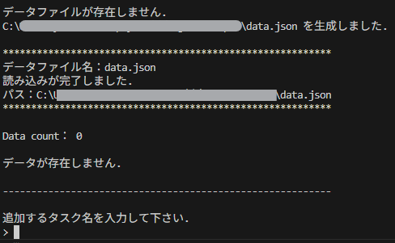
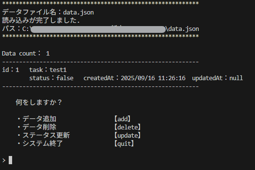
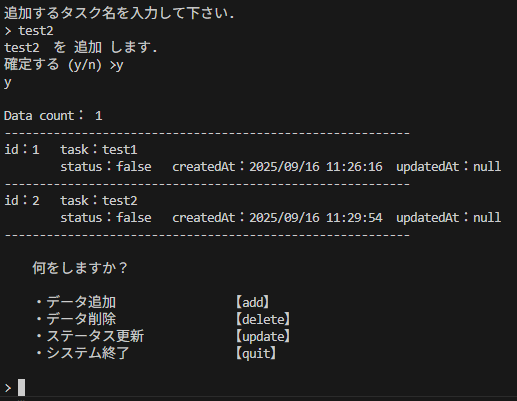
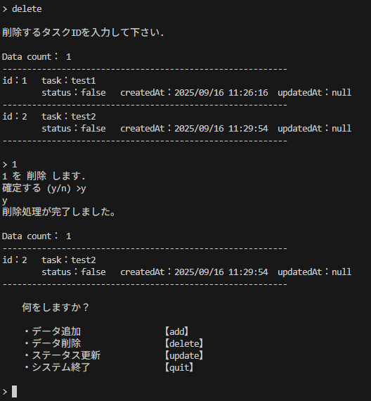
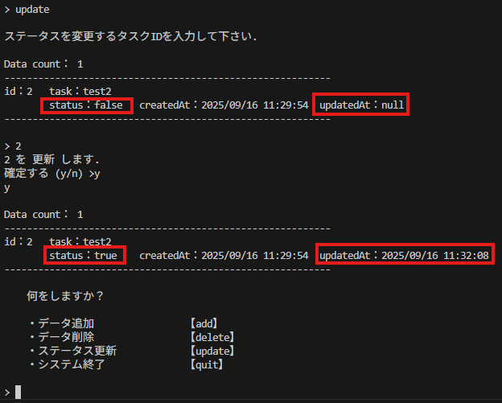
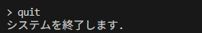

# Todo管理

コンソール画面（ターミナルやコマンドプロンプト）で、タスクを管理するためのシンプルなアプリケーションを作成しましょう。

## 必須要件

1つのタスクは、以下のプロパティを持つものとして設計してください。
|項目|データ型|説明|
|---|---|---|
|id|int|識別するための一意な番号|
|todo|String|タスク内容|
|status|boolean|完了・未完了を識別するための値|
|createdAt|String|タスクを作成した日時|
|updatedAt|String|タスク(ステータス)を更新した日時|

## 機能要件

|機能|説明|
|---|---|
|タスク一覧表示|現在登録されている全てのタスクを一覧で表示してください。 各タスクのプロパティを全て表示してください。|
|タスク追加|新しいタスクを内容を指定して追加できるようにしてください。 追加されたタスクは自動的に「未完了」状態になります。|
|タスク削除|IDを指定して、タスクをリストから削除できるようにしてください。|
|タスク更新|IDを指定して、タスクの状態を切り替えられるようにしてください。 切り替える蔡、更新日時を実行時に更新してください。|
|データ永続化|アプリケーションを終了しても登録したタスクがなくならないように、ファイルへの保存・読み込み機能を実装してください。 データはJSON形式で特定ディレクトリに保存するように実装しましょう。|

:::tip データ永続化
データの永続化にはJSONやCSVファイルへの書き出しやDBとの連携等、様々な手法があります。  
本課題ではプログラム実行時にファイルが存在しなければ作成、そうでなければ追記・更新する形で運用しましょう。  
Windows環境の場合は文字コードShift_JISを使用するとスムーズです。
:::

## UI
プログラムを起動すると、ユーザーが次に行う操作を選べるように選択肢を提示してください。  
ユーザーが特定のコマンドを入力すると、対応する機能が実行されるようにしてください。  
exit や quit などの特定のコマンドを入力すると、アプリケーションが終了するようにしてください。

    
実装例

    

|プログラム起動時(データファイルなし)|
|:---:|
||
|**プログラム起動時(データファイルあり)**|
||
|**タスク追加**|
||
|**タスク削除**|
||
|**タスク更新**|
||
|**システム終了**|
||

    

## 進め方

### 1. 設計
要件については上記の通りです。  
実際に開発することを想定してどんなファイル(クラス・インターフェース)が必要かを考えましょう。  
以下をダウンロードし、自由に設計して下さい。  
[ファイル設計シート](./files/ファイル設計.xlsx)  

:::caution 
完成後は一次成果物として担当講師に提出をお願いします。
:::

### 2. 実装
コアとなる機能から実装しましょう。
処理のエンドポイントとなるファイル操作のクラス及びメソッドを用意しておくとスムーズです。  
極力部分ごとに依存性が無いように部品を作り、一通り作成したら組み合わせてシステムが動作するように実装します。  
まずは最低限となる機能要件を満たすように実装を進めましょう。

:::caution 
ここまで完了したら、二次成果物として**zipファイルで**担当講師に提出をお願いします。
:::

### 3. バリデーション・例外処理
本来専用のクラスを設けることが多いですが、小規模なアプリケーションの場合は後付でも実装可能なことが多いです。  
特にユーザからの入力を受け付けたり、ファイル操作を行う場合はこの処理がシステムの信頼性を左右します。  
あらゆる動作を検証し、例外を補足できない事がないように実装しましょう。

:::tip バリデーション
バリデーションとは、入力されたデータが「正しく」「適切か」をチェックすることです。  
一言でいうと「入力内容の妥当性チェック」です。

バリデーションが必要となる理由は主に2つあります。
- **不正確なデータを防ぐため:**  
ユーザーの入力ミス（メールアドレスの打ち間違いなど）を防ぎ、正しいデータを登録させるためです。
- **システムの安全性を守るため:**  
悪意のあるコードや不正なデータがシステムに送られるのを防ぎ、エラーやセキュリティ上の問題からシステムを守るためです。
:::

:::caution テスト
ここまで完了したら、システムの動作を保証するためのテストを実施しましょう。  
実務においては段階を踏んでテストを実施しますが、今回は**総合テスト**と呼ばれる手法で実施します。  
開発したシステム全体で、それぞれの機能が正しく動作するかどうかを確認して下さい。  
テスト用ファイルは[**こちら**](./files/テスト仕様書_sample.xlsx)からダウンロードして下さい。  
テスト項目は必要なものを例に倣って追記し、例に倣ってエビデンスを残しましょう。

### 総合テストの観点
総合テストの観点は、一般的に**要件定義書に記述されている内容に沿っているか**ということです。  
今回は上記の機能要件に対して動作や振る舞いが正常かどうかを確認します。  
性能や可用性等の**非機能要件**については割愛しましょう。
:::

## 追加要件
- タスクに優先度（例: 高、中、低）や期限日を追加する
- 期限が近い順にソートするといったオプション機能を追加する
- 一覧表示の際に、未完了のタスクのみを表示する
- キーワードでタスクを検索できる機能を追加する