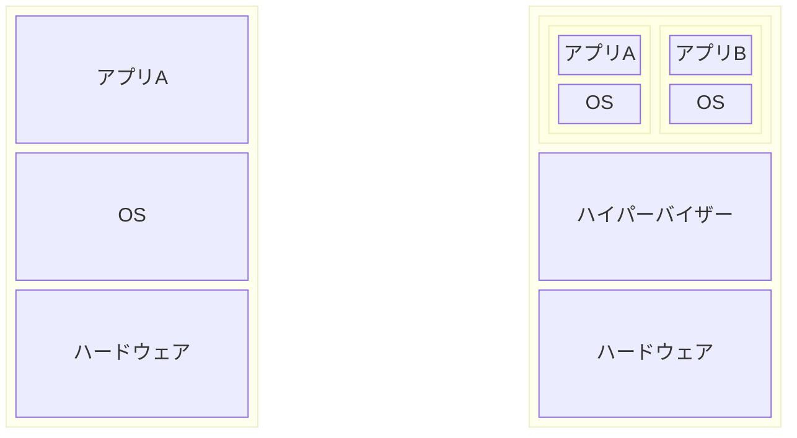
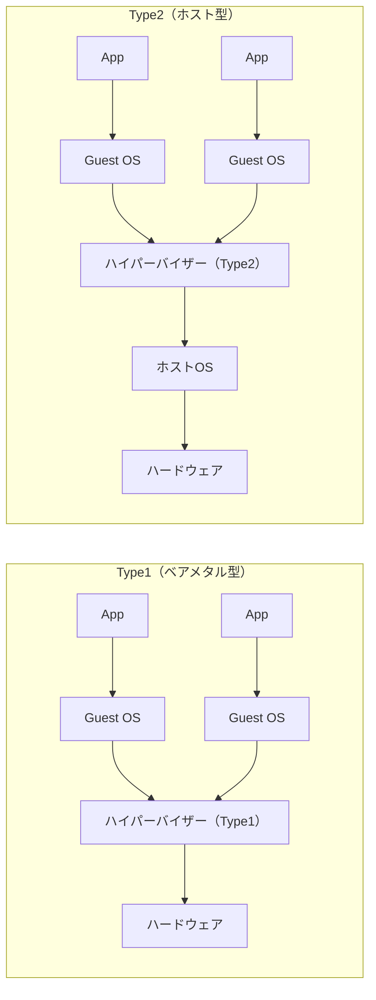
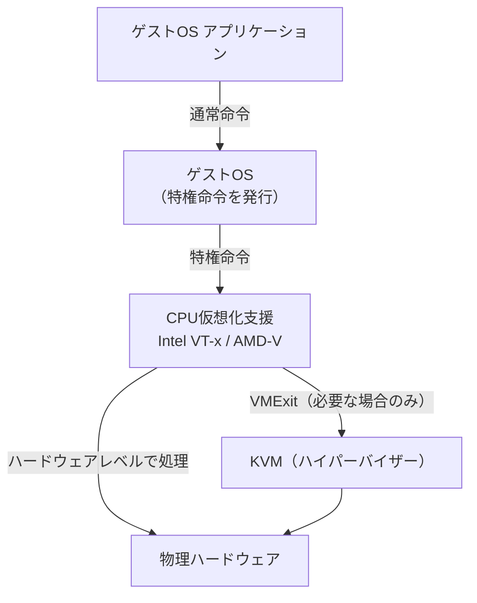

# 仮想化の基礎

## 仮想化とは

仮想化とは、物理的なハードウェアリソース（CPU・メモリ・ストレージ・ネットワーク）をソフトウェアによって抽象化し、複数の論理的な環境として扱えるようにする技術です。

1台の物理サーバー上で複数のOSを同時に動作させることができ、リソースを効率的に利用できます。

## サーバー仮想化のメリット

| メリット          | 説明                               |
| ------------- | -------------------------------- |
| **リソース効率化**   | 1台のサーバーで複数VMを稼働させ、CPU/メモリの利用率を向上 |
| **コスト削減**     | 物理サーバー台数の削減により、電力・冷却・スペースのコストを削減 |
| **柔軟なスケーリング** | VMの追加・削除・複製が容易                   |
| **障害分離**      | 1つのVMに問題が発生しても他のVMに影響しない         |
| **スナップショット**  | VMの状態を保存・復元できる                   |

## Type1 / Type2 ハイパーバイザ

仮想化を実現するソフトウェアを**ハイパーバイザー**と呼びます。ハードウェアへのアクセス方法によってType1とType2に分類されます。

### 比較

| 項目 | Type1（ベアメタル型） | Type2（ホスト型） |
|------|---------------------|----------------|
| 動作場所 | ハードウェア上に直接 | ホストOS上で動作 |
| パフォーマンス | 高い | オーバーヘッドあり |
| 用途 | エンタープライズ・本番環境 | 開発・学習・検証 |
| 代表製品 | KVM, VMware ESXi, Hyper-V | VirtualBox, VMware Workstation |

:::info
**KVMはType1に分類されます。** Linuxカーネル自体がハイパーバイザーの役割を持つため、ホストOSのオーバーヘッドがなく高いパフォーマンスを発揮します。
:::

## CPU仮想化支援（Intel VT-x / AMD-V）

従来のx86 CPUは仮想化を前提に設計されていなかったため、ハイパーバイザーがCPU命令をソフトウェアでエミュレートする必要があり、パフォーマンスが大幅に低下していました。

この問題を解決するため、Intel・AMDはCPU自体に仮想化支援機能を組み込みました。

| 技術              | メーカー  | 有効化             |
| --------------- | ----- | --------------- |
| **Intel VT-x**  | Intel | BIOS/UEFI設定で有効化 |
| **AMD-V (SVM)** | AMD   | BIOS/UEFI設定で有効化 |
|                 |       |                 |
|                 |       |                 |

:::warning
KVMを使用するには、CPU仮想化支援機能がBIOS/UEFIで**有効化されている**必要があります。
`egrep -c '(vmx|svm)' /proc/cpuinfo` で確認できます（0より大きければ有効）。
:::
