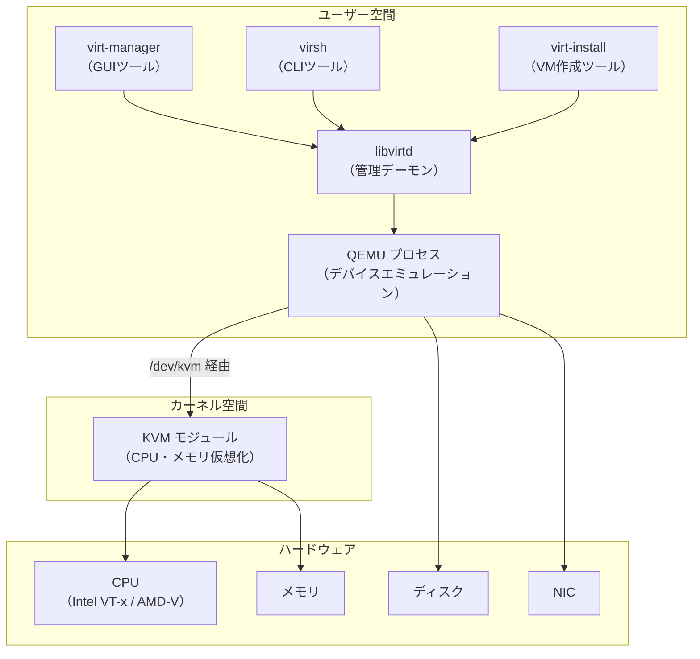
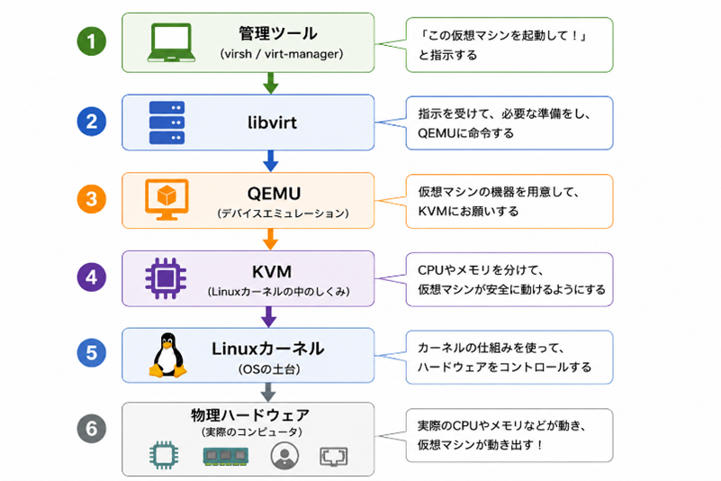
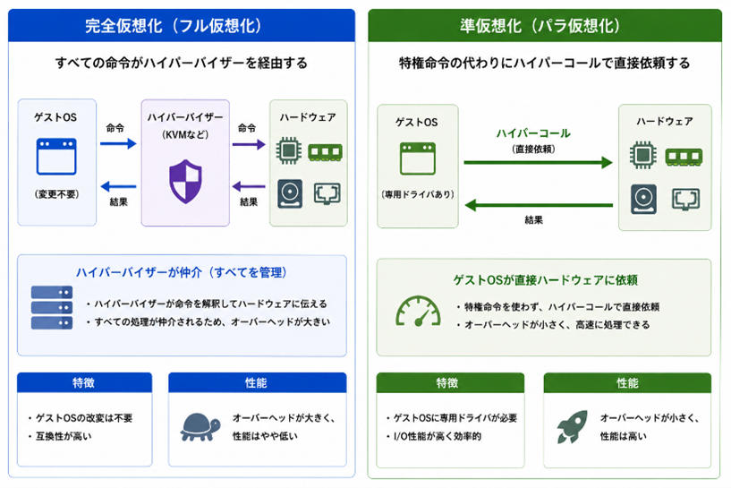
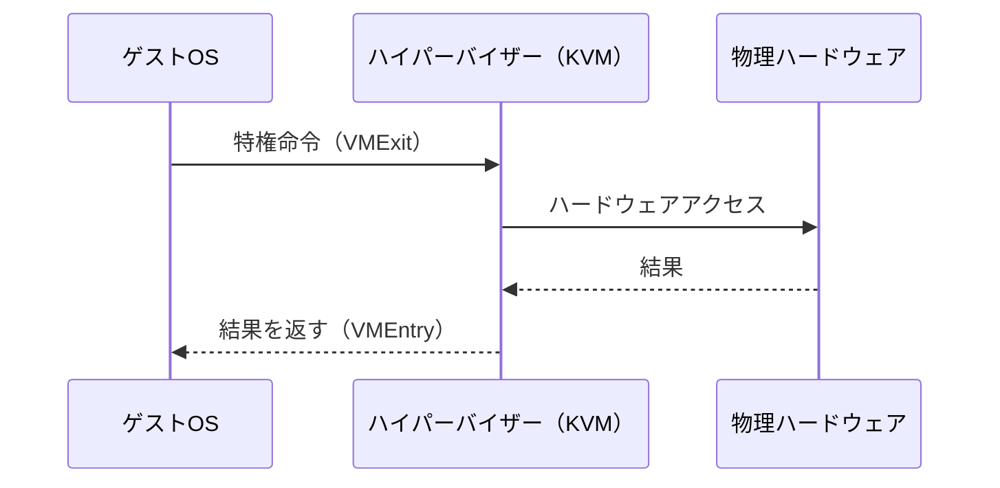
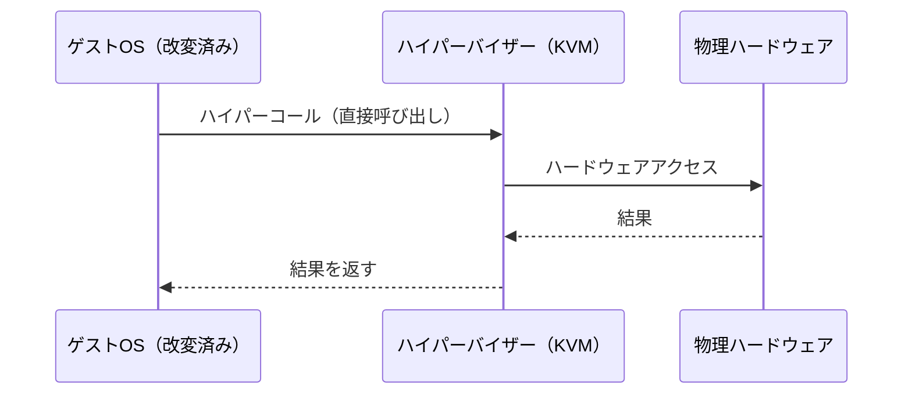
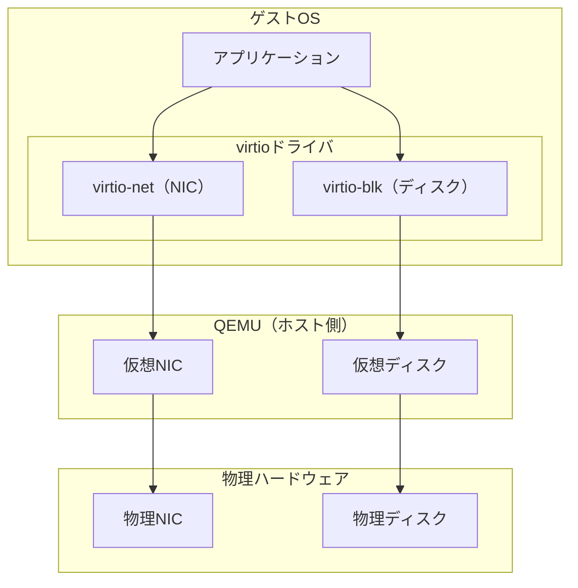

# KVMのアーキテクチャ

## KVMとは

**KVM（Kernel-based Virtual Machine）** は、Linuxカーネルに組み込まれた仮想化モジュールです。2007年にLinuxカーネル2.6.20へマージされ、現在はLinux標準の仮想化基盤として広く使われています。

### KVMの主な特徴

- Linuxカーネル自体がハイパーバイザーとなるため、Type1相当のパフォーマンスを発揮
- オープンソースで無償利用可能
- Red Hat, Ubuntu, SUSE など主要ディストリビューションが採用
- Intel VT-x / AMD-V によるハードウェア仮想化支援を活用

## QEMU・libvirt との関係

KVM単体ではCPUとメモリの仮想化のみを担います。ネットワーク・ディスク・画面などの**デバイスエミュレーション**はQEMUが、**管理インターフェース**はlibvirtが担当します。

### 各コンポーネントの役割

| コンポーネント | 役割 |
|--------------|------|
| **KVM** | CPU・メモリの仮想化。Linuxカーネルモジュール（`kvm.ko`, `kvm_intel.ko`等） |
| **QEMU** | ディスク・NIC・USBなどのデバイスエミュレーション。VMごとにプロセスとして動作 |
| **libvirtd** | VM管理の統合デーモン。XML定義でVMを管理し、QEMUへの命令を抽象化 |
| **virsh** | libvirtへのCLIインターフェース |
| **virt-manager** | libvirtへのGUIインターフェース |

## 仮想化方式

### 完全仮想化（Full Virtualization）

ゲストOSがハードウェアへの特権命令を発行するたびに、ハイパーバイザーがトラップして処理します。ゲストOSを**改変せずに**動作させられるため、Windows VMなどにも対応できます。

### 準仮想化（Paravirtualization）

ゲストOSを**改変し**、特権命令の代わりにハイパーバイザーへの直接呼び出し（ハイパーコール）を行います。VMExit/VMEntryのオーバーヘッドが減り、高いパフォーマンスを発揮します。

### KVMにおける実装

KVMは**完全仮想化**を基本としつつ、デバイスI/Oに**virtio**（準仮想化ドライバ）を活用することで高いパフォーマンスを実現しています。

| 方式           | ゲストOS改変   | パフォーマンス | 対応OS                        |
| ------------ | --------- | ------- | --------------------------- |
| 完全仮想化        | 不要        | 中       | Windows / Linux             |
| 準仮想化（virtio） | ドライバ導入が必要 | 高       | Linux（標準搭載）/ Windows（要ドライバ） |
