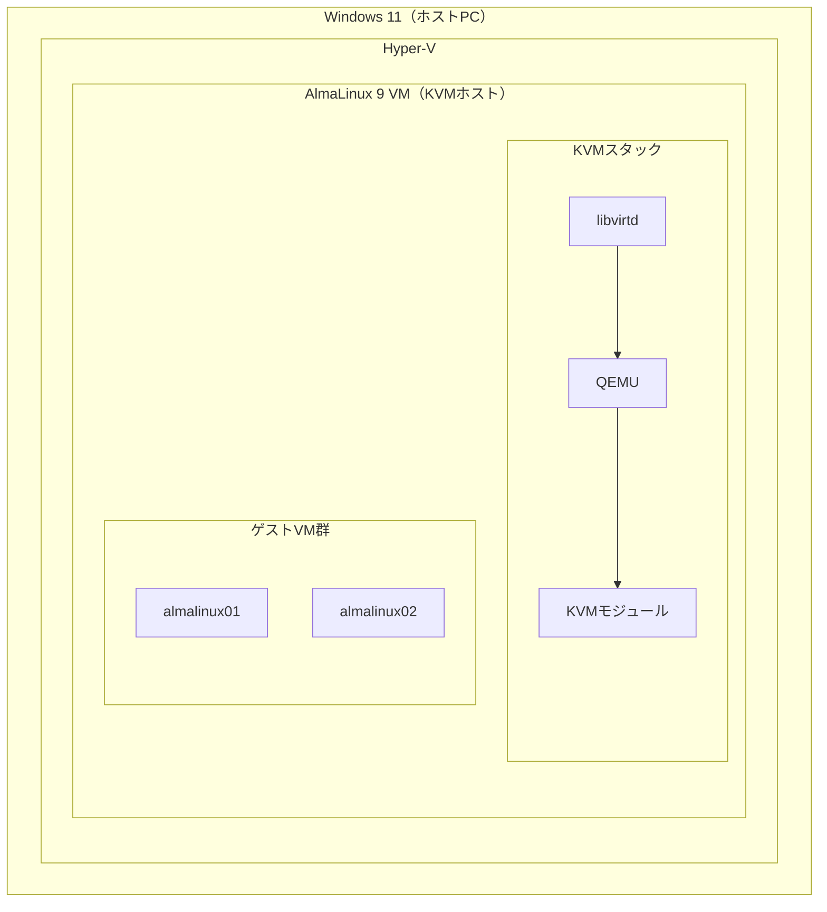

# 環境構築ハンズオン（Hyper-Vパターン）

## 構成概要

本手順では **Windows 11 の Hyper-V** 上に AlmaLinux 9 の VM を作成し、その中で KVM を動かします。  
Hyper-V のネスト仮想化機能を利用するため、WSL2 パターンよりも本番に近い Linux 環境が得られます。



### WSL2 パターンとの違い

| 項目 | WSL2 パターン | Hyper-V パターン |
|------|-------------|----------------|
| udev / systemd | 制限あり（警告が出る） | フル対応 |
| ブリッジネットワーク | 非対応 | 対応 |
| セットアップの手順数 | 少ない | やや多い |
| Linux 環境の完全性 | 簡易的 | 本番に近い |

---

## 前提条件

- Windows 11 Pro / Enterprise / Education（HomeはHyper-V非対応）
- BIOS/UEFI で VT-x / AMD-V が有効になっていること
- RAM 8GB 以上（KVMホスト VM に 4GB 割り当てるため）
- ストレージ 60GB 以上の空き
- インターネット接続

---

## Step 1: Hyper-V の有効化

PowerShell（管理者）で実行：

```powershell
Enable-WindowsOptionalFeature -Online -FeatureName Microsoft-Hyper-V -All
```

完了後、再起動を求められたら再起動します。

再起動後、Hyper-V が有効になっていることを確認：

```powershell
Get-WindowsOptionalFeature -Online -FeatureName Microsoft-Hyper-V
```

`State: Enabled` と表示されれば成功です。

---

## Step 2: AlmaLinux 9 ISO のダウンロード

ブラウザで AlmaLinux の公式サイトから **AlmaLinux 9 Minimal ISO** をダウンロードします。

ダウンロードしたファイルを以下のパスに移動します（パスは任意）：

```
C:\Hyper-V\iso\AlmaLinux-9-latest-x86_64-minimal.iso
```

> ファイルサイズは 1.5GB 前後です。

---

## Step 3: Hyper-V VM の作成

PowerShell（管理者）で実行します。  
`$isoPath` の値は実際の ISO ファイルのパスに合わせてください。

```powershell
$vmName = "AlmaLinux-KVMHost"
$isoPath = "C:\Hyper-V\iso\AlmaLinux-9-latest-x86_64-minimal.iso"
$vhdPath = "C:\Hyper-V\$vmName\disk.vhdx"
```

### 3-1. VHD（仮想ディスク）の作成

```powershell
New-Item -ItemType Directory -Force -Path "C:\Hyper-V\$vmName"
New-VHD -Path $vhdPath -SizeBytes 60GB -Dynamic
```

### 3-2. VM の作成

```powershell
New-VM `
  -Name $vmName `
  -Generation 2 `
  -MemoryStartupBytes 4GB `
  -SwitchName "Default Switch"
```

### 3-3. CPU とメモリの設定

```powershell
Set-VMProcessor -VMName $vmName -Count 4
Set-VMMemory -VMName $vmName -DynamicMemoryEnabled $false
```

### 3-4. ディスクと DVD の接続

```powershell
Add-VMHardDiskDrive -VMName $vmName -Path $vhdPath
Add-VMDvdDrive -VMName $vmName -Path $isoPath
```

### 3-5. Secure Boot の無効化

AlmaLinux のインストールを通すために Secure Boot を無効化します：

```powershell
Set-VMFirmware -VMName $vmName -EnableSecureBoot Off
```

### 3-6. 起動順序の設定（DVD を先頭に）

```powershell
$dvd = Get-VMDvdDrive -VMName $vmName
Set-VMFirmware -VMName $vmName -FirstBootDevice $dvd
```

---

## Step 4: ネスト仮想化の有効化

**VM が停止している状態**で実行します（Step 3 の時点では未起動なので問題ありません）：

```powershell
Set-VMProcessor -VMName $vmName -ExposeVirtualizationExtensions $true
```

> この設定は VM が起動中の場合は変更できません。必ず停止状態で実行してください。

設定を確認：

```powershell
Get-VMProcessor -VMName $vmName | Select-Object ExposeVirtualizationExtensions
```

`True` と表示されれば成功です。

---

## Step 5: AlmaLinux 9 のインストール

### 5-1. VM の起動とコンソール接続

```powershell
Start-VM -Name $vmName
vmconnect.exe localhost $vmName
```

Hyper-V のコンソールウィンドウが開き、AlmaLinux のインストーラーが起動します。

### 5-2. インストール設定

GUI インストーラーが起動します。以下の項目を設定してください：

| 項目 | 設定値 |
|------|-------|
| 言語 | English（または日本語） |
| タイムゾーン | Asia/Tokyo |
| インストール先 | 作成した 60GB ディスク（自動パーティション） |
| ソフトウェア選択 | Minimal Install |
| Root パスワード | 任意（8文字以上） |
| ユーザー作成 | 任意のユーザー名・パスワード（管理者権限を付与） |

設定完了後、**Begin Installation** をクリックします。

インストールには 10〜15 分かかります。

### 5-3. インストール完了後の再起動

`Reboot System` をクリックして再起動します。  
再起動後、DVD イメージは自動的に取り外されます。

---

## Step 6: VM 内の初期設定

Hyper-V コンソールまたは SSH でログインして操作します。

### 6-1. ログイン確認

```
AlmaLinux-KVMHost login: （作成したユーザー名）
Password: （設定したパスワード）
```

### 6-2. パッケージの更新

```bash
sudo dnf update -y
```

---

## Step 7: KVM 関連パッケージのインストール

```bash
sudo dnf install -y \
  qemu-kvm \
  libvirt \
  libvirt-client \
  virt-install \
  virt-manager
```

### ユーザーを libvirt グループに追加

```bash
sudo usermod -aG libvirt $(whoami)
newgrp libvirt
```

---

## Step 8: libvirtd の起動

```bash
sudo systemctl enable --now libvirtd
sudo systemctl status libvirtd
```

`Active: active (running)` と表示されることを確認します。

WSL2 パターンと異なり、udev 関連の警告は表示されません。

---

## Step 9: 動作確認

### KVM ホストの検証

```bash
virt-host-validate
```

以下のように `PASS` が並ぶことを確認します：

```
QEMU: Checking for hardware virtualization               : PASS
QEMU: Checking if device /dev/kvm exists                : PASS
QEMU: Checking if device /dev/kvm is accessible         : PASS
QEMU: Checking if device /dev/vhost-net exists          : PASS
```

### virsh による確認

```bash
sudo virsh list --all
sudo virsh net-list --all
```

`default` ネットワークが `active` であることを確認します。

`default` ネットワークが存在しない場合：

```bash
sudo virsh net-define /usr/share/libvirt/networks/default.xml
sudo virsh net-start default
sudo virsh net-autostart default
```

---

## 構成まとめ

| コンポーネント              | 場所              | 役割            |
| -------------------- | --------------- | ------------- |
| Hyper-V              | Windows 11 カーネル | KVMホスト VM を管理 |
| AlmaLinux 9（KVM ホスト） | Hyper-V VM 内    | KVM ホスト OS    |
| KVM / QEMU           | AlmaLinux 内     | ゲスト VM を管理    |
| libvirtd             | AlmaLinux 内     | 仮想化管理デーモン     |
| AlmaLinux 9（ゲスト VM）  | KVM 上           | 研修で操作する対象     |
