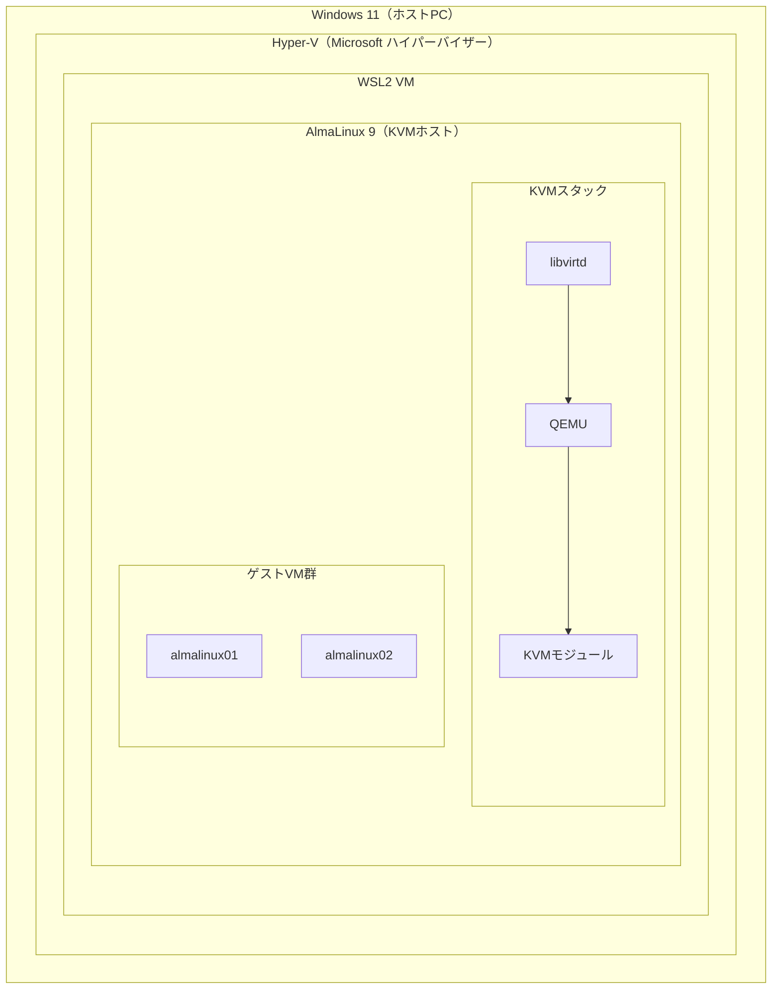

# 環境構築ハンズオン（WSL2パターン）

## 構成概要

本手順では **Windows 11 上の WSL2** に AlmaLinux 9 をインストールし、その中で KVM を動かします。
WSL2 は Hyper-V の上で動作するため、VirtualBox のような Hyper-V との競合が発生しません。



### VirtualBox パターンとの違い

| 項目                | VirtualBox パターン      | WSL2 パターン                    |
| ----------------- | -------------------- | ---------------------------- |
| Hyper-V との関係      | 競合する                 | 共存する（WSL2 が Hyper-V 上で動作）    |
| `/dev/kvm`        | ネスト仮想化の有効化が必要・失敗しやすい | Windows 11 + 最新 WSL2 で自動的に有効 |
| GUI（virt-manager） | VirtualBox ウィンドウ内で動作 | WSLg 経由でウィンドウ表示              |
| ネットワーク            | ブリッジ含め柔軟に設定可能        | NAT は動作、ブリッジは制限あり            |

---

## 前提条件

- Windows 11（Build 22000 以降）
- BIOS/UEFI で VT-x / AMD-V が有効になっていること
- インターネット接続

---

## Step 1: WSL2 の準備

### 1-1. WSL2 のインストールまたは更新

PowerShell（管理者）で実行：

```powershell
wsl --update
```

WSL2 自体が未インストールの場合は以下を先に実行します（Ubuntu はインストールしない）：

```powershell
wsl --install --no-distribution
```

### 1-2. WSL カーネルバージョンの確認

```powershell
wsl --version
```

`カーネル バージョン` が **5.15 以降** であることを確認します。

---

## Step 2: AlmaLinux 9 のインストール

PowerShell で実行：

```powershell
wsl --install -d AlmaLinux-9
```

> `AlmaLinux-9` が見つからない場合は、利用可能なディストリビューション一覧を確認します：
> ```powershell
> wsl --list --online
> ```
> 一覧にない場合は Microsoft Store で「AlmaLinux」を検索してインストールしてください。

### 2-2. 初回起動・ユーザー作成

インストール完了後、AlmaLinux が自動的に起動します。
プロンプトに従い、ユーザー名とパスワードを設定します。

---

## Step 3: WSL2 内の初期設定

以降の操作はすべて **AlmaLinux のターミナル内** で実行します。

### 3-1. systemd の有効化

WSL2 はデフォルトで systemd が無効です。libvirtd を systemctl で管理するために有効化します。

```bash
sudo tee /etc/wsl.conf <<'EOF'
[boot]
systemd=true
EOF
```

### 3-2. WSL2 の再起動

PowerShell で実行：

```powershell
wsl --shutdown
wsl -d AlmaLinux-9
```

### 3-3. systemd の動作確認

```bash
systemctl is-system-running
```

`running` または `degraded` と表示されれば systemd は有効です。

---

## Step 4: KVM モジュールの有効化

### 4-1. kmod のインストール

WSL2 の AlmaLinux は最小構成のため、モジュール管理ツールを手動でインストールします：

```bash
sudo dnf install -y kmod
```

### 4-2. KVM モジュールの読み込み

Intel CPU の場合：

```bash
sudo modprobe kvm_intel
```

AMD CPU の場合：

```bash
sudo modprobe kvm_amd
```

### 4-3. /dev/kvm の確認

```bash
ls -la /dev/kvm
```

`/dev/kvm` が表示されれば成功です。

表示されない場合は CPU の仮想化支援フラグを確認します：

```bash
grep -E '(vmx|svm)' /proc/cpuinfo | head -5
```

出力がなければ、BIOS で仮想化支援機能が無効になっています。

---

## Step 5: KVM 関連パッケージのインストール

```bash
sudo dnf install -y \
  qemu-kvm \
  libvirt \
  libvirt-client \
  virt-install \
  virt-manager
```

### ユーザーを libvirt グループに追加

```bash
sudo usermod -aG libvirt $(whoami)
newgrp libvirt
```

---

## Step 6: libvirtd の起動

```bash
sudo systemctl enable --now libvirtd
sudo systemctl status libvirtd
```

`Active: active (running)` と表示されることを確認します。

> `internal error: Failed to get udev device for syspath` という警告が表示される場合がありますが、WSL2 環境での既知の制限であり無視して問題ありません。

---

## Step 7: 動作確認

### KVM ホストの検証

```bash
virt-host-validate
```

`PASS` が並ぶことを確認します。
`/dev/kvm` の IOMMU 関連は `WARN` になる場合がありますが、研修用途では問題ありません。

### virsh による確認

```bash
sudo virsh list --all
sudo virsh net-list --all
```

`default` ネットワークが `active` であることを確認します。

`default` ネットワークが存在しない場合は定義・起動します：

```bash
sudo virsh net-define /usr/share/libvirt/networks/default.xml
sudo virsh net-start default
sudo virsh net-autostart default
```

---

## Step 8: VM 操作の基本コマンド

本研修では `virsh` と `virt-install` を使用してコマンドで VM を管理します。

| 操作 | コマンド |
|------|---------|
| VM 作成 | `virt-install` |
| VM 一覧 | `sudo virsh list --all` |
| VM 起動 | `sudo virsh start <vm名>` |
| VM 停止 | `sudo virsh shutdown <vm名>` |
| VM 強制停止 | `sudo virsh destroy <vm名>` |
| VM 削除 | `sudo virsh undefine <vm名>` |
| コンソール接続 | `sudo virsh console <vm名>` |
| スナップショット作成 | `sudo virsh snapshot-create-as <vm名> <スナップショット名>` |
| スナップショット一覧 | `sudo virsh snapshot-list <vm名>` |

> **補足: GUI での操作について**
> WSLg（WSL GUI）が有効な Windows 11 環境では、`virt-manager` を使って GUI で VM を管理することもできます。
> ```bash
> virt-manager &
> ```
> ただし WSL2 環境では描画が不安定になる場合があるため、本研修では CLI を使用します。

---

## 構成まとめ

| コンポーネント | 場所 | 役割 |
|-------------|------|------|
| Hyper-V | Windows 11 カーネル | WSL2 VM を管理 |
| WSL2 VM | Hyper-V 上 | AlmaLinux の実行環境 |
| AlmaLinux 9（KVM ホスト） | WSL2 VM 内 | KVM ホスト OS |
| KVM / QEMU | AlmaLinux 内 | ゲスト VM を管理 |
| libvirtd | AlmaLinux 内 | 仮想化管理デーモン |
| AlmaLinux 9（ゲスト VM） | KVM 上 | 研修で操作する対象 |
