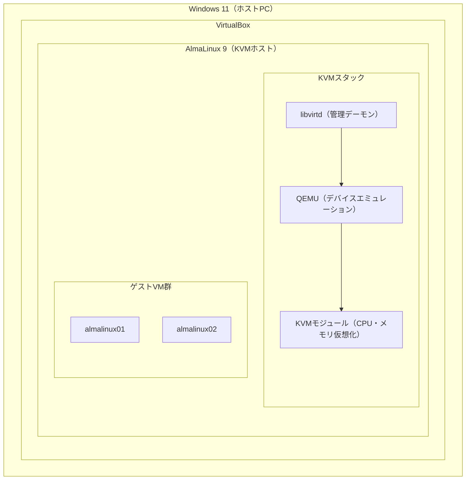

# 環境構築ハンズオン

## 構成概要

本研修では **Windows 11 上の VirtualBox** に AlmaLinux 9 をインストールし、その中で KVM を動かします。VirtualBox のネスト仮想化機能により、AlmaLinux がハイパーバイザー（KVMホスト）として動作します。



### 各レイヤーの役割

| レイヤー | ソフトウェア | 役割 |
|---------|------------|------|
| ホスト | Windows 11 | 物理ハードウェアを管理。VirtualBoxを実行 |
| 仮想化レイヤー1 | VirtualBox | AlmaLinux VMを実行。ネスト仮想化を提供 |
| KVMホスト | AlmaLinux 9 | KVM・QEMU・libvirtdを実行。ゲストVMを管理 |
| 仮想化レイヤー2 | KVM / QEMU | ゲストVMのCPU・メモリ・デバイスを仮想化 |
| ゲストVM | AlmaLinux 9 | 研修で操作・設定するターゲット環境 |

:::warning
ネスト仮想化により、KVMゲストのパフォーマンスはネイティブKVMより低下します。本研修はパフォーマンスより**手順習得**を目的とするため、この構成を採用しています。
:::

---

## 前提条件

| 項目 | 要件 |
|------|------|
| OS | Windows 11 |
| VirtualBox | 7.0 以上 |
| ホストメモリ | 16 GB 以上（推奨） |
| ホストディスク | 空き容量 80 GB 以上 |
| CPU | Intel VT-x または AMD-V 対応（BIOSで有効化済み） |

---

## Step 1: VirtualBox VMの作成

AlmaLinux 9 をインストールする VirtualBox VM を以下の仕様で作成します。

| 項目 | 設定値 |
|------|--------|
| VM名 | `kvm-host` |
| タイプ | Linux / Red Hat (64-bit) |
| メモリ | 8192 MB 以上 |
| CPU | 4 コア以上 |
| ストレージ | 80 GB（動的割り当て） |
| ネットワーク | ブリッジアダプター（アダプター1） |

### ネスト仮想化の有効化

**VMを停止した状態で**、以下のいずれかの方法で有効化します。

**方法A: コマンドライン（推奨）**

```bash
"C:\Program Files\Oracle\VirtualBox\VBoxManage.exe" modifyvm "VM名" --nested-hw-virt on
```

**方法B: GUI**

VirtualBox の **設定 → システム → プロセッサー** から以下を有効化します。

```
☑ ネステッド VT-x/AMD-V を有効化
```

:::warning
この設定を忘れると AlmaLinux 内で KVM が動作しません。`/dev/kvm` が存在しないエラーが発生します。
:::

---

## Step 2: AlmaLinux 9 のインストール

1. [AlmaLinux 公式サイト](https://almalinux.org/) から AlmaLinux 9 の ISO をダウンロード
2. VirtualBox VM の光学ドライブにマウント
3. VM を起動してインストーラーを起動

### インストール時の設定

| 項目 | 設定値 |
|------|--------|
| インストール先 | 作成した仮想ディスク |
| ソフトウェア選択 | **最小インストール** |
| rootパスワード | 任意（記録しておく） |
| ユーザー作成 | 任意 |
| ネットワーク | 有効化する |

---

## Step 3: KVM 関連パッケージのインストール

AlmaLinux にログイン後、以下のコマンドを実行します。

```bash
# KVM / QEMU / libvirt / 管理ツールをインストール
dnf install -y \
  qemu-kvm \
  libvirt \
  virt-install \
  virt-manager \
  virt-viewer

# libvirtd を起動・自動起動設定
systemctl enable --now libvirtd
```

---

## Step 4: 動作確認

インストールが完了したら、以下のコマンドで環境を検証します。

```bash
# KVMホストとして利用可能か検証
virt-host-validate
```

全項目が `PASS` になれば正常です。`WARN` や `FAIL` が出た場合はヒントを参照してください。

```bash
# KVMカーネルモジュールの確認
lsmod | grep kvm

# libvirtd の状態確認
systemctl status libvirtd

# virsh でゲスト一覧を確認（空のリストが返れば正常）
virsh list --all

# デフォルトネットワークの確認
virsh net-list --all
```

### 期待される出力イメージ

```
$ virsh list --all
 Id   名前   状態
-----------------

$ virsh net-list --all
 名前      状態     自動起動   持続的
--------------------------------------
 default   動作中   はい       はい
```

---

## トラブルシューティング

| 症状 | 原因 | 対処 |
|------|------|------|
| `/dev/kvm` が存在しない | ネスト仮想化が無効 | VirtualBox 設定で「ネステッド VT-x/AMD-V」を有効化 |
| `virt-host-validate` で FAIL | KVMモジュール未ロード | `modprobe kvm_intel`（または `kvm_amd`）を実行 |
| `libvirtd` が起動しない | パッケージ不足 | `dnf install -y libvirt` を再実行 |
| `default` ネットワークがない | libvirtd 未起動 | `systemctl start libvirtd` を実行 |

**ヒント**
- `virt-host-validate` の出力にある `WARN` は多くの場合は無視可能
- `/dev/kvm` の存在確認: `ls -la /dev/kvm`
- ネスト仮想化の確認: `cat /proc/cpuinfo | grep -E 'vmx|svm'`
