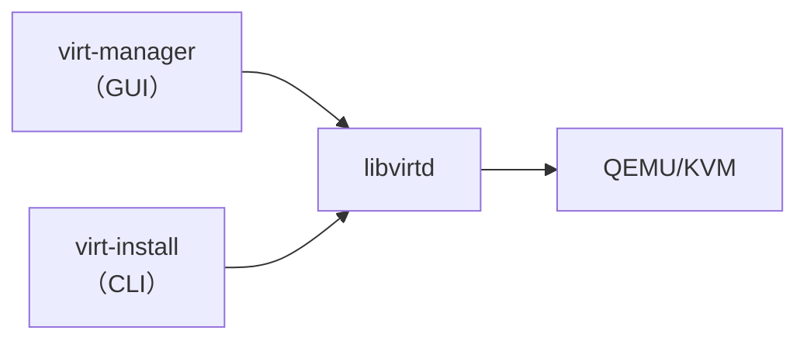
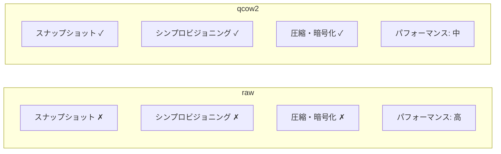
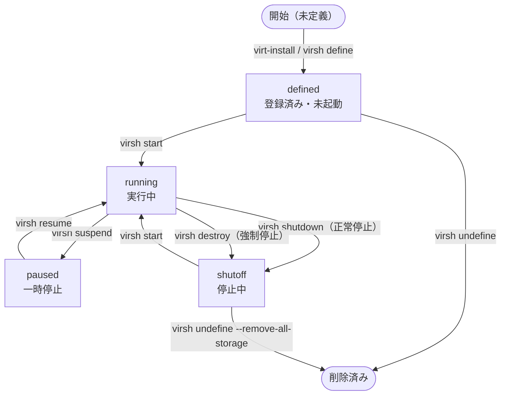
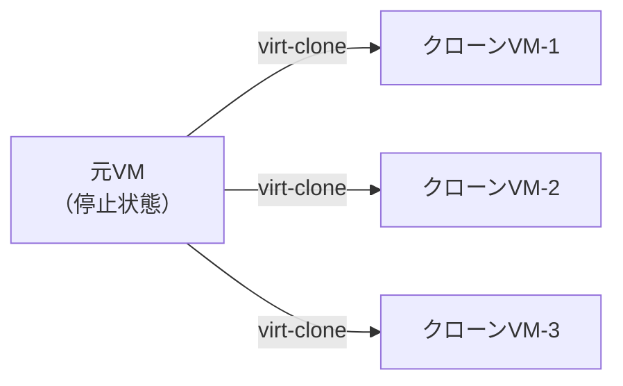
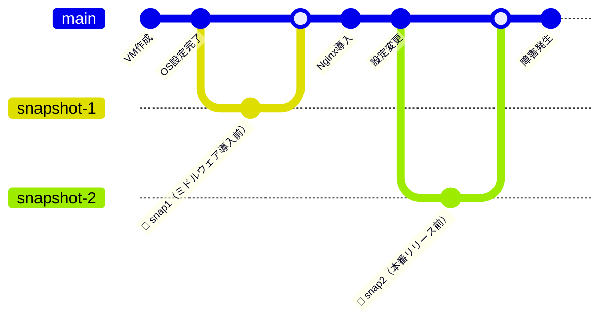

# VMの作成と基本操作

## VM作成の概要

KVM環境でVMを作成する主な方法は2つあります。

| ツール | 種別 | 特徴 |
|--------|------|------|
| **virt-manager** | GUI | 視覚的にウィザード形式でVM作成。初心者向け |
| **virt-install** | CLI | コマンドラインで作成。スクリプト化・自動化に向く |

どちらもlibvirtを介してQEMU/KVMを操作するため、裏側の動作は同じです。

## ディスクイメージ

VMのディスクは**ディスクイメージファイル**として管理されます。主な形式は以下の2つです。

| 形式 | 特徴 | 推奨用途 |
|------|------|---------|
| **qcow2** | スナップショット対応・シンプロビジョニング・圧縮 | KVM標準。ほぼ全ての用途 |
| **raw** | 機能なし・高パフォーマンス | I/O性能を最大化したい場合 |

## VMのライフサイクル

VMは以下の状態を遷移します。

### 各状態の説明

| 状態 | 説明 |
|------|------|
| **defined** | VMの定義がlibvirtに登録されているが、起動していない |
| **running** | 実行中 |
| **paused** | 一時停止（メモリ状態を保持したまま停止） |
| **shutoff** | 停止中（定義は残っている） |

### 停止方法の違い

| コマンド | 動作 | 使い分け |
|---------|------|---------|
| `virsh shutdown` | ゲストOSにシャットダウン信号を送信 | 通常の停止 |
| `virsh destroy` | 即時強制停止（電源断相当） | 応答しない場合 |

## Clone（クローン）

既存のVMを複製して新しいVMを作成します。同じ構成のVM（テンプレート）を素早く展開する際に使用します。

:::info
クローン時にMACアドレスとUUIDは自動的に新しい値に変更されます。ホスト名・IPアドレスはゲストOS内で手動変更が必要です。
:::

## スナップショット

VMの**特定時点の状態**（ディスク＋メモリ）を保存し、後から復元できる機能です。

### スナップショットの種類

| 種類 | 説明 | 特徴 |
|------|------|------|
| **internal** | qcow2ファイル内に保存 | 管理が簡単・同ファイルに格納 |
| **external** | 別ファイルとして保存 | 実行中VMにも対応・ファイル分離 |

:::warning
スナップショットは**バックアップの代替ではありません**。ディスク障害には対応できないため、重要データは別途バックアップを取得してください。
:::
