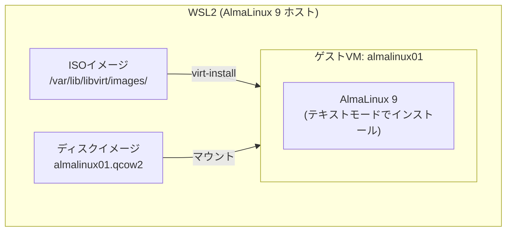

# VM作成ハンズオン（virt-install）

## 概要

このハンズオンでは `virt-install` を使って AlmaLinux 9 の VM をコマンドで作成します。  
GUI を使わずコマンドだけで完結するため、スクリプト化や自動化の基礎を学べます。

### 完成イメージ



### 所要時間

| フェーズ | 時間の目安 |
|---------|----------|
| ISO ダウンロード | 5〜10分（回線速度による） |
| VM 作成コマンド実行 | 1分 |
| OS インストール | 10〜15分 |
| 動作確認・操作演習 | 20〜30分 |

---

## 前提条件

Day 1 の環境構築ハンズオンが完了しており、以下の状態になっていること：

```bash
sudo virsh list --all       # コマンドが実行できる
sudo virsh net-list --all   # default ネットワークが active
ls /dev/kvm                 # /dev/kvm が存在する
```

---

## Step 1: ISO イメージの準備

### 1-1. 保存先ディレクトリに移動

```bash
cd /var/lib/libvirt/images
```

### 1-2. AlmaLinux 9 最小構成 ISO の移動
Windowsにダウンロードされているファイルを仮想マシンに移動します。  
**コマンドプロンプトで**以下のコマンドを実行して下さい。

```cmd
scp "C:\Users\user\Desktop\AlmaLinux-9.7-x86_64-minimal.iso" root@ホストのIPアドレス:/var/lib/libvirt/images/
```

完了後、ファイルが移動されていれば以下のコマンドでisoファイルが表示されます。

```bash
ls -lh /var/lib/libvirt/images/
```

### 1-3. ダウンロードの確認

```bash
ls -lh /var/lib/libvirt/images/*.iso
```

ファイルサイズが **1.5GB 前後** あれば正常です。

---

## Step 2: VM の作成

### 2-1. virt-install コマンドの構成

以下のコマンドで VM を作成します：

```bash
sudo virt-install \
  --name almalinux9-test \
  --vcpus 2 \
  --memory 2048 \
  --disk path=/var/lib/libvirt/images/almalinux01.qcow2,size=20,format=qcow2 \
  --location /var/lib/libvirt/images/AlmaLinux-9.7-x86_64-minimal.iso \
  --os-variant almalinux9 \
  --network network=default \
  --graphics none \
  --console pty,target_type=serial \
  --extra-args 'console=ttyS0,115200n8'
```

### 2-2. 各オプションの意味

| オプション | 値 | 説明 |
|-----------|-----|------|
| `--name` | `almalinux01` | VM の名前 |
| `--vcpus` | `2` | 割り当てる仮想 CPU 数 |
| `--memory` | `2048` | メモリ（MB）。2048 = 2GB |
| `--disk path=...` | qcow2 ファイルパス | ディスクイメージの場所と設定 |
| `size=20` | ― | ディスクサイズ（GB） |
| `format=qcow2` | ― | ディスク形式（シンプロビジョニング） |
| `--cdrom` | ISO ファイルパス | インストールメディア |
| `--os-variant` | `almalinux9` | OS の種類（最適なデフォルト値を設定） |
| `--network` | `network=default` | 接続するネットワーク |
| `--graphics none` | ― | GUI なし（WSL2 ではテキストモードを使用） |
| `--console` | `pty,target_type=serial` | シリアルコンソールで操作 |
| `--extra-args` | `console=ttyS0,...` | カーネルにシリアルコンソールを指示 |

> **`--os-variant` の確認方法**  
> 対応している OS 名の一覧は以下で確認できます：
> ```bash
> osinfo-query os | grep alma
> ```

### 2-3. コマンドの実行

コマンドを実行するとインストーラーが起動します。  
画面が切り替わり、テキストベースのインストール画面が表示されます。

---

## Step 3: AlmaLinux 9 のインストール

### 3-1. 言語選択

```
 1) [x] English (United States)
 2) [ ] ... （他の言語）
```

`1` を入力して Enter を押します。

### 3-2. インストールメニュー

以下のようなメニューが表示されます（番号は環境によって変わる場合があります）：

```
Installation

 1) [x] Language settings         (English (United States))
 2) [!] Time settings             (Timezone is not set.)
 3) [!] Installation source       (Processing...)
 4) [!] Software selection        (Minimal Install)
 5) [!] Installation Destination  (No disks selected)
 6) [ ] Network configuration     (Not connected)
 7) [ ] Root password             (Root account is disabled.)
 8) [!] User creation             (No user will be created)
```

`!` のついた項目は設定が必要です。順番に設定します。

### 3-3. タイムゾーンの設定（2番）

```
2
```

タイムゾーン一覧が表示されるので、Asia/Tokyo を指定します：

```
1        # "Set timezone" を選択
```

地域番号（Asia）と都市番号（Tokyo）を選択します。

### 3-4. インストール先の設定（5番）

```
5
```

ディスク一覧が表示されるので、`vda`（作成した 20GB のディスク）を選択します：

```
1        # vda を選択
c        # confirm（確定）
```

### 3-5. Root パスワードの設定（7番）

```
7
```

パスワードを2回入力します。8文字以上で設定してください。

> 弱いパスワードは警告が出ます。`!` をつけて強制的に設定できます。

### 3-6. ユーザーの作成（8番）

```
8
```

以下を設定します：

```
1        # ユーザー名の設定
alma     # ユーザー名（任意）
3        # パスワードの設定
（パスワードを2回入力）
4        # このユーザーを管理者（sudo）にする
c        # confirm
```

### 3-7. インストールの開始

全ての `!` が解消されたことを確認して：

```
b        # begin installation
```

インストールが開始されます。進捗バーが表示され、10〜15 分で完了します。

### 3-8. インストール完了

```
Installation complete. Press ENTER to quit
```

と表示されたら Enter を押します。VM が再起動します。

---

## Step 4: VM へのログイン

### 4-1. コンソールへの接続

VM 再起動後、コンソール画面が表示されます。  
接続が切れた場合は以下で再接続します：

```bash
sudo virsh console almalinux01
```

> コンソールから抜けるには `Ctrl + ]` を押します。

### 4-2. ログイン

```
almalinux01 login: alma
Password: （設定したパスワード）
```

ログインできたら動作確認をします：

```bash
ip addr show        # IP アドレスの確認
cat /etc/os-release # OS バージョンの確認
df -h               # ディスク使用量の確認
```

---

## Step 5: VM の基本操作

別のターミナルを開き、ホスト側（WSL2 AlmaLinux）で操作します。  
コンソールから抜ける場合は `Ctrl + ]` を押します。

### 5-1. VM の一覧確認

```bash
sudo virsh list --all
```

```
 Id   Name          State
--------------------------
 1    almalinux01   running
```

### 5-2. VM の停止

```bash
sudo virsh shutdown almalinux01
```

ゲスト OS にシャットダウン信号を送ります。`State` が `shut off` になるまで待ちます：

```bash
sudo virsh list --all
```

### 5-3. VM の起動

```bash
sudo virsh start almalinux01
```

### 5-4. VM の強制停止

OS が応答しない場合は `destroy` で即時停止します（電源断相当）：

```bash
sudo virsh destroy almalinux01
```

> 通常運用では `shutdown` を使用してください。データ破損のリスクがあります。

---

## Step 6: スナップショット

### 6-1. スナップショットの作成

VM を停止した状態でスナップショットを作成します：

```bash
sudo virsh shutdown almalinux01
# State が shut off になったことを確認してから実行
sudo virsh snapshot-create-as almalinux01 snap1 --description "OS設定完了後"
```

### 6-2. スナップショットの確認

```bash
sudo virsh snapshot-list almalinux01
```

```
 Name    Creation Time               State
-------------------------------------------
 snap1   2026-05-xx xx:xx:xx +0900   shutoff
```

### 6-3. スナップショットへの復元

```bash
sudo virsh snapshot-revert almalinux01 snap1
```

復元後、VM は停止状態になっています。`virsh start` で起動します。

### 6-4. スナップショットの削除

```bash
sudo virsh snapshot-delete almalinux01 snap1
```

---

## Step 7: クローンの作成

### 7-1. 元 VM を停止

`virt-clone` は VM が停止している状態で実行します：

```bash
sudo virsh shutdown almalinux01
```

### 7-2. クローンの実行

```bash
sudo virt-clone \
  --original almalinux01 \
  --name almalinux02 \
  --auto-clone
```

| オプション | 説明 |
|-----------|------|
| `--original` | クローン元の VM 名 |
| `--name` | 新しい VM の名前 |
| `--auto-clone` | ディスクイメージのパスを自動生成 |

### 7-3. クローンの確認

```bash
sudo virsh list --all
```

```
 Id   Name          State
---------------------------
 -    almalinux01   shut off
 -    almalinux02   shut off
```

### 7-4. クローン VM の起動

```bash
sudo virsh start almalinux02
sudo virsh console almalinux02
```

> クローン VM はホスト名と IP アドレスが元 VM と同じです。  
> ゲスト OS 内でホスト名を変更してください：
> ```bash
> sudo hostnamectl set-hostname almalinux02
> ```

---

## Step 8: VM の削除

不要になった VM を削除します。

### 8-1. VM の停止

```bash
sudo virsh destroy almalinux02    # 起動中の場合
```

### 8-2. VM の定義とディスクを削除

```bash
sudo virsh undefine almalinux02 --remove-all-storage
```

| オプション | 説明 |
|-----------|------|
| `undefine` | libvirt から VM の定義を削除 |
| `--remove-all-storage` | 関連するディスクイメージも削除 |

### 8-3. 削除の確認

```bash
sudo virsh list --all
ls /var/lib/libvirt/images/
```

`almalinux02` が一覧から消え、ディスクイメージも削除されていることを確認します。

---

## コマンドまとめ

| 操作 | コマンド |
|------|---------|
| VM 作成 | `sudo virt-install --name <名前> ...` |
| VM 一覧 | `sudo virsh list --all` |
| VM 起動 | `sudo virsh start <名前>` |
| VM 停止（正常） | `sudo virsh shutdown <名前>` |
| VM 停止（強制） | `sudo virsh destroy <名前>` |
| コンソール接続 | `sudo virsh console <名前>` |
| コンソールから切断 | `Ctrl + ]` |
| スナップショット作成 | `sudo virsh snapshot-create-as <VM名> <スナップショット名>` |
| スナップショット一覧 | `sudo virsh snapshot-list <VM名>` |
| スナップショット復元 | `sudo virsh snapshot-revert <VM名> <スナップショット名>` |
| スナップショット削除 | `sudo virsh snapshot-delete <VM名> <スナップショット名>` |
| クローン作成 | `sudo virt-clone --original <元VM> --name <新VM名> --auto-clone` |
| VM 削除（定義＋ディスク） | `sudo virsh undefine <名前> --remove-all-storage` |
