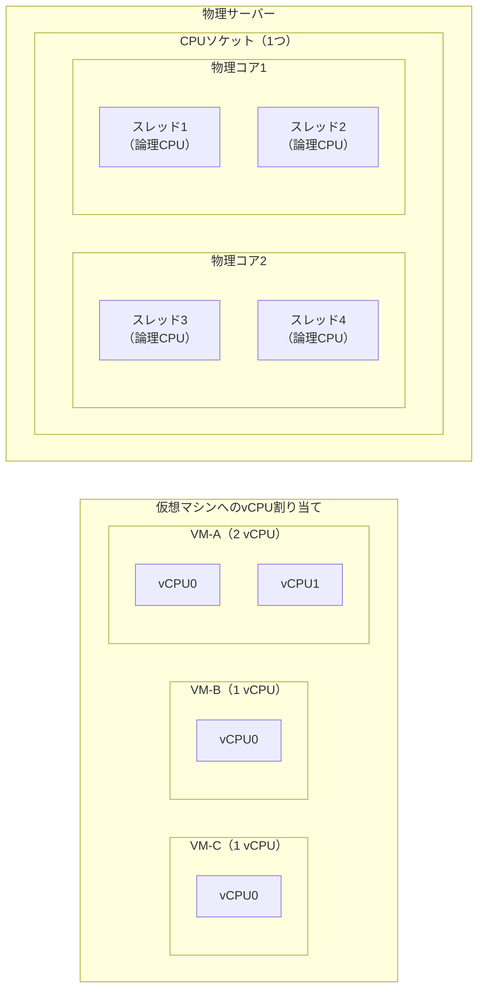
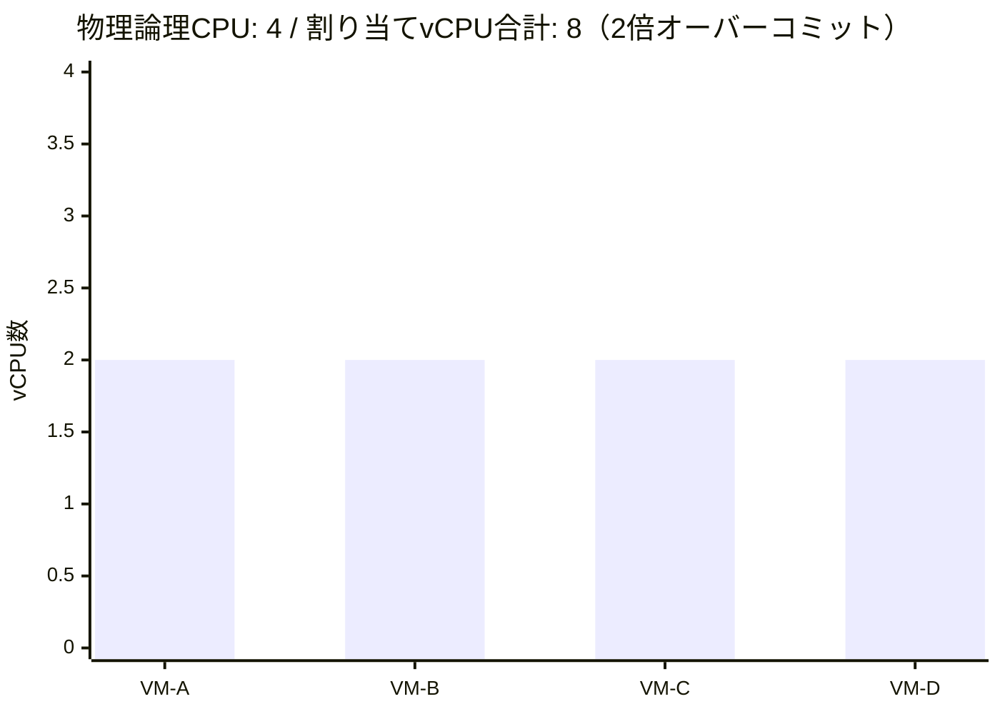
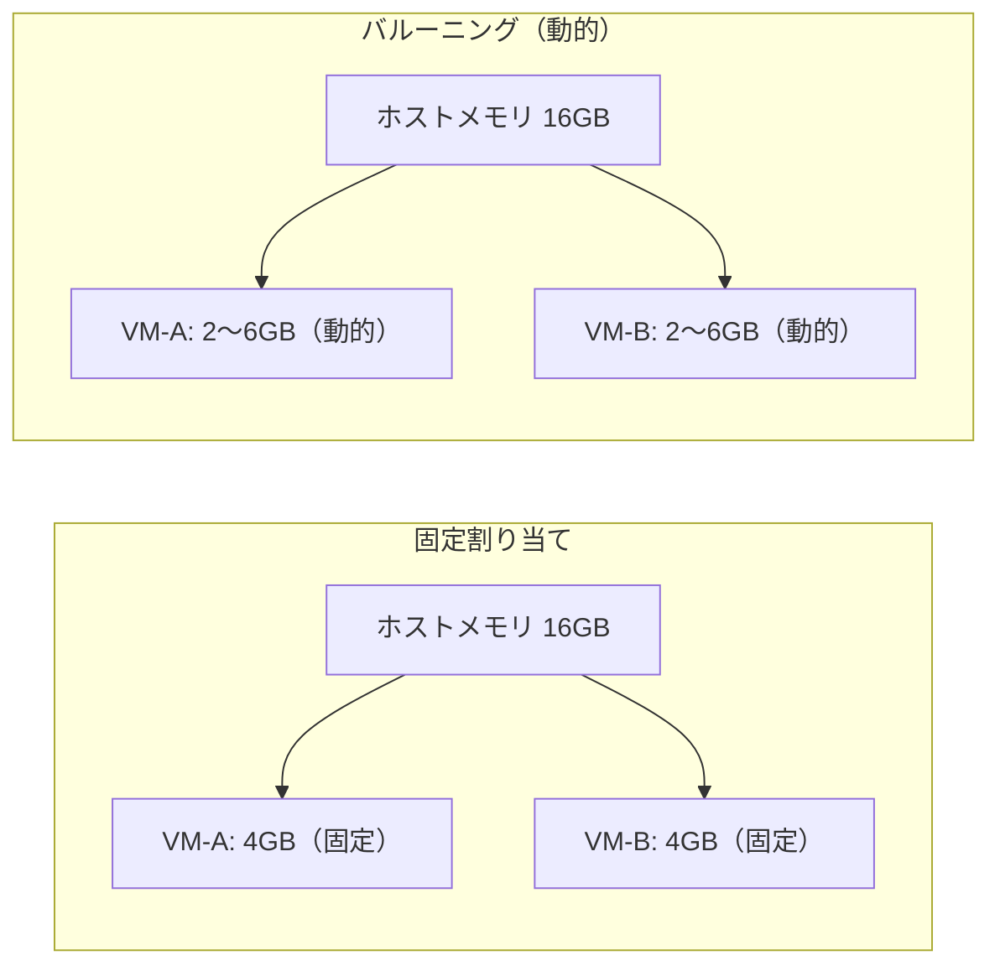
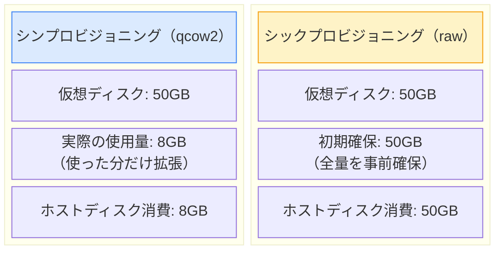
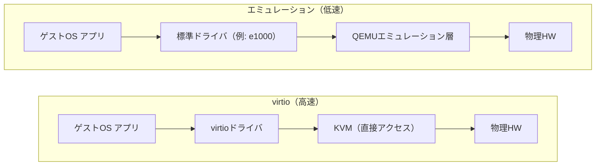

# リソース設計

## vCPU設計

### 物理CPU・コア・スレッドとvCPUの関係

- vCPUは**論理CPU（スレッド）**に対してスケジューリングされます
- 1つの論理CPUに複数のvCPUを割り当て可能（**オーバーコミット**）

### オーバーコミット

物理コア数を超えてvCPUを割り当てることを**オーバーコミット**と呼びます。

| 観点 | 内容 |
|------|------|
| **メリット** | 物理CPUを有効活用。全VMが同時フル稼働しない前提で有効 |
| **デメリット** | 全VMが高負荷になると競合が発生し、パフォーマンスが低下 |
| **推奨比率** | 本番環境では1:1〜1:2程度が目安 |

## メモリ割り当て

### 固定割り当て vs バルーニング

| 方式 | 特徴 | 適用場面 |
|------|------|---------|
| **固定割り当て** | 常に指定量を確保。予測可能な動作 | 本番環境・性能保証が必要な場合 |
| **バルーニング** | 使用量に応じて動的に調整。効率的 | 開発・テスト環境。負荷がバラつく場合 |

:::info
KVMでバルーニングを利用するにはゲストOS側に `virtio-balloon` ドライバが必要です。Linuxでは標準搭載されています。
:::

## ストレージモデル

### シンプロビジョニング vs シックプロビジョニング

| 方式 | ホスト消費量 | I/O性能 | 適用場面 |
|------|------------|--------|---------|
| **シン（qcow2）** | 実使用量のみ | 中 | 開発・検証・ストレージ節約 |
| **シック（raw）** | 最大容量を確保 | 高 | DBサーバーなど性能重視の本番 |

## パフォーマンス最適化の観点

### virtioドライバの活用

デバイスI/Oにはエミュレーションよりもvirtioドライバが大幅に高速です。

| デバイス種別 | エミュレーション | virtio |
|------------|----------------|--------|
| ネットワーク | e1000, rtl8139 | virtio-net |
| ディスク | IDE, SATA | virtio-blk, virtio-scsi |
| メモリバルーン | — | virtio-balloon |

:::tip
新規VM作成時は原則 **virtioを選択**してください。パフォーマンスが大きく向上します。
:::
