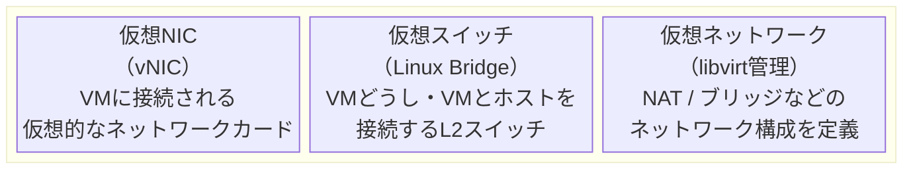
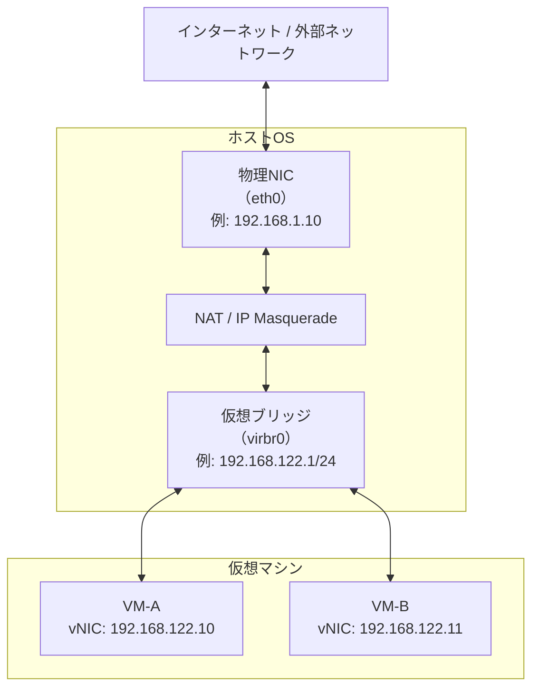
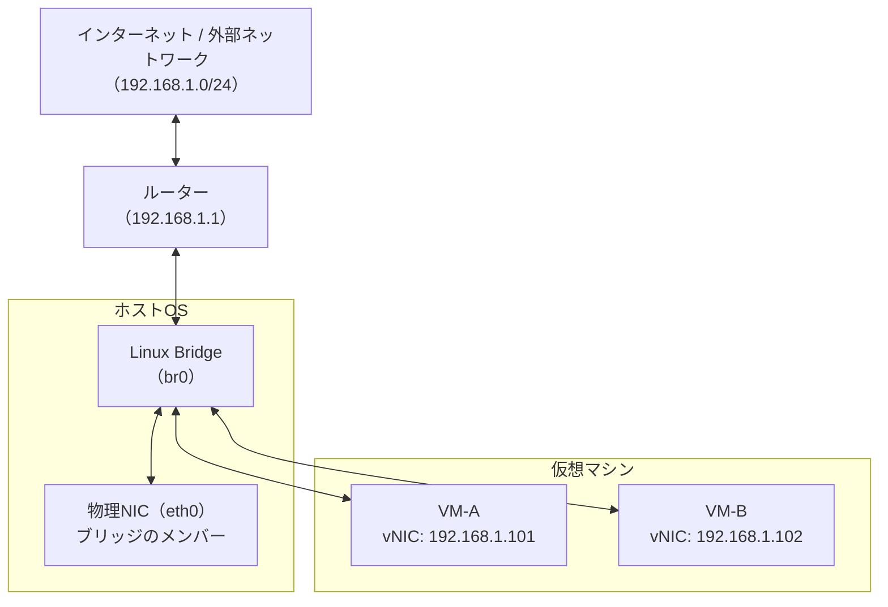
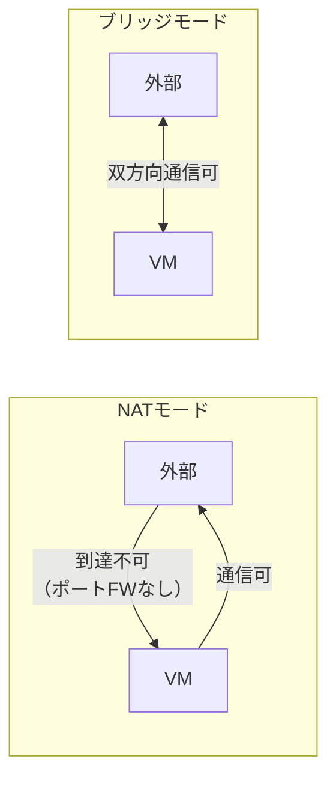
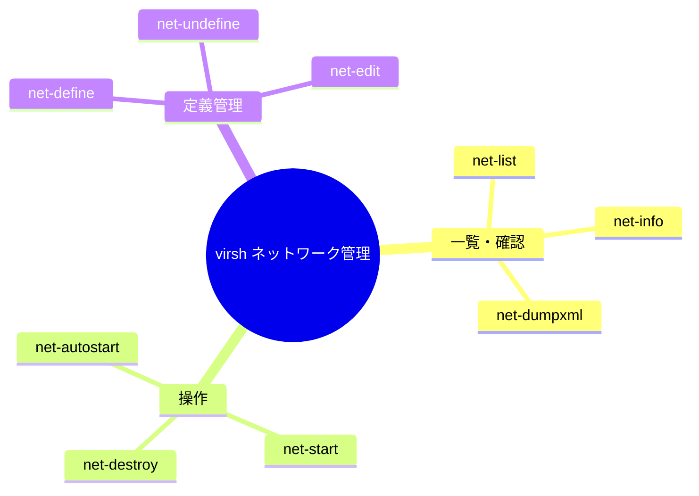

# 仮想ネットワーク

## 仮想ネットワークの基本概念

KVM/libvirtではソフトウェアで仮想的なネットワーク機器を作成します。



libvirtが管理するネットワークモデルは主に **NAT** と **ブリッジ** の2種類があります。

## NATネットワーク

libvirtのデフォルトネットワーク（`default`）はNATモードで動作します。ホストOSがルーターとなり、VMはホストを介して外部と通信します。



| 項目 | 内容 |
|------|------|
| **外部→VM通信** | ポートフォワーディングを設定しない限り不可 |
| **VM→外部通信** | NATにより可能 |
| **VM間通信** | 同じ仮想ブリッジ上であれば可能 |
| **デフォルトブリッジ** | `virbr0`（192.168.122.0/24） |
| **適用場面** | 開発・学習環境。外部からVMへのアクセスが不要な場合 |

## ブリッジネットワーク

ホストの物理NICとVMの仮想NICを同一のブリッジに接続します。VMが**物理ネットワークと同じセグメント**に属するため、外部から直接アクセスできます。



| 項目 | 内容 |
|------|------|
| **外部→VM通信** | 直接アクセス可能 |
| **VMのIPアドレス** | 物理ネットワークのDHCPまたは手動設定 |
| **ホストのIP** | ブリッジ（br0）に設定（eth0からブリッジへ移動） |
| **適用場面** | サーバー用途。外部から直接VMにアクセスが必要な場合 |

## NATとブリッジの比較



| 比較項目 | NAT | ブリッジ |
|---------|-----|---------|
| 設定の容易さ | ◎ デフォルトで使用可能 | △ ブリッジ作成が必要 |
| 外部からのアクセス | ✗（ポートFW要） | ◎ |
| IPアドレス管理 | libvirt内部DHCP | 物理NWと統一 |
| 分離性 | 高い | 低い |
| 用途 | 学習・開発環境 | 本番・サーバー用途 |

## libvirtによるネットワーク管理

libvirtはネットワーク定義をXMLで管理します。virshコマンドで操作できます。

### ネットワーク管理コマンド体系



### デフォルトネットワークの構成（XML例）

```xml
<network>
  <name>default</name>
  <forward mode="nat"/>
  <bridge name="virbr0" stp="on" delay="0"/>
  <ip address="192.168.122.1" netmask="255.255.255.0">
    <dhcp>
      <range start="192.168.122.2" end="192.168.122.254"/>
    </dhcp>
  </ip>
</network>
```

:::info
ネットワーク設定はXMLファイルで定義されており、`virsh net-dumpxml <ネットワーク名>` で確認できます。
:::
