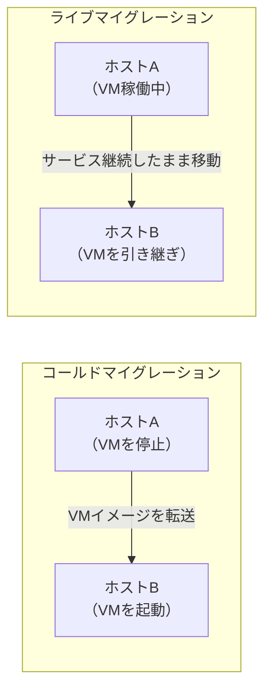
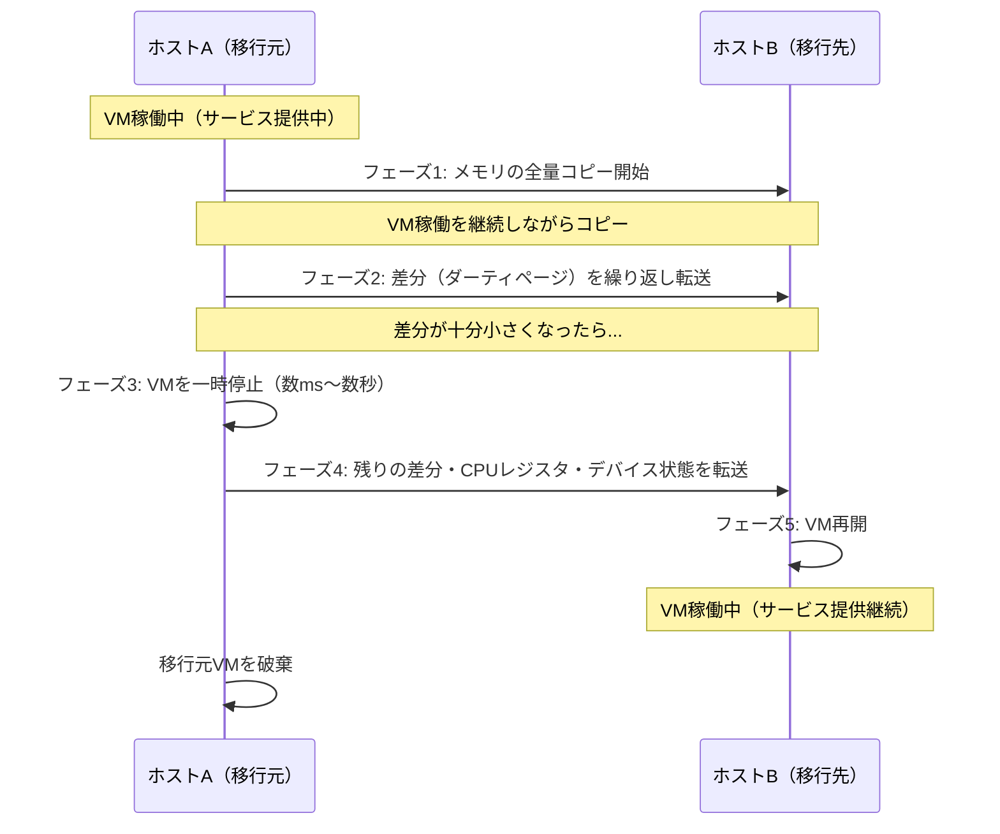
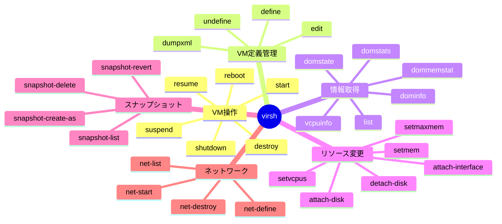
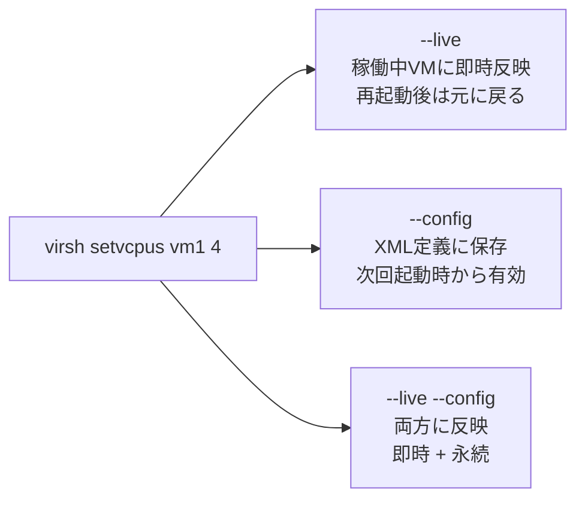

# マイグレーションとCLI管理

## マイグレーションとは

マイグレーションとは、**稼働中または停止中のVMを別の物理ホストへ移動する**技術です。ハードウェアのメンテナンスや負荷分散のために使用します。

### マイグレーションの種類

| 種類 | ダウンタイム | 用途 |
|------|------------|------|
| **コールドマイグレーション** | あり（停止が必要） | メンテナンス時・シンプルな移動 |
| **ライブマイグレーション** | ほぼなし（数ms〜数秒） | サービスを止めたくない本番環境 |

## ライブマイグレーションの仕組み

ライブマイグレーションはVMを停止せずにメモリをコピーするため、複数のフェーズで段階的に処理されます。

:::info
ライブマイグレーションには共有ストレージ（NFS, SANなど）か、**ストレージマイグレーション**（ディスクも同時転送）が必要です。
:::

## CLIによるVM管理

`virsh` はlibvirtの公式CLIツールです。VMの操作から情報取得・リソース変更まで一元管理できます。

### コマンドカテゴリ

### 情報取得コマンド

| コマンド | 用途 | 例 |
|---------|------|-----|
| `virsh list --all` | 全VMの一覧と状態表示 | — |
| `virsh dominfo <VM名>` | VMの詳細情報（CPU・メモリ・状態） | `virsh dominfo almalinux01` |
| `virsh domstate <VM名>` | VMの現在の状態のみ表示 | `virsh domstate almalinux01` |
| `virsh vcpuinfo <VM名>` | vCPUの割り当て状況 | `virsh vcpuinfo almalinux01` |
| `virsh dommemstat <VM名>` | メモリ使用状況の詳細 | `virsh dommemstat almalinux01` |
| `virsh domstats <VM名>` | CPU・メモリ・ネットワーク・ディスクの統計 | `virsh domstats almalinux01` |

### リソース変更コマンド

| コマンド | 用途 | オプション例 |
|---------|------|-----------|
| `virsh setvcpus` | vCPU数を変更 | `--count 4 --live` で稼働中に反映 |
| `virsh setmem` | メモリ使用量を変更（バルーニング） | `--size 2G --live` |
| `virsh setmaxmem` | メモリ最大値を変更（要停止） | `--size 4G --config` |
| `virsh attach-disk` | ディスクを追加 | `--source /var/lib/libvirt/images/data.qcow2` |
| `virsh attach-interface` | NICを追加 | `--type network --source default` |

### `--live` / `--config` オプション

:::tip
設定を永続化したい場合は `--config` を必ず付けてください。`--live` のみだと再起動後に設定が失われます。
:::
