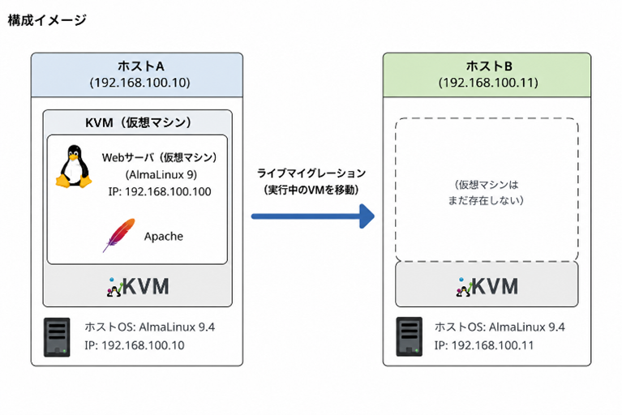

# ライブマイグレーション実践

## 課題の目的

VirtualBoxを用いたネステッド仮想化（入れ子型仮想化）環境を構築し、KVMによる仮想マシンの運用管理を実践的に学ぶ。

特に**ライブマイグレーション**の技術を体験し、無停止メンテナンスの仕組みとそれを実現するためのシステム・ネットワーク要件を理解する。

---

## 前提環境

| 層 | 種別 | 内容 |
|---|---|---|
| 物理環境 | ホストPC | VirtualBoxがインストールされたPC |
| 仮想ホスト（L1） | HostA / HostB | VirtualBox上に構築したLinuxマシン × 2台。それぞれKVM/libvirt環境を構築し、ハイパーバイザとして動作させる |
| 仮想ゲスト（L2） | Guest VM | HostAのKVM上に構築したLinuxマシン × 1台（Webサーバー用） |

---

## 実施ステップ

### Step 1：ネステッド仮想化環境の構築（HostA・HostB）

1. VirtualBox上に2台の仮想マシンを作成し、指定のLinux OS（AlmaLinuxなど）をインストールする。
2. ゲストOS上で仮想化を有効にするため、VirtualBoxの設定から **「ネステッドVT-x/AMD-V」を有効化** する。
3. 両方のOSにKVM関連パッケージをインストールし、仮想化ホストとして稼働する状態にする。

### Step 2：Webサーバーの構築（KVMゲスト）

1. HostAのKVM上に新しい仮想マシン（ゲストOS）を1台作成する。
2. ゲストOSにWebサーバーソフトウェア（ApacheまたはNginx）をインストールする。
3. ホストマシンのブラウザからアクセスし、テストページが正常に表示されることを確認する。

### Step 3：ライブマイグレーションの環境準備

HostAからHostBへ仮想マシンを移動させるための要件を満たす。

| 要件 | 内容 |
|---|---|
| ネットワーク要件 | 移動後もIPアドレスを変えずに通信できるよう、仮想ブリッジネットワーク等を適切に設定する |
| 認証・通信要件 | HostA・B間でマイグレーション処理が行えるよう、ファイアウォールの許可およびSSH鍵認証（パスワードなし接続）を設定する |
| ストレージ要件 | 共有ストレージ（NFSなど）を構築して利用するか、ディスクデータも同時に転送するオプション（ストレージマイグレーション）を利用するか、自ら方針を決定して設定する |

### Step 4：ライブマイグレーションの実行と監視

1. ゲストOS（Webサーバー）を稼働させた状態にする。
2. 別のターミナルからゲストOSに対して `ping` コマンドを実行し続けるか、スクリプト等を用いて継続的にWebアクセスを発生させる。
3. その状態で、HostAからHostBへライブマイグレーションを実行する。

---

## 達成条件

本課題は、以下の**すべて**を満たした段階でクリアとする。

- [ ] `virsh list` 等のコマンドを用いて、HostAから仮想マシンが消え、HostB上で仮想マシンが稼働していることが確認できる。
- [ ] マイグレーションの実行中から実行後に至るまで、Webサーバーへの通信断（Pingの欠損やアクセスエラー）が最小限（無停止に近い状態）で完了したことを**画面キャプチャやログで証明**できる。
