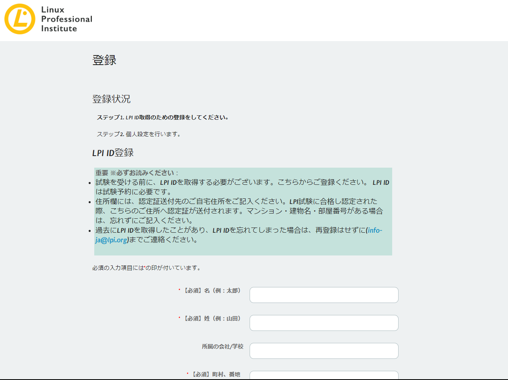
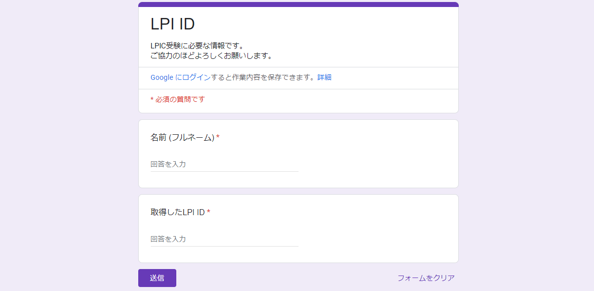

**LPIC受験のために必要なID** です。  
以下手順に沿って取得し、最終的にGoogle Formから取得した**LPI ID**を送信して下さい。  

### 手順 1. アカウント登録ページにアクセス

以下のリンクからアカウント登録ページにアクセスし、以下の画面を表示して下さい。  

[公式アカウント登録ページ(cs.lpi.org)](https://cs.lpi.org/caf/Xamman/register)

### 手順 2. 登録情報入力

画面下部に表示される項目を入力して下さい。  

:::tip
**※入力時の注意点**  
- `所属の会社/学校` は空欄で構いません
- 引越しが控えている方は**現住所**を入力して下さい (引越した場合はマイページから変更可能です)
- `ユーザー名` は一意の値である必要があるため、`名前_eightbit_co` 等、他者と重複しない値を設定します
- メールアドレスは会社から発行された `eightbit.co.jp` ドメインのものを使用して下さい
- ご自身で設定したパスワードは**忘れないように必ずメモしておいて下さい**  

:::

`LPIからのメール配信を希望しますか？` はチェックせず、  
`プライバシーポリシー` は **はい** を選択して`登録`ボタンをクリックするとアカウント作成は完了です。

### 手順 3. LPI ID確認

以下のリンクからログインページにアクセスし、以下の画面を表示して下さい。  

[公式ログインページ(cs.lpi.org)](https://cs.lpi.org/caf/Xamman/auth/login)

:::tip
**※入力時の注意点**  
- `ユーザー名` 欄には 先程登録した**eightbit.co.jpドメインのメールアドレス** を入力して下さい
:::

ログインに成功すると以下のようにマイページが表示されます。  
画面左上の**LPI**から始まる文字列がLPI IDですので、これをコピーしておきます。

### 手順 4. Google Formから送信

以下のURLにアクセスしてご自身のお名前 (※フルネーム) と先程コピーしたLPI IDを貼り付けて送信ボタンをクリックして下さい。

[Google Form (LPI ID送信用)](https://docs.google.com/forms/d/e/1FAIpQLSdERMNAI9rNt-tDUti74DzTwnSRfn7ZHegP4NjxoLWV--gNww/viewform)

以上で完了です。  
ご協力ありがとうございました！