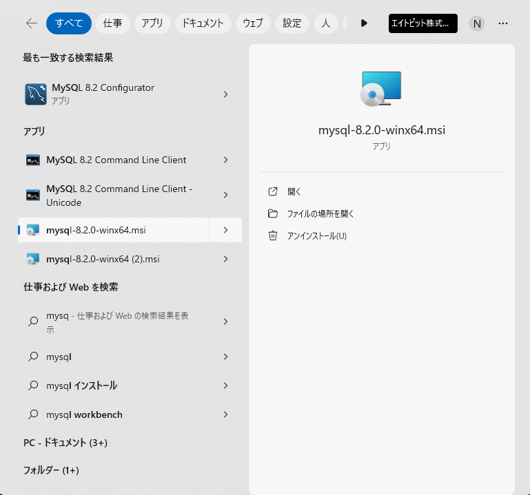
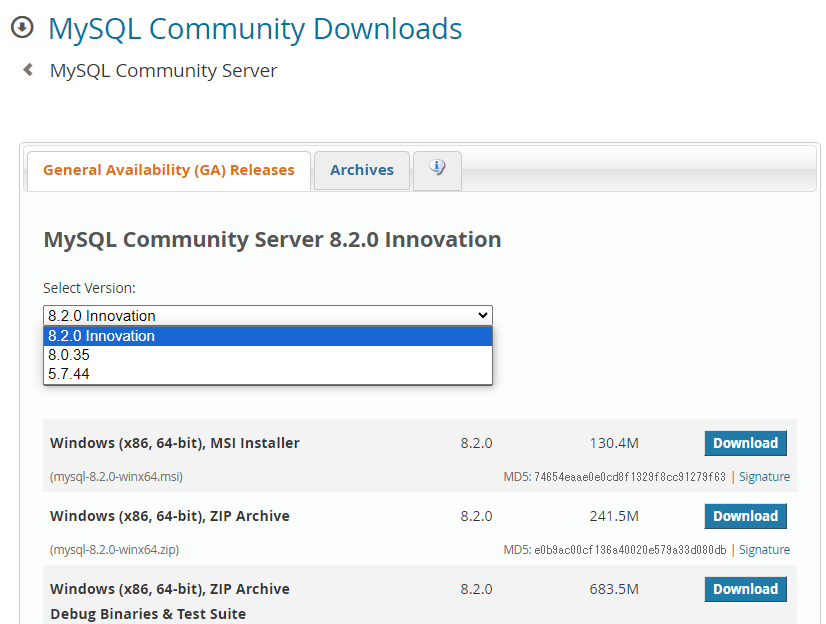
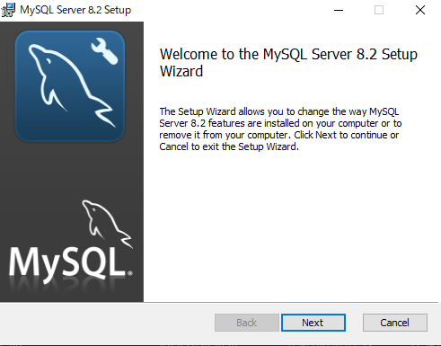
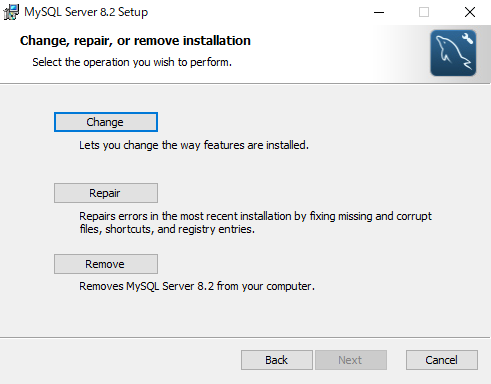
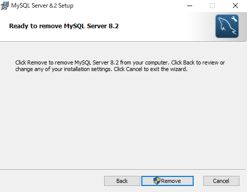
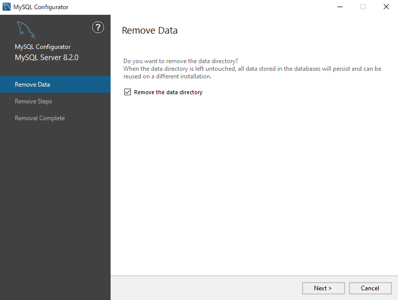
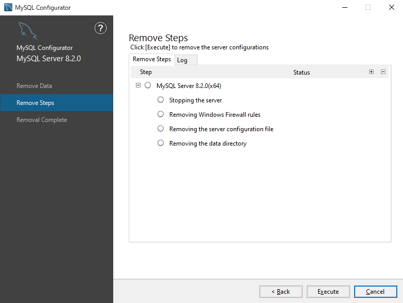
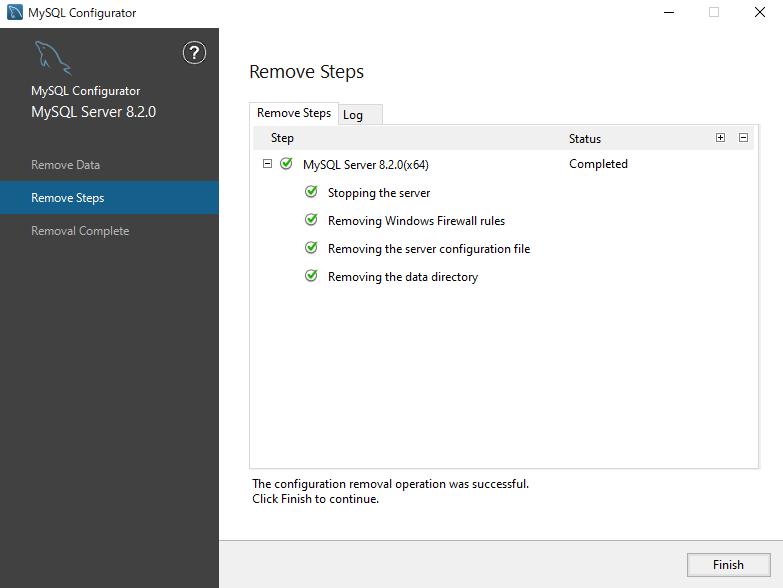
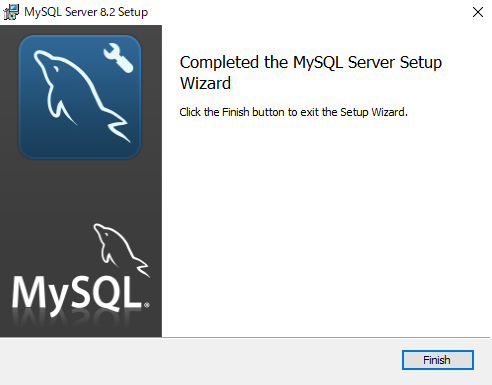

## インストーラの起動

コマンドプロンプトを立ち上げ、 `mysql --version` を実行し、  
インストールされているMySQLのバージョンを確認して下さい  

Windows上で `MySQL` と検索し、**MySQL-8.x.x-winx64.msi** を起動します  
(**8.x.x**の箇所は上記で確認したものと同じバージョンであることを確認して下さい)

もしインストーラが見つからない場合は以下のリンクから該当バージョンのインストーラをダウンロードし、それを実行しましょう  

[公式ダウンロードページ](https://dev.mysql.com/downloads/mysql/)

インストーラを実行すると以下の画面が表示されるので、  
``Next`` をクリックして次の画面に進みます

``Remove`` をクリック

``Remove`` をクリック  

削除処理が開始されますが、別画面として以下の画面が立ち上がるので  
**Remove the data directory** にチェックが入っていることを確認して`Next` をクリック  

``Execute`` をクリック  

しばらくすると以下の様に表示が変わるので、  
`Finish` をクリック

以下の画面が表示されたら`Finish` をクリック

以上でMySQLのアンインストールは完了です！