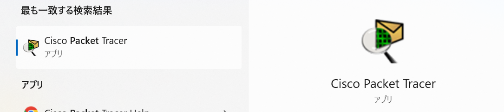
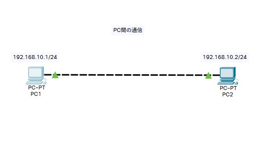
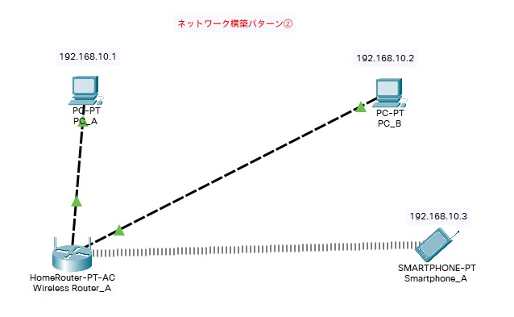
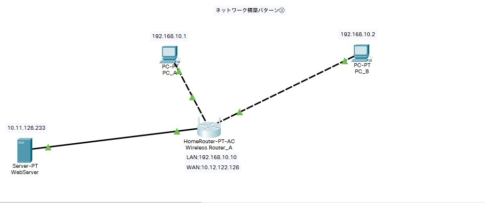
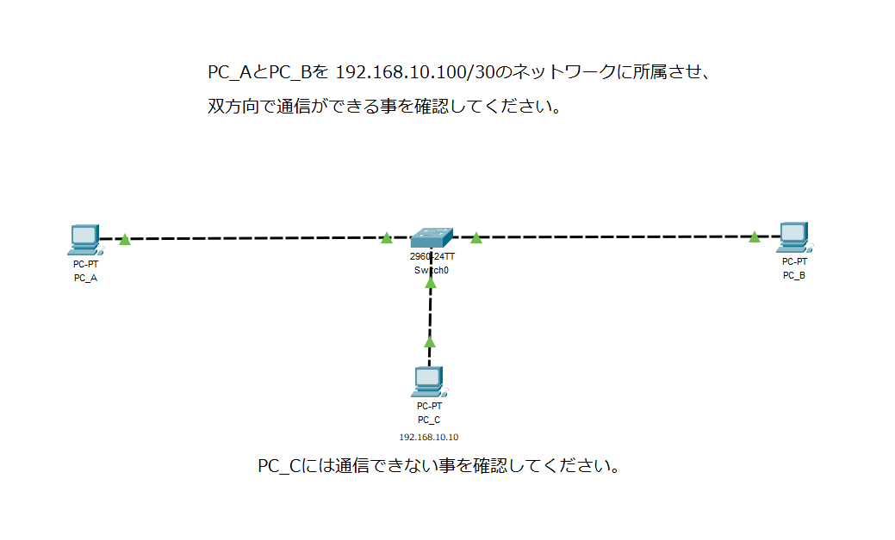
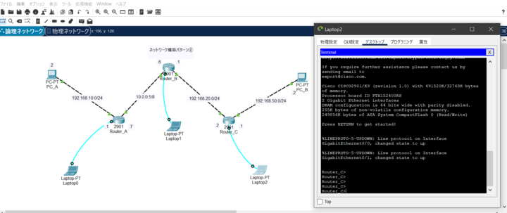
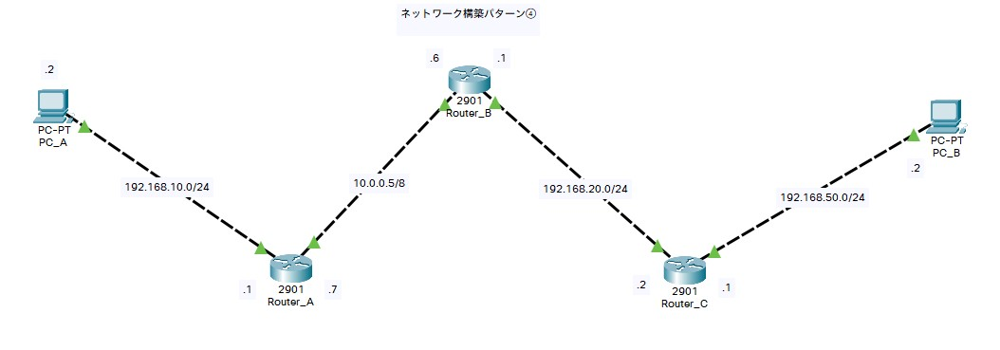
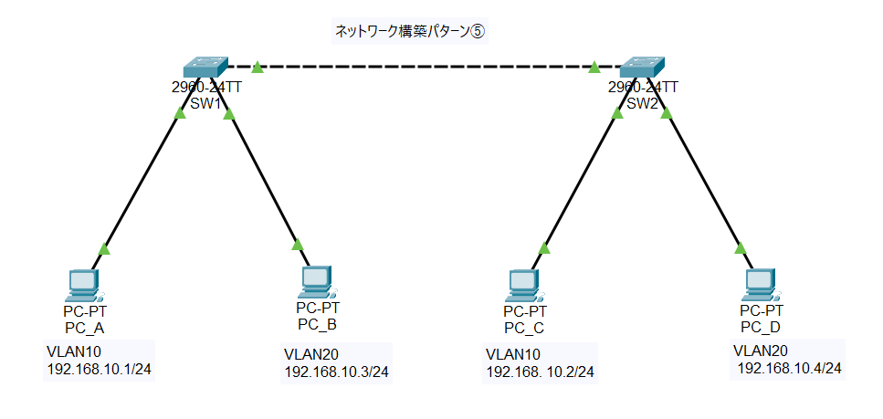
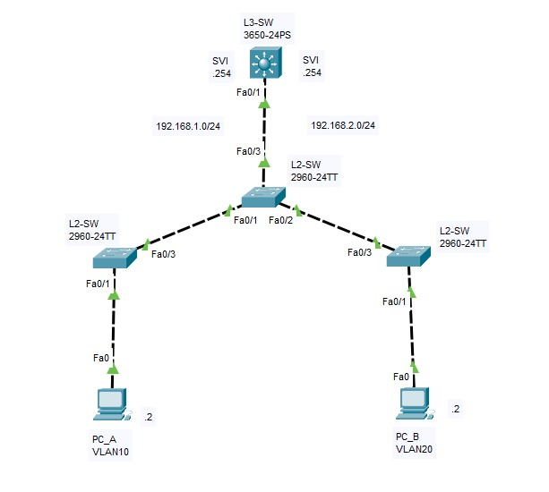

# Network基礎研修

    
導入

    

お使いのPCにPacketTracerというソフトウェアが入っているかどうかを確認して下さい  
画面下の検索窓に`packet tracer`と入力していただき、  
以下のソフトウェアが表示されればインストールされています

もしインストールされていなければ以下のリンクの手順を参考にインストールして下さい

[パケットトレーサー インストール手順](https://infra-note.net/cisco-packet-tracer/#index_id1)

    

    
IPアドレス計算問題

    

### 1. 導入動画

[動画リンク](https://drive.google.com/drive/folders/1ZQyJMaur5MWMoYINnIW4F3IV9P8vVR9z?usp=sharing)

上記のリンクの **第1章 LANテクノロジーから第4章 IPアドレッシング** までの動画を視聴して下さい  
視聴が完了したらら担当講師までお声がけいただき確認テストを実施してください

### 2. 確認テスト

以下のリンクをクリックし、課題用ファイルをダウンロードして下さい  

[計算問題リンク](./files/IPアドレス計算問題.pdf)  
[解答用紙リンク](./files/解答用紙.xlsx)

計算問題ファイルを見つつ課題に差し掛かったら解答用紙ファイルに回答を記入して下さい  
全ての回答が完了したら担当講師まで解答用紙ファイルをDMで送りましょう

:::caution
※確認テストは質問をしていただいてもいいですし、調べながら回答しても大丈夫ですが、  
大事な内容なので全問正解するまで繰り返し実施します
:::

    

    
パケットトレーサー課題

    

[動画リンク](https://drive.google.com/drive/folders/1ZQyJMaur5MWMoYINnIW4F3IV9P8vVR9z?usp=sharing)

上記のリンクの続きから視聴して下さい  
5章(IPルーティング)まで終わったら、以下の課題に着手しましょう

    
【課題1】

    

|ゴール|PC間で通信ができること  |
|:--------:|:--------|
|提出物1|ping の結果を講師にSlackで送る|
|提出物2|名前を付けて保存「.pkt」のファイルを講師に送る|
|ポイント|構成図を解読して、配線・各機器の設定を行い、疎通確認をする|
|構成図||  

    

    
【課題2】

    

|ゴール|すべてのコンピュータ間で通信ができること|
|:--------:|:--------|
|提出物1|ping の結果を講師にSlackで送る|
|提出物2|名前を付けて保存「.pkt」のファイルを講師に送る|
|ポイント|構成図を解読して、配線・各機器の設定を行い、疎通確認をする|
|構成図||  

    

    
【課題3】

    

|ゴール1|すべてのコンピュータ間で通信ができること|
|:--------:|:--------|
|ゴール2|各デバイスのブラウザからWebサーバにアクセスして「Webページ」が見れること|
|提出物1|ping の結果を講師にSlackで送る|
|提出物2|名前を付けて保存「.pkt」のファイルを講師に送る|
|ポイント|宛先が異なるネットワークの場合「とりあえずここに向かいましょう」という設定が必要|
|構成図||

    

    
【課題3-2】

    

|ゴール1|指定したコンピュータ間で通信ができること(VLANは使用しません)|
|:--------:|:--------|
|ゴール2|指定したコンピュータには通信ができない事|
|提出物1|ping の結果を講師にSlackで送る|
|提出物2|名前を付けて保存「.pkt」のファイルを講師に送る|
|ポイント|サブネットマスクでどう表現するか|
|構成図||
    

:::caution
### 課題4以降について

課題4から**ルータとスイッチ**のGUI操作を禁止します  
設定や確認はかならずコマンドで行いましょう  

※PCはこれまで通りGUI設定で問題ありません  
接続は以下のキャプチャのように**構築するネットワークとは関係ない**「作業用のPC」を準備していただき  
コンソールケーブルで直接つないでください  

||ポート名称|
|----|----|
|作業用PC|RS232|
|ルータ|console|

作業用PCのデスクトップから「ターミナル」を選択して接続していただくと、コマンドが入力できる状態になります

:::

    
【課題4】

    

|ゴール1|すべてのコンピュータ間で通信ができること(ルータを含め)|
|:--------:|:--------|
|提出物1|ping の結果を講師にSlackで送る|
|提出物2|名前を付けて保存「.pkt」のファイルを講師に送る|
|ポイント|スタティックルーティングの設定|
|構成図||

:::caution
※今回、ダイナミックルーティングは使用しません  
※ルータの設定は実務さながら、「設定用のPCを用意してコンソール接続」で設定ください
:::

    

14章(VLAN間ルーティング)まで終わったら、以下の課題に着手しましょう

    
【課題5】

    

|ゴール1|同じvlan 同士のPCで、通信が出来ること。(違うvlanのPC同士では通信出来ないこと)|
|:--------:|:--------|
|提出物1|ping の結果を講師にSlackで送る|
|提出物2|名前を付けて保存「.pkt」のファイルを講師に送る|
|ポイント|VLAN, Trunk Port|
|構成図||

:::caution
※スイッチの型番はCatalyst2960です  
※スイッチの設定は実務さながら、「設定用のPCを用意してコンソール接続」で設定ください
:::

    

    
【課題6】

    

|ゴール|VLAN間ルーティングでPC_A PC_Bのpingが成功するようにしましょう。|
|:--------:|:--------|
|提出物1|ping の結果を講師にSlackで送る|
|提出物2|名前を付けて保存「.pkt」のファイルを講師に送る|
|ポイント|L3Switchには、SVIを設定してください|
|構成図||

:::caution
※スイッチの型番はCatalyst2960です  
※スイッチの設定は実務さながら、「設定用のPCを用意してコンソール接続」で設定ください
:::

    

    

