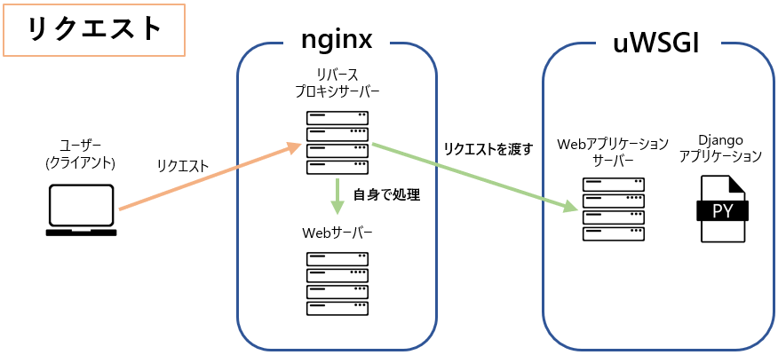
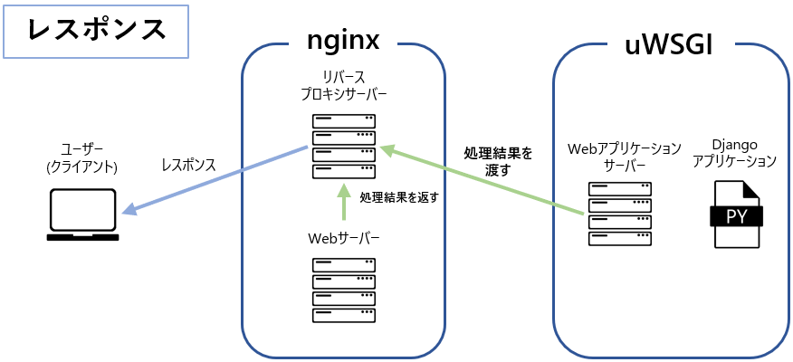

# デプロイ環境構築

Djangoプロジェクトを公開するために、仮想マシンでサーバを構築して下さい。

#### バージョン指定

|ソフトウェア|バージョン指定|
|--|--|
|AlmaLinux|9.5|
|Python |3.12|
|PostgreSQL|17|

:::tip
## 進め方
1. Gitをインストールする  
2. Pythonをインストールする  
3. 任意の階層にサンプルプロジェクトをクローンする
4. uwsgiやpsycopg2等必要なライブラリをインストールする
5. nginxをインストールする
6. PostgreSQLをインストールしDBとユーザを作成する
7. 開発サーバで正常動作するか確認する
8. uwsgiとnginxを連携させる設定を入れ、正常動作する確認する
:::

#### 必要リソース
以下をダウンロードして使用して下さい
- [DB作成クエリ](./files/mysite.sql)
- [サンプルプロジェクト](https://github.com/esx11954/mysite)

## 重要事項説明
Oracle VM VirtualBoxに新たな仮想マシンを作成し、サーバーを構築します  
予めLinuxの初期セットアップとSE Linuxの無効化を実施してください  

仮想マシンのハードウェアの設定は以下のパラメータに設定して下さい。

|項目|パラメータ|
|--|--|
|メモリ(RAM)|2048MB|
|ディスクストレージ|20GB|
|ネットワーク|ブリッジアダプター|

また、Djangoプロジェクトのクローン先は以下とします。

```bash
/opt
```

:::caution
Linux上の操作・コマンドについては、詳細に解説をしていません  
過去の研修内容やWeb上の文献を参考に、構築を進めましょう
:::


### Python
---
Pythonなど作成したアプリケーションの動作に必要なソフトウェアは、開発環境に合わせ、適したバージョンをインストールする必要があります  
今回は **バージョン 3.12** をインストールしましょう  

指定のバージョンをインストールするために以下を実行し、パッケージの最新化をしておきましょう。
```bash
dnf update
```

### nginx
---
nginxは、Webサーバーを提供するソフトウェアであり、クライアントへ **静的** なWebコンテンツを配信することができます  

また、nginxは **リバースプロキシサーバー** を提供します  
DjangoアプリケーションはPythonを利用した **動的** なWebコンテンツを提供するため、nginx単体ではDjangoアプリケーションを公開することはできません  

このような場合、**リバースプロキシサーバー** を利用し、別途構築したWebアプリケーションサーバーとnginxを連携させる必要があります  
詳細については、後述のuWSGI項で解説します  

nginxでは、公式サイトにてソフトウェアリポジトリが提供されています  
以下の公式ページを参考にソフトウェアリポジトリを新たに追加し、インストールしてください  


### PostgreSQL
---
PostgreSQL17をインストールします  

PostgreSQLも公式サイトにてソフトウェアリポジトリが提供されています  
以下の公式ページを参考にソフトウェアリポジトリを新たに追加し、バージョン **17** をインストールしてください  

インストールが完了したら、サンプルアプリケーションに必要なDBとユーザを作成します  

1. 以下のコマンドでPostgreSQLにログインします  

```bash
sudo -i -u postgres psql
```

2. 以下のクエリを実行して下さい  

```sql
CREATE USER myuser WITH PASSWORD 'mypassword';
ALTER ROLE myuser SET client_encoding TO 'utf8';
ALTER ROLE myuser SET default_transaction_isolation TO 'read committed';
ALTER ROLE myuser SET timezone TO 'UTC';
CREATE DATABASE mydatabase with owner myuser;
GRANT ALL PRIVILEGES ON DATABASE mydatabase TO myuser;
\q
```

3. プロジェクトの階層に移動して以下のコマンドを実行し、マイグレーションして下さい

```bash
python manage.py migrate
```

### uWSGI
---
uWSGIは、Pythonなど様々な言語に対応した **Webアプリケーションサーバー** を提供するソフトウェアです  
通常はnginxやApacheといった **Webサーバー** と連携することで、Webアプリケーションをユーザーへ公開します  

この連携は、前述した **リバースプロキシサーバー** を利用することで実現することができます  
リバースプロキシサーバー自体の詳細な解説は省きます  

今回の場合、nginxにはリバースプロキシサーバーとして振る舞いつつ、Webサーバーとして自身で静的なコンテンツをレスポンスさせます  
それ以外の動的コンテンツについては、uWSGIへリクエストを連携し、uWSGIの処理結果をユーザー(クライアント)へレスポンスするよう設定します  




### 起動確認
---
設定が正しく完了している場合、開発サーバと同様の ```http:// {LinuxサーバーのIPアドレス} :8080``` にアクセスすることで、Webアプリケーションが表示されます 

