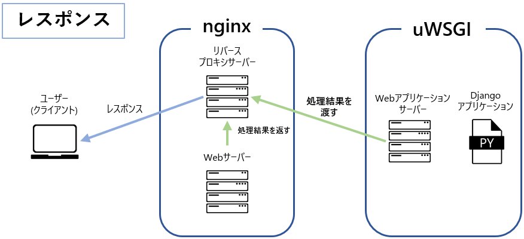

# デプロイ環境構築

## ソフトウェアのインストール
Oracle VM VirtualBoxに新たな仮想マシンを作成し、サーバーを構築します  
予めLinuxの初期セットアップとSE Linuxの無効化を実施してください  

また、各手順で使用するソースファイルのダウンロード先は以下とします。
```bash
/usr/local/src
```

:::caution
Linux上の操作・コマンドについては、一部を除き詳細に解説をしていません  
過去の研修内容やWeb上の文献を参考に、構築を進めましょう
:::

### OpenSSL
初めに、Pythonと依存関係であるOpenSSLをインストールします  
CentOS 7では、OpenSSLが標準でインストールされていますが、バージョンが古いため最新のバージョンをインストールします  

:::tip
OpenSSLは暗号通信プロトコルを提供する、セキュリティ上において極めてデリケートなソフトウェアです  
古いバージョンの使用は、脆弱性が存在するため推奨されません  
そのため、サーバーを運用する際は常に最新のバージョンを保つことが大切です  
:::

<details>
    <summary>OpenSSL: インストール手順</summary>

1. 以下のyumコマンドを実行し、依存関係パッケージをインストール
```bash title="OepnSSLの依存関係パッケージ"
yum -y install wget perl perl-Test-Simple perl-Test-Harness libffi-devel gcc zlib-devel bzip2 bzip2-devel readline readline-devel sqlite sqlite-devel tcl tcl-devel perl-IPC-Cmd
yum -y groupinstall "Development Tools"
```

2. 標準でインストールされているOpenSSLをアンインストールする

3. OpenSSLの公式サイトへアクセス  
[OpenSSL 公式サイト](https://www.openssl.org/source/)
4. 最新バージョンのダウンロードリンクから  
tar.gzファイル(ソースファイルの圧縮ファイル)のURLを取得

5. Linux上で、上記のURLを利用しファイルをダウンロードする

6. ダウンロードしたtar.gzファイルを解凍する

7. 解凍したディレクトリ内の```config```ファイルを実行する

8. ソースファイルをコンパイルする

9. コンパイルしたOpenSSLをインストールする

10. 以下のとおり共有ライブラリ設定ファイルを作成する  
共有ライブラリ設定ファイル: ```/etc/ld.so.conf.d/openssl.conf```  
内容: ```/usr/local/lib64``` (OpenSSLのインストール先)

11. 共有ライブラリのキャッシュファイルを更新する

12. 以下のとおりシンボリックリンクを作成し、opensslコマンドを有効化する  
リンクファイルパス: ```/usr/local/bin/openssl```  
リンク先: ```/usr/bin/openssl```

13. opensslコマンドを利用し、バージョンが表示できることを確認する
```bash title="表示例"
OpenSSL 3.3.0 09 Apr 2024 (Library: OpenSSL 3.3.0 09 Apr 2024)
```
</details>

### SQLite3
Pythonと依存環境であるSQLite3をインストールします  
CentOS 7では標準でインストールされていますが、バージョンが古いため最新バージョンをインストールします  

<details>
    <summary>SQLite3: インストール手順</summary>
1. SQLiteの公式サイトへアクセス  
[SQLite 公式サイト](https://www.sqlite.org/download.html)

2. [Source Code]項のダウンロードリンクからtar.gzファイルのURLを取得

3. Linux上で、上記のURLを利用しファイルをダウンロードする

4. ダウンロードしたtar.gzファイルを解凍する

5. 解凍したディレクトリ内の```configure```ファイルを、以下のオプションを付加し実行する  
```bash
--prefix=/usr/local
```

6. ソースファイルをコンパイルする

7. コンパイルしたSQLite3をインストールする

8. 以下のとおり共有ライブラリ設定ファイルを作成する  
共有ライブラリ設定ファイル: ```/etc/ld.so.conf.d/sqlite3.conf```  
内容: ```/usr/local/lib``` (SQLite3のインストール先)

9. 共有ライブラリのキャッシュファイルを更新する

10. 以下のとおりシンボリックリンクを作成し、sqlite3コマンドを有効化する  
リンクファイルパス: ```/usr/local/bin/sqlite3```  
リンク先: ```/usr/bin/sqlite3```  
:::caution
既に ```/usr/local/bin/sqlite3``` が存在する場合は、```sqlite3```ディレクトリを任意の名前へ変更後、シンボリックリンクを作成してください
:::

11. sqlite3コマンドを利用し、バージョンが表示できることを確認する
```bash title="表示例"
SQLite version 3.45.3 2024-04-15 13:34:05
```
</details>

### Python
次に、Pythonをインストールします  
Pythonなど作成したアプリケーションの動作に必要なソフトウェアは、開発環境に合わせ、適したバージョンをインストールする必要があります  
今回は **バージョン 3.11.9** をインストールしましょう  


<details>
    <summary>Python: インストール手順</summary>
1. Pythonの公式サイトへアクセス  
[Python 公式サイト](https://www.python.org/downloads/release/python-3119/)

2. バージョン 3.11.9 のダウンロードリンク(XZ compressed source tarball)から、tar.gzファイルのURLを取得

3. Linux上で、上記のURLを利用しファイルをダウンロードする

4. ダウンロードしたtar.gzファイルを解凍する

5. 解凍したディレクトリ内の```configure```ファイルを実行する

6. ソースファイルをコンパイルする

7. Pythonをインストールする

8. 以下のとおりシンボリックリンクを作成し、pythonコマンドを有効化する  
リンクファイルパス: ```/usr/local/bin/python3.11```  
リンク先: ```/usr/bin/python3```  

9. 以下のとおりシンボリックリンクを作成し、pipコマンドを有効化する  
リンクファイルパス: ```/usr/local/bin/pip3.11```  
リンク先: ```/usr/bin/pip3```  

11. python3コマンドとpipコマンドを利用し、それぞれのバージョンが表示できることを確認する
```bash title="表示例"
Python 3.11.9
pip 24.0
```
</details>

### nginx
nginxは、Webサーバーを提供するソフトウェアであり、クライアントへ **静的** なWebコンテンツを配信することができます  

また、nginxは **リバースプロキシサーバー** を提供します  
DjangoアプリケーションはPythonを利用した **動的** なWebコンテンツを提供するため、nginx単体ではWebアプリケーションを公開することはできません  

このような場合、**リバースプロキシサーバー** を利用し、別途構築したWebアプリケーションサーバーとnginxを連携させる必要があります  
詳細については、後述のuWSGI項で解説します  

<details>
    <summary>nginx: インストール手順と初期設定</summary>


<h4>インストール手順</h4>

nginxでは、公式サイトにてソフトウェアリポジトリが提供されています  
以下の公式ページを参考にソフトウェアリポジトリを新たに追加し、バージョン **1.26** をインストールしてください  

[nginx 公式サイト](https://nginx.org/en/linux_packages.html)

インストールが完了したら、バージョンが表示できることを確認してください
```bash title="表示例"
nginx version: nginx/1.26.0
```

<h4>初期設定</h4>

1. nginxのサービスを有効化する  
:::tip
サービスを有効化することで、OS起動時にnginxが自動起動されます
:::

2. 以下の条件で、nginxの実行ユーザーを作成する  
ユーザー名: ```nginx```  
非ログインユーザー(su等でのログインができないこと)  

</details>

### PostgreSQL
PostgreSQL13をインストールします

<details>
    <summary>PostgreSQL: インストール手順と初期設定</summary>


<h4>インストール手順</h4>

PostgreSQLも公式サイトにてソフトウェアリポジトリが提供されています  
以下の公式ページを参考にソフトウェアリポジトリを新たに追加し、バージョン **13** をインストールしてください  

また、PostgreSQLをPythonで使用するためのコネクタソフトウェア「python3-psycopg2」をインストールしてください  

[PostgreSQL 公式サイト](https://www.postgresql.org/download/)

インストールが完了したら、バージョンが表示できることを確認してください
```bash title="表示例"
psql (PostgreSQL) 13.2
```

<h4>初期設定</h4>

1. PostgresSQLのPATHを設定する  
PostgreSQLのインストール先ディレクトリ内の **bin** ディレクトリを指定すること

2. postgresql-13のサービスを有効化する  

3. データベースの初期化を行う

4. postgresql-13サービスを起動する

5. PostgreSQLにログインし、以下を実施する  
    - Djangoアプリケーション用のロールを作成する
    - Djangoアプリケーション用のデータベースを作成する  
  ロール名やデータベース名は、Djangoアプリケーションの設定に準拠すること
</details>

## Djangoのデプロイ
前提となるソフトウェアのインストールが終わったところで  
次にDjangoアプリケーションをデプロイします  

### Djangoプロジェクトの配置
以下のディレクトリを作成し、Djangoプロジェクトを配置してください  
なお、プロジェクトファイルはTeraTermのSSH SCP機能を使って転送しましょう  
```bash 
/var/www/
```

### 仮想環境(venv)
Djangoプロジェクトへ ```venv``` を利用した仮想環境を構築してください  
また、構築した仮想環境には以下のライブラリをインストールしましょう  

- django
- uwsgi
- django-allauth
- django-bootstrap5
- psycopg2-binary
- psycopg2
- pillow

### 環境変数
以下の手順を実施し、Djangoアプリケーションで使用する環境変数を設定してください  

1. 以下のファイルを作成し、環境変数を記述する  
実際の内容は、Djangoアプリケーションで使用するものを各自で設定してください  
```bash title="/etc/nginx/.env_profile"
export DB_USER=[DBユーザー名]
export DB_PASSWORD=[パスワード]
export DJANGO_SETTINGS_MODULE={Djangoプロジェクト名}.settings
export ALLOWED_HOSTS=[LinuxサーバーのIP]
export FROM_EMAIL=email@eightbit.co.jp
export DJANGO_SECRET_KEY='1234567890QWERTYUIOP@['
```

2. ホームディレクトリに存在する ```.bash_profile``` ファイルへ  
sourceコマンドを記述し、作成した ```.env_profile``` ファイルを反映させる

3. ```.bash_profile``` ファイルを反映させる

### uWSGI
uWSGIは、Pythonなど様々な言語に対応した **Webアプリケーションサーバー** を提供するソフトウェアです  
通常はnginxやApacheといった **Webサーバー** と連携することで、Webアプリケーションをユーザーへ公開します  

この連携は、前述した **リバースプロキシサーバー** を利用することで実現することができます  
リバースプロキシサーバー自体の詳細な解説は省きます  

今回の場合、nginxにはリバースプロキシサーバーとして振る舞いつつ、Webサーバーとして自身で静的なコンテンツをレスポンスさせます  
それ以外の動的コンテンツについては、uWSGIへリクエストを連携し、uWSGIの処理結果をユーザー(クライアント)へレスポンスするよう設定します  




では、uWSGIとnginxの連携を設定しましょう

<details>
    <summary>uWSGI: nginxとの連携手順</summary>

<h4>uWSGI側の設定</h4>

1. 以下のディレクトリを作成し所有者と権限設定を行う  
所有者: ```root:nginx```  
権限: ```+w```
```bash
/var/run/uwsgi
```

2. Djangoプロジェクト内に作成したvenvの仮想環境ディレクトリへ以下を作成する  
内容の一部は適宜、自身の環境に合わせて変更すること  

```bash title="{Djangoプロジェクト内に作成した仮想環境ディレクトリ}/uwsgi_params"
uwsgi_param  QUERY_STRING       $query_string;
uwsgi_param  REQUEST_METHOD     $request_method;
uwsgi_param  CONTENT_TYPE       $content_type;
uwsgi_param  CONTENT_LENGTH     $content_length;

uwsgi_param  REQUEST_URI        $request_uri;
uwsgi_param  PATH_INFO          $document_uri;
uwsgi_param  DOCUMENT_ROOT      $document_root;
uwsgi_param  SERVER_PROTOCOL    $server_protocol;
uwsgi_param  REQUEST_SCHEME     $scheme;
uwsgi_param  HTTPS              $https if_not_empty;

uwsgi_param  REMOTE_ADDR        $remote_addr;
uwsgi_param  REMOTE_PORT        $remote_port;
uwsgi_param  SERVER_PORT        $server_port;
uwsgi_param  SERVER_NAME        $server_name;
```

```bash title="{Djangoプロジェクト内に作成した仮想環境ディレクトリ}/uwsgi.ini"
[uwsgi]
uid = nginx
gid = nginx

# Djangoアプリのルートを指定
# (Djangoのプロジェクト名が「testsite」の場合は「/var/www/testsite/testsite/」を参照させる)
chdir = {Djangoアプリのルート}

# wsgi.pyの場所を指定する
# (Djangoのプロジェクト名が「testsite」の場合は「/var/www/testsite/testsite/」配下のwsgi.pyを参照させる)
module = {wsgi.pyの場所}.wsgi

# 仮想環境の場所を指定する
home = {仮想環境ディレクトリ}

master = true
processes = 2
threads = 1

# unix-socketとpidファイルの作成先として、前手順で作成したディレクトリを指定
socket = /var/run/uwsgi/master.sock
pidfile = /var/run/uwsgi/master.pid

# nginxとの連携設定
chmod-socket = 666
vacuum = true
thunder-lock = true
max-requests = 6000
max-requests-delta = 300

# ログファイルの作成先を指定
logto = /var/log/uwsgi/uwsgi.log
deamonize = /var/log/uwsgi/uwsgi-@(exec://date +%Y-%m-%d).log
log-reopen = true
```

3. 以下のログ格納ディレクトリを作成
```
/var/log/uwsgi/
```

4. 以下のuWSGIサービスの定義ファイルを作成する  
内容の一部は適宜、自身の環境に合わせて変更すること  
```bash title="/etc/systemd/system/uwsgi.service"
# uwsgi.service
[Unit]
Description=uWSGI
After=syslog.target

[Service]
ExecStartPre=/bin/bash -c 'mkdir -p /var/run/uwsgi; chown root:nginx /var/run/uwsgi; chmod g+w /var/run/uwsgi;'
# 作成した仮想環境のディレクトリ配下のactivateとuwsgi.iniファイルを指定する。
ExecStart=/bin/bash -c 'source /etc/nginx/.env_profile; source {仮想環境ディレクトリ}/bin/activate; uwsgi --ini {仮想環境ディレクトリ}/uwsgi.ini'
#Restart=always
Restart=on-failure
KillSignal=SIGQUIT
Type=notify
StandardError=syslog
NotifyAccess=all

[Install]
WantedBy=multi-user.target
```

4. 作成したuWSGIのサービスを有効化し、起動する


<h4>nginx側の設定</h4>

1. 以下2つのディレクトリを作成する
```bash title="バーチャルホスト設定ファイルの格納ディレクトリ"
/etc/nginx/sites-available
```
```bash title="バーチャルホスト設定ファイルの有効化用ディレクトリ"
/etc/nginx/sites-enabled
```

2. 以下のファイルを作成する  
内容の一部は適宜、自身の環境に合わせて変更すること  
```bash title="/etc/nginx/sites-available/{Djangoプロジェクト名}"
# Djangoの設定
upstream django {
    # unixソケットファイルの場所を指定する。
    server unix:///var/run/uwsgi/master.sock;
}

# サーバの設定
server {
    # ポート番号
    listen      8080;
    # VPSのIPアドレスを入力する
    server_name {LinuxサーバーのIPアドレス};
    charset     utf-8;

    # Djangoの静的ファイルの設定
    # nginxが静的コンテンツの配信を担う
    location /static {

        # 今回は'/var/www/static'に配置するのでルートフォルダにwwwを指定
        root '/var/www';
    }

    location / {
        # 上記で記述したunixソケットを使用する
        uwsgi_pass  django;
        # 前手順で作成したuwsgi_paramsの場所を指定する
        include     {uwsgi_paramsを作成した場所};
    }
}
```

3. 以下のシンボリックリンクを、バーチャルホスト設定を有効化用ディレクトリに作成する  
リンクファイルパス: ```/etc/nginx/sites-available/{Djangoプロジェクト名}```  
リンク先: ```/etc/nginx/sites-enabled/{Djangoプロジェクト名}```  

4. nginxの設定ファイル ```nginx.conf``` へ以下を追記する
```bash title="nginx.conf" {4}
http {
     ...
     #gzip  on;
+    include /etc/nginx/sites-enabled/*;

     server {
     ...
     }
}
```

5. nginxサービスを再起動する

</details>

## 起動確認
最後に、Djangoプロジェクトの開発時と同様にマイグレーション等を行い、実行できる状態にしてください  
指定書籍を参考にしている場合、書籍 P.353 以降および P.372 以降を参考にしてください  

以下の点にも注意しましょう  
- setting.pyで指定する静的ファイルの場所は、nginxに設定したものと一致させる必要がある  
- Djangoアプリケーションの実行ユーザーは ```nginx``` ユーザーで、```nginx``` グループに属しています  
アプリケーションが **操作** するファイルやディレクトリの所有者・権限に注意 

設定が正しく完了している場合、 ```http:// {LinuxサーバーのIPアドレス} :8080``` にアクセスすることで、Webアプリケーションが表示されます  