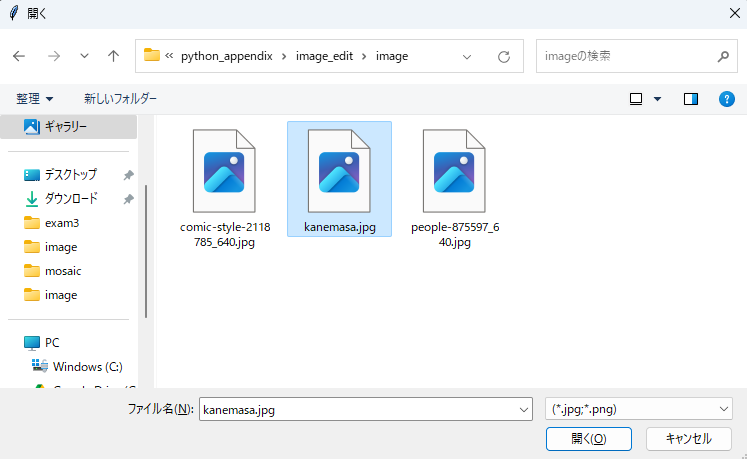

# 課題1 画像処理

この課題では画像ファイルを扱います  
検証用として [**こちらの画像**](./files/kanemasa.jpg) をダウンロードして使用して下さい  

また、後述する「分類器」として扱うファイルも必要ですので [**こちらのファイル**](./files/xml.zip) もダウンロードして下さい

## プログラムの動作

プログラム実行後に以下の画面 (ダイアログ) が表示され、画像ファイル(jpgまたはpng)を選択する



画像選択後、モザイク処理が行われプログラム内で指定したフォルダに加工後の画像が保存される

#### 加工前の画像


#### 加工後の画像


### 要件
- ターミナルからプログラムを実行する
- ファイルダイアログから画像ファイルを選択できる
- 画像内の人の顔を認識し、その部分にモザイクをかける
- 任意のフォルダに保存する
- 保存先のフォルダはプログラム内で指定し、存在しなければプログラムで作成する


:::tip
## 処理の流れ
プログラムは大きく以下の流れで実装することになります

1. 画像読み込み
2. 顔検出
3. モザイク処理
4. 画像ファイル保存

完成したら他の画像でも試してみましょう


## 分類器とは
物体検出を行うためには検出したい物体(この課題では人の顔)がどんな特徴を持っているのか、  
該当する物体を含む画像と含まない画像（＝学習用画像）を用意し、検出したい物体の特徴を抽出します  
この特徴を「特徴量」と呼び、学習用画像すべての「特徴量」をまとめたデータのことを「カスケード分類器」と呼びます


## OpenCVとは
画像処理、画像解析および機械学習等の機能を持つライブラリ  
オープンソースなので誰でも使用することができます

python上で扱う場合は以下のコマンドを実行し、インストールする必要があります
```
pip install opencv-python
```

:::