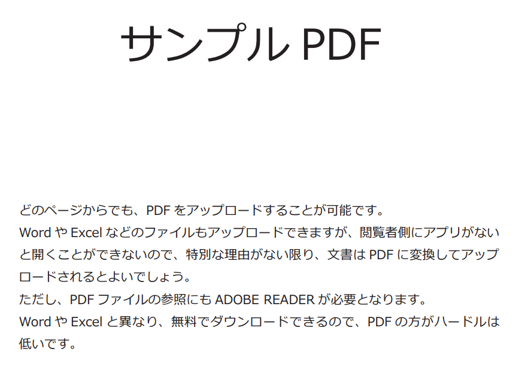
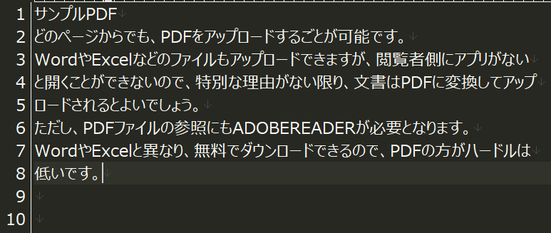

# Appendix

### 概要
PDFファイルに記載されている文字をテキストデータとして保管したいケースを想定し、  
python上でPDFを読み込み、OCRエンジンを利用してテキスト出力して下さい  

以下のファイルをダウンロードして使用して下さい  
[**テストデータ**](./files/sample_pdf.pdf)

### 実行イメージ

#### 入力ファイル(PDFファイル)

#### 出力ファイル(txtファイル)

:::tip
### OCRとは
光学文字認識 = OCR(Optical Character Recognition)は  
画像データのテキスト部分を認識し、文字データに変換する光学文字認識機能のことです  
紙文書やそのスキャンデータ等を読み込み、書かれている文字を認識してデジタル化する技術です  

プログラム上で活用することにより、大量の画像データやPDFデータから文字列データを抽出し、  
データベース化する等、データの再利用性という観点でも非常に優れます  

近年のDX推進の流れにより、業務効率化のために導入する企業は増えています  
AIを導入すると精度はかなり上昇しますが、本研修では扱いません  
OCRによる処理の前段データに対する処理により、精度を向上させることも可能ですので、色々と試してみましょう

:::