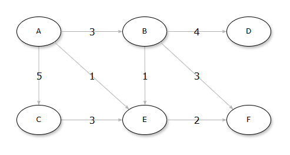

# アルゴリズム課題解答例

## 部分ソートの実装
---

与えられた以下の整数のリスト `nums` と、2つのインデックス `start` と `end` が与えられたとき、  
`nums` の `start` から `end` までの部分リストをソートしてください。ただし、元のリスト `nums` を変更してください。

<details>
    <summary>解答例</summary>
```python
nums = [5, 2, 8, 1, 9, 4]
start = 1
end = 4

def partial_sort(nums, start, end):
    """部分ソート"""
    nums[start:end + 1] = sorted(nums[start:end + 1])

partial_sort(nums, start, end)
print("部分ソート後のリスト:", nums)

```
</details>

## マージソートの実装
---

与えられた以下のタプルのリスト `data` を、各タプルの2番目の要素に基づいてソートを行ってください。  

```Python
data = [("apple", 3), ("banana", 1), ("cherry", 2), ("date", 1), ("elderberry", 3)]
```

<details>
    <summary>解答例</summary>
```python
data = [("apple", 3), ("banana", 1), ("cherry", 2), ("date", 1), ("elderberry", 3)]

def merge_sort_stable(data):
    """マージソート"""
    if len(data) <= 1:
        return data

    mid = len(data) // 2
    left = merge_sort_stable(data[:mid])
    right = merge_sort_stable(data[mid:])

    merged = []
    i = j = 0
    while i < len(left) and j < len(right):
        if left[i][1] <= right[j][1]:
            merged.append(left[i])
            i += 1
        else:
            merged.append(right[j])
            j += 1

    merged.extend(left[i:])
    merged.extend(right[j:])
    return merged

sorted_data = merge_sort_stable(data)
print("ソート結果:", sorted_data)
```
</details>

## 深さ優先探索による組み合わせ列挙
---

与えられた整数のリスト `nums` から、指定された長さ `k` の組み合わせをすべて列挙してください。

```Python
nums = [1, 2, 3, 4]
k = 2
```

<details>
    <summary>解答例</summary>
```python
def combinations(nums, k):
    """深さ優先探索で組み合わせを列挙する関数"""
    result = []

    def dfs(index, current):
        if len(current) == k:
            result.append(current[:])  # currentのコピーを追加
            return

        if index == len(nums):
            return

        # nums[index] を含む組み合わせ
        current.append(nums[index])
        dfs(index + 1, current)

        # nums[index] を含まない組み合わせ
        current.pop()
        dfs(index + 1, current)

    dfs(0, [])
    return result

# 整数のリストと組み合わせの長さ
nums = [1, 2, 3, 4]
k = 2

# 組み合わせを列挙する
result = combinations(nums, k)

# 結果の出力
print(result)
```
</details>

## ダイクストラ法による最短経路探索
---

以下のグラフにおいて、頂点Aから各頂点への最短経路とその距離をダイクストラ法を用いて求めてください。



<details>
    <summary>解答例</summary>
```python
import heapq

def dijkstra(graph, start):
    """ダイクストラ法で最短経路を求める関数"""
    distances = {node: float('inf') for node in graph}
    distances[start] = 0
    pq = [(0, start)]  # 優先度付きキュー (距離, 頂点)

    while pq:
        dist, current_node = heapq.heappop(pq)

        if dist > distances[current_node]:
            continue

        for neighbor, weight in graph[current_node].items():
            distance = dist + weight
            if distance < distances[neighbor]:
                distances[neighbor] = distance
                heapq.heappush(pq, (distance, neighbor))

    return distances

# グラフの定義
graph = {
    'A': {'B': 3, 'C': 5, 'E': 1},
    'B': {'A': 3, 'D': 4, 'E': 1, 'F':3},
    'C': {'A': 5, 'E': 3},
    'D': {'B': 4},
    'E': {'A': 1, 'B': 1, 'C': 3, 'F': 2},
    'F': {'B': 3, 'E': 2}
}

# 始点から各頂点への最短距離を求める
distances = dijkstra(graph, 'A')

# 結果の出力
for node, distance in distances.items():
    print(f"A -> {node}: {distance}")

```
</details>

## 動的計画法によるナップサック問題
---

以下の品物のリストとナップサックの容量が与えられたとき、  
ナップサックに入れる品物の価値の合計を最大化してください。  
※ナップサックの容量は`50`とします。  
※重複する品物は入れられないものとします。  

|品物|価値|重さ(コスト)|
|---|---|---|
|A|10|5|
|B|30|10|
|C|60|20|
|D|120|30|
|E|150|35|

<details>
    <summary>解答例</summary>
```python
def unbounded_knapsack(values, weights, capacity):
    """ナップサック問題を動的計画法で解く関数"""
    n = len(values)
    dp = [0] * (capacity + 1)

    for w in range(1, capacity + 1):
        for i in range(n):
            if weights[i] <= w:
                dp[w] = max(dp[w], dp[w - weights[i]] + values[i])

    # 選んだ品物を特定（重複あり）
    selected_items = []
    w = capacity
    while w > 0:
        max_value = dp[w]
        for i in range(n):
            if weights[i] <= w and dp[w - weights[i]] + values[i] == max_value:
                selected_items.append(i)
                w -= weights[i]
                break

    return dp[capacity], selected_items[::-1]  # 最大価値と選んだ品物のリストを返す

# 品物の価値と重さ
values = [10, 30, 60, 120, 150]
weights = [5, 10, 20, 30, 35]

# ナップサックの容量
capacity = 50

# 最大価値と選んだ品物を求める
max_value, selected_items = unbounded_knapsack(values, weights, capacity)

# 結果の出力
print(f"最大価値: {max_value}")
print(f"選んだ品物 (インデックス): {selected_items}")
```
</details>