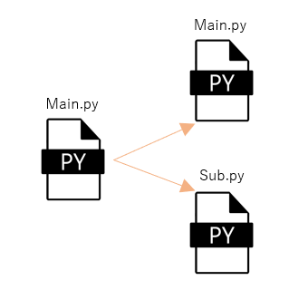

# モジュール

モジュールとは、他の「.py」ファイルから呼び出すことを前提に、関数やクラスなどのコードを記述した「.py」ファイルです  

例えば、長く複雑な処理をコーディングする場合  
1つの「.py」ファイルに全てのコードを記述すると、可読性が落ちより良いコーディングの妨げになります  
こういった場合に、一部コードをモジュールへ分割します  



## 実装例
以下はモジュールを利用したコーディングの例です  
モジュール「calc.py」を「main.py」でインポートしています

``` python title="main.py"
import calc # ここでcalc.pyをインポート

in_a = int(input("数値1: "))
in_b = int(input("数値2: "))

print(calc.add(in_a, in_b)) # 「calc.py」のadd関数を実行
print(calc.sub(in_a, in_b)) # 「calc.py」のsub関数を実行
```

``` python title="calc.py"
def add(a, b):
    return a + b

def sub(a, b):
    return a - b
```