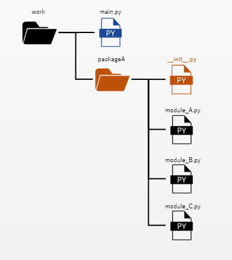

# パッケージ
パッケージとは、複数のモジュールを集約したフォルダ(ディレクトリ)を指します  
関連するモジュールをパッケージ化することで、モジュールが整理され管理性を向上することができます  

## パッケージの作成・構成
以下はパッケージを作成・構成する例です  
1. メインとなる「.py」ファイルと同じ階層へ、パッケージフォルダを作成する
2. パッケージフォルダ内に、モジュールファイルを作成する
3. パッケージフォルダ内に、「\_\_init\_\_.py」ファイルを作成する(空のファイルでもOK)  

    

### 「\_\_init\_\_.py」ファイル
「\_\_init\_\_.py」ファイルは、フォルダをパッケージとしてPythonへ認識させる為のファイルです  
同時にパッケージが読み込まれた際の初期化処理を記述する場所でもあります  

内容が空のままでも認識させることができますが  
初期化処理を利用することで、パッケージのインポートを簡略化することもできます

## パッケージのインポートと「\_\_init\_\_.py」ファイル
パッケージもモジュールと同様にメインとなる「.py」でインポートすることで利用できます  
また、前述のとおり「\_\_init\_\_.py」ファイルの初期化処理を利用することで、インポートの記述が変化します  

### 「\_\_init\_\_.py」が空の場合
``` python title="main.py"
# パッケージ名.モジュール名 と記述する必要がある
import packageA.moduleA # パッケージをインポート

# パッケージ名.モジュール名.関数名 と記述する必要がある
print(packageA.moduleA.calcA(1, 2))
```

``` python title="./packageA/__init__.py"
# 空のファイル
```

### 「\_\_init\_\_.py」の初期化処理を利用した場合
``` python title="main.py"
# パッケージ名 のみの記述でOK
import packageA # パッケージをインポート

# パッケージ名.関数名 を記述すればOK
print(packageA.calcA(1, 2))
```

``` python title="./packageA/__init__.py"
# パッケージの初期化時に、moduleAの関数を全てインポートさせる
from packageA.moduleA import *
```
