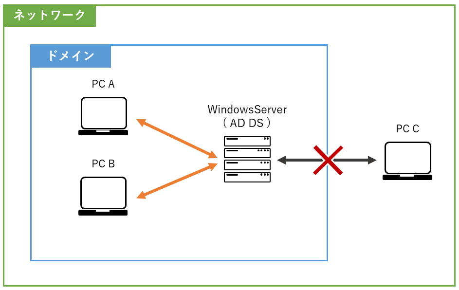
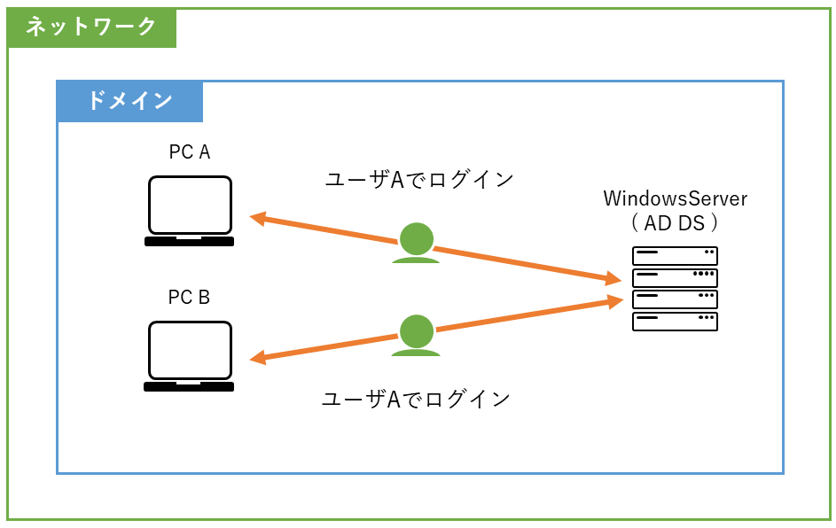

# Active Directory

## Active Directory ドメインサービスとは

Active Directory ドメインサービス(以下、`AD DS`)は、WindowsServerのディレクトリサービスです  
WindowsServerにおける中心的な役割を果たす機能の1つで  
ネットワーク上のユーザやコンピュータに関する情報・設定を一元管理することができます  
また、クライアントは、AD DSからそれらの情報の提供を受けることができます  

世間一般では `AD DS` と略されたり、 単に `Active Directory(AD)` とも呼ばれます  

:::note
ディレクトリサービスとは、「案内」の意で、ネットワークを通した様々な案内を提供するサービスです  
:::

## ドメイン

AD DSを構築する場合 `ドメイン` を設定する必要があります  
ドメインは、AD DSが情報を提供する範囲を指し、ドメインに参加していないPCやスマートフォンなどの **デバイス** は  
たとえ同一のネットワークであっても情報の提供を受けることはできません  

## AD DSの役割

AD DSには主に以下の役割があります  

### ユーザーとコンピュータの管理

組織内の利用者(社員など)のユーザアカウントや、コンピュータを一元管理します  
また、関連する情報の登録・検索などを行うことができます

### 認証の提供

通常PCへログインする際は、個々のPC内に保存されたユーザアカウントでログインしますが  
ドメインに参加したPCでは、AD DSに保存されたユーザアカウントでログインすることができます  

つまり、同一ドメインに参加しているPCであれば、どのPCを利用しても自身のユーザアカウントでログインすることができます  

### リソースへのアクセス制御

ファイルやフォルダー、プリンタなどのアクセス権を制御することができます  
例えば、 営業部の社員だけが特定のフォルダにアクセスできる といった制御が可能です  

### グループポリシーの適用

特定のグループもしくは、ドメイン全体にポリシー(設定)を適用することができます  
例えば、 全社員のPCスクリーンセーバーを10分でロックする設定を一括で行う といった設定が可能です  